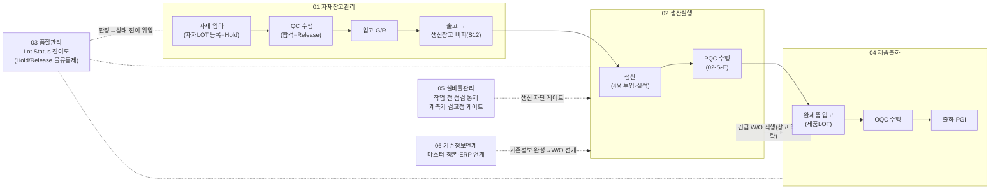

# OMF-MES 사용자 프로세스·태스크 플로우 (통합 정리본)

> 작성일: 2026-07-30 (v1.0 초판) · 작성 주체: CREFLE OMF 팀
> **성격**: 재편성 산출물 — 원본 무수정·전량 신규 작성. 프로세스 정본은 WF 01~06, 시각 정본은 FigJam v2 캔버스, 도식 표기 정본은 도식스펙 01~06이며, 본 문서는 「누가·어느 단말·어느 화면에서·무엇을 하는가」를 단계 단위로 모은 **개발 열람용 편람**이다. 본 문서와 원본이 어긋나면 원본이 우선한다.
> 근거 자료: design/wiki/domain-workflow/2026-07-03-워크플로우-요구사항반영-01~06-*.md · 2026-07-06·07-도식스펙-01~06.md · uiux/2026-07-25-화면목록-IA/node-screen-mapping/01~06.md · design/raw/process/uiux/2026-07-24-프로그램배지/placement-plan.md · FigJam 보드 Sgy5IKD4aWuzpKtJAbMyWz(v2 페이지 219:4509)
> ⭐ **수치는 이 문서를 믿지 말고 명령을 돌린다** — `python3 design/schema/generators/verify-counts.py` · 화면 축은 `design/wiki/handover/화면-진도표.md`. **최종 대조 2026-08-19.** 이 문서는 **인수 세트 Ⅳ**이고 세트 표지는 `design/wiki/00-index.md` 다.
> 표기 원칙: 행위자·단말·화면이 원본에 명시 없으면 「명시 없음」(추정 금지) · 예외 E-n(WF 예외 카탈로그)과 회신 E-n(고객 회신 대기)은 구분 표기 · 원본 내부·간 모순은 최신 확정을 채택하고 «(정합주: …)»로 명시
> 상호 참조: 01-요구사항명세서.md(REQ 원문) · 02-SW설계사양서.md(규칙 전건 §6·결정 대장 §7·미결 총괄 §8) · 04-통합-IA.md(화면 인벤토리·IA)

## §1. 문서 개요·읽는 법

### §1.1 문서 목적·원본 정본 체계

- 본 문서는 omf-mes 도메인 6종(01 자재창고관리 · 02 생산실행 · 03 품질관리 · 04 제품출하 · 05 설비툴관리 · 06 기준정보연계)의 프로세스를 **사용자(행위자) 관점의 단계 블록**으로 통합 서술한다. 자매 산출물(같은 design/wiki/project-spec 폴더): 01-요구사항명세서.md · 02-SW설계사양서.md · 03-HW구성안.md · 04-통합-IA.md.
- 원본 정본 3층 — 본 문서의 모든 서술은 아래 문서군을 근거로 하며, 이하 약칭 「WF0n」·「도식스펙0n」·「매핑0n」으로 인용한다.

| 층 | 약칭 | 문서군(저장소 루트 기준) |
| --- | --- | --- |
| 프로세스 정본 | WF01~WF06 | design/wiki/domain-workflow/2026-07-03-워크플로우-요구사항반영-01-자재창고관리.md ~ 동-06-기준정보연계.md |
| 도식 정본 | 도식스펙01~06 | design/wiki/domain-workflow/2026-07-07-도식스펙-01-자재창고관리.md · 2026-07-06-도식스펙-02-생산실행.md · 2026-07-06-도식스펙-03-품질관리.md · 2026-07-06-도식스펙-04-제품출하.md · 2026-07-06-도식스펙-05-설비툴관리.md · 2026-07-07-도식스펙-06-기준정보연계.md |
| 노드→화면 매핑 | 매핑01~06 | design/raw/process/uiux/2026-07-25-화면목록-IA/node-screen-mapping/01-자재창고관리.md ~ 06-기준정보연계.md |

- 보조 정본: 프로그램 배지 정본 design/raw/process/uiux/2026-07-24-프로그램배지/placement-plan.md · 단말 확정기록 design/raw/decisions/2026-07-24-프로그램배지-단말확정-확정기록.md · 화면 인벤토리 design/raw/process/uiux/2026-07-25-화면목록-IA/screen-inventory-ia.md.

### §1.2 단계 블록 형식 (행위자|단말|화면|태스크|규칙|예외)

- 도메인 절(§3 이후)은 각 WF 단계(S단계 번호)를 다음 6필드 블록으로 기술한다. 필드별 원본 유래:

| 필드 | 내용 | 원본 유래 |
| --- | --- | --- |
| 행위자 | 해당 단계를 수행하는 사용자·역할 | WF Actor · 도식 액터 축 · 배지 정본(placement-plan) |
| 단말 | 관리웹 / POP / 모바일 (프로그램 3종) | 배지 정본 · design/raw/decisions/2026-07-24-프로그램배지-단말확정-확정기록.md |
| 화면 | 화면 ID(W-·P-·M-) 또는 화면 그룹 ID(G-) | 매핑0n · 화면 인벤토리 |
| 태스크 | 단계에서 수행되는 행위 | WF Action · 도식 행위 노드 |
| 규칙 | 확정 규칙(✓확정·✓설계확정·✅REQ) | WF Rule · 확정기록 문서군 |
| 예외 | 예외 흐름(예외 E-n)·미결((확인 필요)·[가설]) | WF Exception · WF 예외 흐름 카탈로그 |

- 마커 범례(원문 표기 그대로 보존한다 — 미결은 미결로 표기하며 확정처럼 쓰지 않는다):

| 마커 | 의미 | 근거 |
| --- | --- | --- |
| ✅REQ-XX-nnnn | 요구사항 명세서 항목 — 검증 확정 | WF02 §0(✅=검증 확정) |
| ✓확정 QA #n | CTO 문답 확정기록(2026-07-04, 35건) | design/raw/decisions/2026-07-04-현장검증-QA-확정기록.md |
| ✓설계확정 결정 nn | 내부 설계 결정서 14건(2026-07-06) | design/raw/decisions/2026-07-06-설계결정서-14건.md |
| 🟡 · [가설] | As-Is 가설 — 반증 대상(확정 아님) | WF02 §0 · WF05 헤더(경량 갱신·이연 명시) |
| (확인 필요) · [확인] | 미결 | 각 WF [Check]·Open-Issue |
| W- / P- / M- / G- | 관리웹 / POP / 모바일 / 화면 그룹 | 매핑01(관리웹·POP·모바일 계수) · 매핑02(W-02-·P-02-·M-02- 접두) |
| P-CO- · M-CO- | 프로그램 공통 화면(예: 사번입력 P-CO-01·M-CO-01) | 매핑05 · 매핑06 |

- ⚠ WF05는 🟡 가설 본문(종이/엑셀 As-Is)과 To-Be 단말 확정 포인터를 **의도적으로 병존**시킨 문서다(「경량 갱신·full 재작성 이연」 헤더 명시) — 본 문서는 포인터 쪽(확정)을 정본으로 읽는다 (WF05 v1.3).
- **도식 미커버 구간**: 아래 단계 블록은 도식이 아닌 **WF 원문에서 직접** 취한다(커버리지 공백의 명시 — 은폐 아님).

| 도메인 | 도식 미커버 단계 | 근거 |
| --- | --- | --- |
| 01 | S6 재고 보관(사이드 구조도 없음·조회성 — 현행 화면 W-01-07만) · S1은 P/O 선택 접점만 부분 커버 | 도식스펙01 §1.0·§5-8 |
| 04 | S1 제품입고·S2 재고 보관(메인 미작화 — 도식은 S3부터 시작) · S10 폐기(SC6 stub만) — 매핑04가 「후속 산출물은 S1·S2·S10을 WF04 원문에서 직접 취해야 함」을 명시 | 도식스펙04 §1 vs WF04 · 매핑04 §4 |
| 05 | S1 자산 등록·S9 폐기(도식 범위 외 — 특칙③, 기준정보는 Wallet 참조만) | 도식스펙05 §0 |
| 06 | S6 운영 마스터(축 상태 아님 — Wallet 참조 B7 + MES-5 노트만) | 도식스펙06 §1·§2 |

### §1.3 시각 정본 — FigJam 캔버스

- 프로세스 도식의 시각 정본 = FigJam 보드 `Sgy5IKD4aWuzpKtJAbMyWz`의 **페이지 "system workflow v2"(219:4509)**. 본 문서의 도식 서술은 전부 v2 페이지 기준이다(v1 페이지 0:1 → v2 전면 재작성) (도식스펙01 근거 자료 헤더 · v2.0 변경 이력).
- 도메인별 구조: 메인 섹션 + 사이드 섹션(예: `01.자재창고관리` 219:4510 · `01.자재창고관리-사이드` 219:5450 — 도식스펙01 §1·§2 / 02 메인 297:5370 · 사이드 297:6292 — 도식스펙02 §0). 단 **03은 사이드 없는 단일 섹션**(Lot Status 상태 전이도 — 도식스펙03 §2).
- ⚠ 조회 함정: 페이지(219:4509) **직속** 커넥터는 섹션 자식 조회에 검출되지 않아 「미작화」 오판이 실제 2회 발생했다(04 H7 브래킷 838:8635 · H6 분기 840:8642 — 캔버스 실측으로 반증·정정) (도식스펙04 §1-③·v1.5·v1.6 변경 이력 · 매핑04 §0-6·1-3). 캔버스 수치를 재검증할 때 섹션 자식만 훑지 말 것.

### §1.4 E-번호 이중 체계 경고 (예외 E-n vs 회신 E-n)

- 동일 «E+숫자» 표기가 서로 다른 체계로 병용된다. 본 문서는 전 절에서 **「예외 E-n」(WF 예외 흐름 카탈로그) / 「회신 E-n」(고객 회신 대기 항목)**으로 구분 표기한다.

| 체계 | 본 문서 표기 | 정의 위치 | 예 |
| --- | --- | --- | --- |
| WF 예외 흐름 카탈로그 | 예외 E-n | WF01 E1~E11 · WF03 E1~E9 · WF04 E1~E10 · WF05 E1~E9 | 예외 E-3(WF01)=검사 전·긴급 입고 · 예외 E-3(WF03)=계측기 미검교정·고장 상태로 검사 · 예외 E-4(WF04)=결품·선입선출 이탈(S4) · 예외 E-7(WF05)=QR 라벨 훼손 |
| 고객 회신 대기 항목 | 회신 E-n | 도식스펙 §4(미정의 마커·Email)·고객 액션 목록 | 회신 E-3=판정유형 값 목록(대기 중) · 회신 E-4=폐기 계정 항목 · 회신 E-5=출하지시서 샘플 · 회신 E-6=납품라벨 형식 · 회신 E-10=ERP 선택 연계 방식 상세 |
| 질문지 유래 번호(잔존 표기) | 질문지 E-n | WF04 변경 이력(「E14 완전 종결」·「E16 종결」) | E14 · E16 |

- 충돌 실례(오독 위험 지점): 「E3」=예외(WF01 긴급 입고 / WF03 계측기) vs 회신(판정유형 값) · 「E4」=예외(WF04 결품·선입선출 이탈) vs 회신(폐기 계정) · 도식스펙05 내부에서 M4·M5의 「고객 액션 E1·E7」과 「예외 E-7」이 병존. (근거: WF01 예외 카탈로그 vs 도식스펙01 §4.3 · WF03 예외 카탈로그 vs 도식스펙03 · WF04 예외 카탈로그 vs 도식스펙04 §4.1 vs WF04 v1.1 변경 이력 · 도식스펙05 §4.2)
- 회신 E-4는 01-SA1(01-S-A 폐기 전환·계정)과 01-S-I(폐기 계정)에 **동일 미결이 이중 등재**되어 있다(도식스펙01 §5-6 자체 등재 — 코드 통합/상호 참조 여지).

### §1.5 단계 번호 ≠ 수행 순서 주의

| 위치 | 내용 | 근거 |
| --- | --- | --- |
| **02 S7·S8** | S8 PQC는 「작업실적 입력 전 수행」 개정으로 **S7(실적 수집)보다 시간상 선행**한다. WF02 문서 절 순서는 S7→S8을 유지하고, 도식은 실제 순서(PQC 분기→실적 등록)로 작화되어 있다 — 단계 번호로 수행 순서를 읽지 말 것 | WF02 v1.5 개정 · 도식스펙02 §1.2-C |
| 01 S12 | S12 생산창고(라인사이드) 재고 관리(신규 — ✅REQ-PR-0034)는 번호상 말단이나 **흐름상 위치는 S7~S8 사이**(「출고→S12 버퍼→투입」 2단 구조) | WF01 S7·S12 |
| 02-S-B | 러닝체인지 사이드의 도식 체인 순서(6320→6322→6324)가 시간 순서와 반대 — 주석안 채택·노드 재배치 없음(공인된 도식 결함, 이슈 #43) | 도식스펙02 §2.2 · 매핑02 |

---

## §2. 전사 프로세스 지도

### §2.1 물류 대흐름

- 물류 축 대흐름: **자재 입하 → IQC → 입고 → 출고 → 생산 → PQC → 완제품 입고 → OQC → 출하**. 실행 도메인은 01(자재) → 02(생산) → 04(제품)이며, 03(품질 거버넌스)·05(점검 통제·검교정 게이트)·06(기준정보·ERP 연계)은 횡단으로 걸린다.

| # | 대흐름 | 소재 도메인·단계 | 요지 · 근거 |
| --- | --- | --- | --- |
| 1 | 자재 입하 | 01 S2 | 공급사 도착 등록 — **자재LOT 등록=Hold**(✓확정 2026-07-20 §재정의 #5) · 사전발행 라벨 스캔·거래명세서 문서 분석 자동 등록(QA #29) (WF01 S2) «(정합주: WF01 S3 Open-Issue에 잔존하는 「IQC 합격이 자재LOT을 '생성'한다」 구서술은 2026-07-20 자재LOT 재정의(등록=입하 Hold·합격=Release·생성 서술 폐기)로 대체 — WF01 S3·S4 vs design/raw/decisions/2026-07-20-자재LOT관리-재정의-확정기록.md)» |
| 2 | IQC | 01 S3 (수행=사이드 01-S-C) | 합격=**Release** · 불합격=Hold 유지→S10 공급사 반품 (WF01 S3·도식스펙01 §2.1) |
| 3 | 입고(G/R) | 01 S4 | 자재LOT Release·QR·재고 가용화 · ERP G/R **건별 즉시·합격품 한정**(✓확정 QA #1·#4) (WF01 S4) |
| 4 | 출고 | 01 S7 → S12 | W/O 생성 → 출고요청 자동 발행 → 출고(부분출고·출고 QR 항상 발행) → **S12 생산창고 버퍼**(✅REQ-PR-0034) → 생산 투입 (WF01 S7·S12) |
| 5 | 생산 | 02 S5~S10 | 작업 전 점검 통제(05 게이트) → 작업 시작·4M 투입 → 작업실적 수집 → 생산LOT 완료·인식표 발행 (WF02 §0·S5~S10) |
| 6 | PQC | 02-S-E | 수행·결과 입력=02 / 소유·거버넌스=03 (03 재정의 확정 2026-07-20) · 트리거=실적 입력 전 — **§1.5 순서 주의** (WF02 S8 · 도식스펙02 02-S-E) |
| 7 | 완제품 입고 | 04 S1 | 생산완료/외주 → 완제품 창고 · 제품LOT 형성 — 도식 미작화 구간(WF04 원문 정본, §1.2) (WF04 S1) |
| 8 | OQC | 04 S5 | 수행=04(M6 품질담당·관리웹 W-04-03) (WF04 S5 · 도식스펙04 M6/M7) |
| 9 | 출하 | 04 S3~S7 | 고객사 출하지시서(엑셀·**비ERP**) 수신·import → Picking → Packing(납품라벨·생산LOT Matching·고객 바코드) → 고객 출하·PGI (WF04 S3~S7 · ✅REQ-PR-0029) |

- 우회·역류 경로(도메인 수준):
  - **긴급 W/O 직행 출하**: 02(02-S-D · 발원=예외 E-1(WF02)) → 04(04-S-A) — 창고 적치 생략·기록상 입고+출하 자동 생성·ERP 전표=04 사이드 소관(영역 분리 확정 2026-07-06 #3=(a)) (WF02 · 도식스펙04 SA0)
  - **반품**: 공급사 반품(자재)=01 S10 / 고객 반품·클레임(제품)=04 S9 — 별개 경로(QA #15) (WF01 S10 · WF04 S9)
  - **수리 왕복·재투입**: 02-S-I(구 03 사이드 A 이관 — 진입 원천=02-S-E) (도식스펙02 §2)
  - **폐기**: 자재=01 S11(불량창고→판정→품의→기타출고) / 제품=04 S10(품의→기타 출고) / 설비·툴 자산 처분=05 S9 — **셋은 별개, 혼동 금지**(WF05 §0) (WF01 S11 · WF04 S10 · WF05 §0)

- ⚠ 위 도식은 도메인 수준 개괄이다 — 노드·화면 수준 정본은 FigJam v2 페이지(§1.3). PQC 위치는 단계 번호상 02 S8이나 시간상 실적 입력 전 수행(§1.5). (근거: WF01·WF02·WF04 §0 · 도식스펙03 §1.0)

### §2.2 도메인 경계·co-location

**검사 수행 위치 (co-location)** — 03 도식 본체는 검사 수행이 아니라 **Lot Status 상태 전이도**(상태 7·전이 16 — 자재/생산/제품 3 LOT 공통 크로스 도메인 상태 정본)이며, 검사 *수행*은 각 도메인에 co-locate한다(03재정의 결정 1 — 2026-07-20).

| 검사 | 수행 도메인·지점 | 행위자·단말·화면 | 03 측 표기 | 근거 |
| --- | --- | --- | --- | --- |
| IQC | 01 (WF01 S3 · 사이드 01-S-C) | **IQC 담당자·관리웹 W-01-01**(01 계상) «(정합주: placement-plan 배지 「01-S-C 품질담당=모바일」·「IQC 대상 LOT 특정 스캔」 구서술은 매핑01 4단계 리더 확정 「01-S-C 전체=IQC 담당자·웹」으로 대체(배지 문구=정정 대상·docs 이슈 발행 대상) — design/raw/process/uiux/2026-07-25-화면목록-IA/node-screen-mapping/01-자재창고관리.md vs design/raw/process/uiux/2026-07-24-프로그램배지/placement-plan.md)» | 유입 `01-S-C`(빨강 DOC) | WF01 S3 · 도식스펙01 §2.1 · 매핑01 |
| PQC | 02 (사이드 02-S-E — 수행·결과 입력 지점, 소유·거버넌스=03 유지) | 작업자·POP P-02-13(02 계상) | 유입 `02-S-E`(빨강 DOC) · 7번째 상태 「PQC 검사 필요」 전수 재검 수행=02-S-E | WF02 · 도식스펙03 §1.0 · 매핑03 |
| OQC | 04 (WF04 S5 · 도식 M6/M7) | 품질담당·관리웹 W-04-03(04 계상) | 유입 회색 hex(04 v2 미작화 — 작화 시 빨강 DOC 승격) | WF04 S5 · 도식스펙03 · 매핑03 |
| (03 본체) | Lot Status 전이도 — 단일 섹션 | 출고/출하 차단=Lot Status(C4) 단일 지점 참조 판정·재고 상태컬럼 비보유(✓설계확정 결정 10·08) | 상태 7 · 전이 16 · 유입 3 · 경계 exit 1 | WF03 §0 · 도식스펙03 §1.0·§2 |

- 검사 공통 게이트: **계측기 검교정 유효 게이트**(05-S-E) → 01 IQC·02 PQC·04 OQC 각 검사실적 입력(구 03 U1 대상에서 03재정의 결정 1·4로 재지정) · **검사측정치 바인딩**(05-S-C — 캠데코→표준 I/F→MES-10 수집채널매핑→검사측정치, 수행 도메인 01/02/04 co-locate) (도식스펙05 §2 · 경계 hex 791:8041).
- 검사 3종은 **단일 검사실적 엔티티 + 검사유형 코드**로 표현한다 (WF03 §0).
- 상태 7종에는 7번째 확정 상태 **「PQC 검사 필요」**(632:6932)가 포함된다 «(정합주: WF03 v1.5 S5 본문의 상태 열거 구서술 「Hold/Release/보류」는 도식스펙03 v2.1·매핑03이 확정한 7상태(「PQC 검사 필요」 포함)로 대체 — WF03 측 반영은 S2 Action의 「"PQC 검사 필요"(Hold) 전환」 서술뿐, 상태 목록으로는 미착지 — WF03 S5 vs 도식스펙03 v2.1·매핑03)».

**도메인 간 위임 전건** (각 도메인 D절 근거 — ERP 연계 접점(D-1)은 도메인 간 위임이 아니므로 본 표 제외, 각 원본 D-1 및 WF06 S7 참조):

| 발신 | 수신 | 위임·경계 내용 | 근거 |
| --- | --- | --- | --- |
| 01 | 02 | W/O 생성·추가 자재 출고 요청 수신(출고요청 생성 화면=02 소관) — 01-S-E 진입 | 도식스펙01 §2.2(219:5457·442:6658) · 매핑01 |
| 01 | 02 | 4M 투입·라인 검증 발신(WIP 전환=생산실행) — 01-S-F | 도식스펙01 §2.2(219:5491·219:5502) |
| 01 | 02 | 초과분 사후 P/O 등록의 P/O 수신 I/F=02 도식 소관 | 도식스펙01 01-S-B 주석 225:5759 |
| 01 | 02 | P/O 변경의 W/O 연쇄=생산실행 🔗 · 작업중단 홀드(✅REQ-PR-0009)·퍼징/시작불량(✅REQ-PR-0035)은 생산 소관이나 창고 재고와 접면 | WF01 S1·S6·S11 |
| 01 | 03 | 「판정 → 03 전이도」 위임 3곳(01-S-A 224:5653 · 01-S-G 219:5520 · 01-S-I 219:5591) — 03=Lot Status 전이도 특정(v2.8 재포인트) | 도식스펙01 §2.1·§2.2 |
| 01 | 06 | 판정유형 코드 목록 정본=06 MES-12 지향(회신 E-3 대기) | 도식스펙01 §4.3 |
| 01 | 04 | 고객 반품(제품)=별도 경로(불량창고→재작업→재등록→출하) 🔗 | WF01 S10(REQ-PR-0011 현행) |
| 02 | 01 | 출고요청 자동 발행분의 출고·생산창고 적치=WF01 S7 · 불량 물리 반출(재고이동·반출 QR)=01-S-G · 자재LOT 등록/Release=01 소관 | WF02 · 도식스펙02 |
| 02 | 03 | 검사실적 소유·판정 유형·Lot Status 전이·검사방식·합격판정개수·재검사 Hold gating=03 거버넌스(OUT 유지) · 재검 불량분→02-S-I(03 C16 경계 exit·DOC 633:6934) | WF02 §0 · 도식스펙03(632:6932) |
| 02 | 04 | 긴급 직행 출하(창고 적치 생략·ERP 전표=04 「긴급 직행 출하」 사이드 소관) · 출하 포장(P&P)=04(02 [4.포장]=생산 포장) · 기포장품 Packing 스킵/파렛트=04 설정형 | WF02 · 도식스펙02(297:6383) |
| 02 | 05 | 설비 점검(C5 이력)↔작업 통제 판정 경계 · 점검 NG→보전(C5) 연계 · 금형 타발수=툴사용실적(C5) 집계 | WF02 |
| 03 | 01 | IQC 수행=WF01 S3(03은 참조·판정 유입 진입점만 표기) | WF03 §0 · 도식스펙03 |
| 03 | 02 | PQC 수행·결과 입력 지점=02-S-E(2026-07-16 캔버스 재구성·03 재정의 확정 2026-07-20) · 수리 공정 왕복=02-S-I 이관 완료(2026-07-21) | WF03 · design/raw/decisions/2026-07-20-03품질섹션-구조재정의-확정기록.md |
| 03 | 04 | OQC 수행=04(도식 M6/M7·WF04 S5) · OQC 합격 이후 출하=WF04(범위 OUT) | WF03 §0 |
| 03 | 05 | 설비 데이터 수집 표준 I/F(구 사이드 C)·계측기 검교정 이력(구 사이드 D) 이관 | WF03 · 도식스펙03 §2 |
| 03 | 06 | 불량코드 2계층 마스터(구 사이드 E — 실참조 02·03·N:M 통일) · 판정유형 코드 목록 정본=06 MES-12·개념모델 §4 | WF03 |
| 04 | 02 | SA0 「진입: 02 긴급 W/O 직행」 수신(02 사이드 D 경계 헥사곤의 짝 — 발원=예외 E-1(WF02)) | WF04 S1 Boundary · 도식스펙04 SA0 |
| 04 | 03 | 재작업/폐기 **판정 소관=03 단일화**(H8 「판정 → 03 도식」 — 2026-07-07 정합 점검 F04 확정, 04는 판정 의뢰 B10·결과 수신 후 처리만 소유) · Hold 분기 H3 「→ 03 전이도」 — 매핑 인계처=W-03-02. ⚠ B10 「판정 의뢰」(1008:9057)는 도식스펙04 v1.7 신설분 — 매핑04 대장은 도식스펙 v1.4 기준 105행으로 B10 **미등재**·W-04-07 재판정 대기 상태 | WF04 · 도식스펙04 §1-③·v1.7 변경 이력 · 매핑04 |
| 04 | 01 | 공급사반품=01 도메인(재고 차감+반출 기록으로 충분 — ✓확정 QA #15) | WF04 S9 · 도식스펙04 SC1 비고 |
| 04 | 02(생산 C2) | 재작업 실적·양품화 기록=생산실적(✅REQ-PR-0025) — 사이드 B 행위자=생산담당(잠정) | WF04 S5·S9·S10 |
| 05 | 02 | S3 점검 통제=점검이력(C5)→W/O·공정진행 결합(05↔02 **유일 강결합**) · 긴급 W/O(✅REQ-PR-0014)=02 소유(05는 접점만) · W/O 중단(사유=설비/도구 고장)·작업홀드 구간 이력=02 소유(QA #25·✓설계확정 결정 14) · 작업실적(C2)↔툴사용실적(C5) N:1 | WF05 · 도식스펙05 |
| 05 | 03(품질/현장 C4) | 비가동 소유=C4 — 05는 공급자 · 점검/보전이력(C5)↔비가동(C4) N:M=내부 설계 «(정합주: WF05 본문의 「④품질」·「품질(④) 도메인과 걸침」 구표기는 도식스펙05 v1.1 정정 「품질(③)」(03=품질관리 정본 매핑)으로 대체 — WF05 §0·S4 Boundary vs 도식스펙05 v1.1)» | WF05 S4 Boundary · 도식스펙05 v1.1 |
| 05 | 06 | 설비·설비그룹·툴·예비품·WorkCalendar·캘린더적용 마스터 소유=C1(06) — 05는 참조 · 예비품목록 화면=W-06-08(06 귀속) | WF05 · 매핑05 |
| 05 | 01·02·04 | 계측기 검교정 유효 게이트→각 검사실적 입력(05-S-E) · 검사측정치 바인딩→검사 수행 도메인 co-locate(05-S-C) | 도식스펙05 §2 |
| 06 | 02 | P/O 수신(ERP 트랜잭션 연계)=02 도식 소관(06에는 H2 경계 표기만) | 도식스펙06 H2·특칙① |
| 06 | 04 | 출하지시=**ERP 원천 아님** — 고객사 문서 import(D+1·시간대별)로서 04 도식 소관 | 도식스펙06 §1.3 · WF04 S3 |
| 06 | 01 | G/R 송신 흐름 작화=01(도식스펙06 v1.1 정정: 02→01) | 도식스펙06 §2.4·MES-10 |
| 06 | 02 | 생산 실적 송신 흐름(E2·부속 E2-b)=02 | 도식스펙06 MES-10·B14 |
| 06 | 04 | 출하 PGI 송신 흐름=04 | 도식스펙06 §2.4 |
| 06 | 02 | W/O 전개·트랜잭션 사용(A6 진출 회색 주석) · 러닝체인지 계획 분할의 실행 · 세부 공정별 생산 이력 · 개발품 W/O 전개 · POP 운영 자체=WF02 | 도식스펙06 §1.1 · WF06 S2~S4·S9 Boundary |
| 06 | 01 | 생산창고 재고 트랜잭션·재생재 등록=WF01 | WF06 S6 Boundary |
| 06 | 03·01 | 의심 자재 관리·불량 처리 흐름=WF03·WF01 | WF06 S5 Boundary |
| 06 | 03 | Lot Status 전이 로직·상태기계=03 도식(전이도) | 도식스펙06 MES-12 |
| 06 | 01·03 | 자재LOT 등록/Release 상세 흐름=자재창고·품질 문서 | WF06 S5 Boundary |
| 01 | (외부) 공급사 | 사전발행 LOT 라벨=협력사 부착만(발번은 MES 표준 양식 부여 번호 수용) · 공급사 반품 반출 | WF01 S2·S10 |
| 04 | (외부) 고객사 | 출하지시서 엑셀 import=상위지시 유입 경계(지정 양식·D+1·시간대 슬롯·샘플=회신 E-5 대기) · 고객 바코드=외부 식별체계 연계·발행(신규 고객 등록 경로 [확인]) · 납품라벨(형식=회신 E-6 대기) | WF04 S3 Boundary·S6 |

- 횡단 공통(도메인 위임 아님): Notice·알림(Notification)=시스템 공통 기능(✅REQ-PR-0016·✅REQ-OA-0009) (WF02) · 대시보드(✅REQ-PR-0036 — 05는 데이터 공급자) · 사용자/권한 마스터(✅REQ-PR-0015) (WF05).

### §2.3 프로그램·행위자 개관

- 프로그램 3종 = **관리웹(W-) · POP(P-) · 모바일(M-)** (+프로그램 공통 화면 P-CO-·M-CO-). 도메인×단계대 개괄:

| 도메인 | 관리웹(W-) | POP(P-) | 모바일(M-) | 근거 |
| --- | --- | --- | --- | --- |
| 01 자재창고 | S3 IQC 수행·판정=**IQC 담당자·웹**(W-01-01 — 「01-S-C 전체=IQC 담당자·웹」 4단계 확정, §2.2 정합주) · 긴급 IQC 생략 한도승인 W-01-02(⚠ 도식 앵커 없음 — 인라인 조건 라벨 914:9058뿐) 등 9건 | 2건 | 11건 | 매핑01(현행 22건 — 인벤토리 v1.1 기준 시점 · W-01-02 부기) |
| 02 생산실행 | 축1 S1~S4 W/O 편성·확정·배포 + 축5 S12 완료·마감=**생산관리자**(W-02-01~10, 10건) | 축2 S5~S6 점검·작업시작·4M 투입 + 축3 S7~S10 실적·불량·LOT 완료=**작업자**·[4.포장]=**포장 작업자**(P-02-01~13, 13건) | 축4 S11 공정 이동/WIP=**현장반장**(M-02-01~02, 2건) | WF02 · 도식스펙02 · 매핑02(현행 25건) |
| 03 품질관리 | 자체 현행 화면 W-03-01~09(9건 — 전부 W- 계열) · S4 특채 승인=**MES 권한 보유 관리자·관리웹** «(정합주: WF03 v1.5 S4 Exception①·[Check]의 「특채를 누가 승인·어디 기록하나 [확인]」 잔존 서술은 도식스펙03 v2.2 병기 확정(주체=MES 권한 보유 관리자·매체=관리웹, 2026-07-27 단말확정 확정기록 v1.1 §4 #9 — 대기 잔여=회신 E-3 값 목록뿐)으로 대체 — WF03 S4 vs 도식스펙03 v2.2)» | (검사 수행 화면은 co-locate 도메인 계상: P-02-13) | (동: M-02-02 — 재검 불량분 생산불량LOT) | 매핑03 · 도식스펙03 |
| 04 제품출하 | S5 OQC=**품질담당**(W-04-03) · 조회·대시보드 W-04-08·W-04-09(규칙 밖)·W-04-10(stub 앵커) | (프로그램별 세부 분포는 매핑04 참조) | M-04-02(4단계에서 통합 −1 처분) | WF04 · 도식스펙04(메인 축 11노드 — 작업자(행위자) 노드 M2·M4·M6·M8·M10 교대, 그중 M6=품질담당(OQC)) · 매핑04(총 17건 — M-04-02 통합·G-04-12 신설로 구성 변경, 총량 유지) |
| 05 설비툴 | 보전·마스터 축=**설비담당·웹**(G-05-04) · W-05-07 수집채널매핑·W-05-11 계측기 마스터(MES 노트만 근거 — 별도 도출 체계 판정 대상) | S3 작업 전 점검 통제=P-02-02(**02와 병합** — 05 단독 재검토 대상 아님) · 사번입력=P-CO-01 | S2 점검 입력=**모바일(순회/핸드헬드) 확정** «(정합주: 도식스펙05 v1.5의 M3 「점검 입력 매체=POP 여부 미확정」·B3 「점검입력(POP 후보)」 구서술은 WF05 v1.3 헤더·S2 확정 포인터(확정기록 #5) 및 매핑05 「배지 정본 #11 확정·칩 926:9063 모바일」=**모바일 확정**으로 대체(도식스펙·캔버스 마커 갱신 누락) — WF05 v1.3·매핑05 vs 도식스펙05 v1.5)» · M-05-01→M-CO-01 귀속(4단계 정정) | WF05 v1.3 · 도식스펙05 · 매핑05 · design/raw/decisions/2026-07-24-프로그램배지-단말확정-확정기록.md |
| 06 기준정보 | 등록→연계→변경→통제 축(확인되는 현행 화면은 전부 W- 계열: W-06-03·04·06·08·10 — 06 화면 수 변동 0) | S9 현장 사번 경량 인증=B12 사번입력 **P-CO-01(공통)** — 배지 정본=POP(캔버스 아이콘 Mobile은 「유형 열로 단말 추정 금지」의 반례, 매핑06 G-07) | (원본 확인 범위 내 없음) | WF06 · 매핑06 |

- 확인된 행위자(원본 명기분): 생산관리자·작업자·포장 작업자·현장반장(02) / IQC 담당자(01 — 4단계 확정) / 품질담당(01 도식 구표기·04 M6)·생산담당(잠정 — 04 사이드 B) / 설비담당(05) / MES 권한 보유 관리자(03 특채 승인) / 협력사·공급사=외부(라벨 부착·납품·반품 반출, WF01 S2·S10).
- ⚠ 화면 수치 시점 주의: 위 표의 계수는 각 매핑 문서 기준 시점 수치다. 매핑01의 대조 기준=화면 인벤토리 **v1.1**(01 도메인 22건)이며 4단계 결과 「22→25」(신설 4건은 화면 ID 미부여·그룹 ID만 존재, M-01-03 소멸). 전사 화면 정본=화면 인벤토리 **v1.3(109건)**(design/raw/process/uiux/2026-07-25-화면목록-IA/screen-inventory-ia.md) — 25건 반영·ID 부여 여부는 최신 인벤토리와 재대조 필요(매핑01 부기). 도식 앵커 없는(또는 행위 노드 아닌 근거뿐인) 현행 화면은 별도 근거 체계 대상이다 — 01의 W-01-02(인라인 라벨뿐), 02의 W-02-08·W-02-09·W-02-10(`[추정]` 조회·대시보드), 04의 W-04-08·W-04-09(규칙 밖)·W-04-10(stub 앵커·등급 미정), 05의 W-05-07·W-05-11(Server 노드만), 06의 W-06-03·04·06·10(MES 노트·미정의 마커만) (매핑01·02·04·05·06 · design/raw/process/uiux/2026-07-25-화면목록-IA/screen-mapping-rule.md §5 「규칙 밖」).

## §3. 도메인 01 자재창고관리

> 근거 약칭 — **WF01** = design/wiki/domain-workflow/2026-07-03-워크플로우-요구사항반영-01-자재창고관리.md (v1.6) · **도식01** = design/wiki/domain-workflow/2026-07-07-도식스펙-01-자재창고관리.md (v2.13) · **매핑01** = design/raw/process/uiux/2026-07-25-화면목록-IA/node-screen-mapping/01-자재창고관리.md (규칙 v1.1 · 4단계 확정 2026-07-29).
> 규칙 전건(60건)·미결 전건(72건 등재·실질 69건)은 02-SW설계사양서.md §6·§8 참조 — 본 절은 태스크 수행에 필요한 요지만 수록.
> ⚠ E-번호 이중 체계: 「**예외 E-n**」=WF01 예외 흐름 카탈로그(E1~E11) / 「**회신 E-n**」=고객 회신 대기 코드(회신 E-3=판정유형 값, 회신 E-4=폐기 계정 등). 동일 «E+숫자» 표기가 두 체계로 병용되므로 본 절은 전건 구분 표기한다 (WF01 예외 카탈로그 ※)

### §3.0 개요

- **목적**: 자재(원자재·부자재·외주품) 창고의 입고~보관~불출 사이클 관리 — 발주 수신 · 입하(자재LOT 등록=Hold) · 수입검사 · 입고(Release·재고 가용·적치) · 재고 보관 · 출고(생산창고 인계) · 재고이동 · 재고실사 · 반품(공급사) · 폐기 · 생산창고(라인사이드) 재고 관리(S12 신규 — ✅ REQ-PR-0034) (WF01 §0)
- **범위 OUT**: 제품 출하·Picking&Packing·생산 실적·작업지시(W/O)·품질 검사 *내부 절차* — 별도 워크플로우. 경계 접점은 🔗 표시 (WF01 §0)
- **메인 축 체인** (WF01 §0 개요 도식):
  `S1 발주 정보 수신 → S2 입하(자재LOT=Hold) → S3 수입검사(IQC) → S4 입고(G/R·Release) → S5 적치 → S6 재고 보관 → S7 출고 → S12 생산창고 재고(버퍼) → [생산 투입 → 02]`
  - 분기: S3 불합격 → S10 반품(공급사) / S6에서 사유별 분기 → S8 재고이동 · S9 재고실사 · (불량·만료·손상) 불량창고 → S11 폐기 (WF01 §0)
  - S12는 단계 번호상 말미이나 **흐름상 위치는 S7~S8 사이**(출고분이 생산 투입 전 머무는 버퍼) (WF01 S12 머리)
- **도식 구조**: FigJam 메인 1(섹션 219:4510) + 사이드 9종(섹션 219:5450) (도식01 §1·§2). 메인 커버=WF01 S1~S5 «(정합주: 도식01 §1.0의 「커버 범위 S1~S5」 구서술은 S1의 경우 P/O 선택 접점(219:4519)만 부분 커버로 정정 채택 — P/O 변경 이벤트·무발주 도착 인지는 미도식, 근거 도식01 §5-8·§3.1)». S6~S12·입하 예외 4종은 사이드 위임, **S6은 사이드 구조도도 없음**(조회성) (도식01 §1.0)

| 사이드 코드 | 구조도 | 성격 | 대응 WF 단계 |
| --- | --- | --- | --- |
| 01-S-A | 수량·품목 오류 | 입하 예외 | S2 Exception |
| 01-S-B | 초과 수량 입하 | 입하 예외 | S2 Exception ②(✅ REQ-OA-0011) |
| 01-S-C | IQC (수행 사이드로 확장, 구 「IQC 불량 처리」) | 입하 예외→주 수행 | S3 |
| 01-S-D | 임시 위치 적재 | 적치 예외 | S5 Exception |
| 01-S-E | 자재 출고 절차(필수) | 주 흐름 | S7 |
| 01-S-F | 생산창고·호퍼 재고 | 주 흐름 | S12 |
| 01-S-G | 재고이동·불량 반출 | 주 흐름 | S8 |
| 01-S-H | 재고실사·조정 | 주 흐름 | S9 |
| 01-S-I | 공급사 반품·폐기 | 주 흐름 | S10·S11 |

(도식01 §1.0·§2 — 메인 미커버 단계는 사이드 위임: S7=01-S-E · S8=01-S-G · S9=01-S-H · S10·S11=01-S-I · S12=01-S-F · 입하 예외 4종=01-S-A~D)

- **경계(타 도메인 위임)** (도식01 §2.1·§2.2·§4.3 · WF01 각 절 Boundary):
  - 02 생산실행: W/O 생성·추가 자재 출고 요청(01-S-E 진입)·4M 투입·라인 검증(01-S-F 발신)·출고요청 생성 화면·P/O 수신 I/F(초과분 사후 P/O 등록)·W/O 연쇄 변경 🔗
  - 03 품질: 「판정 → 03 전이도」 헥사곤 3곳(224:5653 01-S-A · 219:5520 01-S-G · 219:5591 01-S-I) — IQC *수행*은 01의 01-S-C에 co-locate(품질담당·W-01-01), 판정 결과 전이만 03 전이도로 위임 (도식01 v2.8·§2.1)
  - 06 기준정보: 판정유형 코드 목록 정본=06 MES-12 지향 (회신 E-3 대기) (도식01 §4.3)
  - 04 제품출하: 고객 반품(제품)=별도 경로 🔗 (✅ REQ-PR-0011 현행, WF01 S10)
  - 공급사: 사전발행 LOT 라벨 부착(✅ REQ-PR-0001)·반품 반출 (WF01 S2·S10)
- **화면 규모** (매핑01): 노드 215행 전수 처분 → 그룹 20개(행위 노드 48 귀속) → 현행 화면 22건(관리웹 9·POP 2·모바일 11) 대비 4단계 확정 후 **25건**(M-01-03 삭제 + 신설 4: 정상품 입하 처리·신규 P/O 등록·재고조정·재생재 등록 — 신설분은 그룹 ID(G-01-18~21)만 존재·화면 ID 미부여) «(정합주: 이 수치는 화면 인벤토리 v1.1 §3 기준 시점 수치 — 인벤토리는 이후 v1.3(전체 109건)으로 마감되어 25건 반영·ID 부여 여부는 최신 인벤토리와 재대조 필요, 근거 매핑01 현행 대조 · 상세는 04-통합-IA.md)»

### §3.1 단계별 태스크 플로우

> 규칙 요지는 단계 수행에 필요한 핵심만 발췌 — 전건은 02-SW설계사양서.md §6. 단말 표기는 To-Be(매핑01 배지·4단계 확정) 기준이며 As-Is 🟡가설 서술은 원본(WF01 각 절 Medium) 참조.

#### S1. 발주 정보 수신 / 입하 예정 인지 — 행위자: 전산(ERP 연계)담당·물류(창고)담당 | 단말: 명시 없음 (To-Be 미확정) | 화면: 매핑 대응 그룹 없음

«(도식 미작화 — WF 정본 기준: P/O 변경 이벤트·무발주 도착 인지 미도식, 도식01 §5-8)» (WF01 S1)

- **트리거**: ERP에서 P/O(구매발주) 발행 / 공급사 납기 임박 (WF01 S1)
- **태스크** (WF01 S1):
  1. 입하 예정(품목·수량·납기·공급사) 파악·공유
  2. P/O 변경 수신 시 — 중단→생산계획 중단 / 수량 변경→생산계획 수량 변경+관리자 확인 (✅ REQ-PR-0024 요구)
  3. 관리자 확인 화면에서 '변경 반영 vs 기존 유지(강행)' 선택 — 강행 시 P/O-W/O 불일치 플래그 (✓확정 QA #23)
- **규칙 요지**:
  - P/O=ERP 발행 정본·MES 수신·MES에서 수정 없음 — ✅ REQ-PR-0024 요구 (D10 해소) (WF01 S1)
  - ERP=UNIERP · 연계=DB 중계 테이블 방식 — ✓확정 QA #18 (WF01 S1)
- **예외** (예외 E-1 — 무발주·P/O 불일치 입하): ① 무발주 도착 인지(예정표 부재→누락 위험) [확인] — 무발주=3계층 nullable 상위지시 검증 🔗 ② P/O 변경 수신 — 처리 확정(태스크 2·3)·W/O 연쇄 변경은 02 생산실행 🔗 ③ P/O 초과 물량 도착 → S2 경유 사이드 01-S-B (WF01 S1 Exception 🟠)
- 비고: 현행 `W-01-09 입하 예정 조회`(관리웹)가 존재하나 도식 앵커 없음 — 매핑 규칙 §5 밖 (매핑01 현행 대조)

#### S2. 입하 (공급사 도착 등록) — 행위자: 물류(창고)담당(+공급사 기사) · 도식 액터=작업자(1)(219:4514) | 단말: 모바일 | 화면: M-01-01 (G-01-01 입하 등록)

(WF01 S2 · 도식01 §1.1·§1.2-A · 매핑01 — 게이트 946:6749 분기는 M-01-01 내부 「사전부착/미부착」 상태로 흡수)

- **트리거**: 공급사 차량 도착·납품 (WF01 S2)
- **태스크** (도식01 §1.2-A):
  1. 자재 LOT 부착 여부 분기(OR 946:6749 — 진입 P/O 매칭): [사전부착] 자재 LOT 번호 스캔(946:6724) → P/O 후보 선별(946:6806) → P/O 목록에서 선택(219:4519) / [미부착] 전체 P/O 목록에서 선택
  2. 거래명세서 스캔 등록(219:4515) + 품목&수량 확인(219:4579)
  3. 입하 검증 분기(OR 219:4581): [정상] → 4 / [수량 초과] → 사이드 01-S-B / [수량 부족·품목 오류] → 사이드 01-S-A
  4. 자재 입하 정보 등록(219:4521) — **입하유형(자재/외주품/상품) 구분** 포함(WF01 S2 Action — 도식 미표기) → MES 기록(219:4522) — **자재LOT 등록(Lot Status=Hold), 가용 재고 아직 아님** (✓확정 2026-07-20 §재정의 #5)
- **규칙 요지**:
  - 자재LOT 등록=입하 시점·Lot Status=Hold — ✓확정 2026-07-20 §재정의 #5 (WF01 S2 Result)
  - 거래명세서 문서 분석 자동 등록(수기=대안 · IQC 생략·별도 입고 경로 아님) — ✅ REQ-PR-0006 요구 재해석 · ✓확정 QA #29 (WF01 S2)
  - 자재LOT 발번 이원화 — 사전부착=공급사가 MES 표준 양식대로 부여한 번호 수용·등록 / 직접부착=MES 발번 — ✓확정 §재정의 #4 (WF01 S2·S4)
  - 입하 등록 시 담당자 P/O 확인 — ✓확정 §재정의 #6; 사전부착 경로=LOT No 파싱({제품코드}→품목·{공급사 성분}→거래처)→미마감 P/O 후보 자동 필터→담당자 최종 선택 — #16 (WF01 v1.6 · 도식01 §1.2-A)
- **예외** (예외 E-1): ① P/O 조회 안 됨/미연계 🟠 ② 불일치 — 수량 초과=확정: 초과분만 별도 입하 분리 생성(P/O 비귀속) → 01-S-B (✅ REQ-OA-0011 · ✓확정 QA #36) / 수량 부족·품목 상이·미등록·분할납품의 차단 vs 가입고·승인 주체=잔여 ⚠ → 01-S-A ③ 거래명세서 누락 🟠 (WF01 S2 Exception)

#### S3. 수입검사 (IQC) 의뢰/수행/판정 — 행위자: 품질담당(+물류담당 동석) · 도식 01-S-C 액터=품질담당(545:5762) | 단말: 관리웹 | 화면: W-01-01 (G-01-09 IQC 수입검사 전체 — 스캔부터 판정까지)

- **단말 부기**: 01-S-C 전체=IQC 담당자·**관리웹** — 매핑01 4단계 리더 확정 2026-07-29(진입 전 현장 작업자가 IQC 대상 분류를 마쳤으므로 IQC 공간에서 수행) «(정합주: placement-plan 배지 정본 「01-S-C 품질담당=모바일」 구서술은 이 확정으로 대체 — 배지 문구가 정정 대상(docs 이슈), 근거 매핑01 보류②)». 긴급 한도승인의 승인/기록 매체=관리웹·권한자=MES 권한 보유 관리자 — ✅확정 2026-07-27 (도식01 §1.2-B)
- **트리거**: 입하 등록됨 (WF01 S3). 도식: OR 545:4443(IQC 대상/생략)의 [IQC 대상] 분기 → 01-S-C 진입 (도식01 §1.2-B)
- **태스크** (도식01 §1.2-B·§2.1 01-S-C):
  1. (S4 축) 작업자2(219:4523)의 LOT 스캔(219:4571) 후 IQC 대상/생략 분기(OR 545:4443)
  2. [IQC 대상] → 01-S-C: 품질담당 — 자재 LOT 번호 스캔(545:5843) → 점검 항목 확인(545:6753) → IQC 진행(545:6037) → 결과 기록(545:6901) → MES(545:6256)
  3. 판정 분기(OR 226:5724): [양품] 메인 복귀(545:7108) → 정상품 입하 처리(545:6596) / [부분 입고 허용] LOT 수량 정정(226:5738) → MES(226:5754) + 불량분 → 01-S-I / [불량] → 01-S-I / [의심자재 입고 대기/지연] → (01-SC1) 마커 «(정합주: 도식01 §3.2 근거 표·§2.1 본문의 226:5738 구 라벨 「합격 수량만 LOT 생성」은 2026-07-24 FigJam 실측 확정 라벨 「LOT 수량 정정」으로 대체 — 근거 도식01 §2.1 실측 확인 불릿·노트C 「합격 수량-Release」)»
  4. [생략·샘플링 미대상](545:6632) → 정상품 입하 처리(Release=그룹 판정 승계)
  5. [생략·긴급승인→한도승인](914:9058) → 정상품 입하 처리(LOT 상태 `정상` · 한도승인은 조건(`app.approval_request`) (기존 서술 폐기: 2026-08-07 회신 E-3 종결 — 공유계약 A-14)·G/R 제외)
- **규칙 요지**:
  - **IQC 합격=Release**(입하 시 등록된 Hold LOT의 가용 전이) — ✅ REQ-PR-0007 개정 · ✓확정 2026-07-20 §재정의 #5 «(정합주: WF01 S3 Open-Issue의 구서술 「IQC 합격이 자재LOT을 '생성'한다」는 §재정의 #5 「합격=Release·생성 서술 폐기」로 대체 — 같은 문서 S3 Rule·S4 Open-Issue·요약 매핑은 갱신됨, 근거 WF01 94행 vs 90·95·109·247행)» (WF01 S3)
  - IQC 대상=등록된 전량(부착 여부 처리 분기 소멸) — §재정의 (WF01 S3 Rule)
  - IQC 생략 2분기 — [샘플링 미대상]→Release / [긴급승인]→한도승인 — ✓사용자 확정 2026-07-24; G/R 「합격품 한정」이 한도승인 자동 제외; 긴급 IQC 생략=작업자 요청→권한자 승인→한도승인 — ✓확정 §재정의 #8 (도식01 §1.2-B·v2.10)
  - ERP G/R=IQC 합격 직후 건별 즉시·합격품 한정 — ✓확정 QA #1; 검사기준 정본=MES(현행 엑셀→마이그레이션)·검사 결과 ERP 비연계 — ✓확정 QA #4 (WF01 S3)
  - IQC 불합격=Hold 유지 상태에서 반품 — ✓확정 §재정의 #3 (WF01 S3·S10)
- **예외** (예외 E-2 — 검사기준 미등록·특채·보류): ① 검사기준(검사항목) 미등록(신규 품목) [확인] ② 보류·재검 — 판정 보류(의심 자재) 상태 실존 확정(✅ REQ-PR-0027 요구) → (01-SC1) ③ 특채(조건부 합격) — 판정 유형으로 한도승인·특채·폐기 등 실재(✅ REQ-PR-0027 요구), 전체 목록=회신 E-3 대기 ⚠ ④ 계측기 미검교정/고장 🟠 ⑤ 공급사 성적서 누락 🟠 / 불합격 → 01-S-I(S10 반품) (WF01 S3 Exception)
- 비고: 구 G-01-08(IQC 대상 LOT 스캔·모바일 `M-01-03`)은 폐지·W-01-01에 병합 — **M-01-03 소멸**(매핑01 4단계 2026-07-29). 현행 `W-01-02 긴급 IQC 생략 한도승인`은 도식 앵커가 인라인 라벨(914:9058)뿐인 규칙 밖 화면 (매핑01 부기)

#### S4. 입고 (G/R) — 자재LOT Release·QR·재고 가용화 — 행위자: 물류(창고)담당 · 도식 액터=작업자(2)(219:4523) | 단말: 모바일 + POP + 관리웹 | 화면: M-01-02 (G-01-02 자재LOT 스캔·등록) · P-01-01 (G-01-03 자재LOT 발번·라벨 발행) · G-01-18 정상품 입하 처리(4단계 신설 — 웹·화면 ID 미부여)

(WF01 S4 · 도식01 §1.1·§1.2-B · 매핑01. 구 「자재LOT 생성」 서술 폐기 — LOT은 S2 입하 시 이미 등록(Hold))

- **트리거**: IQC 합격 (WF01 S4)
- **태스크** (도식01 §1.2-B):
  1. 자재 LOT 부착 여부 분기(OR 219:10424 — 발번): [사전부착] 자재 LOT 번호 스캔(219:4571 — 공급사 번호 수용·등록) / [미부착] 입하 목록에서 선택(219:10999) → 자재 LOT 등록 및 부착(545:4582 — MES 발번·Lot Status Hold·POP 라벨 발행) → 스캔(219:4571)
  2. IQC 대상/생략 분기(OR 545:4443) — S3 참조
  3. 정상품 입하 처리(545:6596 — Release/한도승인, 관리웹)
  4. [합격품 한정, G/R 송신](545:6692 강조 A+) → ERP(219:4570)
  - 상태변화: Hold→가용(Release). 재고 자체는 S2 등록 시 이미 존재 (WF01 S4)
- **규칙 요지**:
  - IQC 합격분만 입고 확정 → Release·바코드 발행·재고 가용화 — ✅ REQ-PR-0007 요구 · §재정의 #5 (WF01 S4)
  - LOT 수량 비고정 — 품목별 '자재LOT 보관 단위 기본값'+개별 override(자재·생산 양쪽) — ✅ REQ-PR-0008 요구 · ✓확정 QA #14 (질문지 E-26 — 질문 없이 자연 해소·종결) (WF01 S4)
  - 입고—자재LOT 1:N 혼적 실재 — ✓확정 QA #14 (WF01 S4)
  - POP·바코드 스캐너·라벨 프린터=신규 설치 대상 — ✅ REQ-PR-0017 요구 (설치 공정·위치=고객 정리 대기 ⚠) (WF01 S4)
- **예외** (예외 E-3 — 검사 전·긴급 입고 · 예외 E-1): ① IQC 미완료 긴급 입고 → 입하 시 이미 등록(Hold)이므로 가입고 식별 체계 불요 — 한도승인 경로 확정(§재정의 #8) (예외 E-3) ② P/O 없이 입고(무발주) — 자재LOT·재고·회계 처리 ⚠ (예외 E-1) ③ LOT 채번 실패/중복 🟠 ④ 분할·혼적 입고 — 확정: 1입고—다LOT(✓확정 QA #14) ⑤ 적치 공간 부족 → S5(예외 E-4·01-S-D) (WF01 S4 Exception)

#### S5. 적치 / 로케이션 배정 — 행위자: 물류(창고)담당 · 도식 액터=작업자(3)(위치 확인)·작업자(4)(적치·입고 완료) | 단말: 모바일 | 화면: M-01-04 (G-01-04 자재 위치 확인) · M-01-05 (G-01-05 적치·입고 완료)

(WF01 S5 · 도식01 §1.1·§1.2-C·D · 매핑01. 위치 확인 모니터링=현행 `W-01-08`(관리웹) — 도식 앵커 없는 대시보드)

- **트리거**: 입고 확정 (WF01 S5)
- **태스크** (도식01 §1.2-C·D):
  1. [위치 확인] 작업자3 — 자재 LOT 번호 스캔(219:4535) → 자재 위치 정보 확인(219:4538) — 조회 전용, 축 우회 「위치 확인 생략」(219:4553) 가능
  2. [적치] 작업자4 — 위치 관리 여부 분기(OR 220:12187)
  3. [위치 관리 필요] 보관 위치 코드 검증 스캔(219:4545) → 위치 검증(OR 219:4565): [정상] LOT 스캔(219:4546) → MES / [오류] 재스캔 루프
  4. [위치 관리 안함] LOT 스캔(219:4554) → 보관 위치 직접 선택(219:4556) → MES(219:4549)
  5. [적치 불가(포화)](220:12448) → 사이드 01-S-D «(정합주: 도식01 §1.6 표의 구서술 「01-S-D 진입 커넥터 라벨 부재」는 v2.13(2026-07-28) 전수 실측 — 220:12448 인라인 「적치 불가(포화)」 실재 확인으로 대체, 근거 도식01 §1.3 전수 실측·§1.2-C 정정)»
  - 상태변화: 재고-Location 매핑(위치 귀속) · 상태:적치 완료 (도식01 노트③ 219:4551)
- **규칙 요지**:
  - 창고유형 구분 — 자재/제품/반제품/상품 + 생산창고(✅ REQ-PR-0034) + 불량창고(✅ REQ-PR-0025 요구·REQ-PR-0011 현행·REQ-OA-0007 공통 전제) (WF01 S5)
  - 위치 관리=선택적 사용+모니터링 화면 — ✅ REQ-PR-0005 요구; 적치 Location 안내 — ✅ REQ-OA-0001 요구 (WF01 S5)
  - Location 마스터=사용자 설정·수정, 정본=MES — ✅ REQ-PR-0021 요구; MES 정본 마스터 전체 수정 가능+변경 이력 필수·연계 수신본 읽기 전용 — ✓확정 QA #34 (WF01 S5)
  - 재고 키=재고 No(surrogate)+유니크(품목·LOT·Location) — ✓설계확정 결정 08 (WF01 S5)
- **예외** (예외 E-4 — 적치 공간·위치 미지정·오적치): ① Location 미지정/공간 부족 → 임시·바닥 적치 → 01-S-D ② 잘못된 창고유형 적치 🟠 ③ 한 파렛트 다LOT 혼적 [확인] (WF01 S5 Exception)

#### S6. 재고 보관 · 상태(가용/Hold) 관리 — 행위자: 물류담당(+품질담당: Hold/Release 판정) | 단말: 명시 없음 | 화면: 매핑 대응 그룹 없음

«(도식 미작화 — 메인·사이드 어디에도 구조도 없음(조회성), WF 정본 기준)» (WF01 S6 · 도식01 §1.0)

- **트리거**: 적치 완료 / 상태 변경 사유 발생(검사·홀드·해제) (WF01 S6)
- **태스크** (WF01 S6):
  1. 재고 현황 유지
  2. 가용/Hold 상태 관리(+판정 유형 확장)
  3. 유효기간 관리
  4. 의심 자재(판정 보류) 등록 관리 — 수량·자재 종류 입력 (✅ REQ-PR-0027 요구)
  5. 작업중단 홀드품의 보관장소·사유 관리 (✅ REQ-PR-0009 요구 — 작업 중단·취소·재시작 자체는 02 생산실행 🔗)
- **규칙 요지**:
  - 상태 3축 분리 — ①수명주기(사전발행/활성/소진/종료)=LOT 속성 ②품질 판정(보류/Release/한도승인/특채/폐기)=Lot Status(C4) ③작업 홀드=작업홀드이력(C2) — ✓설계확정 결정 10 (WF01 S6)
  - 판정 정본=Lot Status 현재 1행 + Lot Status변경이력 1:N(이전→신규 판정·사유·트리거 검사실적·행위자·일시); 재고 행 상태 축 비보유(캐시 없음) — ✓설계확정 결정 08·10 (WF01 S6)
  - 가용재고=Release분 — 판정은 Lot Status(C4) 참조로 산정 — ✓설계확정 결정 08·10 (WF01 S6)
  - 의심자재등록=판정 보류를 만드는 전이 트리거 트랜잭션(상태 이중 보유 금지) — ✓설계확정 결정 10; ※품질 Hold와 작업중단 홀드(✅ REQ-PR-0009)는 별개 상태 체계 — 혼동 금지 (WF01 S6)
- **예외** (예외 E-5 — Hold 전환·유효기간 경과·부분 Hold): ① Hold 전환 사유(재판정·클레임·리콜) — 절차·권한 잔여 ⚠ ② 유효기간 경과 — 처리 정책 잔여 ③ 장부-실물 수시 불일치 🟠 ④ 부분 Hold — 미해소 ⚠ (WF01 S6 Exception)
- 비고: 현행 `W-01-07 재고 현황·상태 조회`(관리웹)가 존재하나 도식 앵커 없는 조회 화면 — 매핑 규칙 §5 밖 (매핑01 현행 대조)

#### S7. 출고 (자재창고 → 생산창고) — 행위자: 물류(창고)담당(+생산/현장담당) · 도식 액터=A1. 물류담당(219:5459) | 단말: 모바일 + POP(출고 QR 발행) | 화면: M-01-08 (G-01-11 자재 출고·피킹) · P-01-02 (G-01-12 출고 QR 발행)

- 구조: 「출고 → S12 생산창고 재고(버퍼) → 투입」 **2단 구조** — ✅ REQ-PR-0034 요구(기존 '출고=즉시 투입 WIP 전환' 가설 폐기) (WF01 S7 머리)
- 출고요청 접수(219:5458)=화면없음:시스템자동 — 출고요청 생성 화면은 02 소관 (매핑01)
- 오프라인 축퇴: 정상 시 출고(01-S-E 모바일)·입고(01-S-F 모바일) 별개 단말 → 통신 두절 시 입·출측 스캔 단일 단말 큐로 축퇴·복구 시 일괄 동기화 — ✓확정 2026-07-24 #8 · 결정 17 시나리오 2 (도식01 §2.2)
- **트리거**: W/O 발행 → **자재 출고요청서 자동 발행**(작업계획 기반 필요 수량 자동 산정 — ✅ REQ-PR-0022 요구). 예외 확정: W/O 유형=긴급은 자동 발행 제외 (✓확정 2026-07-14 문답 #4·#5·#7·#8) (WF01 S7)
- **태스크** (도식01 §2.2 01-S-E):
  1. 진입 2원 — [자동] 「W/O 생성 ← 02 도식 (긴급 제외)」(219:5457) / [수동] 「추가 자재 출고 요청 ← 02 도식」(442:6658 — 수동 발행·사유 '긴급 W/O 대응')
  2. 출고요청 접수(219:5458 — 시스템 자동)
  3. 출고요청 선택(219:5466)
  4. 피킹 LOT 확인(219:5467 — 태그 「품목별 FEFO/FIFO」·「Hold LOT 출고 차단」 / [결품 시] → (U-A1))
  5. 자재 LOT 스캔(219:5468) → 출고 수량 입력(219:5469 — 태그 「부분 출고·잔량 유지」)
  6. 출고 QR 발행(219:5470 — 태그 「전량 출고도 발행」) → MES(219:5471)
  7. 생산창고 인계(219:5460 — 실물) → 01-S-F(S12) 축 인계
- **규칙 요지**:
  - 가용(Release)분만 출고 — Hold 차단, 판정=Lot Status(C4) 조회 단일 지점·캐시 없음 — ✓설계확정 결정 08·10 (WF01 S7)
  - FIFO 선택적 적용+강제 옵션·Manual LOT 선택 허용 — ✅ REQ-PR-0010 요구; 선출=품목별(유효기한 품목 FEFO·나머지 FIFO) — ✓확정 QA #28 (WF01 S7)
  - LOT 부분 출고·잔량 관리 — ✅ REQ-PR-0004 요구 (WF01 S7)
  - 출고 QR=보관 단위(LOT 라벨) vs 이동 단위 분리 · 전량 출고에도 예외 없이 항상 발행 · 출고/입고 양방향 스캔 · 명칭/디자인 구분 — ✅ REQ-OA-0010 요구 · ✓확정 QA #16 (WF01 S7)
  - 긴급 W/O=기출고 라인 재고(타 W/O 목적 출고분·여분 포함)를 BOM 품목 정합 조건으로 교차 투입, 부족분=신규 기능 「추가 자재 출고 요청」(수동 발행·본 절차 동일 경유·무절차 창고 반출 금지); 출고요청 사유 필드(코드형 — '긴급 W/O 대응' 포함) 신설·긴급 W/O 참조 연결 없음(실투입 추적=genealogy 커버) — ✓확정 2026-07-14 문답 #4·#5·#7·#8 (WF01 S7)
- **예외** (예외 E-6 — 결품·강제출고·자재 반납): ① 결품/수량 부족 → 부족분·대체자재 처리 (U-A1) 미정의 ② 가용 없음(Hold분만) → 강제출고/특채 출고 허용? ⚠ ③ LOT 미지정 출고 🟠 ④ 미사용 자재=생산창고 재고로 관리(반납 아님 — ✅ REQ-PR-0034); 자재창고 반납 역흐름 실재 여부 [확인] (U-B1) ⑤ W/O 없는 출고 — 긴급 생산도 긴급 W/O로 처리(✅ REQ-PR-0014 요구·무지시 출고 아님); 샘플 출고 케이스 잔여 ⚠ (WF01 S7 Exception)

#### S8. 재고이동 (창고·Location·파렛트 간) — 행위자: 물류(창고)담당 · 도식 액터=C1. 작업자(219:5517) | 단말: 모바일 | 화면: M-01-10 (G-01-14 재고이동·불량 반출 — 반출/도착 1화면 확정: 같은 이동 레코드의 시작·종료)

(WF01 S8 · 도식01 §2.2 01-S-G · 매핑01)

- **트리거**: 재배치 필요 / 라인 인근 이동 / 창고 간 이동 / 불량 자재 반출 필요 (WF01 S8)
- **태스크** (도식01 §2.2 01-S-G):
  1. 이동 대상 발생(219:5516)
  2. 이동 대상 선택(219:5523 — [Hold LOT 이동 시] → (U-C1))
  3. 반출 QR 스캔(219:5524 — 태그 「파렛트=이동 그룹핑」·「확인=자재별 QR」)
  4. 도착 스캔(291:5775) → 이동 기록 등록(291:5791) → MES(291:5807)
  5. [일반 이동 시] 이동 완료(219:5518) / [불량 반출 시] 불량창고 적치(219:5519) → 판정 → 03 전이도(219:5520)
  - ERP 무연계(Database 노드 없음) — 이동증 전표=선택 연계 원칙만 (✓확정 QA #6) · 상태변화: Location 변경(수량 불변) (도식01 §2.2)
- **규칙 요지**:
  - 사내 위치 이동(외부 구매·내부 생산 모두)=출/입 시 모두 MES 기록 — ✅ REQ-OA-0008 요구 (WF01 S8)
  - 불량 자재 불량창고 반출 시 언제·어떤 부품·몇 개 기록 — ✅ REQ-OA-0007 요구 (WF01 S8)
  - 이동 조작 단위=상황별 혼용(설정형)·파렛트=이동 그룹핑(재고 잠금 단위 아님)·확인=자재별 출고 QR 스캔 — ✓확정 QA #16 (WF01 S8)
  - 동일 평가영역 내 회계전표 없음 (WF01 S8)
- **예외** (예외 E-7 — 이동 누락·분실·Hold 이동): ① 이동 중 분실·손상 🟠 ② 이동 후 위치 갱신 누락 [확인] ③ Hold 재고 이동 — 차단 판정 위치=Lot Status 조회 확정(✓설계확정 결정 10), 허용 정책 자체는 잔여 ⚠ (U-C1) (WF01 S8 Exception)

#### S9. 재고실사 — 행위자: 물류담당(+회계/관리) · 도식 액터=D1. 물류담당(219:5545) | 단말: 관리웹(장부 조회·조정 등록, 오프라인 금지) + 모바일(실물 카운트) | 화면: W-01-04 (G-01-15 재고실사·조정) · M-01-11 (G-01-16 실물 카운트) · G-01-21 재고조정(4단계 신설 — 독립 메뉴: ERP 조정 전표+승인 마커 U-D1, W-01-04에서 분리 · 화면 ID 미부여)

(WF01 S9 · 도식01 §2.2 01-S-H · 매핑01)

- **트리거**: 정기(월/분기) 또는 수시 실사 (WF01 S9). 도식: 실사 개시(219:5544 — 태그 「정기/수시」)
- **태스크** (도식01 §2.2 01-S-H):
  1. 실사 개시(219:5544)
  2. 장부 재고 조회(219:5550) + 실물 카운트(219:5551 — 모바일 병렬)
  3. 장부 대비 대조 분기(OR 219:5552): [차이 없음] 실사 결과 등록(219:5553) / [차이 발생 시] 조정 등록(219:5554 — (U-D1) 조정 승인)
  4. MES(219:5556) → [조정 전표·선택 연계](219:5571 강조 A+) → ERP(219:5557)
- **규칙 요지**:
  - 조정=수불 원장 트랜잭션으로 기록(잔량 직접 덮어쓰기 금지) — 수불 원장=정본·잔량=파생 — ✓설계확정 결정 08 (WF01 S9)
  - 실사조정 ERP 반영=항목별 선택(on/off, configurable) 연계 — ✓확정 QA #6 (방식 상세=회신 E-10 대기 ⚠) (WF01 S9)
- **예외** (예외 E-8 — 실사 미동결·조정 권한): ① 실사 중 입출고 발생(동결 안 됨) → 카운트 왜곡 — 동결 여부 (U-D1) ② 차이 원인 미상·조정 권한·승인 (U-D1) ③ 차이 과다 시 재실사 🟠 (WF01 S9 Exception)

#### S10. 반품 (공급사) — 행위자: 물류담당(+품질담당) · 도식 액터=E1. 물류담당(219:5576 — 섹션 내 유일 User, 반품/폐기 공용) | 단말: 관리웹 | 화면: W-01-05 (G-01-17 반품·폐기 처리 — 반품 측)

(WF01 S10 · 도식01 §2.2 01-S-I · 매핑01)

- **트리거**: IQC 불합격(S3) / 입고 후 하자 발견 / 분리 생성된 초과 입하 건(P/O 비귀속)의 후속 공급사 반품 선택 (✅ REQ-OA-0011 · ✓확정 QA #36). 도식 진입 3원: 「불합격 ← 01-S-C」(219:5572) · 「초과 반품 ← 01-S-B」(219:5573) · 태그 「불량·만료·손상」(263:5812) (WF01 S10 · 도식01 §2.2)
- **태스크** (도식01 §2.2 01-S-I 반품 분기):
  1. 반품·폐기 대상(219:5575)
  2. [공급사 반품 시] 반품 등록(219:5579 — 태그 「불합격=Hold 유지·반품」 263:5792)
  3. 반출 기록 생성(219:5580) → MES(219:5581)
  4. [반품 전표·선택 연계](219:5604 강조 A+) → ERP(219:5582) · MES → 반품 완료(219:5577)
  - 상태변화: 재고 감소 — Hold 유지 상태의 자재LOT 반품 (✓확정 §재정의 #3)
- **규칙 요지**:
  - 공급사 반품=재고 차감+반출 기록이면 충분(전용 트랜잭션 불요) — ✓확정 QA #15 (WF01 S10)
  - IQC 불합격분·입고 후 하자분·P/O 초과분(선택 시)만 공급사 반품 (WF01 S10)
  - ERP 반영=선택(on/off) 연계 — ✓확정 QA #6 (방식 상세=회신 E-10 대기 ⚠) (WF01 S10)
  - (🔗 참고) 고객 반품(제품)=별도 경로(04 제품출하·03 품질 — 불량창고 이동→재작업→재고 재등록→출하, ✅ REQ-PR-0011 현행); 클레임 입고=불량창고 반품입고 통일+원천 구분 속성 — ✓확정 QA #15 → 전 불량 공통 원천(source) 코드 축(현장/PQC/OQC/수리/클레임) 일반화 — ✓설계확정 결정 09 (WF01 S10)
- **예외** (예외 E-9 — 반품 거부·잔량반품): ① 공급사 반품 거부 → 폐기(S11) 전환? [확인] ([가설] 225:5631 · 01-SA1 연동) ② 부분·잔량반품 [확인] ③ 반품-입하 연결 추적 실패 🟠 (WF01 S10 Exception)

#### S11. 폐기 (Scrap/Disposal) — 행위자: 물류담당(+품질담당, 품의 승인권자) · 도식 액터=E1. 물류담당(S10과 공용) | 단말: 관리웹 | 화면: W-01-06 (G-01-17 반품·폐기 처리 — 폐기 측. 4단계 확정 「W-01-05·06 분리 유지」: 공급사 반품 전표와 폐기 품의는 결재선·ERP 전표 종류가 다름 — 규칙 기본값을 사람이 뒤집은 01 유일 사례)

(WF01 S11 · 도식01 §2.2 01-S-I · 매핑01)

- **트리거**: 불량·유효기간 경과·손상·반품 불가 자재 발생 → 불량창고 우선 입고 (✅ REQ-PR-0025 요구) (WF01 S11)
- **태스크** (도식01 §2.2 01-S-I 폐기 분기):
  1. [판정 대기 시] 불량창고 입고(219:5586)
  2. 판정 → 03 전이도(219:5591)
  3. [폐기 판정 시] 내부 품의(219:5587)
  4. 기타출고 처리(219:5588) → MES(219:5589) → 폐기 완료(219:5578) · (U-E1) 폐기 계정(219:5590)
  - 상태변화: 재고 감소, genealogy 종결 (WF01 S11)
- **규칙 요지**:
  - 재작업 가능 불량 vs 폐기 불량 구분 — 판정은 불량창고 입고 후 — ✅ REQ-PR-0025 요구 (WF01 S11)
  - 폐기=내부 품의 승인 후 기타 출고 처리 — ✅ REQ-PR-0028 요구 (WF01 S11)
  - 설계 메모: 폐기=별도 엔티티보다 출고 트랜잭션 유형 확장(투입/이동/기타출고(폐기))+사유·품의 참조·계정 속성 통합 방향 우선 (WF01 S11)
  - 재사용/분쇄 자재 실재 — 생산창고 등록·신재료 동일 코드(✅ REQ-PR-0031 요구); 코드 2단 구조 — 품목 코드=ERP 동일 1개+하위 코드 MES 내부 구분(비노출 축·ERP 동기화 제외·고객사 향 문서/라벨/보고서 제외·MES 일반 화면 숨김), 단 MES 내부 genealogy는 하위 코드 포함 완전 기록('외부 비노출 ≠ 내부 미기록') — ✓확정 QA #31 (WF01 S11)
  - 퍼징·시작불량=불량 아닌 별개 '손실(Loss)' 범주 — 양품/불량/손실 3원 집계 — ✓확정 QA #13 (✅ REQ-PR-0035은 생산실행 도메인 🔗) (WF01 S11)
- **예외** (예외 E-10 — 폐기 승인·손익·재활용): ① 승인 권한=내부 품의 확정; 품의 절차 상세·자재(원자재) 폐기 동일 적용 여부 잔여 ⚠ ② 재고손익(전표) — 폐기 계정 항목(회신 E-4 대기)·손익 전표 상세 잔여 ⚠ ③ 잔재/재활용 분기 — 재사용/분쇄 확정(위 규칙); ERP 재고 대사 상세만 설계 잔여 ⚠ (WF01 S11 Exception)

#### S12. 생산창고(라인사이드) 재고 관리 — 신규 단계 — 행위자: 🟡 *[가설]* 생산(현장)담당 중심(+물류담당) — 생산창고 재고 소유 부서는 확인 필요 · 도식 액터=B1. 작업자(219:5489) | 단말: 모바일 | 화면: M-01-09 (G-01-13 생산창고 입고·호퍼 — 잔량 입력 흡수 확정) · G-01-20 재생재 등록(4단계 신설 — 독립 타일: 「재생재 발생 시」는 출고분 입고와 무관한 독립 사건·진입 동선 상이 · 모바일 · 화면 ID 미부여)

- 흐름상 위치는 S7(출고)~S8(재고이동) 사이 — 자재창고 출고분이 생산 투입 전 머무는 버퍼 재고 지점 (WF01 S12 머리)
- 오프라인 시 01-S-E와 단일 단말 축퇴 (도식01 §2.2). ※As-Is: 생산창고 재고는 현행도 구분 관리 중(✓확정 QA #5 — 기존 '장부 없음' 가설 폐기)·관리 매체는 🟡 미확인 (WF01 S12)
- **트리거**: S7 출고분 도착 / 생산 라인 자재 사용(투입) / 사출 후 호퍼 잔량 발생 / 재사용·분쇄 자재 발생 (WF01 S12)
- **태스크** (도식01 §2.2 01-S-F):
  1. ← 01-S-E 출고분(219:5487) → 출고분 도착(219:5488)
  2. 출고 QR 스캔(219:5496 — 「라인 검증 → 02 도식」(219:5502)) → MES(219:5497)
  3. 생산창고 재고(219:5490) → 「4M 투입 → 02 도식」(219:5491)
  4. 서브: [생산창고 입고 시점] 호퍼 잔량 실측(219:5498 — 실물 작업) → 잔량 입력(219:5499) → MES 합류
  5. 서브: [재생재 발생 시] 재생재 등록(219:5500) → MES 합류
  6. [자재창고 반납 시] → (U-B1) 반납 역흐름 미정의
  - 상태변화: 자재창고 재고 → 생산창고 재고 → WIP 투입 (WF01 S12)
- **규칙 요지**:
  - 생산창고 재고=MES 관리 대상(며칠분 적치 사용) — ✅ REQ-PR-0034 요구 (WF01 S12)
  - 라인 입고 검증=수량 체크→QR 스캔(✅ REQ-OA-0002 요구) + 출고 QR 양방향 확인의 입고 측(✅ REQ-OA-0010 요구) (WF01 S7·S12)
  - 호퍼 잔량=사용자 직접 실측 입력(계산·추정 아님)·등록 트리거=생산창고 입고 시점 — ✓확정 QA #5; 실측 입력=실사 계열 조정 트랜잭션으로 수불 원장 기록·호퍼=Location 모델링(설비—Location 매핑) — ✓설계확정 결정 08 (WF01 S12)
  - 재사용/분쇄 자재=생산창고 등록 후 신재료와 동일 코드 관리 — ✅ REQ-PR-0031 요구 · ✓확정 QA #31 정밀화 (WF01 S12)
- **예외** (예외 E-11 신규 — 생산창고 정합·호퍼·재생재 역추적): ① 계획 대비 불일치(라인 입고 검증 실패 — 수량·품목 상이): 차단? 반송? [확인] ② 호퍼 실측 도구·오차 처리(방식 자체는 확정) ③ 생산창고 적치분 장기 체류·자재창고 반납 역흐름 (U-B1) ④ 재생재 혼합 비율·품질 이슈 역추적 — genealogy 완전 기록 확정(✓확정 QA #31)·혼합 비율 관리 잔여 (WF01 S12 Exception)

### §3.2 사이드 플로우

> 성격 구분 (도식01 §2): 01-S-A~D=예외 사이드 — 본 절에 전체 체인 수록 / 01-S-E~I=주 흐름 사이드 — 태스크 전개는 §3.1 S7~S12에 수록, 본 절은 진입·복귀 골격만.

**01-S-A 수량·품목 오류** (도식01 §2.1 · 223:5564)
- 진입 조건: 메인 S2 입하 검증(OR 219:4581) [수량 부족·품목 오류] — 「수량·품목 오류 ← 메인」(223:5568) / 행위자: 작업자(224:5577) / 단말: 모바일(#11 확정 — 현장 즉시 등록) / 화면: M-01-06 (G-01-06 입하 오류 등록) (매핑01)
- 태스크: 1. 오류 내용 등록(224:5593) → 2. MES(224:5609 — 노트A: 입하 오류 기록 / KEY=입하 번호 / 오류 유형(수량·품목) / 대상 수량 / 상태:보류)
- 복귀/종결: 분기(OR 224:5639) — [공급사 반품 시] → 01-S-I / [회수 거부 시 [가설]] → 판정 → 03 전이도 / 미정의: (01-SA1) 폐기 전환·계정(회신 E-4 대기, 224:5625)

**01-S-B 초과 수량 입하** (도식01 §2.1 · 223:5565)
- 진입 조건: 메인 S2 입하 검증 [수량 초과] — 「수량 초과 ← 메인」(223:5571) / 행위자: 작업자(225:5648) / 단말: 웹 / 화면: W-01-03 (G-01-07 초과 입하 분리) + G-01-19 신규 P/O 등록(4단계 확정 2026-07-29 — 독립 메뉴·화면 신설: ERP 전표 연계+승인 마커, 관리웹 절단 기준 「저장 엔티티가 다르면 다른 화면」 · 화면 ID 미부여) (매핑01)
- 태스크: 1. 정량분 입하 생성(225:5664) → 2. 초과분 분리 입하(225:5677 — 태그 「P/O 비귀속」 263:5796) → 3. MES(225:5693 — 노트B: 초과 입하 분리 기록 / KEY=입하 번호 2건 / 정량분=P/O 귀속·초과분=P/O 비귀속 / 상태:입하 완료)
- 복귀/종결: 분기(OR 225:5707) — [공급사 반품 시] → 01-S-I / [입고 진행 시] → 신규 P/O 등록(225:5730) → (01-SB1) 승인 주체·ERP 매칭 미정의(225:5749). 주석: 사후 P/O 번호 등록 — P/O 수신 I/F=02 도식 소관

**01-S-C IQC** (도식01 §2.1 — 구 「IQC 불량 처리」에서 수행 사이드로 확장)
- 진입 조건: 메인 OR 545:4443 [IQC 대상] / 행위자: 품질담당(545:5762) / 단말: 관리웹 «(정합주: 배지 「01-S-C 품질담당=모바일」 → 4단계 확정 「웹」 대체 — §3.1 S3 단말 부기 참조)» / 화면: W-01-01 (G-01-09)
- 태스크: §3.1 S3 태스크 2~3 전개 — 스캔(545:5843) → 점검 항목 확인(545:6753) → IQC 진행(545:6037) → 결과 기록(545:6901) → MES(545:6256) → 판정 분기(OR 226:5724)
- 복귀/종결: [양품] 메인 복귀(545:7108) → 정상품 입하 처리(545:6596) / [부분 입고 허용] LOT 수량 정정(226:5738 — **존치**: 부분 입고 허용 여부=「고객사 협의 사항」이라 관련 결정 전부 유보, 매핑01 리더 결정 2026-07-29) + 불량분 → 01-S-I / [불량] → 01-S-I / [의심자재 입고 대기/지연] → (01-SC1 — 판정 유형 목록, 회신 E-3 대기)

**01-S-D 임시 위치 적재** (도식01 §2.1 · 223:5567)
- 진입 조건: 메인 S5 [적치 불가(포화)](220:12448) — 「적치 불가(포화) ← 메인」(223:5577) «(정합주: 도식01 §1.6 구서술 「커넥터 라벨 부재」는 v2.13 전수 실측 「적치 불가(포화)」 인라인 실재로 대체 — §3.1 S5 참조)» / 행위자: 작업자(226:5833) / 단말: 모바일(배지 — 적치 불가 임시 위치 스캔·사유 입력) / 화면: M-01-07 (G-01-10 임시 위치 적재) (매핑01)
- 태스크: 1. 임시 위치 선택(226:5849 — 태그 「임시 Location [가설]」 263:5804) → 2. 임시 위치 스캔(226:5865) → 3. 적치 사유 입력(226:5881) → 4. MES(226:5894 — 노트D: 임시 적치 기록 / KEY=LOT 번호 / 보관 위치=임시 Location / 적치 사유 / 상태:적치 완료(임시))
- 복귀/종결: [정위치 이동] → 01-S-G(S8 재고이동)

**01-S-E 자재 출고 절차(필수)** (도식01 §2.2)
- 진입 조건: [자동] 「W/O 생성 ← 02 도식 (긴급 제외)」(219:5457) / [수동] 「추가 자재 출고 요청 ← 02 도식」(442:6658)
- 태스크: §3.1 S7 태스크 1~7 전개
- 복귀/종결: 생산창고 인계(219:5460) → 01-S-F 축 인계

**01-S-F 생산창고·호퍼 재고** (도식01 §2.2)
- 진입 조건: ← 01-S-E 출고분(219:5487) / 서브 진입: [생산창고 입고 시점] 호퍼 잔량 실측 · [재생재 발생 시] 재생재 등록
- 태스크: §3.1 S12 태스크 1~6 전개
- 복귀/종결: 「4M 투입 → 02 도식」(219:5491) · 「라인 검증 → 02 도식」(219:5502) / [자재창고 반납 시] → (U-B1) 미정의

**01-S-G 재고이동·불량 반출** (도식01 §2.2)
- 진입 조건: 이동 대상 발생(219:5516) / 01-S-D [정위치 이동]
- 태스크: §3.1 S8 태스크 1~5 전개
- 복귀/종결: [일반 이동] 이동 완료(219:5518) / [불량 반출] 불량창고 적치(219:5519) → 판정 → 03 전이도(219:5520)

**01-S-H 재고실사·조정** (도식01 §2.2)
- 진입 조건: 실사 개시(219:5544 — 정기/수시)
- 태스크: §3.1 S9 태스크 1~4 전개
- 복귀/종결: 실사 완료 — [조정 전표·선택 연계](219:5571) → ERP(219:5557)

**01-S-I 공급사 반품·폐기** (도식01 §2.2)
- 진입 조건 3원(+1): 「불합격 ← 01-S-C」(219:5572) · 「초과 반품 ← 01-S-B」(219:5573) · 태그 「불량·만료·손상」(263:5812) · 01-S-A [공급사 반품 시]
- 태스크: §3.1 S10(반품 분기)·S11(폐기 분기) 태스크 전개
- 복귀/종결: 반품 완료(219:5577) / 폐기 완료(219:5578) — 각 전표는 선택(on/off) 연계 → ERP · (U-E1) 폐기 계정(회신 E-4 대기)

### §3.3 예외 흐름 카탈로그

> WF01 말미 「예외 흐름 카탈로그」 전건(예외 E-1~E-11) — 각 예외에 공통 4질문(차단/우회 · 승인 주체 · 기록 매체 · 사후 정합) 적용 (WF01 예외 카탈로그).
> 공통 규칙: 관리자 개입 필요 예외는 담당 관리자 알람 통지 — ✅ REQ-OA-0009 요구 · 채널=대시보드+카카오톡/Zalo 선택형 채널 어댑터(Zalo 기업 API 검토=CREFLE 액션) — ✓확정 QA #24 (WF01 예외 카탈로그 공통 4질문).
> ※카탈로그 번호(예외 E-1~E-11)는 고객 회신 코드(회신 E-3·E-4·E-10·E-26 등)와 **별개 체계** (WF01 예외 카탈로그 ※).

| 예외 E-n | 상황 (대상 단계) | 처리 | 근거 |
| --- | --- | --- | --- |
| 예외 E-1 | 무발주·P/O 불일치 입하 (S1·S2·S4) | 수량 초과=확정: 초과분만 별도 입하 분리(P/O 비귀속) → 01-S-B (✅ REQ-OA-0011 · ✓확정 QA #36); 부족·품목 상이·미등록·분할납품 → 01-S-A — 차단 vs 가입고·승인 주체 잔여 ⚠; 무발주=3계층 nullable 상위지시 검증 🔗·무발주 입고의 자재LOT·재고·회계 처리 ⚠ | WF01 예외 카탈로그·S1·S2·S4 |
| 예외 E-2 | 검사기준 미등록·특채·보류 (S3) | 판정 보류(의심 자재)·특채·한도승인 등 판정 유형 실재 확정(✅ REQ-PR-0027 요구); 전체 목록=회신 E-3 대기 ⚠; 신규 품목 기준 미등록 처리 [확인] | WF01 예외 카탈로그·S3 |
| 예외 E-3 | 검사 전·긴급 입고 (S4) | **한도승인 경로 확정** — 작업자 요청→권한자(MES 권한 보유 관리자·관리웹) 승인→LOT 상태 `정상` · 한도승인은 조건(`app.approval_request`) (기존 서술 폐기: 2026-08-07 회신 E-3 종결 — 공유계약 A-14)·G/R 자동 제외 (✓확정 §재정의 #8 · ✅확정 2026-07-27); 입하 시 이미 Hold 등록이므로 가입고 식별 체계 불요 | WF01 예외 카탈로그·S4 · 도식01 §1.2-B |
| 예외 E-4 | 적치 공간·위치 미지정·오적치 (S5) | 포화 → 01-S-D 임시 적치(사유 입력·정위치 이동은 01-S-G); 임시 Location 운용 [가설]; 창고유형 오적치·혼적 [확인] | WF01 예외 카탈로그·S5 · 도식01 §2.1 |
| 예외 E-5 | Hold 전환·유효기간 경과·부분 Hold (S6) | Hold 전환 절차·권한 잔여 ⚠; 유효기간 경과 정책 잔여; 부분 Hold 미해소 ⚠ | WF01 예외 카탈로그·S6 |
| 예외 E-6 | 결품·강제출고·자재 반납 (S7) | 결품=부족분·대체자재 (U-A1) 미정의; Hold 강제출고(특채 출고) 허용 여부 ⚠; 미사용 자재=생산창고 재고 관리 확정(✅ REQ-PR-0034)·반납 역흐름 [확인] (U-B1); 긴급 생산=긴급 W/O 처리 확정(✅ REQ-PR-0014 요구)·샘플 출고 잔여 ⚠ | WF01 예외 카탈로그·S7 |
| 예외 E-7 | 이동 누락·분실·Hold 이동 (S8) | 이동 중 분실·손상 🟠·위치 갱신 누락 [확인]; Hold 이동 — 차단 판정 위치=Lot Status 확정(✓설계확정 결정 10)·허용 정책 잔여 ⚠ (U-C1) | WF01 예외 카탈로그·S8 |
| 예외 E-8 | 실사 미동결·조정 권한 (S9) | 조정=수불 원장 트랜잭션 확정(✓설계확정 결정 08); 실사 동결 여부·조정 승인 권한·사유 기록 (U-D1) 미정의; 차이 과다 시 재실사 🟠 | WF01 예외 카탈로그·S9 |
| 예외 E-9 | 반품 거부·잔량반품 (S10) | 반품 거부 → 폐기(S11) 전환? [확인] ([가설] 225:5631 · 01-SA1 연동); 부분·잔량반품·반품-입하 연결 추적 [확인] | WF01 예외 카탈로그·S10 |
| 예외 E-10 | 폐기 승인·손익·재활용 (S11) | 내부 품의 승인 후 기타 출고 확정(✅ REQ-PR-0028 요구); 폐기 계정=회신 E-4 대기·손익 전표 상세 잔여 ⚠; 재사용/분쇄 확정(✅ REQ-PR-0031 요구)·ERP 재고 대사 상세 잔여 ⚠ | WF01 예외 카탈로그·S11 |
| 예외 E-11 (신규) | 생산창고 정합·호퍼·재생재 역추적 (S12) | 라인 입고 검증 실패(수량·품목 상이) 처리 — 차단? 반송? [확인]; 호퍼 잔량=직접 실측 방식 확정(✓확정 QA #5)·도구·오차 잔여; 재생재=genealogy 완전 기록 확정(✓확정 QA #31)·혼합 비율 관리 잔여 | WF01 예외 카탈로그·S12 |

### §3.4 미결 포인터

> 이 도메인 태스크 수행에 직접 영향을 주는 핵심만 수록 — 전건(72건 등재·실질 69건)은 02-SW설계사양서.md §8 참조.

1. **회신 E-3** — IQC 판정 유형 전체 목록(한도승인·특채·폐기 외) 고객 회신 대기 — S3 판정 분기·S6 상태 관리의 값 집합 미확정. 정본=06 MES-12 지향 · (01-SC1) 226:5770 (WF01 S3 · 도식01 §4.3)
2. **회신 E-4** — 폐기 계정 항목·ERP 재고손익 전표 상세 — S11 기타출고 처리의 회계 접점 미확정. (U-E1) 219:5590·(01-SA1) 224:5625이 동일 미결 중복 참조 (WF01 S11 · 도식01 §4.2·§4.3·§5-6)
3. **회신 E-10** — ERP 연계 방식 상세(실사조정·반품·이동증) — 선택형(on/off) 원칙만 확정(✓확정 QA #6)·방식 상세 미정 — S8·S9·S10 전표 연계 구현에 영향 (WF01 S9·S10)
4. **(U-A1)** 결품(재고<소요) 시 부족분·대체자재 처리 미정의 — S7 피킹 분기(219:5467) 행선지 공백 (도식01 §4.2 · WF01 S7 Exception ①)
5. **(U-B1)** 생산창고→자재창고 반납 역흐름 존재 여부 미정의 — S7·S12 간 역방향 태스크 유무 미확정 (도식01 §4.2 · WF01 S7 Ex④·S12 Ex③)
6. **(U-D1)** 실사 동결 여부·조정 승인 권한·사유 기록 미정의 — S9 조정 등록(219:5554·G-01-21 승인 마커)의 권한 설계 공백 (도식01 §4.2 · WF01 S9 Exception ①②)
7. **226:5738 「LOT 수량 정정」 존치** — 부분 입고 허용 여부가 「고객사 협의 사항」이라 관련 결정 전부 유보(매핑01 리더 결정 2026-07-29) — S3 판정 분기 [부분 입고 허용] 경로 전체가 조건부 (매핑01 보류①)

## §4. 도메인 02 생산실행

> 근거 약칭 — **WF02** = design/wiki/domain-workflow/2026-07-03-워크플로우-요구사항반영-02-생산실행.md(v1.15, 2026-07-29) · **도식02** = design/wiki/domain-workflow/2026-07-06-도식스펙-02-생산실행.md(v2.21, 2026-07-29) · **매핑02** = uiux/2026-07-25-화면목록-IA/node-screen-mapping/02-생산실행.md(규칙 v1.1·4단계 확정 2026-07-29) · 단말 배지 정본 = 2026-07-24-프로그램배지/placement-plan.md §3.
> **E-번호 이중 체계 주의**: 「예외 E-n」 = WF02 예외 흐름 카탈로그(§4.3, E1~E14) / 「회신 E-n」 = 고객 회신 대기 코드(회신 E-3 = 판정유형 값). 동일 표기·다른 의미.

### §4.0 개요 — 목적·범위·경계(위임)

- **목적·범위(IN)**: P/O 수신 → W/O 전개·확정 → 자원배정(4M 계획) → 작업 시작(작업 전 점검 통제) → 작업실적 수집(생산수량·4M투입·불량·비가동·검사실적 트리거) → 생산LOT·인식표 발행 → 공정 이동(WIP) → W/O 완료·마감. 「지시가 현장에 내려가 실물 생산·실적·LOT으로 완결되는 사이클」. (WF02 §0)
- **범위(OUT)·위임**:
  | 위임 대상 | 내용 | 근거 |
  | --- | --- | --- |
  | 도메인 01 자재창고(본서 §3) | 자재 입출고·재고 · 출고요청 자동 발행분의 출고·생산창고 적치(WF01 S7) · 불량 물리 반출(재고이동·반출 QR)=01-S-G · 자재LOT 등록/Release(입하 Hold·IQC 합격) | WF02 §0·S9 Boundary |
  | 도메인 03 품질(본서 §5) | 검사 내부 절차·검사실적 소유·판정 유형·Lot Status 전이·검사방식 거버넌스 — 단 **PQC 검사 수행·결과 입력 지점은 02-S-E 사이드**(03 재정의 확정 2026-07-20) · 폐기 갈래 | WF02 §0·도식02 §2.5 |
  | 도메인 04 출하(본서 §6) | 제품 출하·Picking&Packing · 긴급 직행 출하(02-S-D 종점→04 도식) | WF02 §0·도식02 §2.4 |
  | 도메인 05 설비·툴(본서 §7) | 설비 점검 이력(C5)↔작업 통제 판정 경계 · 점검 NG→보전 · 금형 타발수=툴사용실적 집계 | WF02 S5 Boundary |
  | ERP(UNIERP·DB 중계) | 생산 실적 **필수 송신·개발품 제외** / 기타 항목 on/off 선택 / 검사 결과 비연계 — 상세는 02-SW설계사양서.md | 도식02 §1.5·✓확정 QA #4·#6·#18 |
- **메인 축 체인(12단계·5축)**: S1 P/O 수신 → S2 W/O 전개·편성 → S3 자원배정(4M) → S4 W/O 확정·배포(+생산LOT 선발행) → S5 작업 전 점검·통제 → S6 작업 시작·4M 투입 → S7 작업실적 수집 → S8 PQC 트리거 → S9 불량·비가동 수집 → S10 생산LOT 완료·인식표 → S11 공정 이동/WIP → S12 W/O 완료·마감. (WF02 §0·도식02 §1)
  - 축 구성: 축1 S1~S4 생산관리자·웹 / 축2 S5~S6 작업자·POP / 축3 S7~S10 작업자·POP(+[4.포장] 포장 작업자·POP) / 축4 S11 현장반장·모바일 / 축5 S12 생산관리자·웹. (도식02 §1·매핑02 그룹 요약)
  - «(정합주: 단계 번호 순서 ≠ 수행 순서 — S8 PQC는 **작업실적 입력(S7) 전 수행**이 최신 확정(✓확정 2026-07-14 v2도식 검토 문답 Q4). 문서 절 번호는 S7→S8 유지·도식은 실제 순서(PQC 분기→실적 등록)로 작화 — WF02 S8·도식02 §1.2-C)»
- **W/O 상태 체계**: 편성→확정→배포→진행→완료→마감 / 진행↕중단(N회 반복) / 진행불가(자원 Validation NG — 해소 시 배포 복귀) / 확정·배포·진행→취소. '재시작'은 상태 아님(중단→진행 **전이 이벤트**). 작업중단 홀드(REQ-PR-0009)와 품질 Lot Status Hold(REQ-PR-0027)는 별개 상태 체계. (✓설계확정 2026-07-06 결정 14 — WF02 §0)
- **사이드 목록(9종 — 02-S-A~I, 결번 소멸)**: (도식02 §2)
  | 코드 | 이름 | 성격 | 상태 |
  | --- | --- | --- | --- |
  | 02-S-A | 작업 홀드 | 중단→재개·N회 반복 | 확정 작화 |
  | 02-S-B | 러닝체인지 | W/O 무분할·LOT BOM 스냅샷별 분할 | 확정 작화(시제 역전 주석) |
  | 02-S-C | P/O 변경 수신 | 반영 vs 강행 | 확정 작화(리셉션-only) |
  | 02-S-D | 긴급 W/O 직행 | P/O 비귀속·통제 우회·배정 null | 확정 작화(리셉션-only) |
  | 02-S-E | PQC | PQC 판정·현장 발견 불량 — 수행 지점 02·거버넌스 03 | 확정 작화 |
  | 02-S-F | BOM 미비 처리 | BOM 없음→W/O 전개 불가 | **미정 골격**(행위 0) |
  | 02-S-G | 점검 이력 없음 처리 | 점검 필수인데 이력 없음 | **미정 골격**(행위 0) — ⚠ **도식만 비었다.** 절차는 `P-02-02` §5-1~§5-8 이 확정했고 계약에도 섰다(`POST /production/precheck-decisions` · 2026-08-26 신설) |
  | 02-S-H | 비가동 처리 | 메인 발신 없음 | **미정 골격**(행위 0) |
  | 02-S-I | 수리 왕복·재투입 | 수리 왕복+생산불량LOT 재투입 루프 — 진입 원천=02-S-E(사이드 발 최초 사례) | 확정 작화 |
- **화면 총괄**: 현행 02 화면 25건(웹 W-02-01~10 · POP P-02-01~13 · 모바일 M-02-01~02) + 공통 P-CO-01. 도식 앵커 없는 `[추정]` 3건 = W-02-08(W/O 진행현황 조회)·W-02-09(생산 현황·비가동 알람 대시보드)·W-02-10(추가 자재 출고 요청·수동). (매핑02 — 4단계 확정 2026-07-29; 화면 상세=04-통합-IA.md) «(정합주: **`W-02-09` 는 그 뒤 결번이 됐다** — 인벤토리 v1.3 에서 집계 뷰는 `W-02-08` 로 흡수 · 알람은 `W-CO-03` · 일일실적은 `W-CO-05` · 비가동은 `W-05-08` 로 갈렸다. `04-통합-IA.md` §6 결번 내역이 정본이다.)»

### §4.1 단계별 태스크 플로우

#### S1. P/O 수신 / 생산계획 인지 — 행위자: 전산(ERP 연계)담당·생산관리자 | 단말: 관리웹(To-Be — G-02-01; 현행 매체 🟡 가설) | 화면: W-02-01
- **트리거**: ERP에서 P/O(생산계획·대표공정 단위) 발행 → MES 연계 송신 / 생산 착수 임박. (WF02 S1)
- **태스크**: 1. P/O(품목·수량·완료예정일·자재예약정보) 연계 수신·인지 — 수신 자체는 시스템 자동(화면없음) 2. W/O 전개 대상 식별 3. P/O 변경 이벤트 수신 시 → 02-S-C 위임(§4.2).
- **규칙 요지**: R07 P/O=ERP 발행·MES 수신본(수정 불가) — ✅ / R08 P/O 변경 시 W/O 전파(중단·수량 변경, 모두 관리자 확인) — ✅ (REQ-PR-0024 요구) / R09 '변경 반영 vs 기존 유지(강행)' 선택·강행 시 불일치 플래그 (✓확정 2026-07-04 QA #23). (전건=02-SW설계사양서.md §6)
- **예외**: ① 무P/O 긴급·시제 생산(예외 E-1) → 02-S-D 확정 경로 ② P/O 수신 지연/누락(연계 타이밍 갭) — 🟡 유지 ③ P/O 수정(수량·납기) — 확정(전파+강행 옵션, QA #23) → 02-S-C. (WF02 S1 Exception)

#### S2. W/O 전개 · 편성(세부공정) — 행위자: 생산관리자(+전산담당) | 단말: 관리웹(G-02-01; 현행 🟡 엑셀·종이 가설) | 화면: W-02-02
- **트리거**: P/O 수신·확인. (WF02 S2)
- **태스크**: 1. 마스터 점검 체인 — 공정 Routing(MES 정본)·BOM(ERP 정본) 확인(생산 공정 계획·공정 자재 계획 = W-02-02 내부 패널) 2. 분기: 「모두 있음」·「공정 없음」→ 전개 진행 / 「BOM 없음」→ 02-S-F(§4.2) 3. ERP P/O를 MES Routing 기준 세부공정 W/O로 전개(1 P/O→N W/O) — 공정·수량·생산LOT 크기 설정 4. 러닝체인지 대비 계획 부품별 분할 생성.
- **규칙 요지**: R11 Routing 정본=MES·Rev 관리 (✓설계확정 2026-07-06 결정 07) — ✅ (REQ-PR-0026 요구) / R12 W/O 전개 시 Routing Rev 스냅샷 고정(이후 개정 비소급) / R13 Routing 부재=BOM 기반 4M 계획 fallback+MES 공정 등록 — ✅ (REQ-PR-0026 요구) / R14 W/O 크기=양품 목표 수량·1 P/O→N W/O — ✅ / R15 W/O 유형=양산/긴급/개발품 — ✅ (REQ-PR-0014·0033 요구).
- **예외**: ① Routing 미등록(예외 E-2) — BOM fallback 확정 ② 외주공정 포함 W/O(예외 E-2) — 🟡 유지(U3) ③ 무W/O 긴급(예외 E-1) — To-Be는 W/O 유형=긴급 정규 발행 → 02-S-D ④ BOM 없음 → 02-S-F. (WF02 S2 Exception)

#### S3. 자원배정(4M 계획) · 유효성 Validation · 우선순위 — 행위자: 생산관리자(+설비/현장담당) | 단말: 관리웹(G-02-01; 현행 🟡 구두·엑셀 가설) | 화면: W-02-03
- **트리거**: W/O 편성됨. (WF02 S3)
- **태스크**: 1. W/O에 4M 자원 배정(설비·작업자·자재·툴/금형) 2. 배정 적합성 Validation(OK/NG·이상 알림) 3. W/O 우선순위 조정 4. Routing 부재 품목=BOM 기반 4M 계획. 상태변화: '편성'→'확정 대기'.
- **규칙 요지**: R23 배정 키=배정 No(surrogate)+논리 유니크(W/O·자원유형·자원ID) (✓설계확정 2026-07-06 결정 04) / R24 계획(배정)·실적(4M투입) 2엔티티 분리+투입→배정 nullable 참조(긴급=null) (✓설계확정 결정 04) / R25 자원 가용·유효성 OK라야 확정 진행·NG=진행불가 상태(결정 14).
- **예외**(예외 E-3 — 🟠 잔존): ① 자원 충돌·중복 배정(우선순위·강제 배정?) ② Validation NG 무시 확정(권한·기록?) ③ 배정 자재 결품(보류/부분 배정?) ④ 배정 작업자 미출근·자격 미달 — 전건 미결(§4.4 참조). (WF02 S3 Exception)

#### S4. W/O 확정 · 현장 배포(+생산LOT 선발행 · 전달사항 · 출고요청 자동 발행) — 행위자: 생산관리자 → (배포 수신) 현장반장·작업자 | 단말: 발행=관리웹(G-02-01) · 배포 대상=POP(신규 설치 전제 — REQ-PR-0017 ✅ 간접) | 화면: W-02-04(전달사항 등록=내부 섹션 · 출고요청 자동발행=화면없음:시스템자동)
- **트리거**: 자원배정·Validation 완료(OK). (WF02 S4)
- **태스크**: 1. W/O 확정 2. 자동 현장 배포(POP) 3. 생산LOT 선발행 — N=양품목표÷LOT크기(**계획값이지 상한 아님**) 4. 전달사항 등록·배포(확인 점검) 5. 자재 출고 요청서 자동 발행(BOM 소요량 자동 산정 — 긴급 W/O 제외).
- **규칙 요지**: R26 생산LOT=MES 발행 정본·**W/O 배포 시 선발행**(번호 슬롯 예약·완료 전 실물 미귀속) (✓확정 2026-06-24·2026-07-15) / R27 N=계획값 — 초과 시 추가 발번·미달 슬롯=S12 마감 자동 폐번 (✓확정 2026-07-29) / R29 W/O 생성 완료→출고요청 자동 발행(담당자 개입 없음) — ✅ (REQ-PR-0022 요구) / R30 전달사항·공지·Popup='공지/전달(Notice)' 단일 엔티티·확인 이력 1:N (✓설계확정 2026-07-06 결정 02) / R31 확정 W/O라야 배포·전달사항은 W/O 기준.
- **예외**(예외 E-4): ① 생산LOT 발번 실패/중복(채번 충돌) — 🟠 잔존 ② 선발행 vs 실시간 — **종결**(✓확정 2026-06-24·2026-07-15; 현행이 완료 후 발번이면 As-Is→To-Be 전환 과제) ③ 전달사항 미확인 채 작업 시작 — 🟠 ④ 배포 후 W/O 수정·취소 — 취소 상태 신설 확정·선발행 LOT 회수 규칙 잔여 ⑤ BOM 미비 시 출고요청 자동화 정지 → 02-S-F(수동 fallback 미결). (WF02 S4 Exception)

#### S5. 작업 전 점검 / 작업 통제 — 행위자: 현장반장·작업자(+설비담당) | 단말: POP(G-02-02; 현행 🟡 종이 점검표 가설) | 화면: P-CO-01 · P-02-01 · P-02-02
- **트리거**: 작업자가 작업 시작 전 **사번 입력(로그인 없음)** → 배포 W/O 선택 → 작업 착수 시도 — ✅ REQ-PR-0023. (WF02 S5)
- **태스크**: 1. 사번 입력(P-CO-01 단일화 — P-02-01은 W/O 선택으로 범위 축소, 결정 16·4단계 확정) 2. W/O 선택(P-02-01) 3. 점검 기록 확인(P-02-02 — 작업 전 통제=별도 게이트로 독립 유지) 4. 분기: 「생략 또는 기록 정상」→진행 / 「필수 AND 기록 불량」→02-S-G(§4.2). 상태변화: W/O '배포'→'진행 가능/진행불가'.
- **규칙 요지**: R32 현장 단말 인증=사번 입력(로그인 없음) — ✅ (REQ-PR-0023 요구) / R33 점검 이력 존재=작업 진행 선행조건 — ✅ / R34 작업 통제=차단/경고/미적용 3단계 정책 설정형+긴급 W/O 우회 허용 (✓확정 2026-07-04 QA #9) / R35 인증·권한 이원화(POP=사번 경량 인증 / 권한 통제=관리 화면 중심).
- **예외**(예외 E-5 — 🟠 잔존): ① 점검 미실시 강행 — 통제 3단계+긴급 우회 확정(QA #9), 우회 시 기록·승인 주체 잔여(**U2** — §4.4) ② 점검 NG(설비 이상) → 보전(C5)·비가동 전환 경로 🟠 ③ 점검 항목 미등록(신규 설비) ④ 사번 오입력·대리 입력(경량 인증 귀속 오류) 🟠 ⑤ 점검 이력 없음 → 02-S-G. (WF02 S5 Exception · 매핑02 §1.2-B)

#### S6. 작업 시작 · 4M 투입(라인 수령 검증 · 자재LOT·금형QR 스캔 · 러닝체인지 · 재생재) — 행위자: 작업자·현장반장 | 단말: POP QR 스캔(신규 설치 전제 — 현행 스캔 인프라 부재 ✅ 간접, REQ-PR-0003·REQ-PR-0017) | 화면: P-02-03
- **트리거**: 작업 전 점검 통과·작업 시작. (WF02 S6)
- **태스크**: 1. 라인 자재 수령 검증(수량 체크→QR 스캔, 계획 대비) 2. 자재LOT 스캔 3. 금형 QR 스캔 4. 오투입 Validation — NG=자재LOT 스캔부터 루프백 5. 러닝체인지 발생 시 → 02-S-B(§4.2) · 재생재 투입 · 생산창고/호퍼 경유. 상태변화: 자재→WIP 투입 · 생산LOT '대기'→'진행' · genealogy 시작(자재LOT→생산LOT).
- **규칙 요지**: R36 라인 수령 검증 통과 후 투입 — ✅ (REQ-OA-0002) / R37 투입 가능=Release분만(Lot Status 참조) — ✅ (REQ-PR-0007 개정, 2026-07-20 재정의) / R39 오투입 판정 기준=BOM 품목 정합·출고 귀속 무관·교차 투입 허용 (✓확정 2026-07-14 문답 #5·#6) / R42 러닝체인지=W/O 무분할·생산LOT만 **BOM 스냅샷별 분할** (✓설계확정 2026-07-07 QA #37·표현 정정 ✓확정 2026-07-29) / R47 네트워크 두절 폴백=POP 로컬 버퍼링+자동 동기화 (✓확정 2026-07-04 QA #32).
- **예외**(예외 E-6·예외 E-14): ① 자재 결품 작업 중단 → 홀드 전환(REQ-PR-0009) → 02-S-A ② 오투입 NG — 루프백 확정(U1 종결) ③ LOT 미스캔 — 현행 인프라 부재로 상시(✅ 간접) ④ Hold 자재 강제 투입 — D2·판정 유형 값 **회신 E-3 고객 회신 대기**(REQ-PR-0027) ⑤ 금형 타발수 한도 초과 ⑥ 네트워크 두절 — 폴백 확정(예외 E-14·QA #32). (WF02 S6 Exception)

#### S7. 작업실적 수집(생산수량 · 양품/불량/손실 3원 · 작업조건) — 행위자: 작업자·현장반장(+향후 IoT 자동수집) | 단말: POP(G-02-03; 현행=수기 기록 ✅ REQ-PR-0002) | 화면: P-02-04 · P-02-05 · P-02-06 · P-02-07
- **트리거**: 작업 진행·완료 시점(회차/교대 무관, 양품 목표 단위). ※ 수행 순서상 PQC 대상이면 실적 입력 전 02-S-E 선행(§4.0 정합주·S8). (WF02 S7)
- **태스크**: 1. LOT 선택(P-02-04 진입) 2. 제품 선택 3. PQC 대상/생략 분기 — 대상→02-S-E(§4.2)·생략→직행 4. 실적 등록(**양품만** — 불량은 02-S-E/생산불량LOT 분리) 5. [인식표 부착 대상품] 인식표 발행 및 부착(P-02-05 — 「부착」은 화면 밖) 6. LOT 잔여수량 분기: >0→제품 선택 회귀(PQC 과정 포함 반복) / =0→LOT 완료 처리(→S10).
- **규칙 요지**: R48 작업실적=양품/불량/손실 3원(퍼징·시작불량='손실' 범주·수율 산식 분리) (✓확정 2026-07-04 QA #13) / R49 실적 키=생산LOT 단위·W/O당 N건 — ✅ / R50 생산LOT=양품만 누적·불량=생산불량LOT 분리 (✓확정 2026-07-15) / R51 타발수=수동 기입·환산=선택형 (✓확정 2026-07-04 QA #12) / R52 생산 실적=MES→ERP 연계 필수(개발품 제외) (✓확정 QA #4·#35).
- **예외**(예외 E-7): ① 실적 사후 수기 보정(시점·승인·정합?) — 🟠 ② 회차/배치 누적 운영 — 모델은 정량 LOT 1:1·현장이 회차 누적이면 키 재검토(B3 실태) ③ 초과 생산 → '초과 달성' 분류·실적 인정(✓확정 QA #27)·**추가 발번**(✓확정 2026-07-29) «(정합주: WF02 S7 예외③의 「LOT 추가 발행 여부는 잔여」 구서술은 ✓확정 2026-07-29 「초과분=추가 생산LOT 발행·미달 슬롯=마감 자동 폐번」(도식 태그 464:6653·R27·R82)으로 대체 — WF v1.15 내 갱신 누락. 근거: design/wiki/domain-workflow/2026-07-03-워크플로우-요구사항반영-02-생산실행.md S7 · design/wiki/domain-workflow/2026-07-06-도식스펙-02-생산실행.md)» ④ 작업조건 미수집 ⑤ 작업 중단 → 02-S-A. (WF02 S7 Exception)

#### S8. 공정검사(PQC) 트리거 · 품질 연계 — 행위자: 작업자(자주)·품질담당(초중종)(+계측기) | 단말: POP(02-S-E — G-02-12·결정12 정책2 예외) | 화면: P-02-13
- **트리거**: **작업실적 입력 전 공정검사 수행**(PQC 후 실적 입력·생략 공정/제품은 즉시 입력 — ✓확정 2026-07-14 Q4). 생략 판정=Routing 검사 공정 명시 기반 opt-in(QA #4). (WF02 S8)
- **태스크**: 1. 「PQC 대상」 분기 → 02-S-E 사이드(제품 검사 → 검사 결과 입력 — §4.2) 2. 「양품」만 실적 등록 복귀 3. 「PQC 생략」 → 실적 등록 직행(생략 조건: ①PQC 자체 미시행 ②샘플링 검사 미대상). 상태변화: 검사 결과에 따라 생산LOT 진행/Hold·불량 가산.
- **규칙 요지**: R54 순서: PQC 수행 후 실적 입력 (✓확정 2026-07-14 Q4) / R55 PQC 실행/생략=Routing **opt-in**·생략=정식 기능 — ✅ (REQ-OA-0003)(✓확정 QA #4·✓설계확정 결정 07) / R56 검사 기준정보 정본=MES(As-Is 엑셀→DX) (✓확정 QA #4) / R57 검사 결과=ERP 비연계 (✓확정 QA #4) / R58 검사실적 소유·판정 유형·Lot Status 전이·검사방식·합격판정개수·재검사 Hold gating=**03 거버넌스**·수행·입력 지점=02-S-E(03 재정의 확정 2026-07-20).
- **예외**(예외 E-8): ① 검사기준 미등록(신규 품목/공정) — 무검사/임시기준? 🟠 ② 검사 NG → 중단·재작업·특채 분기 — 판정 유형 확장(한도승인·특채·폐기 등) 목록 **회신 E-3 고객 회신 대기**(REQ-PR-0027) ③ 계측기 미검교정·연계 두절 ④ 생략=정식 옵션(재정의 — 논점 소멸). (WF02 S8 Exception)

#### S9. 불량 · 비가동 수집(+재작업/폐기 2분류 · 퍼징 · 반출 기록 · 알람) — 행위자: 작업자·현장반장(+품질·설비담당) | 단말: 불량 처리=POP(02-S-E) · 비가동=**POP**(05 소관) | 화면: 불량=P-02-13 · 비가동=02 도식 대응 없음(**수집 화면=05 소관 `P-05-02`** · 집계=`W-05-08` — 본서 §7.1 S4) · 알람 대시보드=**결번 `W-02-09`** — 알람은 `W-CO-03`(알림센터)이 갖는다(`04-통합-IA.md` §6)
- **트리거**: 작업 중 불량 발생 · 설비/공정 정지(고장·자재대기·Job Change 등). 불량 발생 등 이벤트=알람 트리거(REQ-PR-0016). (WF02 S9)
- **태스크**: 1. 불량 수집(불량코드 공정별 1:N·처분구분 재작업/폐기) 2. 생산불량LOT 발행 3. 불량창고 우선 입고 상태 4. 갈래: 재작업가능→02-S-I 위임(§4.2) / 폐기→03 소관(도식 미표기) 5. 비가동 수집(사유·시간 — 계획=WorkCalendar/실적=현장·**절차는 02-S-H 미정**) 6. 불량 반출 기록(시점·품목·수량) 7. 알람 발신.
- **규칙 요지**: R60 불량 2분류=재작업 가능 vs 폐기 — ✅ (REQ-PR-0025) / R61 불량코드=공정별 1:N (✓확정 2026-07-04 QA #13) / R66 생산불량LOT: 3원천(PQC·현장 발견·의심자재) 개별 채번·W/O 직접 귀속·Lot Status 비대상 (✓확정 2026-07-15·2026-07-16) / R67 이벤트 알람=대시보드+카카오톡/Zalo 채널 어댑터형 (✓확정 QA #24) — ✅ (REQ-PR-0016 요구) / R68 비가동 계획=WorkCalendar(계층형)/실적=현장 (✓설계확정 2026-07-06 결정 03).
- **예외**(예외 E-9): ① 불량 과다·재작업 — 현행 2경로 확인(REQ-PR-0011 현행)·수리 왕복=02-S-I ② 비가동 사유 미분류('기타' 뭉뚱그림) → 강제 분류? 🟠 ③ 불량 중복 집계 — 방지 규칙=내부 설계 전환(C2잔) ④ 계획 비가동 오기록. (WF02 S9 Exception)

#### S10. 생산LOT 완료 · 인식표 발행(+[4.포장]) — 행위자: 작업자·현장반장(+Label Printer) · [4.포장]=포장 작업자 | 단말: POP + Label Printer(신규 설치 전제 — REQ-PR-0017 ✅ 간접) · [4.포장]=POP(G-02-04) | 화면: P-02-06 · P-02-07 · P-02-08 · P-02-09
- **트리거**: 생산LOT 양품 목표 수량 달성(또는 마감 결정). (WF02 S10)
- **태스크**: 1. LOT 완료 처리(P-02-06) 2. LOT 라벨 출력·부착(LOT 단위, P-02-07) + 인식표(제품 개체·S7에서 발행) 2단(양품만) 3. LOT 선택 회귀 4. [4.포장] 분기: 「포장작업 명시」(「LOT 수」 반복)→포장 작업자→LOT 스캔→제품 포장(P-02-08)→포장 단위 분기(「LOT 단위 포장」→LOT 라벨 재출력·부착 / 「제품 단위 포장」→인식표 재출력·부착 — P-02-09) / 「포장작업 없음」→현장반장.
- **규칙 요지**: R69 인식표=양품 생산품 개체별 1:1·seq=개체 일련번호·불량품 미부착 — ✅ A4 확정 / R70 인식표+LOT 라벨 2단 출력·부착(양품만) / R71 완료=양품 목표 달성(비강제 — 미달 완료=별도 명시 액션) — ✅ (REQ-PR-0019 요구) / R73 생산 포장 품목=마지막 공정 작업실적이 포장단위 생성·제품입고=포장단위 단위 (✓설계확정 2026-07-06 결정 05 보정) / R74 [4.포장] 라벨=재발행 아닌 **재출력·부착**(사용자 확정 2026-07-20).
- **예외**(예외 E-10): ① 미달 완료 → '미달 마감' 명시 분류(REQ-PR-0019) — 미달 사유·잔량 W/O 처리·LOT 부분완료 잔여 ② 인식표 발행 실패(프린터 장애·seq 중복) — 🟠 ③ 인식표 미부착 운영 — 현행 추정 강화(✅ 간접) ④ 초과 생산분 → '초과 달성'·추가 생산LOT 발행(도식 태그 464:6653) «(정합주: WF02 S10 예외④의 「LOT 추가 발행 여부는 잔여」 구서술은 ✓확정 2026-07-29 초과 시 추가 발번·마감 자동 폐번(R27·R82)으로 대체 — 갱신 누락. 근거: design/wiki/domain-workflow/2026-07-03-워크플로우-요구사항반영-02-생산실행.md S10 · design/wiki/domain-workflow/2026-07-06-도식스펙-02-생산실행.md)». (WF02 S10 Exception)

#### S11. 공정 이동 / WIP — 행위자: 현장반장·작업자 | 단말: **모바일**(온라인 전용 — ✓확정 2026-07-24 #2·#3; 현행 🟡 구두·종이 가설) | 화면: M-02-01
- **트리거**: 공정 완료(생산LOT/인식표 단위) · 다음 공정 인계. (WF02 S11)
- **태스크**: 1. 「다음 공정 투입 필요」 → WIP 이동 스캔(M-02-01 — 그룹 내 유일 행위 노드) 2. MES 기록 3. 공정 반복=「LOT 수」 축 반복(명시 회귀 커넥터 없음 — ⑤번 [확인] 해소 2026-07-24).
- **규칙 요지**: R75 수리 재투입=I/O 검사 과정부터 생산 추적 재시작 — ✅ (REQ-OA-0004 요구) / R77 홀드품 이동=재고이동 트랜잭션 별개 기록 (✓설계확정 결정 14) / R78 W/O 마감 전이라도 생산 완료 처리된 LOT는 다음 공정 이동 가능(도식 태그 545:5620) / R79 WIP 공정 이동·수리 투입/반출 단말=모바일·온라인 전용 (✓확정 2026-07-24 확정기록 #2·#3). 이동단위 인식표 없음(✅ A4·생산품 한정).
- **예외**(예외 E-11): ① 공정 간 정체·WIP 누적 → 홀드 관리(라인사이드, QA #25) ② 이동 후 위치/실적 갱신 누락 ③ 반제품 분할/합류 genealogy — 일반 반제품 승계 규칙 잔여 ④ 외주공정 이동(사외 반출입) — 🟠. (WF02 S11 Exception)

#### S12. W/O 완료 · 마감(+중단·홀드·취소·재개) — 행위자: 생산관리자·현장반장(+전산담당) | 단말: 관리웹(G-02-06; 현행 🟡 엑셀 집계 가설) | 화면: W-02-05(이월/소멸 선택 흡수)
- **트리거**: W/O 내 모든 생산LOT 완료 · 생산 종료 · 생산 계획 마감 시간 도래(REQ-PR-0019). (WF02 S12)
- **태스크**: 1. W/O 마감 처리 2. 마감 결과 선택 3. 분기: 「미달」→이월/소멸 선택(W-02-05 흡수 — 02-S-A 합류는 예외 경로·독립 진입 아님) / 「초과, 정상」→MES 4. 선발행 LOT 중 실적 미등록 슬롯 **자동 폐번** 5. 계획 대비 실적 집계 6. 제조이력 확정 7. ERP 회신 — 생산 실적 「개발품 제외, 필수 송신」·「기타 항목 on/off 선택」(강조 인라인 297:5490·5491 — 위반 금지).
- **규칙 요지**: R80 마감 결과 3분류(미달/정상/초과 달성) — ✅ (REQ-PR-0019 요구) / R81 미달 잔량=관리자 이월/소멸·초과분=실적 인정 (✓확정 2026-07-04 QA #27) / R82 선발행 미등록 슬롯 자동 폐번(재사용 금지·마감 시점 전용) (✓확정 2026-07-29) / R83 마감 재오픈 금지·정정=상쇄식 보정 트랜잭션·LOT 정정 3종 (✓확정 2026-07-14 마감후정정 #1~#3) / R84 MES→ERP: 생산 실적 필수(개발품 제외)·기타 항목별 on/off·검사 결과 비연계 (✓확정 QA #4·#6·#35).
- **예외**(예외 E-12·예외 E-13): ① 미달 마감 — 잔량=이월/소멸(QA #27)·미달 사유 기록 항목 잔여 ② 마감 후 보정 — 재오픈 금지·정정 3종 확정, 실행·승인 권한 주체·UNIERP 역분개성 재송신 수용 방식 잔여(**U6** — §4.4) ③ ERP 회신 실패/지연 — UNIERP DB 중계 확정·재전송 규칙=내부 설계 ④ 작업 중단·강제 마감 — 중단/취소/마감 구분 상태 확정(결정 14 — 예외 E-13 **설계 종결**). (WF02 S12 Exception)

### §4.2 사이드 플로우

#### 02-S-A 「작업 홀드」 — 행위자: 작업자 | 단말: POP(배지 정본 「중단 사유 선택=POP」) | 화면: P-02-10
- **진입 조건**: 메인 생산 진행 중 인라인 「작업 중단」 발신 → 리셉션. (도식02 §2.1)
- **태스크**: 1. 중단 사유 선택(관리자 설정형 코드 — 초안 3종: 긴급 오더 끼어들기·설비 고장·도구 고장, ✓확정 QA #25) 2. 홀드품 등록(생산LOT·수량) 3. 라인사이드 적치(**실물 작업** — 화면없음) 4. W/O 중단 → MES 기록(작업홀드이력 구간 — W/O당 N회 반복 가능).
- **복귀/종결**: 재개=「중단→진행(재개)」 전이 이벤트로 메인 복귀(N회 반복) / 마감 시 미종료 홀드=강제 종료(마감 편입) → 메인 S12 이월/소멸 흐름 합류. 규칙 전건=R01~R05(02-SW설계사양서.md §6). (도식02 §2.1 · 매핑02 02-S-A · WF02 예외 E-13)

#### 02-S-B 「러닝체인지」 — 행위자·단말 이원: 분할 시점 지정=관리자·웹(기존 편성·계획 화면·시스템 자동 — 화면 신설 0건) / 교체 시점·신규 부품 등록=작업자·POP | 화면: P-02-11
- **진입 조건**: 메인 S6 금형 QR 스캔 → 인라인 「부품 교체」 → 리셉션. (도식02 §2.2)
- **태스크**(실제 시간 순서): 1. 생산LOT 분할 — 관리자가 웹에서 계획 분할 시점(생산 양품 실적 기준) 지정 → 시스템 자동 실행(화면없음:시스템자동) 2. 생산 당일: 교체 시점 지정 = 신규 부품 등록(작업자·POP 같은 세션 — P-02-11 흡수, 4단계 확정 ⑥) [설비 무중단]. «(정합주: 도식 체인 순서 297:6320→6322→6324는 시간 순서와 역전(실제는 6322 분할 지정이 선행·6320=6324 생산 당일이 후행) — 주석안 채택·노드 재배치 없음(리더 확정 2026-07-29·이슈 #43). 본 절은 시간 순서로 기술. 근거: design/wiki/domain-workflow/2026-07-06-도식스펙-02-생산실행.md §2.2 · 매핑02)»
- **복귀/종결**: OR 합류 → 「→ 메인 4M 투입(N6)」 위임 복귀. 구조 원칙: **W/O 무분할·생산LOT만 BOM 스냅샷별 분할**·투입 Validation=해당 LOT BOM 기준(R42·R43). 잔여: 분할 지정 타이밍=편성 시점+진행 중 W/O 양쪽 지원 필요(매핑02 보류결정 ⑥). (도식02 §2.2)

#### 02-S-C 「P/O 변경 수신」 — 행위자: 생산관리자 | 단말: 웹(배지 「관리자 확인=웹」) | 화면: W-02-06
- **진입 조건**: ERP → 인라인 「P/O 변경 이벤트」. 메인 발신 참조 부재 — **리셉션-only 비대칭**(도식02 §5-2 관찰). (도식02 §2.3)
- **태스크**: 1. 관리자 확인 2. 분기: 「변경 반영」→메인 W/O 반영 / 「기존 유지(강행)」→불일치 플래그 기록.
- **복귀/종결**: 양 갈래 모두 메인 W/O로 복귀(강행 시 P/O-W/O 불일치 플래그 유지). 규칙: R08·R09(✓확정 QA #23). (도식02 §2.3 · WF02 S1)

#### 02-S-D 「긴급 W/O 직행」 — 행위자·단말: 발행=허가된 권한자(생산관리자)·웹(G-02-10) → 현장 실행=작업자·POP(G-02-11 — 한 구조도 안 웹→POP 단말 절단) | 화면: W-02-07 · P-02-12
- **진입 조건**: 긴급 생산 요청(빨강 시작 — 리셉션-only). 메인 발신은 **의도 삭제 유지**(2026-07-24 ③ 확정: 긴급 우회=사이드 전담·메인 미표기 원칙). (도식02 §2.4)
- **태스크**: 1. 긴급 W/O 발행(P/O 비귀속·발행자 직접 전개·별도 승인 없음) [점검 통제 우회 허용·배정 없이 투입] 2. 자재 즉시 투입(기출고 라인 재고 사용·BOM 정합 교차 투입 — 부족 시 「추가 자재 출고 요청」 수동+사유, 대응 화면=W-02-10 `[추정]`·도식 미작화) 3. 금형·설비 투입 4. 실적 입력 5. LOT 완료·인식표 발행 — 현장 실행 전 구간=정상 경로 화면 재사용+긴급 플래그(P-02-12, 4단계 확정 ④).
- **복귀/종결**: 「긴급 직행 출하 → 04 도식」 위임 종결(창고 적치 생략·기록상 입고+즉시 출하 자동 생성 — ✓확정 QA #26). 실적 3원·genealogy=정상 동일. 규칙: R18~R20·R22. (도식02 §2.4 · WF02 예외 E-1)

#### 02-S-E 「PQC」 — 행위자: 작업자·품질담당 | 단말: POP(G-02-12 — 결정12·정책2 예외) | 화면: P-02-13
- **진입 조건**: 메인 S7/S8 「PQC 대상」 분기 → 사이드 참조 DOC → 리셉션. «(정합주: 도식02 §2 서두 표의 구 명칭 「PQC 불량 발생 처리」는 §2.5·매핑02·캔버스 제목의 「PQC」로 대체 — 구 명칭 표 잔존. 근거: design/wiki/domain-workflow/2026-07-06-도식스펙-02-생산실행.md §2·§2.5)» (도식02 §2.5)
- **태스크**: 1. 제품 검사 2. 검사 결과 입력 [재작업/폐기 2분류 · 불량창고 우선 입고].
- **복귀/종결**: 「양품」→메인 실적 등록 복귀 / 「재작업가능」→02-S-I 발신(사이드 간 참조) / 폐기 갈래=03 소관 미표기. **분업(Q1)**: 검사 수행·결과 입력 *지점*=02-S-E, 검사실적 소유·판정 유형·Lot Status 전이·검사방식·합격판정개수·재검사 Hold gating=03 거버넌스(03 재정의 확정 2026-07-20). 03 전이도 「PQC 검사 필요」 상태의 전수 재검도 02-S-E 수행·재검 불량분→02-S-I 생산불량LOT. P-02-13에 담을 내용(판정 유형·Lot Status 전이 범위)=03 소관·상세 스펙 단계 확정. (도식02 §2.5 · 매핑02 02-S-E)

#### 02-S-F 「BOM 미비 처리」 / 02-S-G 「점검 이력 없음 처리」 / 02-S-H 「비가동 처리」 — 3종 공통: **미정 골격**(행위 노드 0·커넥터·데이터 노트 없음 — 확정 전 창작 금지 원칙)
- **진입 조건만 확정**: 02-S-F=「← 02 메인 (BOM 없음)」(S2·S4 발신) / 02-S-G=「← 02 메인 (점검 이력 없음)」(S5 발신) / 02-S-H=「← 02 메인 (비가동 발생)」 — 단 **메인 발신 없음 비대칭**(리셉션만 존재). (도식02 §2.6~§2.8)
- **행위자·단말·태스크·복귀·화면**: 명시 없음(그룹 미형성이 정상 — 매핑02). 미결 마커: (02-SF1) 처리 절차·수동 출고요청 fallback 미결 / (02-SG1) 처리 절차·통제 수준 연계 미결 / (02-SH1) 비가동 수집·집계 미결 — §4.4 참조.

#### 02-S-I 「수리 왕복·재투입」 — 행위자: 작업자 | 단말: **모바일**(G-02-13·온라인 전용 ✓확정 2026-07-24 #3) · 수리 공정 투입/완료 반출=실물 작업(배지 불요) | 화면: M-02-02(1화면)
- **진입 조건**: 02-S-E 「재작업가능」 갈래(진입 원천이 사이드인 최초 사례) + 03 재검 불량분(노트 I-1 원천 필드로 포괄 — 별도 리셉션 불요, 리더 판단 2026-07-21). (도식02 §2.9)
- **태스크**: 1. 수리 공정 투입(실물) 2. 수리 투입 스캔 3. 수리 완료 반출(실물) 4. 수리 반출 스캔 5. 수리이력 기록 — 투입·반출 스캔=같은 수리이력 레코드의 시작·종료(1화면 M-02-02, 4단계 확정 ⑦).
- **복귀/종결**: 「I/O 검사 재개」 → 「→ 메인 PQC 분기 재진입」(포인터-only·실제 커넥터 없음). 재투입 성공분=재투입 시점 진행 중 생산LOT 등록(원 LOT 무관·생산불량LOT 재투입 참조 필드 추적 — ✓확정 2026-07-15). 재판정=원 불량 레코드 갱신+수리이력 연결·신규 레코드 금지(✓설계확정 결정 09 규칙 ⓒ). ERP 연계 없음(전부 MES 기록). 규칙: R75·R76. (도식02 §2.9 · WF02 예외 E-9)

### §4.3 예외 흐름 카탈로그 (WF02 전건 — 공통 4질문: 차단/우회·승인 주체·기록 매체·사후 정합)

| 예외 E-n | 상황(발생 단계) | 처리 | 근거 |
| --- | --- | --- | --- |
| 예외 E-1 | 무P/O·무W/O 긴급/시제 생산(S1·S2) | 확정 — 긴급 작업지시서·개발품 작업 계획서 경로(02-S-D). 잔여: 개발품 승인 주체 | REQ-PR-0014·0033 · ✓확정 QA #26·#35 · ✓확정 2026-07-14 문답 #1·#2·#4 |
| 예외 E-2 | Routing 미등록·외주공정 분기(S2) | 부분 확정 — BOM fallback. 외주공정 잔여 🟡(U3) | ✅ REQ-PR-0026 · ✓확정 QA #3 |
| 예외 E-3 | 자원 충돌·Validation NG 강행·배정 결품(S3) | 부분 — NG='진행불가' 상태. 충돌 조정·강행 권한 잔존 🟠 | ✓설계확정 결정 14 |
| 예외 E-4 | 생산LOT 발번 실패·~~선발행 vs 실시간~~·전달사항 미확인(S4) | 부분 종결 — 선발행 종결. 발번 실패/중복·전달사항 미확인 잔존 🟠(+BOM 미비 출고요청 정지 신규 → 02-S-F) | ✓확정 2026-06-24·2026-07-15 |
| 예외 E-5 | 작업 전 점검 미실시→통제·점검 NG(S5) | 잔존 🟠 — 통제 3단계+긴급 우회는 확정, 우회 기록·승인 주체(U2)·사번 오입력·대리 입력 신규 | ✓확정 QA #9 |
| 예외 E-6 | 자재 결품 중단·오투입·LOT 미스캔·Hold 투입(S6) | 부분 — 미스캔=상시(✅ 간접)·러닝체인지 분할 구조 확정(BOM 스냅샷별 분할·LOT 번호 순서 ≠ 시간 순서). Hold 투입=회신 E-3 대기 | ✓확정 QA #37 · 표현 정정 ✓확정 2026-07-29 · REQ-PR-0027 |
| 예외 E-7 | 실적 사후 수기 보정·회차 누적·초과 생산(S7) | 부분 — 초과='초과 달성'·실적 인정·추가 발번 | ✓확정 QA #27 · ✓확정 2026-07-29 |
| 예외 E-8 | 검사기준 미등록·공정검사 NG·계측 두절(S8) | 부분 — 생략=정식 옵션·캠데코 표준 I/F 1차 적용. NG 판정 유형=회신 E-3 대기 | ✅ REQ-OA-0003 · ✅ REQ-PR-0032 · REQ-PR-0027 |
| 예외 E-9 | 불량 과다·재작업·비가동 미분류·중복 집계(S9) | 부분 — 재작업 2경로(현행)·2분류+우선 입고·수리 왕복·퍼징·반출 기록 확정. 비가동 미분류·중복 집계 잔여 🟠 | ✅ REQ-PR-0011(현행)·0025·0035 · ✅ REQ-OA-0004·0007 |
| 예외 E-10 | 인식표 발행 실패·미부착·목표 미달 완료(S10) | 부분 — 미달='미달 마감' 명시 분류. 발행 실패·미부착 잔존 🟠 | ✅ REQ-PR-0019 |
| 예외 E-11 | 공정 정체·WIP 갱신 누락·반제품 추적(S11) | 부분 — 홀드품 보관장소(라인사이드) 확정. 반제품 승계·외주 이동 잔여 | ✅ REQ-PR-0009 · ✓확정 QA #25 |
| 예외 E-12 | 미달 마감·마감 후 보정·ERP 회신 실패(S12) | 부분 — 3분류·이월/소멸·초과 인정·UNIERP DB 중계·정정 3종 확정. 잔여: 보정 권한 주체(U6) | ✓확정 QA #27·#18 · ✓확정 2026-07-14 마감후정정 #1~#3 |
| 예외 E-13 | 작업 중단·홀드·취소·재개(S6~S12) | **설계 종결** — 상태 전이 그래프·홀드이력 구간 모델(02-S-A) | ✓설계확정 결정 14 · ✓확정 QA #25 |
| 예외 E-14 | 네트워크 두절 — POP 입력 불가(S5~S10) | **확정** — 폴백=POP 로컬 버퍼링+복구 시 자동 동기화(인프라=고객/단절 내성=CREFLE) | ✓확정 QA #32 · ✅ REQ-OA-0005(현행) |

(근거: WF02 「예외 흐름 카탈로그」 표 전건 — design/wiki/domain-workflow/2026-07-03-워크플로우-요구사항반영-02-생산실행.md)

### §4.4 미결 포인터 (태스크 수행에 영향 주는 핵심만 — 전건 47건은 02-SW설계사양서.md §8)

1. **U2** — 점검 통제 우회 시 기록·승인 주체 미정(QA #9는 우회 허용까지만 확정). **캔버스 부재(구 297:5414 소실 — 미작화, 2026-07-28 실측·이슈 #26)**. 02-S-G 확정 시 흡수·재작화 동시 판단 — S5 우회 실행 통제에 직접 영향. (도식02 §1.7)
2. **미정 골격 3종** — (02-SF1) BOM 미비 처리 절차·수동 출고요청 fallback / (02-SG1) 점검 이력 없음 처리·통제 수준(차단/경고/미적용) 연계 / (02-SH1) 비가동 수집·집계 절차 — S2·S4·S5·S9의 예외 행선지가 전부 절차 미정. (도식02 §2.6~2.8·§4.1)
> «(정합주: **U2 의 「기록」과 (02-SG1) 의 「처리 절차·통제 수준 연계」는 2026-08 화면 상세 단계에서 확정됐다** — `P-02-02` §5-1 통제 3단계 소유 화면 · §5-5 판정식 · §5-7 NG 는 수준 무관 차단 · §5-8 통제 판정 이력, 계약 착지 `POST /production/precheck-decisions`(2026-08-26 신설 — 판정 4값 `PASSED`·`BLOCKED`·`WARNED`·`OVERRIDDEN` · 통제수준 3값 `BLOCK`·`WARN`·`OFF` · 근거 점검 헤더 · 사번). 「**승인** 주체」는 02-S-D 「별도 승인 없음」(`W-02-07` §5-4)이 답이다. **남은 것은 도식(캔버스) 재작화뿐이고 그것은 이 저장소 밖 작업이다.**)»
3. **회신 E-3** — Hold 자재 투입 차단의 판정 유형 확장(한도승인·특채·폐기 등) 값 목록 **고객 회신 대기**(D2·REQ-PR-0027) — S6 예외④·S8 예외② 공통 영향. (도식02 §4.2)
4. **U6**(297:5459) — 마감 후 실적 보정: 재오픈 금지·정정 3종은 확정, **보정 실행·승인 권한 주체·UNIERP 역분개성 재송신 수용 방식 미정** — S12 예외②. (도식02 §1.7 · WF02 S12)
5. **(02-SI1)**(615:6930) — 수리 왕복 **계보 재개 시점 규칙** 잔여(흐름·재판정은 확정 — 골격 미정 아님) — 02-S-I. (도식02 §4.1)
6. **예외 E-3 잔존** 🟠 — 자원 충돌·중복 배정 조정 방법·Validation NG 강행 권한·결품 시 보류/부분 배정·작업자 미출근/자격 미달 처리 — S3 전 태스크. (WF02 S3 Exception · 도식02 §4.2)
7. **POP·바코드 스캐너·라벨 프린터 설치 공정·위치** — 고객 정리 대기(REQ-PR-0017 비고) — S5~S10 단말 전제 전체·03-HW구성안.md 연계. (도식02 §4.2)

## §5. 도메인 03 품질관리

> 정본: design/wiki/domain-workflow/2026-07-03-워크플로우-요구사항반영-03-품질관리.md (WF03, v1.5) · design/wiki/domain-workflow/2026-07-06-도식스펙-03-품질관리.md (도식스펙03, v2.2) · design/raw/process/uiux/2026-07-25-화면목록-IA/node-screen-mapping/03-품질관리.md (매핑03).
> ⚠ E-번호 이중 체계: 본 절에서 「예외 E-n」=WF03 예외 흐름 카탈로그 번호, 「회신 E-n」=고객 회신 대기 코드(회신 E-3=판정유형 값 목록, 회신 E-4=폐기 계정 항목). 동일 표기·다른 의미이므로 반드시 접두어로 구분한다 (근거: design/wiki/domain-workflow/2026-07-06-도식스펙-03-품질관리.md §4.1 — WF03 예외 카탈로그와 대조).

### §5.0 개요 — 목적·범위·경계

- **목적** (WF03 §0): 품질 검사의 기준 등록~판정~통제~분석 사이클 — 검사 기준정보 준비 · 공정검사(PQC) 트리거·수행 · 검사실적/검사결과 입력(비전검사기 연동) · 합부 판정(판정 유형 확장: 보류·한도승인·특채·폐기) · Lot Status(Hold/Release·의심 자재 보류) 물류통제 · 불량/부적합 처리 · SPC 측정·관제 · 출하검사(OQC) · 계측기 검교정.
- **엔티티 원칙**: 검사 3종 IQC/PQC/OQC = 단일 검사실적 엔티티 + 검사유형 코드 (WF03 §0 범위 IN).
- **메인 축 체인**: S1 검사 기준정보 준비 → S2 공정검사(PQC) 트리거/검사 의뢰 → S3 검사 수행·검사실적/검사결과 입력 → S4 합부 판정 → S5 Lot Status 물류통제 → S6 불량/부적합 처리 → S7 SPC 측정·관제 → S8 출하검사(OQC)·납품라벨 Matching → S9 계측기 검교정 관리 (WF03 섹션 구조).
- **사이드**: 03 도식에 **사이드 없음**(단일 섹션 — 도식스펙03 §2). 구 사이드 5종 재배치는 §5.2 참조.
- **도식 파티셔닝** (2026-07-20 03 재정의 — WF03 §0·도식스펙03 §1.0): 워크플로우는 S1~S9 통합 기술하되 검사 **수행** 도식은 도메인 co-locate(IQC=01·PQC=02-S-E·OQC=04). **03 도식 본체 = Lot Status 상태 전이도**(상태 7·전이 16·유입 3·경계 exit 1·노드 23·ERP 화살표 0). 03=품질 공통 거버넌스 — Lot Status는 자재/생산/제품 3 LOT 공통 크로스 도메인 상태 정본. 정적 마스터(판정유형 코드 목록)=06/도메인 소관, 동적 상태 전이 로직=03 소관.
- **경계 — 범위 OUT (타 도메인 위임)** (상단 2건=WF03 §0 · 하단 이관 2건=도식스펙03 §2·03 재정의):
  | 위임 대상 | 소재 | 비고 |
  | --- | --- | --- |
  | 수입검사(IQC) 수행 | 자재창고 WF01 S3 | 본 문서 참조만. 자재LOT=입하 시점 등록(Lot Status=Hold)·IQC 합격 시 Release ✅ (REQ-PR-0007 개정, 2026-07-20 재정의) |
  | 제품 출하 절차(Picking&Packing·고객 출하·납품) | WF04 | OQC 합격 *이후* 출하는 OUT — OQC 검사 자체는 IN |
  | 계측기 검교정 도식 | 05 설비툴관리 | 03 재정의 결정 4 — 도식·화면 모두 05 이관 |
  | 불량코드 2계층 마스터 | 06 기준정보 | 실참조 02·03·N:M 통일 |
- **ERP 경계** (WF03 S4 Rule·S1 Boundary): 검사 기준·결과(합·불 수량 포함) **모두 ERP 비연계** — MES→ERP 송신은 생산 실적만(필수·개발품 제외) ✓확정 QA #4·#35. ERP G/R=자재 IQC 합격 직후 건별(자재 영역 한정)·OQC 합격은 G/R 무관 ✓확정 QA #1. 도식에 ERP 화살표 0·Database 아이콘 배치 금지 (도식스펙03 §1.7).

### §5.1 단계별 태스크 플로우

#### S1. 검사 기준정보 준비 — 행위자: 품질담당(+전산담당: ERP QM/QMS 연계분) | 단말: 명시 없음(현행 엑셀 → To-Be MES 정본) | 화면: 명시 없음(03 도식 내 대응 없음 — 검사기준·검사정책 엔티티=06 기준정보 소관, 도식스펙03 §4.2)

- **트리거**: 신규 품목/공정 도입 · 검사기준(검사시방서·도면) 개정 · 고객 사양 변경 (WF03 S1).
- **태스크**:
  1. 검사유형(IQC / PQC(공정·초중종·자주) / OQC)·품목·검사항목별 기준값(UCL·LCL·Target·단위) 등록·개정.
  2. Input=도면·검사시방서·고객 사양·공정 표준 → Result=검사항목·품질기준값 마스터(상태변화 없음 — 기준정보).
- **규칙 요지** (전건은 02-SW설계사양서 §6):
  - 검사기준 정본=MES 확정, 현행 엑셀→DX 마이그레이션 — ✓확정 2026-07-04 QA #4 (WF03 S1).
  - 검사 전 기준이 존재해야 판정 가능 (WF03 S1 Rule).
  - PQC 생략 정책=품목·공정 단위 생략 설정 + Routing 검사 공정 미명시 시 항상 생략(opt-in) — ✓확정 QA #4 (WF03 S1·S2).
- **예외**: 예외 E-1(검사기준 미등록 신규 품목·기준 버전 충돌·PQC 하위 기준 단일 등록) → 기준관리 절차 자체는 [확인] 잔여 · 단 검사 수행 측 처리는 S2 확정 규칙(단순 선택+자유 입력)으로 귀결 (WF03 S1 Exception).

#### S2. 공정검사(PQC) 트리거 / 검사 의뢰 — 행위자: 작업자/현장반장(자주검사 수행) · 품질담당(초중종 입회·판정) | 단말: POP(To-Be — 매핑03 근거 P-02-13) | 화면: P-02-13(02 계상 — 03 유입 노드는 `화면없음:섹션인계`)

> [도식 co-locate] PQC 수행(S2·S3) 도식은 02-S-E 사이드 소재 (도식스펙03 §1.0).

- **트리거**: 작업 시작(초물) · 공정 중 자주검사 주기 도달(중물·자주) · 작업 종료(종물) (WF03 S2). 현행 시스템 트리거 없음 — 종이 체크시트/현장 게시판·품질 엑셀 [가설].
- **태스크**:
  1. 생략 여부 판정(Routing opt-in — ✓확정 QA #4).
  2. 수행 시 방식 결정: 전수 또는 샘플을 품목·공정 단위로 설정 — ✓확정 2026-07-15(사업부 고정 아님. OA사업부 현재 전수·추후 샘플 변동 가능). 샘플=제품 단위/LOT 단위 선택+샘플 비율(%) — W/O 전개 시 무작위 배정(제품 단위=전 LOT 균등 배분·각 LOT 지정 개체만 PQC 필수 / LOT 단위=선택 LOT 전수).
  3. 검사 대상(생산LOT) 지정·검사 시점 기록 — 상태변화: 검사 대기. 샘플 미대상=양품 처리(Hold 없이 정상 진행).
  4. 샘플 불량이 합격판정개수(공정별 설정) 초과 시: 관리자 알람 + W/O 전체 생산LOT 「PQC 검사 필요」(Hold) 전환 → 전수 재검사·결과 등록 후 Release — ✓확정 2026-07-15.
- **규칙 요지** (전건은 02-SW설계사양서 §6):
  - **PQC 최소 단위=제품(개체)** — LOT은 샘플 배정 단위 — ✓확정 2026-07-15 (WF03 S2 Rule). «(정합주: WF03 「요약 매핑」 표 S2 행·「최우선 검증」 문단의 「부품사업부 PQC 방식 [확인]」 잔존 표기는 ✓확정 2026-07-15 전수/샘플 선택제 종결로 대체 — WF03 v1.3 변경 이력·S2 [Check] 종결 기재가 최신, design/wiki/domain-workflow/2026-07-03-워크플로우-요구사항반영-03-품질관리.md)»
  - 검사기준(S1) 미비 시: 정상/불량 단순 선택+자유 입력으로 검사·기록(무검사 스킵 아님) — ✓확정 2026-07-15 (WF03 S2 Rule).
  - OA사업부 '의도적 생략을 정식 옵션으로' — ✅ REQ-OA-0003 요구 · 생략 규칙=기준정보 설정(Routing opt-in) (WF03 S2).
- **예외**: 예외 E-1(검사기준 미등록 품목) → 확정 처리(단순 선택+자유 입력) · 예외 E-2(검사 미실시·초물 검사 전 양산 진행 — 초물 미검 양산 빈도 [확인]) → 생략은 opt-in으로 흡수 · 샘플 불량 합격판정개수 초과 → S5 「PQC 검사 필요」 Hold → 전수 재검 후 Release (WF03 S2 Exception).

#### S3. 검사 수행 · 검사실적/검사결과 입력 (IQC/PQC/OQC 공통) — 행위자: 품질담당·검사원(자주검사는 작업자) | 단말: 프로그램 종별 명시 없음(PQC 입력은 매핑03상 POP P-02-13) | 화면: W-01-01(IQC — 01 계상) · P-02-13(PQC — 02 계상) · 현행 인벤토리 W-03-05 검사실적 조회(도식 앵커 없음 — 규칙 §5 밖)

- **트리거**: 검사 대상 지정(S2) / OQC 시점(S8) / IQC 입하(자재창고 S3 — 참조만) (WF03 S3).
- **태스크**:
  1. 검사항목별 측정 — 현행=전량 수기 계측·종이+엑셀 전사 ✓확정 2026-07-15 / To-Be=**비전검사기(캠데코) 연동** ✅(REQ-PR-0032 요구) — 설비 데이터 수집 표준 I/F 경유(✓확정 QA #8).
  2. **검사실적(헤더) + 검사항목별 검사결과(라인) + 시료별 검사측정치** 입력 — 3계층 ✓설계확정 2026-07-06 결정 01(라인 측정값=대표값, 검사측정치=계량형 항목만·수집원 축(수기/설비 I/F), 계수형은 라인 종결).
  3. 계측기 계측값 연계·성적서(Coa/Coc) 첨부 — 상태변화: 측정 완료.
- **규칙 요지** (전건은 02-SW설계사양서 §6):
  - 검사 수행 선행조건 = 검사기준 존재(S1) + 계측기 검교정 유효(S9) (WF03 S3 Rule).
  - 검사 결과 3계층 구조 — ✓설계확정 결정 01 (WF03 S3).
  - 설비 데이터 수집 표준 I/F로 일반화 — 포맷·프로토콜 스펙=CREFLE 정의·캠데코=1차 적용 — ✓확정 QA #8 (WF03 S3·S7).
- **예외**: 예외 E-3(계측기 미검교정·고장 상태로 검사 — 강행? 대체 계측기? [확인]) → S9 통제로 귀속 · 예외 E-2(검사 누락·사후 입력 — 소급 허용 범위 [확인]) · 측정값 일부 누락(부분 측정 판정 [확인]) · 비전검사기 연동 단절(통신 불안정 — REQ-OA-0005 현행 참조) → 수기 폴백 [확인] (WF03 S3 Exception).

#### S4. 합부 판정 — 행위자: 품질담당(미확정 3상태(한도승인·특채·폐기) 승인 주체=MES 권한 보유 관리자 ✅확정 2026-07-27 — WF03 구기재 「특채 시 +품질책임자/생산책임자 승인·권한 미확인」은 규칙 요지의 정합주로 대체) | 단말: 관리웹(매핑03 배지 정책 4 「검사 판정」 지점) | 화면: G-03-02→W-03-01 조회 흡수 [4단계 확정 2026-07-29] · 판정 분기 전이(C4·C5·C6·C14)=`화면없음:전이`→W-03-02 분기 조건 흡수 · 판정 수행 자체=W-01-01(IQC)·P-02-13(PQC)·W-04-03(OQC)

- **트리거**: 검사결과 입력 완료(S3) (WF03 S4).
- **태스크**:
  1. 항목별 OK/NG 종합 → 검사 판정 → 합격수량/불합격수량 산출. 자동 vs 수기 판정 여부 [Check].
  2. **판정 유형 확장** ✅: 합/불 2값이 아니라 보류(의심 자재)·한도승인·특채·폐기 등 판정 유형 실재 — REQ-PR-0027 요구(전체 목록=회신 E-3 대기).
  3. 판정 결과 → S5 Lot Status 전이 트리거(보류 판정→의심 자재 등록).
- **규칙 요지** (전건은 02-SW설계사양서 §6):
  - 모든 필수 검사항목 측정 완료(S3)가 판정 선행조건 (WF03 S4 Rule).
  - 합격→Release 대상 · 불합격→Hold·불량처리(S6) (WF03 S4).
  - 검사 결과(합·불 수량 포함) ERP 비연계 확정 — ✓확정 QA #4·#35 (WF03 S4 Rule).
  - 미확정 3상태(한도승인·특채·폐기) 승인 주체=MES 권한 보유 관리자·기록/승인 매체=관리웹 — ✅확정 2026-07-27(design/raw/decisions/2026-07-24-프로그램배지-단말확정-확정기록.md v1.1 §4 #9). «(정합주: WF03 v1.5 S4 Exception①·[Check]의 「특채를 누가 승인하고 어디 기록하나 [확인]」 잔존 서술은 상기 2026-07-27 확정으로 대체 — 하류(도식스펙03 v2.2 §4.1 #1·#5·§3)가 앞선 상태. 대기 잔여=회신 E-3 값 목록·절차(프로세스)·유형별 조건뿐)»
- **예외**: 예외 E-4(특채·재검·보류·부분합격) — ① 특채(조건부 합격) 실재 확인 ✅(REQ-PR-0027 요구)·절차·유형별 조건 [확인] ② 재검·보류 — '판정 보류(의심 자재)' 실재 ✅ → S5 의심 자재 등록 행 ③ 부분 합격(수량 일부만) [확인] · 판정 유형 전체 목록=회신 E-3 대기 (WF03 S4 Exception).

#### S5. Lot Status (Hold/Release/보류) 물류통제 — 행위자: 품질담당(상태 판정) · 물류담당(통제 적용) | 단말: 관리웹(판정 지점 4곳 — 의심자재등록·검사 판정·보류·Release 전부 관리웹, 매핑03 배지 정책 4 · 미확정 3상태 승인 매체=관리웹 ✅확정 2026-07-27) | 화면: W-03-03(G-03-01 — 의심자재 등록=Lot Status 생성) · W-03-02(G-03-03 보류 재판정·G-03-04 Release 재Hold=Lot Status 변경) · W-03-01(상태값 조회 표시 — Hold·PQC 검사 필요) · W-03-04(N7 변경이력 조회) · 미확정 3상태=`화면없음:상태값` 존치(회신 E-3 대기)→현행 W-03-09(1:1 의존) · 02-S-I 경계 exit=섹션인계·02 계상 M-02-02·P-02-13

- **트리거**: 합부 판정(S4) / 재판정·클레임·리콜 / 의심 자재(판정 보류) 발생 — REQ-PR-0027 요구 (WF03 S5).
- **태스크**:
  1. 검사 결과 기반 LOT Hold/Release 전이 — 대상 LOT=**자재·생산·제품 LOT** 전부(자재LOT도 입하 등록 Hold·IQC 합격 Release — 2026-07-20 재정의).
  2. 의심 자재(반제품·판정 보류) 분류·등록 — 수량·자재 종류 등 입력 ✅(REQ-PR-0027 요구). 의심자재등록=판정 보류를 만드는 트랜잭션(수량·사유 입력)=**전이 트리거**, Lot Status=결과 상태(상태 이중 보유 없음 — ✓설계확정 결정 10). 등록분=판정 확정 시까지 통제.
  3. 전이 전수=변경이력 기록(N6 Lot Status·N7 변경이력 1:N — 공통 범례 「모든 전이=변경이력 기록」, 도식스펙03 §1.4).
- **규칙 요지** (전건은 02-SW설계사양서 §6):
  - 검사 미완 LOT=**Hold(기본)** — 자재·생산·제품 LOT 전반 ✅(REQ-PR-0007 개정·2026-07-20 재정의). «(정합주: v1.0에서 폐기했던 「IQC 미완 자재LOT=Hold 존재」 전제를 2026-07-20 재정의가 부활·확정 — WF03 S5 Rule에 재-폐기 금지 명시. 구버전(v1.0 폐기 서술) 인용 금지)»
  - **Release분만 출고/출하 가능** · 불합격분=Hold 유지·반품(재고 미가용) (WF03 S5 Rule).
  - 상태 3축 분리: ①수명주기=LOT 속성 ②품질 판정=Lot Status ③작업 홀드=C2 작업홀드이력 — ✓설계확정 결정 10 · 품질 Hold(Lot Status) ≠ 작업중단 홀드(REQ-PR-0009 — WF02) (WF03 S5 각주).
  - Lot Status 상태 목록 = 확정 4(보류·Release·Hold·**PQC 검사 필요**) + 미확정 3(한도승인*·특채*·폐기* — 별표·무배선, 회신 E-3 대기) (도식스펙03 §1.1·§3). «(정합주: WF03 v1.5 S5 본문 상태 열거 「Hold/Release/보류」는 「PQC 검사 필요」 7번째 확정 상태 포함으로 대체 — 사용자 C-1(a) 승격 결정 2026-07-20·캔버스 검토 PASS 2026-07-21, design/wiki/domain-workflow/2026-07-06-도식스펙-03-품질관리.md §1.1·§3)»
  - 판정 유형별 후속 통제(출고 가부)=Lot Status 단일 지점에 규칙을 거는 구조 확정 — 규칙 값은 회신 E-3 목록 회신 후 — ✓설계확정 결정 10 (WF03 S4·S5).
- **예외**: 예외 E-5 — ① Hold 강제 출고·출하(특채 연계) → 차단 우회 허용 여부 [확인] ② 부분 Hold — 의심 자재 등록(수량 입력) 실재 사례 ✅ → 태스크 2 ③ Release 후 재Hold(리콜·재판정·클레임) → W-03-02 전이 · Hold 이력 보존=변경이력 1:N으로 확정 (WF03 S5 Exception). 재검 불량분=상태 신설 아닌 02-S-I 경계 exit 위임(생산불량LOT=Lot Status 비대상 — 도식스펙03 §1.2).

#### S6. 불량/부적합 처리 — 행위자: 품질담당 · 현장반장(현장 불량 수집) · (폐기 시) 품의 결재권자 | 단말: 명시 없음(To-Be 언급: POP 불량 입력 화면 — 공정 매핑 코드만 노출·결정 12 / 알람=SNS+대시보드) | 화면: 03 도식 내 앵커 없음(불량 처리=각 검사 도메인 co-locate·수리 왕복=02-S-I) · 현행 인벤토리 W-03-06 불량·부적합 판정·폐기 품의(도식 앵커 없음 — 규칙 §5 밖) · 02-S-I 위임 목적지=M-02-02·P-02-13(02 계상)

- **트리거**: 불합격 판정(S4) / 현장 불량 발생 (WF03 S6).
- **태스크**:
  1. 불량코드(불량유형·공정별) 부여 → 불량 실적 등록 — 원천 축 필수(현장/PQC/OQC/수리/클레임 — ✓설계확정 결정 09).
  2. **불량 창고 우선 입고 → 재작업(리페어)/폐기 판단** ✅(REQ-PR-0025 요구).
  3. 분기 ⓐ 재작업: 수리 공정 왕복(투입 확인 → 수리 완료 반출 확인 → **I/O 검사부터 생산 추적 재시작** ✅ REQ-OA-0004 요구) → 재고 재등록·출하 — 재작업 양품화 제품=생산실적 기록 ✅(REQ-PR-0025 요구).
  4. 분기 ⓑ 폐기: **내부 품의 → 기타 출고** ✅(REQ-PR-0028 요구 — 폐기 계정 항목=회신 E-4 대기).
  5. 분기 ⓒ 불량 자재 반출 기록: 언제·어떤 부품·몇 개(적치 후 일괄 반출) ✅(REQ-OA-0007 요구).
  6. 분기 ⓓ 불량 발생 알람 ✅(REQ-PR-0016 요구 — 현행 없음) — 채널=카카오톡/Zalo 선택 사용 확정·SNS+대시보드 — ✓확정 QA #24. «(정합주: WF03 체크리스트 「고객 액션 대기: 알람 매체 확정(Zalo 검토 — REQ-OA-0009)」 잔존은 채널 확정(✓확정 QA #24)과 병존 — 대기 잔여=Zalo API 검토(CREFLE 몫)·알람 상황 유형 목록으로 읽음, design/wiki/domain-workflow/2026-07-03-워크플로우-요구사항반영-03-품질관리.md)»
- **규칙 요지** (전건은 02-SW설계사양서 §6):
  - 불량품=불량 창고 우선 입고 후 재작업/폐기 판단 ✅(REQ-PR-0025) · 폐기=내부 품의 선행 ✅(REQ-PR-0028) (WF03 S6 Rule).
  - 불량 중복 집계 방지 4원칙(판정 이벤트 1회+원천 축 / 입력 경계 / 재판정=원 레코드 갱신 / 뷰 레벨 원천 필터) — ✓설계확정 결정 09 (WF03 S6 Exception②).
  - 불량코드 2계층(전사 대분류+공정별 상세·관리자 설정형·N:M 매핑·POP=해당 공정 매핑분만 노출) — ✓설계확정 결정 12 (WF03 S6 Input).
  - 퍼징·시작불량=손실(Loss) 범주(불량 아님) — 작업실적=양품/불량/손실 3원·수율에서 손실 분리 — ✓확정 QA #13 (WF03 S6 Input).
  - 클레임 반품 입고=불량창고 반품입고 통일+입고 원천 구분(내부 판정 vs 외부 클레임) 속성 — ✓확정 QA #15 (WF03 S6 Exception③).
- **예외**: 예외 E-6 — ① 불량코드 미등록 → 상세 코드=관리자 설정형이라 코드 추가로 흡수(✓설계확정 결정 12) ② 같은 불량 중복 집계(품질+현장+생산 3경로) → 방지 규칙 확정(✓설계확정 결정 09)·현행 실태 관찰 [확인/Check] ③ 불합격 LOT 종착 — 현행 확정 ✅(REQ-PR-0011): OQC 불합격=재작업 공간 적치→재작업→출하 / 반품 불량=불량창고→재작업→재고 재등록→출하 / 폐기=품의→기타 출고 (WF03 S6 Exception).

#### S7. SPC 측정·관제 — 행위자: 품질담당(+설비담당: 설비측정값 소스) | 단말: 프로그램 종별 명시 없음 | 화면: 03 도식 내 앵커 없음 · 현행 인벤토리 W-03-07 SPC 대시보드·W-03-08 품질 대시보드(도식 앵커 없음 — 규칙 §5 밖)

- **트리거**: 검사결과 측정값 축적(S3) / 설비 자동수집값 / 관제 주기 (WF03 S7).
- **태스크**:
  1. 측정값을 부분군(subgroup)으로 SPC 차트(Xbar-R·Cp-Cpk·Histogram) 산출.
  2. 관리한계(UCL/LCL/CL) 이탈(OOC)·패턴 감지 → OOC 알람(채널=이벤트 알람 체계와 통합 설계 — SNS Zalo·카카오톡·대시보드, REQ-PR-0016 요구).
  3. 상태변화 없음 — 분석/관제 축.
- **규칙 요지** (전건은 02-SW설계사양서 §6):
  - **1차 범위=수집+기준 상하한 판정** — 관리도 통계·경향 분석(Xbar-R·Cp/Cpk·부분군)=Analytics(OMF-AI) 이연 — ✓설계확정 2026-07-06 결정 11 (WF03 S7 Action).
  - SPC측정값 엔티티→검사측정치 흡수(저장소 단일화·수집원 축) + 수집채널매핑 신설(마스터 — 키=설비 FK+채널명→검사항목 FK, 설비 추가=매핑 행 추가로 종결) — ✓설계확정 결정 11 (WF03 S7 Input).
  - 선행조건=측정값 축적(S3)+측정값 소스 일관 (WF03 S7 Rule).
- **예외**: 예외 E-7 — ① OOC·Nelson 8 Rule 패턴 감지 → 조치 주체·방법 [확인](설비 정지? 재검? 기록만?) ② 측정 데이터 부족(부분군 미달) ③ 설비 자동수집 단절 → 수기 대체 (WF03 S7 Exception).

#### S8. 출하검사(OQC) 수행·판정·납품라벨 Matching — 행위자: 품질담당(+출하/물류담당) | 단말: POP·바코드 스캐너·라벨 프린터(인프라 전제 ✅ REQ-PR-0017 요구 — 설치 공정·위치=고객 정리 대기) · OQC 판정 화면=웹(04 소관) | 화면: W-04-03(04 계상 — OQC 유입 노드는 `화면없음:섹션인계`)

> [도식 co-locate] OQC 검사 수행 도식=04 제품출하(M6/M7·사이드 B) 완비 — 03은 판정 유입(← 04)만 참조 (도식스펙03 §1.0·§2).

- **트리거**: 출하지시 수신 / 제품입고·포장 완료. ※ 출하지시 원천: 현행=고객사 지시서 엑셀 직접 참고(REQ-PR-0029 현행) / To-Be=지정 양식 시스템 등록(D+1일치)·일부 시간대별 지시(REQ-PR-0029 요구) (WF03 S8).
- **태스크**:
  1. 제품LOT 대상 출하검사 수행·판정.
  2. 합격 시 납품라벨 출력 · 생산LOT Matching · 부착 — 연결 구조 확정: 납품라벨→제품LOT(포장구성 경유)→생산LOT(✓확정 QA #2 — 현행은 중간(생산 기록) 단절).
  3. 상태변화: 합격→출하 가능(출하 절차는 WF04 OUT).
- **규칙 요지** (전건은 02-SW설계사양서 §6):
  - 검사기준(OQC) 존재(S1)+계측기 유효(S9)가 선행조건 · 합격→Release(S5) (WF03 S8 Rule).
  - OQC 검사실적—제품LOT N:1 · 제품LOT=MES 발번(A1 완전 확정 — ✓확정 QA #1) (WF03 S8).
  - ERP G/R은 자재 IQC 한정 — OQC 합격은 G/R 무관·제품 측 ERP 송신 축=생산 실적·출하(PGI) — ✓확정 QA #1 (WF03 S8 각주).
- **예외**: 예외 E-8 — ① OQC 불합격 → 현행 확정 ✅: 재작업 공간 적치→재작업→출하(REQ-PR-0011 현행) → S6 ② 납품라벨 Matching 불일치 → 출하 차단 여부 [확인] ③ 긴급 W/O(창고 적치 생략 — REQ-PR-0014 요구) 흐름의 OQC 수행 여부 [확인] (WF03 S8 Exception).

#### S9. 계측기 검교정 관리 — 행위자: 품질담당(+외부 검교정 기관) | 단말: 프로그램 종별 명시 없음(현행 [가설]=검교정 대장 엑셀/종이 성적서) | 화면: 명시 없음(도식·화면 모두 05 설비툴관리 이관 — 도식스펙03 §2 사이드 D)

> [도식 co-locate] 계측기 검교정 도식=05 설비툴관리 신규 작화 (03 재정의 결정 4).

- **트리거**: 검교정 주기 도달 / 신규 계측기 도입 / 계측기 고장 (WF03 S9).
- **태스크**:
  1. 검교정 일정 관리 → 검교정 수행/의뢰(내부/외부 기관).
  2. 이력 기록 — **계측기이력 엔티티(신설)**: 계측기 FK·이력유형 코드(관리자 설정형 초안 4종: 검교정/점검/수리/폐기)·수행일·수행자·결과·비고 + 검교정 한정 확장 속성(성적서 번호·교정 기관·차기 예정일) — ✓설계확정 2026-07-06 결정 06.
  3. 계측기 상태 갱신(정상/만료/고장) — 마스터에는 현재 상태·차기 검교정 예정일만 유지. 상태변화: 계측기 사용 가부.
- **규칙 요지** (전건은 02-SW설계사양서 §6):
  - **검교정 유효 계측기만 검사 사용** — S3·S8 선행조건 (WF03 S9 Rule).
  - 계측기이력 엔티티 분리 — ✓설계확정 결정 06 (WF03 S9).
  - 도구류 현행=ERP 미사용·엑셀 관리 ✅(REQ-PR-0003 현행 — 계측기 포함 여부 [확인] 잔여) + QR 코드 부착 관리 요구(REQ-PR-0003 요구) (WF03 S9 Medium).
- **예외**: 예외 E-9 — ① 검교정 만료 계측기 검사 수행 → 결과 소급 무효화 여부 [확인] ② 계측기 고장·분실 → 대체/검사 중단 [확인] ③ 검교정 주기 미설정 신규 계측기 [확인] (WF03 S9 Exception).

### §5.2 사이드 플로우

- **03 도식에 사이드 없음** — 단일 섹션(Lot Status 상태 전이도) 구성 (도식스펙03 §2). 구 03 사이드 5종은 2026-07-20 03 재정의로 아래와 같이 재배치:

| 구 사이드 | 이관처 | 상태 | 근거 |
| --- | --- | --- | --- |
| A 수리 공정 왕복 | 02 생산실행 | ✅ 02-S-I 완료(2026-07-21) | 도식스펙03 §2 |
| B Lot Status 전이도 | **03 메인 승격** | ✅ 본 도식(§5.1 S5의 앵커) | 도식스펙03 §2 |
| C 설비 데이터 수집 표준 I/F | 05 설비툴관리 | 05 미착수 | 도식스펙03 §2 |
| D 계측기 검교정 이력 | 05 설비툴관리 | 05 도식 신규 | 도식스펙03 §2 |
| E 불량코드 2계층 | 06 기준정보 | 06 미착수 | 도식스펙03 §2 |

- **타 도메인 위임 흐름(사이드에 준함)** — 검사 수행 3종의 진입·복귀 (도식스펙03 §1.0·매핑03 §3-C — 경계 카드 화면=수행하는 쪽 계상):

| 흐름 | 진입 조건 | 수행 소재(도식·화면) | 복귀/종결 |
| --- | --- | --- | --- |
| IQC | 자재 입하(자재LOT=Hold 등록) | 01 자재창고 WF01 S3·사이드 C — 유입 `01-S-C`(빨강 DOC)·W-01-01(01 계상) | 판정 허브 ⊕(캡션 「검사 판정」)로 유입 → S4·S5 전이 |
| PQC | S2 검사 대상 지정 | 02 생산실행 02-S-E 사이드 — 유입 `02-S-E`(빨강 DOC)·P-02-13(02 계상·POP) | 판정 허브 유입 → S4·S5 전이 |
| OQC | S8 출하검사 시점 | 04 제품출하 M6/M7·사이드 B — 유입 회색 hex(04 v2 미작화 — 작화 시 빨강 DOC 「04-S-x」 승격)·W-04-03(04 계상·웹) | 판정 허브 유입 → S4·S5 전이 |
| 재검 불량분 exit | 「PQC 검사 필요」 전수 재검 중 불량 발생 | 02-S-I 경계 exit(생산불량LOT 홈 — M-02-02·P-02-13, 02 계상) | 생산불량LOT으로 위임 종결(Lot Status 비대상 — 생산불량LOT 정책 #10, 도식스펙03 §1.2) |

### §5.3 예외 흐름 카탈로그 (WF03 §예외 — 전건)

> 공통 5질문 프레임: (a)차단/우회 (b)승인 주체 (c)기록 매체 (d)사후 정합 (e)관리자 알람 여부·매체 — ✅ REQ-OA-0009 요구 (WF03 예외 카탈로그).
> ⚠ 아래 「예외 E-3」은 계측기 예외 유형 번호 — 고객 회신 대기 「회신 E-3」(판정유형 값 목록)과 무관.

| # | 상황 (발생 단계·깨지는 선행조건) | 처리 | 근거 |
| --- | --- | --- | --- |
| 예외 E-1 | 검사기준 미등록 품목·기준 버전 충돌 (S1·S2 — 검사기준 존재·단일정본) | 수행 측=정상/불량 단순 선택+자유 입력으로 검사·기록(✓확정 2026-07-15) · 기준관리 절차 자체 [확인] | WF03 S1·S2 |
| 예외 E-2 | 자주검사 미실시·검사 누락·사후 입력 (S2·S3 — 검사 시점 수행) | PQC 생략=Routing opt-in 확정(✓확정 QA #4) · 사후 입력 허용 범위 [확인] | WF03 S2·S3 |
| 예외 E-3 | 계측기 미검교정·고장 상태로 검사 (S3·S9 — 검교정 유효) | 검사 강행/대체 계측기/소급 무효화 [확인] | WF03 S3·S9 |
| 예외 E-4 | 특채·재검·보류·부분합격 (S4 — 합격 판정) | 판정 유형 실재 확인 ✅(REQ-PR-0027 요구) · 승인 주체=MES 권한 관리자·매체=관리웹 ✅확정 2026-07-27 · 목록=회신 E-3 대기·절차·부분합격 [확인] | WF03 S4 · 도식스펙03 §4.1 |
| 예외 E-5 | Hold 강제출고·부분 Hold·Release 후 재Hold (S5 — Release분만 출고) | 의심 자재 등록=전이 트리거·변경이력 1:N(✓설계확정 결정 10) · 강제출고 차단 실동작 [확인] | WF03 S5 |
| 예외 E-6 | 불량코드 미등록·중복집계·불합격 LOT 종착 (S6 — 불량코드·종착 경로) | 종착·방지 규칙·코드 체계 전부 확정 — ✅REQ-PR-0025·0028·0011·REQ-OA-0007·✓확정 QA #13·#15·✓설계확정 결정 09·12 | WF03 S6 |
| 예외 E-7 | SPC OOC·Nelson rule·데이터 부족 (S7 — 관리한계 내·소스 일관) | 알람 채널 통합(REQ-PR-0016 요구) · OOC 대응 절차 [확인] | WF03 S7 |
| 예외 E-8 | OQC 불합격·Matching 불일치·긴급출하 검사생략 (S8 — OQC 합격·Matching 일치) | OQC 불합격=재작업 확정 ✅(REQ-PR-0011 현행) · Matching 불일치 차단 [확인] · 긴급 W/O OQC [확인] | WF03 S8 |
| 예외 E-9 | 검교정 만료 계측기 사용·주기 미설정 (S9 — 검교정 주기 유효) | 만료 통제(차단)·대체·주기 미설정 처리 [확인] | WF03 S9 |

### §5.4 미결 포인터 (태스크 수행 영향 핵심 — 전건 45건은 02-SW설계사양서 §8)

| # | 미결 | 영향 지점 | 상태 |
| --- | --- | --- | --- |
| 1 | **회신 E-3** — 판정 유형 전체 목록(REQ-PR-0027 비고) | S4 판정·S5 미확정 3상태(한도승인*·특채*·폐기* — 무배선 존치)·유형별 출고 통제 규칙 값·현행 W-03-09 화면 1:1 의존 | 고객 회신 대기(코드 값만 채우면 됨·구조 변경 없음 — 구조는 ✓설계확정 결정 10) |
| 2 | **회신 E-4** — 폐기 계정 항목(REQ-PR-0028 비고) | S6 폐기 품의→기타 출고 | 고객 회신 대기 |
| 3 | 알람 상황 유형 목록(REQ-PR-0016)·알람 매체 잔여(REQ-OA-0009 — Zalo API 검토=CREFLE) | S6 불량 알람·S7 OOC 알람 | 고객 공유 예정 · 채널 자체=카카오톡/Zalo ✓확정 QA #24 |
| 4 | 납품라벨 형식(REQ-PR-0036 비고) | S8 납품라벨 출력·Matching | 고객 요청 중 |
| 5 | 계측기 통제 [확인] 군 — 만료 계측기 검사 통제·고장 시 대체·주기 미설정 처리 | S3·S8 검사 선행조건·S9·예외 E-3/E-9 | [확인] |
| 6 | 검사실적—W/O 연결(C4 미결 — 작업실적 이력 경유) | S3 검사실적 귀속·생산(C2)↔품질(C4) 경계 | [확인] (질문 번호 미부여) |
| 7 | 긴급 W/O(REQ-PR-0014 요구) 흐름의 OQC 수행 여부·검사 생략 빈도 | S8·예외 E-8 | [확인] |

(근거: WF03 현장 실행 체크리스트 「고객 액션 대기」·각 S절 Exception 잔여 / design/wiki/domain-workflow/2026-07-06-도식스펙-03-품질관리.md §4.1)

## §6. 도메인 04 제품출하

> 원본 약칭: **WF04** = design/wiki/domain-workflow/2026-07-03-워크플로우-요구사항반영-04-제품출하.md (v1.3, 2026-07-20 갱신) · **SPEC04** = design/wiki/domain-workflow/2026-07-06-도식스펙-04-제품출하.md (v1.7, 2026-07-29 갱신) · **MAP04** = design/raw/process/uiux/2026-07-25-화면목록-IA/node-screen-mapping/04-제품출하.md (규칙 v1.1 · 4단계 확정 2026-07-29).
> 설계 규칙 전건(44건) = 02-SW설계사양서.md §6 · 미결 전건(고유 68건) = 02-SW설계사양서.md §8 · 화면 매핑 대장(105행·그룹 12) 전건 = MAP04(design/raw/process/uiux/2026-07-25-화면목록-IA/node-screen-mapping/04-제품출하.md) · 화면 정의 전건 = 04-통합-IA.md.
> ⚠ **E-번호 3계 구분**: 본 절에서 「**예외 E-n**」 = WF04 예외 흐름 카탈로그(E1~E10, 예외 유형) / 「**회신 E-n**」 = 고객 회신 대기 코드(E3 판정유형·E4 폐기 계정·E5 지시서 샘플·E6 납품라벨·E10 ERP 항목, SPEC04 §4.1) / 「**질문지 E-n**」 = 초기 질문지 유래(E14·E16 — 종결 표기용). 동일 숫자·다른 의미(예: 예외 E-4=결품·선입선출 이탈 ↔ 회신 E-4=폐기 계정)이므로 반드시 접두로 구분한다. (근거: WF04 예외 카탈로그 표 · SPEC04 §4.1 · 다이제스트 G-5 교차 대조)

### §6.0 개요

- **목적·범위(IN)**: 완제품(제품·외주 반제품) 창고의 **입고~보관~출하 사이클** 전체 — 제품입고(제품LOT 형성)·재고 보관(가용/Hold)·고객사 출하지시서 수신·Picking·출하검사(OQC)·Packing(납품라벨·고객 바코드)·고객 출하(출하 후 ERP 반영·PGI)·포장 합병/분할·고객 반품/클레임입고·제품 폐기. (WF04 §0 범위(IN))
- **메인 축 체인 (WF04 메인 10단계)**: S1 제품입고 → S2 완제품 재고 보관(가용/Hold) → S3 고객사 출하지시서(엑셀) 수신·import/출하작업지시 생성 → S4 Picking → S5 출하검사(OQC) → S6 Packing → S7 고객 출하(ERP 반영·PGI) → S8 포장 합병/분할 → S9 고객 반품·클레임입고 → S10 제품 폐기. (WF04 §0 워크플로우 개요)
- **도식 구조 (SPEC04)**: 메인 축 11노드(M1 지시서 수신 → M3 출하지시 등록 → M5 Picking 완료 → M7 OQC 합격 → M9 Packing 완료 → M11 출하 완료, 작업자 M2·M4·M6·M8·M10 교대) + 행위 노드 **25**(A1~A15+B1~B10) + MES 노트 8(N1~N8) + ERP 연계 2(HE1·HE2) + 미정의 Email 마커 4. 기준 시점=**To-Be MES**(확정 사항만 도식화·As-Is 가설 미표기). «(정합주: SPEC04 말미 「제약 준수 체크」 표의 행위 노드 「24 (A1~A15+B1~B9)」는 v1.7 미갱신 슬리피지 — §1-② 헤더 「메인 15+사이드 10=총 25」(B10 반영·변경 이력 명기)로 대체 — 근거: SPEC04 §1-② vs 제약 준수 체크 표, 다이제스트 G-1)» (SPEC04 §0·§1)
- ⚠ **도식 커버리지 주의**: WF04 **S1·S2는 도식 메인 미포함**(도식은 S3 지시서 수신부터 시작 — 긴급 직행 사이드 A가 S1 예외 ⑥만 커버), **S10은 도식 범위 외**(SC6 stub 표기만). 해당 단계는 본 절에서 «(도식 미작화 — WF 정본 기준)»으로 기술한다. (SPEC04 §1 흐름 개요 vs WF04 S1·S2·S10 · 다이제스트 G-3)
- **사이드 플로우 4종** (SPEC04 §2):

| ID | 명칭 | 채택 근거 |
| --- | --- | --- |
| 04-S-A | 긴급 W/O 직행 (S1 예외 ⑥의 도식화) | ✅REQ-PR-0014 + ✓확정 QA #26 |
| 04-S-B | OQC 불합격 → 재작업 (S5 예외 ①의 도식화) | ✅REQ-PR-0011 현행 |
| 04-S-C | 반품·클레임 입고 (S9의 도식화) | ✓확정 QA #15 |
| 04-S-D | 포장 재구성 (S8의 도식화 — 매우 드문 예외라 사이드 배치) | ✓설계확정 결정 13 + ✓확정 QA #17 |

- **경계(타 도메인 위임)** (WF04 §0 범위(OUT) · SPEC04 §2):

| 상대 | 위임 내용 |
| --- | --- |
| 01 자재창고 | 자재 입출고·공급사반품(재고 차감+반출 기록으로 충분 — ✓확정 QA #15) |
| 02 생산실행 | 생산 실적 내부 절차·생산 투입용 자재 출고(Issue). 긴급 직행의 발원=02(WF02 E1) — 04는 SA0 「진입: 02 긴급 W/O 직행」 수신만 표기 |
| 03 품질관리 | 재작업/폐기 **판정 소관=03 단일화**(2026-07-07 정합 점검 F04 확정 — H8 「판정 → 03 도식」 경계 위임, 04는 판정 의뢰(B10)·결과 수신 후 처리만 소유). H3 Hold 분기도 「→ 03 전이도」 위임 |
| ERP | 회계 마감·세금계산서 법정연번·PGI 전표·폐기 계정 |

### §6.1 단계별 태스크 플로우

#### S1. 제품입고 (생산완료/외주 → 완제품 창고 · 제품LOT 형성) — 행위자: 물류(완제품창고)담당(+생산/현장담당·외주분은 품질담당 동석) | 단말: 명시 없음 | 화면: 명시 없음(제품입고 자체 도식·매핑 무앵커 — 긴급 직행 경로만 G-04-06=W-04-05·사이드 A) «(도식 미작화 — WF 정본 기준)»
- **트리거**: 생산LOT 완료(양품 목표 달성) / 외주 제품·반제품 도착. (WF04 S1)
- **화면 비고**: 현행 `M-04-04`(제품입고·적치 — 모바일)는 도식 앵커 없음 — 인벤토리 v1.3 신설(비도식 근거 규칙·적대 검증 N2)이 WF04 S1 에 귀속시켰다.
- **태스크**: 1. 생산완료품(생산LOT)·외주품을 제품창고 입고·적치(외주품은 제품입고 시점 수입검사(IQC) 분기) 2. 포장단위(Pallet/박스) 형성 3. **제품LOT 형성**(=포장 수량 묶음) 4. 재고 증가(완제품 가용 재고 또는 Hold). (WF04 S1 Action)
- **규칙 요지**: ✅A2 확정 — 생산LOT↔제품LOT=N:M·제품LOT 크기=포장 수량·포장구성 매개(WF04 §핵심결정) · 제품LOT 발번=MES(LOT 3종 전부 — ✓확정 QA #1) · **포장 실적 원천 2원화**(생산 포장 품목=마지막 공정 실적이 포장단위 생성·제품입고=포장단위 단위 / 그 외=출하 Packing 시점 — ✓설계확정 결정 05 보정, 품목별 분기=Routing 명시 기반) · LOT 수량 가변(✅REQ-PR-0008 — 제품LOT 적용 [확인]).
- **예외**: **예외 E-1** — 포장 미완·벌크 입고(제품LOT 형성 시점 상세 [확인]) / 외주품 IQC 미완 입고 → 자재 측 원칙(입하 등록 Hold·IQC 합격 Release)의 외주 제품 적용 [확인] «(정합주: 구서술 「자재LOT=MES 발번·IQC 합격 시점 생성」은 2026-07-20 재정의 「입하 등록(Lot Status=Hold)·IQC 합격 시 Release·발번 이원화」로 대체 — 근거: WF04 v1.3 변경 이력·§핵심결정)» / 긴급 생산분 적치 생략 직행 → **사이드 A**(§6.2, ✓확정 QA #26). 그 외 단계 예외: 제품LOT 채번 실패/중복·부분 완료품 입고·적치 공간 부족(WF04 S1 예외 ③~⑤).

#### S2. 완제품 재고 보관 · 상태(가용/Hold) 관리 — 행위자: 물류(완제품창고)담당(+품질담당: Hold/Release 판정) | 단말: 명시 없음 | 화면: 명시 없음 «(도식 미작화 — WF 정본 기준)»
- **트리거**: 제품입고 완료 / 상태 변경 사유 발생(검사·홀드·해제·유효기간). (WF04 S2)
- **태스크**: 1. 재고 현황 유지(수량·위치·상태) 2. 가용/Hold 상태 관리(가용 ↔ Hold, 가용재고=Release분) 3. 유효기간·선입선출 기준 관리. (WF04 S2 Action)
- **규칙 요지**: **출하 차단 판정=Lot Status(C4) 단일 지점 참조**(✓설계확정 결정 10) · 출하 가용분=Release·미할당분(Hold 출하 차단, WF04 S2 Rule) · 선출 기준=품목별 FEFO/FIFO(✓확정 QA #28 — 질문지 E-16 종결)+선택/강제 옵션(✅REQ-PR-0010) · 사내 이동 전수 출/입 기록 후보(✅REQ-OA-0008 — 완제품 적용 범위 [확인]).
- **예외**: **예외 E-2** — 유효기간 경과/임박(자동 Hold 여부 [확인] → S10 폐기 경로만 확정 연결)·장기재고/진부화 식별·부분 Hold(제품LOT 수량 일부) — 미해소. 그 외: 장부-실물 불일치(WF04 S2 예외 ④).
- **화면 비고**: 현행 W-04-08(완제품 재고·Lot Status 조회)은 도식 앵커 없음 — 조회·대시보드 별도 도출 체계 필요(MAP04 §4, E-D 51).

#### S3. 고객사 출하지시서(엑셀) 수신·import / 출하작업지시 생성 — 행위자: 물류(출하)담당(+전산: import·ERP 반영) | 단말: 관리웹(배지 891:8995 · M2) | 화면: G-04-01=W-04-01 · W-04-02(출하 예정 목록 — 독립 유지)
- **트리거**: 고객사(삼진의 고객)에서 출하지시서(엑셀) 전달 — 일부 항목 **시간대별 지시**(✅REQ-PR-0029) / 고객 납기 임박. «(정합주: 구가설 「상위지시=ERP 출하지시(납품오더) 발행」은 충돌② 판정으로 폐기 — 상위지시 원천=고객사 출하지시서(엑셀) import 채택. 근거: WF04 v1.0 변경 이력·§핵심결정·S3, ✅REQ-PR-0029 현행)» (WF04 S3)
- **태스크**: 1. 지시서 수신(M1) 2. **지시서 import**(A1 — 지정 양식 엑셀 데이터 시스템 등록) 3. **MES 출하작업지시 생성**(A2 — 항상 MES 소유·MES 발번, 제품LOT은 미확정=S4에서 선택) 4. 출하 예정 목록 확인(A3 — D+1 등록분·시간대 슬롯). 대안 진입: **「지시서 없이 단독 생성」**(standalone — 긴급출하/샘플/무상, 상위지시 nullable). (SPEC04 §1 M1~M3·A1~A3)
- **규칙 요지**: **출하 3계층** — 상위지시=고객사 지시서 import(nullable) → MES 출하작업지시(항상 MES 소유) → 출하 후 ERP 반영(✅REQ-PR-0029·REQ-PR-0030) · **D+1일치 분량만 등록**·시간대별 슬롯 속성(✅REQ-PR-0029) · **출하—P&P 1:N**(✓설계확정 결정 05) · 1 지시서→N 작업지시(분할)·N 지시→1 작업지시(혼적) 표현 가능(WF04 S3 Rule).
- **예외**: **예외 E-3** — 지시서 없는 긴급출하/샘플/무상 → standalone 단독 생성(**상시 구조 가능성** — ERP 출하지시 사실상 부재·병존 여부는 REQ-PR-0030 확인과 병행). 그 외: 지시 수량 > 가용재고 → S4 결품 분기(예외 E-4 측)·지시서 양식 변경/수신 지연/D+1 범위 밖 취급 [확인]·시간대 슬롯 미준수 처리 [확인](WF04 S3 예외 ②~④).
- **화면 비고**: standalone=W-04-01의 모드(화면 신설 안 함) · H6(생산 포장품? 게이트)도 G-04-01 흡수 — ⚠ 재확인 조건 있음(E-D 49). (MAP04 §3)

#### S4. Picking (제품LOT 선택) — 행위자: 물류(출하)담당 | 단말: 모바일(배지 891:8998 · M4 — 바코드 스캔 피킹·스캐너 신규 설치 To-Be ✅REQ-PR-0017) | 화면: G-04-02=M-04-01(피킹 목록 M-04-02 통합 — 화면 −1)
- **트리거**: 출하작업지시 생성. (WF04 S4)
- **태스크**: 1. 피킹 목록 확인(A4) 2. **제품LOT 스캔**(A5) 3. 피킹 실적 기록(A6 — 어느 제품LOT을 꺼냈는지=제품LOT 확정·역추적 시작점) 4. Picking 완료(M5 — 제품LOT·수량 확정·출하 대상 집결). 게이트: **H3 Lot Status 가용?**(Hold→03 전이도 위임) · 조건(인라인 표기): **H4 품목별 FEFO/FIFO**. (SPEC04 §1 A4~A6·M5·H3(게이트)·H4(인라인 라벨))
- **규칙 요지**: 🟡 제품LOT 선택 시점=MES Picking(우리 보정 — WF04 §핵심결정) · 가용(Release)분만 피킹(차단 판정=Lot Status 단일 지점, ✓설계확정 결정 10) · 선입선출=선택적 적용+강제 옵션(✅REQ-PR-0010 — 선택 모드의 타 LOT 선택=허용된 동작) · 선출 기준=품목별 FEFO/FIFO 확정(✓확정 QA #28).
- **예외**: **예외 E-4** — 재고 부족(결품)→분할/지연 출하·대체 제품LOT·백오더 [확인] / 가용 없음(Hold분만)→강제 피킹/특채 출하 허용 여부 [확인] / 사전할당 LOT과 실물 불일치([확인필요] 유지 — 사전할당 원천 후보: 고객사 지시서 LOT 지정 또는 ERP 출하지시 병존분) / 강제 모드 위반(우회) 처리·권한·기록 [확인] / 제품LOT 미지정 피킹. Hold LOT은 H3에서 03 전이도로 위임. (WF04 S4 예외 ①~⑤)

#### S5. 출하검사(OQC) 의뢰/수행/판정 — 행위자: 품질담당(+물류 출하담당 동석) | 단말: 관리웹(배지 891:9001 · M6 — 정책 2: OQC 판정=관리웹) | 화면: G-04-03=W-04-03
- **트리거**: Picking 완료(출하 대상 집결). (WF04 S5)
- **태스크**: 1. 샘플 채취 2. 검사항목 측정 3. 합/불 판정(A7) 4. 성적서(CoA/CoC) 발행(A8). 게이트 **H5 OQC 합/불**: 합격→M7(납품라벨 출력 트리거) / 불합격→**사이드 B**(재작업, §6.2). (SPEC04 §1 A7~A8·H5)
- **규칙 요지**: **OQC 합격해야 출하**·합격 시 납품라벨 출력 트리거(WF04 S5 Rule ✅) · 불합격 기본 경로=재작업 공간 적치→재작업→재출하(✅REQ-PR-0011 현행) · 기포장품 OQC=개봉 샘플링·재봉함·파괴검사 수량 변동=재구성 이벤트 기록(✓설계확정 결정 05 보정·결정 13 규칙 ②) · 판정 유형 확장 실재 — 합/불→한도승인·특채·폐기 등(✅REQ-PR-0027 — 목록=회신 E-3 대기).
- **예외**: **예외 E-5** — OQC 불합격 → 재작업(사이드 B)·특채(조건부 출하)·폐기(S10) 분기 — 특채·폐기 분기의 권한·기록 매체 [확인]·판정 유형 목록=회신 E-3 대기·완제품 OQC 특채가 '자재(반제품)' 문맥과 동일 체계인지 [확인]·의심품(판정 보류) 등록 관리 요구는 S2 Hold 연계. 그 외: 검사기준 미등록(신규 제품)·계측기 미검교정·고객 사양 미반영(WF04 S5 예외 ②~④).

#### S6. Packing (제품LOT·납품라벨·생산LOT Matching·고객 바코드) — 행위자: 물류(출하)담당(+품질: Matching 검증) | 단말: POP(배지 891:9004 · M8 — 라벨 인쇄 내장·프린터/스캐너 신규 설치 ✅REQ-PR-0017) | 화면: G-04-04=P-04-01 · G-04-11=P-04-02(라벨 출력 2건 분리 유지)
- **트리거**: OQC 합격. (WF04 S6)
- **태스크**: 1. **납품라벨 출력**(A9 — OQC 합격 트리거) 2. **라벨 매칭 스캔**(A10 — 납품라벨↔생산LOT Matching·포장구성 경유) 3. **O1 검증**(일치→부착·진행 / 불일치→부착 차단) 4. **포장라벨 발행**(A11 — 사전발행 placeholder) 5. **포장 실적**(A12 — Packing 확정=포장단위 생성·사전발행 라벨 활성) 6. **고객 바코드** 연계·발행(A13) 7. Packing 완료(M9). 분기: **H6 생산 포장품?** 예(기포장품)→Packing 스킵→O4 합류 / 재포장 필요 시→**사이드 D**(§6.2) · **H7 출하 1:N P&P 반복**(M4~M9 구간 — 시간대·파렛트 단위 분할 수행). (SPEC04 §1 A9~A13·M9·H6·H7·O1)
- **규칙 요지**: Matching 일치 시 부착·불일치 시 부착 차단(WF04 S6 Rule ✅) · **포장단위=포장 실적 시점 생성**(계획 단계는 포장 사양만 참조)+포장라벨 사전발행(placeholder→활성)·미사용/취소=폐번(✓설계확정 결정 05+보정) · 기포장품 출하=Packing 스킵/파렛트 구성만(설정형)(✓설계확정 결정 05 보정) · 역추적=납품라벨→제품LOT→생산LOT 포장구성 경유(✓확정 QA #2).
- **예외**: **예외 E-6** — 납품라벨–제품LOT(생산LOT) 불일치→부착 차단(차단 해제·재발행 권한 [확인]) / 혼적 포장(다LOT 1 Pallet)·분할 포장(1LOT 다 박스) genealogy 처리=포장구성 기록·재구성 이벤트로 표현(✓설계확정 결정 05·13) — 납품라벨 형식=회신 E-6 대기(✅REQ-PR-0036 비고). 그 외: 고객 바코드 체계 미등록/변경(신규 고객) [확인]·포장 사진 누락(WF04 S6 예외 ②·④).
- **화면 비고**: A9·A11 라벨 출력=G-04-11 신설 분리·P-04-02 유지(4단계 확정 — 발행 시점 상이: A9=OQC 합격 트리거/A11=O1 통과 후 사전발행·「부착」은 화면 밖). (MAP04 §3)

#### S7. 고객 출하 (출하 후 ERP 반영 · PGI 전표) — 행위자: 물류(출하)담당(+전산: ERP 전표 연계) | 단말: 관리웹(배지 891:9007 · M10 — 오프라인 금지) | 화면: G-04-05=W-04-04(HE1 연계 대상)
- **트리거**: Packing 완료. (WF04 S7)
- **태스크**: 1. 고객 인도(차량 상차·납품) 2. **출하 확정**(A14) 3. **출하 기록**(A15 — 제품 재고 차감·genealogy 종결점: 제품LOT→고객) 4. **HE1: 출하 확정 시 PGI 송신**(ERP — 매출·COGS·세금계산서) 5. 출하 완료(M11). O3(긴급 직행 합류)·O4(기포장 스킵 합류)=M9~M10 사이. (SPEC04 §1 A14~A15·M10~M11·HE1·O3·O4)
- **규칙 요지**: 3계층 전표=ERP — MES 출하작업지시 완료 트리거로 PGI 채번·출하 후 ERP 반영=고객 요구 확정(✅REQ-PR-0030) · **MES→ERP 송신=항목별 선택형(on/off, configurable)·DB 중계 테이블**(✓확정 QA #6 — 현행 ERP 기록 항목=회신 E-10 대기) · 출하—제품LOT **N:M**(병합/분할 실재 — ✓확정 QA #14②).
- **예외**: **예외 E-7** — 혼적/분할 출하(다 지시 1 차량/1 지시 다 차량)→전표·납품서 정합 [확인] / 출하 후 반품/회수(오출하·고객 거부)→즉시 입고 역흐름(**S9**) [확인] / ERP 전표 미발행·연계 실패→재고 이중 차감/누락 [확인]. 그 외: 부분 출하(잔량 백오더)(WF04 S7 예외 ④).
- **화면 비고**: 출하 현황 모니터링 현행 W-04-09는 규칙 밖 — 현행 없음 확정·추후 고객 요구 예상(✓확정 QA #21·D20, MAP04 §4).

#### S8. 포장 합병/분할 (genealogy 승계 — 재구성 이벤트) — 행위자: 물류(완제품창고)담당 | 단말: 모바일+POP 2단말 스택(배지 891:9022 모바일·891:9025 POP · SD2 — 재구성 스캔=모바일/신규 발번·라벨 인쇄=POP) | 화면: G-04-09=M-04-03 + G-04-10=P-04-04
- **트리거**: 출하 단위 조정·재포장·고객 요청(Pallet 통합/분할). H6 「재포장 필요 시」 링크도 이 지점 진입(SD1). (WF04 S8 · SPEC04 SD1)
- **태스크**: 1. **포장 스캔**(B7 — 원 포장단위 LOT 바코드) 2. **H10 작업유형 선택**(합병 N:1 / 분할 1:N / 재구성 N:M — 단일 이벤트 통일) 3. **재구성 이벤트 기록**(B8 — 헤더: 작업유형·일시·작업자 + 라인: 원→신규·전/후 수량) 4. **신규 라벨 발행**(B9 — 신규 생성분=항상 신규 발번+새 라벨) 5. 재구성 완료(SD3 — 재고 보관 복귀). (SPEC04 §2 04-S-D B7~B9·H10)
- **규칙 요지**: ✓설계확정 결정 13 규칙 ①~⑤ — 신규 생성분=신규 발번+새 라벨·**분할 잔량=원 단위 유지(ID 유지·수량 갱신)**·수량 변경=재구성 이벤트 한정+전/후 이력 «(정합주: 구서술 「합병/분할 시 수량 불변」 단정은 결정 13 규칙 ②로 폐기·대체 — 근거: WF04 v1.2 변경 이력·S8 Rule)»·구성 재기록(역추적 불단절)·라벨 재출력=사용자 선택(정본=시스템 수량)·동일 품목 한정·생산LOT 혼합 허용 · 실태=매우 드묾·새 라벨 관행(✓확정 QA #17 — 우선순위 하향) · 분할품 신규 QR+양방향 스캔 패턴(✅REQ-OA-0010 — 제품 적용 [확인]).
- **예외**: **예외 E-8** — 합병 후 genealogy 끊김→설계상 차단(구성 재기록) / 분할 수량·구성 정합 오류→이벤트 한정 통제 / 이종 품목 혼합 합병→범위 외(동일 품목 한정 확정) / 합병·분할 미기록(라벨만 교체)→라벨 재출력=사용자 선택·정본=시스템 수량. (WF04 S8 예외 ①~④)
- **화면 비고**: B8 재구성 이벤트=G-04-10/P-04-04 확정(4단계 — 배지 경계 관통 지점·배지 정본이 B8 단말을 미배정한 유일 지점이라 정본 한 줄 추가 docs 이슈 대기, MAP04 §3 D·E-D 50).

#### S9. 고객 반품·클레임입고 (3유형 재고영향) — 행위자: 물류(완제품창고)담당(SC2)(+품질담당: 재작업/폐기 판정 **의뢰** — 판정 자체=03 소관) | 단말: 관리웹(SC2 배지 891:9016·SC4도 웹) | 화면: G-04-08=W-04-06 · G-04-12(재고 재등록 — 신설 분리) · W-04-07(존치·재판정 대기)
- **트리거**: 고객 부적합 통보·반품 / 클레임 결과 입고 / 오출하 회수. (WF04 S9)
- **태스크**: 1. 반품·클레임 도착(SC1) 2. **반품입고 등록**(B4 — 불량창고 반품입고로 통일) 3. **반품 기록**(B5 — 원천 구분 속성: 내부 판정 vs 외부 클레임) 4. 불량창고 **물리** 입고(SC3 — 실물작업) 5. 품질담당 **판정 의뢰**(B10 — SPEC04 v1.7 신설 `1008:9057`·판정 기록은 03 소관) 6. **H8 판정 → 03 도식**(경계 위임 — 인계처=W-03-02) 7. 03 판정 결과 수신 후: 재작업 가능→재작업→**재고 재등록**(B6 — 양품 재고 증가)→O2 출하 재진입(SC5) / 불가→폐기 stub(SC6 「품의→기타 출고」=**S10**). **HE2: 반품 시 ERP 선택 연계**(방식=회신 E-10 미정). (SPEC04 §2 04-S-C B4~B6·B10·H8·HE2)
- **규칙 요지**: 반품 3유형·유형별 재고 증감 상이·클레임=불량창고 반품입고 통일+원천 구분 속성(✓확정 QA #15) · 불량 반품분=불량 창고 우선 입고 후 판정(✅REQ-PR-0025) · 고객반품 경로=불량창고→재작업→재고 재등록→출하 재진입(✅REQ-PR-0011 현행) · 재작업 양품화분=생산실적 기록(✅REQ-PR-0025) · 반품=credit memo/매출반품 전표(ERP)·선택형 연계(✓확정 QA #6).
- **예외**: **예외 E-9** — 클레임 반품입고→판정→폐기(재작업 불가)→**S10** 전환(반품 재검(OQC/IQC) 공식 수행 여부·기록 매체 [확인]) / 반품-원출하 연결 추적 실패 — 잔여 [확인] / 3유형 재고 방향=종결(✓확정 QA #15). 그 외: 반품 사유-실물 불일치·부분 반품·반품지시 없는 반품(긴급)·ERP 반품지시(RMA) 존재 [확인]. (WF04 S9 예외 ①~⑤·Input)
- **화면 비고**: B6 재고 재등록=G-04-12 신설 분리(4단계 확정 — 03 판정·재작업 개재로 작업 끊김·**화면 +1**, 현행 W-04-06이 반품입고+재고 재등록 두 단계를 한 화면에 담고 있었음) «(정합주: MAP04 권고안이 B6에 「현행 유지」로 부기한 것은 부정확 — MAP04 스스로 「분리 결정은 실제로 화면을 1건 늘린다」로 정정, 신설(+1)이 정본. 근거: MAP04 §3 C·§4 검산, 다이제스트 G-7)» · SC4=존치·W-04-07 현행 유지 «(정합주: MAP04의 「SC4=도식 결함(인접 행위 0개)·존치」 판정은 도식스펙 v1.4 기준 — 같은 날 SPEC04 v1.7이 B10 「판정 의뢰」를 신설해 결함 해소, MAP04 대장(105행)에는 B10 미등재·W-04-07 재판정 대기 상태(E-D 48). 근거: SPEC04 v1.7 변경 이력 vs MAP04 헤더·§4 검산, 다이제스트 G-2)».

#### S10. 제품 폐기 (Scrap/Disposal — D21 확정: 품의 → 기타 출고) — 행위자: 물류담당(+품질담당: 판정 · 관리/경영: 품의 승인 · 전산담당) | 단말: 명시 없음 | 화면: 명시 없음 «(도식 미작화 — WF 정본 기준 · 도식 범위 외=SC6 stub만)»
- **트리거**: OQC 불합격·재작업 불가 / 진부화·장기재고 / 유효기간 경과 / 클레임 반품 후 재판매 불가. 전치 단계 확정: 불량은 불량 창고 우선 입고 후 재작업/폐기 판단(✅REQ-PR-0025) — 재작업 가능분은 S5·S9 경로로 분기·양품화분=생산실적 기록. (WF04 S10)
- **태스크**: 1. 폐기 대상 판정(불량 창고 입고 후) 2. **내부 품의(승인)** 3. **기타 출고 처리**(제품 재고 차감·genealogy 종결·ERP 계정 반영). (WF04 S10 Action · ✅REQ-PR-0028)
- **규칙 요지**: 폐기=불량창고 우선 입고→판정→내부 품의→기타 출고(✅REQ-PR-0025·REQ-PR-0028 — D21 확정) · 분쇄 재활용 자재 실재 — 생산 창고 등록·신재료 동일 코드·**외부(고객사·회계) 비노출**(≠내부 미기록 — 내부 genealogy 유지)·코드=ERP 동일 1개+하위 코드·관리자만 조회(✅REQ-PR-0031·✓확정 QA #31) · 모델링 방향: 별도 '폐기' 트랜잭션보다 '기타 출고' 유형+사유·품의 참조·계정 속성 통합 우선 검토(WF04 S10 Rule).
- **예외**: **예외 E-10** — 품의 절차·전결 권한·양식 상세 [확인]·폐기사유 코드 체계 [확인] / 재고손익 전표='기타 출고' 트랜잭션 — 계정 항목=**회신 E-4** 대기·손익 전표 상세 [확인] / 제품 폐기분의 분쇄 재활용 연결 여부 [확인] / Hold LOT 폐기 종결(특채·재작업 불가 시) [확인]. «(정합주: WF04 S10의 Open-Issue·[Check]는 ✓확정 QA #21 인용으로 「잔여=회신 E-4(계정)만」·「사유 코드=내부 설계」라 하나 예외 절 [확인] 4건이 같은 문서에 병존(부분만 '(기존 서술 폐기)' 처리) — 미결 은폐 금지 원칙에 따라 [확인] 전건을 원문 표기대로 유지하고 QA #21 확정을 병기. 근거: WF04 S10 예외 ①~④ vs Open-Issue·[Check], 다이제스트 G-4)» (WF04 S10 예외 ①~④)
- **화면 비고**: 현행 W-04-10(제품 폐기 품의) — 앵커=SC6 stub(섹션인계)뿐·도식 범위 외·**등급 현행 미정**(MAP04 §4, E-D 52).

### §6.2 사이드 플로우

#### 04-S-A. 긴급 W/O 직행 (S1 예외 ⑥의 도식화)
- **진입 조건**: 02 도식 사이드 D 「긴급 직행 출하 → 04 도식」 인계 수신(SA0) → 긴급 생산완료(SA1 — 창고 적치 생략·실물 직행). 발원=WF02 E1. (SPEC04 §2 04-S-A·SA0)
- **행위자·단말·화면**: 물류담당(SA2) · 관리웹(배지 926:9060 · #11 확정) · G-04-06=W-04-05. (MAP04)
- **태스크**: 1. **직행 처리**(B1 — 원클릭) 2. **기록 2건 자동 생성**(B2 — 기록상 제품입고+즉시 출하). 재고 수불·추적·ERP 전표=일반 경로와 동일 구조. (✅REQ-PR-0014 요구 · ✓확정 QA #26 — 질문지 E-14 완전 종결)
- **복귀/종결**: O3 합류 — 실물이 출하 확정(M10) 앞으로 직행. (SPEC04 §1-③ O3)

#### 04-S-B. OQC 불합격 → 재작업 (S5 예외 ①의 도식화)
- **진입 조건**: H5 「불합격」 분기(SB1). (SPEC04 §2 04-S-B)
- **행위자·단말·화면**: 생산담당(SB3 — 주체 상세 잠정, SPEC04 §4.2 #10) · POP(배지 891:9013) · G-04-07=P-04-03. (MAP04)
- **태스크**: 1. 재작업 적치(SB2 — 물리 작업·화면 없음) 2. **재작업 실적 등록**(B3 — 재작업 양품화분=생산실적 기록, ✅REQ-PR-0025 · ✅REQ-PR-0011 현행).
- **복귀/종결**: O2 출하 재진입(SB4) — 재작업 후 OQC 재검 여부 미확정으로 O2는 M5~M6 사이 **잠정 배치**(SPEC04 §4.2 #2 확정 시 재배치, E-D 53).

#### 04-S-C. 반품·클레임 입고 (S9의 도식화 — ✓확정 QA #15)
- **진입 조건**: 반품·클레임 도착(SC1). 공급사반품은 01 도메인 소관(도식 외 — SC1 비고).
- **태스크 체인**: B4 반품입고 등록 → B5 반품 기록(원천 구분) → SC3 불량창고 물리 입고 → B10 판정 의뢰(v1.7 신설) → **H8 판정 → 03 도식 위임** → 결과 수신: 재작업→B6 재고 재등록 / 불가→SC6 폐기 stub. HE2 반품 ERP 선택 연계(방식=회신 E-10). — 상세·규칙·정합주는 §6.1 S9 블록에 통합 기술.
- **복귀/종결**: 재작업 가능분=SC5 O2 출하 재진입 / 재작업 불가분=SC6 「품의→기타 출고」 stub(=S10 종결). (SPEC04 §2 04-S-C)

#### 04-S-D. 포장 재구성 (S8의 도식화 — 매우 드문 예외라 사이드 배치, ✓확정 QA #17)
- **진입 조건**: 재포장 필요(SD1) — S8 트리거(출하 단위 조정·고객 요청) 및 H6 「재포장 필요 시」 링크 진입.
- **태스크 체인**: B7 포장 스캔 → H10 작업유형(합병/분할/재구성) → B8 재구성 이벤트 기록(헤더–라인) → B9 신규 라벨 발행. — 상세·규칙(결정 13 규칙 ①~⑤)은 §6.1 S8 블록에 통합 기술.
- **복귀/종결**: SD3 재구성 완료 → 재고 보관(S2) 복귀. (SPEC04 §2 04-S-D)

### §6.3 예외 흐름 카탈로그 (WF04 예외 흐름 카탈로그 — 전건 10건)

> 각 예외는 **공통 4질문**으로 점검한다 — (a) 차단하나/우회(가입고·특채·강제출고·standalone)하나 · (b) 누가 승인하나 · (c) 어디에 기록(매체)하나 · (d) 사후 정합(ERP·재고·genealogy) 방법. (WF04 예외 흐름 카탈로그 서두)
> ⚠ 아래 「예외 E-n」은 WF04 예외 유형 번호 — 고객 회신 대기 「회신 E-n」과 무관(§6.0 구분 참조).

| 예외 E-n | 상황 (발생 단계 · 깨지는 선행조건) | 처리 (명세서 판정 2026-07-01 이후) | 근거 |
| --- | --- | --- | --- |
| 예외 E-1 | 포장 전 벌크 입고·외주 검사 전 입고·제품LOT 형성 시점 + 긴급 생산분 적치 생략 직행(신규) (S1 · 제품LOT(=포장) 형성·검사 합격·창고 적치) | 긴급 직행 요구 확정 ✅(REQ-PR-0014 요구) — 사후 정합 확정 ✅: 기록상 입고+출하 자동 생성·실물만 직행(✓확정 QA #26) → 사이드 A | WF04 예외 카탈로그 E1 |
| 예외 E-2 | 유효기간 경과·진부화·부분 Hold (S2 · 가용 상태·정합) | 미해소(폐기 경로만 S10 확정 연결) | WF04 예외 카탈로그 E2 |
| 예외 E-3 | 지시서 없는 긴급출하/샘플(standalone) (S3 · 출하지시서 존재) | **상시 구조 가능성** — 원천=고객사 지시서·ERP 출하지시 사실상 부재 ✅(REQ-PR-0029 현행)·ERP 병존은 REQ-PR-0030 확인과 병행 | WF04 예외 카탈로그 E3 |
| 예외 E-4 | 결품·분할/지연 출하·Hold 강제출고·사전할당 충돌·선입선출 이탈 (S4 · 가용재고 충분·LOT 선택 일관) | 선입선출=선택/강제 옵션 확정 ✅(REQ-PR-0010 요구)+FEFO/FIFO=품목별 설정 확정 ✅(✓확정 QA #28) — 강제 모드 위반 처리·사전할당 여부 [확인] | WF04 예외 카탈로그 E4 |
| 예외 E-5 | OQC 불합격→재작업·특채·폐기 (S5 · OQC 합격·검사기준 등록) | 기본 경로 확정 ✅ — 재작업 공간 적치→재작업→출하(REQ-PR-0011 현행) → 사이드 B. 특채·폐기 분기 [확인]·판정 유형 목록=회신 E-3 대기(REQ-PR-0027) | WF04 예외 카탈로그 E5 |
| 예외 E-6 | 납품라벨–제품LOT(생산LOT) 불일치 부착 차단·혼적/분할 포장 (S6 · 라벨-실물 일치) | 혼적/분할 포장 계보=포장구성 기록·재구성 이벤트로 표현 ✓설계확정(결정 05·13) — 납품라벨 형식=회신 E-6 대기(REQ-PR-0036 비고) | WF04 예외 카탈로그 E6 |
| 예외 E-7 | 혼적/분할 출하·출하 후 반품·MES출하–ERP전표 불일치 (S7 · 1:1 출하·전표 정합) | 출하 후 ERP 반영 요구 확정 ✅(REQ-PR-0030)+항목별 선택형(on/off) 연계 원칙 ✅(✓확정 QA #6) — 현행 ERP 기록 항목=회신 E-10 대기. 출하 후 반품→S9 역흐름 | WF04 예외 카탈로그 E7 |
| 예외 E-8 | 포장 합병 후 genealogy 끊김·이종 LOT 혼합·미기록 재포장 (S8 · 추적성 승계) | 실태 확정 ✅ — 매우 드묾·새 라벨 관행·우선순위 하향(✓확정 QA #17) · 분할품 QR·양방향 스캔 패턴 일치 ✅(REQ-OA-0010 요구 — 제품 적용 [확인]) · 계보 승계 ✓설계확정 — 재구성 이벤트 헤더–라인·신규 발번+새 라벨·분할 잔량=원 단위 유지·동일 품목 한정(결정 13) → 사이드 D | WF04 예외 카탈로그 E8 |
| 예외 E-9 | 클레임 반품입고→판정→폐기·반품-원출하 연결 실패·3유형 방향 (S9 · 원출하 연결·재고 방향) | 고객반품 경로 확정 ✅ — 불량창고→재작업→재고 재등록→출하(REQ-PR-0011 현행·REQ-PR-0025 요구) → 사이드 C. 3유형 종결 ✅ — 클레임 입고=불량창고 통일+원천 구분 속성(✓확정 QA #15). 반품-원출하 연결만 [확인] | WF04 예외 카탈로그 E9 |
| 예외 E-10 | 제품 폐기 승인·재고손익·재활용 (S10 · 기존: 전반 미설계) | **D21 확정** ✅ — 품의 승인(REQ-PR-0028)·기타 출고 처리·분쇄 재활용 실재(REQ-PR-0031 요구). 잔여=**회신 E-4**(계정)만 ✅(✓확정 QA #21 — 전표=선택형 연계 ✓확정 QA #6) «단 §6.1 S10 정합주 참조 — 예외 절 [확인] 4건 병존» | WF04 예외 카탈로그 E10 |

> 핵심 원리(WF04): 예외는 「선행조건 ↔ 그 조건이 깨질 때」의 쌍 — 출하 도메인의 진짜 운영 차이는 정상 흐름이 아니라 이 예외 처리에서 드러난다. 2026-07-01 명세서로 예외 E-1·E3·E4·E5·E9·E10 골격 확정, 2026-07-04 CTO 문답(QA #26·#28·#6·#17·#15·#21)으로 추가 종결, 2026-07-06 설계 결정서(결정 05+보정·13·10)로 예외 E-6·E8 설계 확정. 잔여=각 행 [확인]. (WF04 예외 흐름 카탈로그 말미)

### §6.4 미결 포인터 (태스크 수행 영향 핵심 7건 — 전건 68건은 02-SW설계사양서.md §8)

| # | 미결 | 영향 태스크 | 근거 |
| --- | --- | --- | --- |
| 1 | **회신 E-5** 고객사 출하지시서 샘플 — 요청 완료·회신 대기 | S3 import(A1) 양식 설계의 전제 | REQ-PR-0035 비고 (SPEC04 §4.1 EM1 · WF04 S3) |
| 2 | **회신 E-3** 판정 유형 목록(한도승인·특채·폐기 등 확장) — 회신 대기·확정 후 Lot Status 단일 지점에만 통제 규칙 적용(✓설계확정 결정 10) | S5 H5 분기(합/불→다분기)·S2 Hold 통제·S4 특채 출하 | REQ-PR-0027 (SPEC04 §4.1 EM2 · WF04 S2·S5) |
| 3 | **회신 E-6** 납품라벨 형식 — 요청 완료·회신 대기 | S6 납품라벨 출력(A9)·매칭(A10) | REQ-PR-0036 비고 (SPEC04 §4.1 EM3 · WF04 S6) |
| 4 | **회신 E-10** 현행 출하-ERP 기록 항목+반품/실사조정 연계 방식 — 고객 회수 대기 | S7 HE1 PGI 송신·S9 HE2 반품 연계 | REQ-PR-0030 비고 · ✓확정 QA #6 (SPEC04 §4.1 EM4 · WF04 S7·S9) |
| 5 | **회신 E-4** 폐기 계정 항목 — 회신 대기(✓확정 QA #21: S10 유일 잔여 — 단 §6.1 S10 정합주의 [확인] 병존 참조) | S10 기타 출고 처리·전표 | REQ-PR-0028 비고 (WF04 S10 · SPEC04 §4.2 #11) |
| 6 | 재작업 후 **OQC 재검** 수행 여부 [확인] — O2 합류=M5~M6 사이 잠정 배치·확정 시 재배치 | 사이드 B·C 복귀 지점(재작업·반품 재진입 경로) | SPEC04 §4.2 #2·§1-③ O2 (WF04 S5 [확인] · E-D 53) |
| 7 | 기포장품 스킵 경로의 **납품라벨 부착 절차** [확인] — 「부착한다」로 회신되면 H6 「예」가 부분 스킵이 되어 H6→G-04-01 흡수 판정 재판단(P-04-02 경유) | S6 H6 분기·화면 귀속 | SPEC04 §4.2 #7 (MAP04 §3 E · E-D 49) |

## §7. 도메인 05 설비툴관리

- 근거 원본 약칭 — **WF05** = design/wiki/domain-workflow/2026-07-03-워크플로우-요구사항반영-05-설비툴관리.md (v1.3, 2026-07-24) · **도식스펙05** = design/wiki/domain-workflow/2026-07-06-도식스펙-05-설비툴관리.md (v1.5, 2026-07-28) · **매핑05** = design/raw/process/uiux/2026-07-25-화면목록-IA/node-screen-mapping/05-설비툴관리.md (규칙 v1.1 · 99행 · 4단계 확정 2026-07-29). 보조: research/2026-07-24-프로그램배지-단말확정-확정기록.md(확정기록 #n) · research/2026-07-04-현장검증-QA-확정기록.md(✓확정 QA #n).
- ⚠ **E-번호 이중 체계 주의**: 본 절의 「예외 E-n」=WF05 예외 카탈로그의 예외 유형 번호(원문 표기 E1~E9) / 「회신 E-n」=고객 회신 대기(고객 액션) 목록 번호(도식스펙05 원문 표기 「고객 액션 E1·E7」) — 동일 표기·다른 의미(도식스펙05 §4.1·§4.2에 혼용 실재, 다이제스트 G-3).
- 규칙 전건 = 02-SW설계사양서.md §6 · 미결 전건 = 02-SW설계사양서.md §8 · 화면 정의 전건 = 04-통합-IA.md.

### §7.0 개요

**목적·범위(IN)** (WF05 §0)

- 설비·툴(금형·지그) 자산의 **점검(Daily/Monthly) → 작업 전 점검 통제(생산 차단) → 고장·비가동 수집 → 경량 보전(계획→지시→실적) → 예비품 사용·출고 → 툴 사용실적(타발수) → 툴 PM → 폐기**를 MES에서 관리한다.
- 핵심 전제 3종 (WF05 §0):
  1. **점검 ≠ 보전** (✅ 결정문서 §2) — 점검=진단·보전=조치. 점검 NG·누계타발수 초과·고장이 보전을 트리거. 별개 트랜잭션·데이터 단위·소유.
  2. **MES 경량 보유** (✅ D4 결정 2026-06-26 · ✓확정 QA #10) — 고객 EAM/CMMS 미보유 → MES=①수집(상태·비가동·점검·고장) ②보전 트리거 ③생산 통제 ④경량 보전 계획/지시/실적. 비용·원가·자산 감가상각·수명·예비품 발주(구매)·고급 신뢰성 분석(MTBF/MTTR 전용)=범위 밖.
  3. **툴 마스터 정본 = MES** (✅ 충돌③ · REQ-PR-0003) — 금형·지그 포함 모든 도구 MES 직접 등록+QR 발급·부착. I/F 연계 대상에서 툴 제외. 기존 엑셀 대장=DX(마이그레이션) 대상. 설비(기계) 대장 매체·연계=🟡 미검증.
- 도메인 직격 요구=REQ-PR-0003 단 1건이었으나 **요구 공백 ≠ 불요** 확정(✓확정 QA #10) — 점검·보전·예비품·PM 전부 확정 범위 포섭 (WF05 §0).

**경계 — 범위(OUT)·타 도메인 위임** (WF05 §0·S3·S5·S9 Boundary)

| 위임·제외 항목 | 소유·행선지 |
| --- | --- |
| 생산 실적·작업지시(W/O)·4M투입 · 긴급 W/O(✅ REQ-PR-0014) · W/O 중단(작업홀드) | ②생산 — 05는 접점·경계만 표기 |
| 품질 검사·SPC 측정값 내부 절차 | 품질(③) «(정합주: WF05 원문 「④품질」·「품질(④)」 표기는 도식스펙05 v1.1(2026-07-07) 「품질(④)→품질(③)」 정정으로 대체 — 03=품질관리 정본 매핑, WF05 본문 미정정 잔존. 근거: 도식스펙05 변경 이력·다이제스트 G-2)» |
| 자재·제품 재고·입출고 | ⑥물류 |
| 보전 비용·자산 회계·예비품 구매발주·전용 신뢰성 분석 | 범위 밖(추후 EAM) |
| D21 자재/제품 폐기(불량품 Scrap — REQ-PR-0025·0028 확정) | WF01 S11·WF04 S10 소관 — S9(설비·툴 자산 처분)와 **별개**·혼동 금지 |

**메인 축 체인** (WF05 9단계)

S1 자산 등록·기준정보 설정 → S2 설비 점검(Daily/Monthly) → S3 작업 전 점검 통제(생산 차단) → S4 고장·비가동 수집(사후보전 트리거) → S5 설비 보전(경량: 계획→지시→실적) → S6 예비품 사용·출고 → S7 툴 사용실적 수집(타발수) → S8 툴 PM → S9 설비·툴 폐기(자산 처분)

**도식 구성·사이드 목록** (도식스펙05 §0~§2)

- 메인 도식=**설비 점검 루프(S2+S3, +S4 고장 분기 H4)** — 직선 흐름이 아닌 주기 루프(특칙② — A5→A1 회색 점선 「다음 주기」 회귀). [구성 판단: 주기 루프 성격 · 점검 루프가 생산(②)과 맞닿는 유일한 강결합 지점]
- **S1·S9=도식 범위 외**(특칙③ — 기준정보=Wallet 참조만·자산 수명주기 미도식). §7.1 해당 단계는 «(도식 미작화 — WF 정본 기준)» 서술.
- 사이드 5종:

| 사이드 | 대응 WF 단계 | 내용 |
| --- | --- | --- |
| 05-S-A 툴/금형 PM | S7·S8 | 작업실적발생→타발수→PM 도달?→오더→PM실적 |
| 05-S-B 경량 보전 | S4(고장)+S5+S6 | NG·고장·PM예정일 3계 합류(⊕-2)→보전 계획/지시→수행→가동복귀 |
| 05-S-C 설비 데이터 수집 표준 I/F | S4(캠데코) | 캠데코→표준 I/F 수신·두절 폴백·검사측정치 바인딩(구 03 사이드 C 병합) |
| 05-S-D 비가동 기록 | S4(비가동) | 계획(캘린더) vs 실적(현장 수집) 2원 대비 |
| 05-S-E 계측기 검교정 이력 | (구 03 사이드 D 이관 — WF05에 S단계 없음) | 검교정 등록→이력 · 검교정 유효 게이트→01/02/04 |

### §7.1 단계별 태스크 플로우

- 단말 확정 근거 = WF05 v1.3 헤더·S2/S4 Medium 확정 포인터(확정기록 #5·#6·#7) + 매핑05 배지 정본. WF05 S2·S4 Medium은 🟡가설 As-Is(종이/엑셀)와 To-Be 단말 확정 포인터를 병존시키는 설계된 이중 상태(헤더에 「경량 갱신·full 재작성 이연」 명시) «(정합주: 본 편람의 단말 서술은 확정 포인터 쪽을 정본으로 채택 — 다이제스트 G-12)».
- 화면 ID = 매핑05 그룹(G-05-nn) + 현행 인벤토리 ID(W-/P-/M-) 병기. 규칙 전건=02-SW설계사양서.md §6.

#### S1. 설비·툴 자산 등록 / 기준정보 설정 — 행위자: 설비담당(+전산담당 — 설비(기계) Legacy 연계 여부 미확정·확인 후 역할 결정) | 단말: 명시 없음 | 화면: 없음(도식 범위 외 — 매핑 노드 없음)

«(도식 미작화 — WF 정본 기준: 도식스펙05 §0 특칙③)»

- **트리거**: 신규 설비/금형·지그 도입·입고 · 점검·보전 기준 제·개정 · 기존 엑셀 툴 대장의 MES 이관(DX — ✅ 충돌③ 파생·REQ-PR-0003) (WF05 S1)
- **태스크** (WF05 S1 Action):
  1. 자산 마스터 등록(설비코드/툴코드·설비그룹·호기·Set·Cavity)
  2. 점검/보전 항목·주기 정의
  3. 툴 사용한도(적정타수) 설정
  4. 예비품(Spare Part) 지정
  5. 툴 QR 코드 발급·부착(✅ REQ-PR-0003 요구 — 라벨 프린터 설치=REQ-PR-0017 인프라)
- **규칙 요지** (WF05 S1 Rule):
  - 점검·보전·사용실적·PM은 이 기준정보(주기·적정타수)가 있어야 트리거·판정 가능
  - 툴·금형·지그 마스터 정본=MES 직접 등록(✅ REQ-PR-0003) — I/F 연계 대상에서 툴 제외
  - 마스터=C1 소유·이력=C5(본 도메인은 master 참조만) · 설비 위치(레이아웃) 속성 포함(✅ REQ-PR-0036 전제)
- **예외**: 예외 E-1(기준정보 미등록·마스터 등록 누락 — 선행조건: 기준정보 존재) — 무점검 가동? 임시기준? [확인] 미결 · 마스터 등록 누락(툴=마이그레이션 누락·중복 / 설비=연계·수기 등록 누락)→수기 등록·미관리 위험 · 설비-예비품 매핑 미정의(N:M 테이블 부재) · QR 라벨 훼손·미부착 툴→식별 불가로 S7 스캔 실패에 파급(→예외 E-7 폴백) (WF05 S1 Exception·예외 카탈로그 E1)
- 참고: 현행 인벤토리 W-05-12(설비·설비그룹 마스터)·W-05-13(툴/금형/지그 마스터)은 노드 앵커 없는 화면 — 별도 도출 체계(REQ·WF) 판정 대상 (매핑05 「그룹·현행 대조」)

#### S2. 설비 점검 (Daily/Monthly) 계획·수행 — 행위자: 점검자(Daily=현장 오퍼레이터 / Monthly=설비담당 — 도식 U1) | 단말: 모바일(순회/핸드헬드) | 화면: G-05-01 설비 점검 입력(→M-05-01) · B1 사번입력=M-CO-01 귀속(공통)

- **트리거**: 점검 주기 도래(일상=Daily·정기=Monthly) — S1 점검항목·주기 기준. 도식 A1(시작)·A5로부터 회색 점선 「다음 주기」 루프 (WF05 S2·도식스펙05 §1.1)
- **태스크** (WF05 S2 Action · 도식 A1→U1→A2→A3→H1):
  1. 점검 계획(예정) 수립
  2. 점검 지시
  3. 점검자 식별 — WF 원문: 로그인 없이 사번 입력(✅ REQ-PR-0023) · 화면 귀속: B1 사번입력→M-CO-01(**모바일=단말 토큰+사번 귀속·로그인 생략** — POP과 동일. POP인증 §6-③ ✓확정 2026-07-28) «(정정 2026-08-02: 구 서술 「모바일=계정 로그인(결정 16)」은 **WF 원문의 「로그인 없이 사번 입력」과 정면으로 어긋나 있었다** — 같은 줄 안에 모순이 남아 있던 지점이다. 결정 16 원문에 모바일 인증 서술이 없어 지지되지 않으며, 정정으로 WF 원문과 정합한다. 인벤토리 v1.4)»
  4. 점검항목 확인(B2 Wallet 참조 — G-05-01 흡수)
  5. 항목별 점검 수행 — 점검부위·기준 대비 측정/육안(A2·B3)
  6. 합/NG 판정(H1) → 점검이력 기록(A3·B4 — 설비점검이력 1건·점검자 사번 귀속·C5 소유)
- **규칙 요지** (WF05 S2 Rule):
  - 점검=진단(조치 아님) — 점검 NG는 보전을 부른다(점검≠보전 · ✅ 결정문서 §2)
  - 점검=MES 유지(✅ D4 — 생산 실행과 일체) · Daily/Monthly 점검=확정 범위(✓확정 QA #10)
  - 점검 입력 단말=모바일 ✓확정(확정기록 #5 · 매핑05 배지 정본 #11) «(정합주: 도식스펙05 v1.5의 M3 「점검 입력 매체=POP 여부 미확정」·B3 「POP 후보」 표기는 위 확정으로 대체 — 도식스펙·캔버스 마커 갱신 누락 스테일. 근거: 다이제스트 G-1·매핑05 M3 행)»
- **예외**: 예외 E-2(주기 도래 미수행·점검 NG 가동 — 선행조건: 점검 완료·합격) — 통제=차단/경고/미적용 3단계 정책 옵션 설정형(✓확정 QA #9 — S3 준용) · 점검 NG인데 생산 우선→통제 정책+긴급 W/O 우회(허용 확정)로 처리·승인·기록 상세=내부 설계 · NG→보전 전환 자동/수기=내부 설계 → 05-S-B ⊕-2 행 · 점검 항목 미등록(신규 설비)→무점검 통과(예외 E-1 연관) · 점검자 권한 차이→사용자 권한 체계(REQ-PR-0015) 정의 시 포함 항목 (WF05 S2 Exception·예외 카탈로그 E2)

#### S3. 작업 전 점검 통제 (생산 차단) — 행위자: 작업자(현장반장·오퍼레이터·+설비담당 — 도식 U2) | 단말: POP | 화면: G-05-02 작업 전 통제(→P-02-02 — 02와 병합·05 단독 재검토 대상 아님) · B5 사번입력=P-CO-01 귀속(공통)

- **트리거**: 작업(W/O) 시작 시점 — 현장 오퍼레이터가 설비에서 작업 착수 (WF05 S3)
- **태스크** (WF05 S3 Action · 도식 U2→A4→H2→H3→⊕-1→A5):
  1. 사번 입력 — 로그인 없이 사번만(✅ REQ-PR-0023 요구 — POP 로그인 생략 · B5→P-CO-01, 매핑05 4단계 확정)
  2. 작업 시작 전 점검 사항 확인(A4 작업전통제·B6 통제알림)
  3. 당일 점검이력 존재 여부 판정(H2 — MES-2: W/O×점검이력 대조)
  4. 이력 無 → 통제 3단계 적용(H3): 차단=A2(점검 수행) 회귀 / 경고·미적용=⊕-1 경유 진행 · 긴급 W/O는 H2·H3 전체를 건너뛰는 별도 회색 우회 경로
  5. 이력 有 → A5 생산 진행 — 02 인계(화면없음:섹션인계 — 경계 카드는 수행하는 쪽이 계상·02 귀속, 매핑05 4단계 확정)
- **규칙 요지** (WF05 S3 Rule):
  - 작업 전 점검 완료(=점검이력 존재)해야 생산 진행
  - 통제 수준=차단/경고/미적용 3단계 설정형 + **긴급 W/O 우회 허용**(✓확정 QA #9 · 긴급 생산 자체=✅ REQ-PR-0014 요구)
  - 우회·경고 진행도 기록 — 상세=내부 설계(MES-2) (도식스펙05 §1.4)
- **예외**: 예외 E-3(점검 미실시 통제 — 선행조건: 점검이력 존재) — **차단/경고/미적용 설정형 확정 · 긴급 W/O 우회 허용 확정**(✓확정 QA #9 — 승인 주체·기록 상세=내부 설계) · 점검 NG 상태 설비 작업 시도 · 시스템 차단 부재로 통제 무력(As-Is 관행 의존) · 설비 교체·재가동 시 재점검 누락 (WF05 S3 Exception·예외 카탈로그 E3)

#### S4. 설비 고장·비가동 발생 수집 (사후보전 트리거) — 행위자: 현장 오퍼레이터·반장(+설비담당 호출) | 단말: 고장 기록=모바일+관리웹 · 비가동 실적=POP+관리웹 (✓확정 포인터 — 확정기록 #6·#7) | 화면: G-05-06 고장 현장 보고(→M-05-02) · G-05-07 고장 상세·처리(→W-05-04) · G-05-09 비가동 실적 입력(→P-05-02) · G-05-10 비가동 집계·조회(→W-05-08) · G-05-14 가동 캘린더 마스터(→W-05-09)

- **트리거**: 가동 중 설비 고장·정지·이상(돌발)·계획 외 비가동 발생 — 도식 H4 「가동 중 고장?」(무고장=A5 루프 지속·단일 진출) (WF05 S4·도식스펙05 §1.3)
- **태스크** (WF05 S4 Action):
  1. 고장/정지 인지
  2. 비가동 사유·시간 기록 — 현장 수집(B19 — POP·G-05-09) / 사무 집계·조회(웹·G-05-10) — 2단말 스택 확정(매핑05)
  3. 설비담당 호출(Call) — 고장 현장 보고(B13 — 모바일·G-05-06)·고장 상세·처리(웹·G-05-07) — 2단말 스택 확정(매핑05)
  4. 사후보전(BM) 트리거 → 05-S-B ⊕-2 유입(§7.2)
  - 병행(무인 자동): 캠데코 설비 연동(✅ REQ-PR-0032) → 05-S-C 표준 I/F(§7.2) — 두절 시 B18 POP버퍼링→복구 자동 동기화(사람 조작 지점 아님)
  - 기준 설정: 계획 비가동 캘린더 설정(B20 — 웹·G-05-14, WorkCalendar=마스터 엔티티→관리웹 절단 확정)
- **규칙 요지** (WF05 S4 Rule):
  - 비가동=**계획(WorkCalendar 기준) vs 실적(현장 수집)** 구분 · 계획 비가동 캘린더=계층형 확정(✓설계확정 2026-07-06 결정 03 — 공장 기본 캘린더 필수+설비그룹 override 선택·설비 개별 캘린더 1차 제외)
  - 비가동 소유=C4(본 도메인=공급자) · 보전/점검이력(C5)과 N:M(내부 설계) · 사후보전=고장↔비가동 연계(분해도 6.2.1.4)
  - 설비→MES 수집=「설비 데이터 수집 표준 I/F」 일반화 · 캠데코=1차 적용·포맷/프로토콜=CREFLE 정의(✓확정 QA #8 · ✅ REQ-PR-0032)
  - 소비처: 대시보드 일일생산실적·알람발생 설비 위치 표시(✅ REQ-PR-0036 요구 — 본 도메인=데이터 공급자)
- **예외**: 예외 E-4(돌발 고장·비가동 사유 미상·경미 정지 미기록·연동 통신 두절 — 선행조건: 사유·시각 기록) — 통신 두절→**폴백 확정: POP 로컬 버퍼링(B18)+복구 시 자동 동기화 · 네트워크 인프라 관리·원인 해결=고객 책임·단절 내성 설계=CREFLE**(✓확정 QA #32 · 현행 통신 불안정=✅ REQ-OA-0005 현행) → 05-S-C 행 · 돌발 고장 선先조치 후後기록→기록 누락 위험(기록 시점 [확인]) · 사유 미상/미분류→기타 처리 · 경미 정지(Chokotei) 미기록 · 고장+품질 불량 동시 발생→귀속 모호 (WF05 S4 Exception·예외 카탈로그 E4)

#### S5. 설비 보전 (경량: 계획→지시→실적) — 행위자: 설비담당(+외주 보전업체 해당 시 — MES는 사용기록만 · 도식 U5) | 단말: 관리웹 | 화면: G-05-08 보전 지시 발행(→W-05-05) · G-05-13 보전 실적 기록(→W-05-06 — 4단계 신설) · B15 예비품목록=W-06-08 마스터 귀속(06 도메인)

- **트리거**: ① 예방보전(PM) 예정일 도래(주기 기반 — SB0 자체 시작) ② 점검 NG(S2 H1) ③ 고장 발생(S4 H4 — 사후보전) ④ (향후) 상태 기반 예지보전(CBM) — 도식 ⊕-2에 3계 합류 (WF05 S5·도식스펙05 §2.2)
- **태스크** (WF05 S5 Action · 도식 ⊕-2→SB1→U5→SB2→SB3):
  1. 보전 계획(예정일) 수립
  2. 보전 지시 발행(B14 — 보전지시=MES-6: EAM 미보유→MES 경량 단독 채번)
  3. 보전 수행(SB2 — 화면없음:실물작업 · 수행자·일시)
  4. 결과·예비품 사용내역 기록(B16 예비품출고·B17 보전실적기록 — G-05-13)
  5. 보전이력 마감 → 가동 복귀(SB3 — 설비 '보전 중→가동')
- **규칙 요지** (WF05 S5 Rule):
  - 보전=조치(점검≠보전) · 보전유형=**사후/예방/예지 3구분**
  - MES 경량 보유 — 계획·지시·실적까지(✅ D4 · ✓확정 QA #10) · 비용·자산·발주·전용 MTBF=범위 밖
  - 추후 EAM 도입 시 「지시–작업지시」 분리 이관(✅ D4 §4 — 느슨결합 nullable 참조 설계)
  - 보전지시=계획 / 보전실적=실적 — SB2 실물 작업 실재가 2화면 분리 근거(매핑05 4단계 확정)
- **예외**: 예외 E-5(예비품 없음·보전 중 추가 결함·외주 보전·PM 지연 — 선행조건: 예비품·계획 충족) — 긴급 고장(사후보전) 지시 없이 선조치→지시-이력 역순/지시 생략? [확인] · 예비품 없음→보전 지연·임시 조치·외주(→예외 E-6 연쇄) · 보전 중 추가 결함 발견→범위 확대·추가 지시 [확인] · 외주 보전→MES는 사용기록만·계약/발주=범위 밖 · PM 예정일 생산 우선 지연(→예외 E-8 동형) (WF05 S5 Exception·예외 카탈로그 E5)

#### S6. 예비품(Spare Part) 사용·출고 — 행위자: 설비담당(+물류담당: 예비품 창고 출고) | 단말: WF 명시 없음 — 매핑상 관리웹(05-S-B U5 웹 1배치에 포함) | 화면: B15 예비품목록=W-06-08(06 귀속) · B16 출고·사용내역 기록=G-05-13(→W-05-06)

- **트리거**: 보전 수행(S5)·툴 PM(S8) 중 예비품 교체 필요 (WF05 S6)
- **태스크** (WF05 S6 Action):
  1. 예비품 출고 요청
  2. 출고
  3. 보전 작업에 사용
  4. 사용내역(수량) 기록
  5. 예비품 재고 차감
- **규칙 요지** (WF05 S6 Rule):
  - MES는 예비품 **사용·출고 기록만**(✅ D4 — 발주·구매=범위 밖)
  - 예비품=**별도 마스터 확정**(품목 마스터 통합 아님) · As-Is=현행 엑셀 관리 확정=DX 대상(✓확정 QA #7 — 종이 출고전표 병용 여부=참고 확인)
  - 보전이력—예비품=N:M(사용량 속성) · 사용-보전이력 연동 경계=내부 설계(✓확정 QA #10 확정 범위에 명시 미포함)
- **예외**: 예외 E-6(예비품 재고 부족·미등록 부품 사용·사용내역 누락 — 선행조건: 예비품 재고·등록) — 재고 없음/부족→보전 지연·긴급 구매(ERP)·대체품 [확인] · 미등록 예비품 사용→수기·사후 등록 [확인] · 사용 후 기록 누락→재고 부정합 · 공용 예비품(여러 설비 공유)→귀속 모호 (WF05 S6 Exception·예외 카탈로그 E6)

#### S7. 툴 사용실적 수집 (타발수) — 행위자: 작업자(현장 오퍼레이터 — 작업실적 입력자·도식 U3)(+설비담당) | 단말: POP(QR 스캔·타발수 기입) · 관리웹(환산옵션만) | 화면: G-05-03 툴 사용실적 입력(→P-05-01) · G-05-04 타발수 환산 파라미터 설정(→W-05-01 — 단말 바뀜 확정)

- **트리거**: 금형(툴) 생산 가동 — **작업실적 발생**(✓확정 QA #12 — 계수기 설비 없음·'설비/계수기 신호' 경로 폐기). 도식 SA1(메인 A5에서 회색 「작업실적 발생」 유입) (WF05 S7·도식스펙05 §2.1)
- **태스크** (WF05 S7 Action · 도식 B7→B8(·B9)→H5):
  1. 금형 QR 스캔(B7 — 툴 식별=QR ✅ REQ-PR-0003 · 스캐너 설치=REQ-PR-0017)
  2. 타발수 수집 — 작업실적 입력 시 **수동 기입**(B8) + 생산 수량 기반 환산=사용 여부 선택형(사용 시 수량 대비 타발수 비율 설정 — B9 회색 대안)
  3. 누계타발수 집계
  4. 적정타수 대비 사용가능타수 산출(=적정타수−누계타발수)
  5. H5 PM 도달 판정으로(→S8)
- **규칙 요지** (WF05 S7 Rule):
  - 타발수=수동 기입+환산 선택형·비율 설정(✓확정 QA #12) · 타발수는 표준 I/F(QA #8) 대상 아님 · "PM 수량"=타발수 단위
  - 작업실적:툴사용실적=**N:1 확정**(✓확정 QA #12) — 작업실적=C2·툴사용실적=C5·툴 master/적정타수=C1(✅ MES 정본)
  - 환산 파라미터 설정=관리웹 별도 화면(G-05-04 — 액터=설비담당·웹, 매핑05 그룹 요약) «(정합주: 도식스펙05는 B9를 U3(작업자) 부착으로 기재하나, 매핑05 4단계 확정(2026-07-29 최신·배지 정본 별도 배치 기반)의 액터=설비담당·웹을 채택 — 다이제스트 G-5)»
- **예외**: 예외 E-7(타발수 기입 누락·오기·누계 리셋·Cavity 환산·QR 라벨 훼손 — 선행조건: 타발수 정확 수집) — 기입 누락·오기→누계 보정 절차(내부 설계 — 수동 기입 확정으로 상시 절차화) [확인] · 금형 교체/오버홀 후 누계 리셋 시점·권한 [확인] · 다(多) Cavity 금형 환산→**확정: 선택형+비율 설정 속성 신설**(✓확정 QA #12) «(정합주: WF05 S7 Exception 말미 [확인]의 「자동 vs 수동 비율」 문구는 같은 단계 본문 「계수기 없음·자동수집 없음」(✓확정 QA #12)과 상충하는 스테일로 미채택 — 다이제스트 G-11)» · 한 금형 다설비 가동 시 수집원 충돌(잔존 미결) · QR 훼손·스캔 불가→수기 코드 입력 폴백(재발급 절차 [확인] — 예외 E-1 연관) (WF05 S7 Exception·예외 카탈로그 E7)

#### S8. 툴 PM (MaintenanceOrder→PM실적·차기 산출) — 행위자: 설비담당(금형 보전 — 도식 U4) | 단말: 관리웹 | 화면: G-05-05 PM 오더 생성(→W-05-02 · B10 PM도래목록=W-05-02 유지) · G-05-12 PM 실적 기록(→W-05-03 — 4단계 신설)

- **트리거**: 누계타발수/사용가능타수의 적정타수 도달·초과(S7 H5) 또는 BaseDate 기준 PM 주기 도래 — **타발수·날짜 주기 겸용 설정형 확정**(✓확정 QA #11) (WF05 S8)
- **태스크** (WF05 S8 Action · 도식 H5→U4→MES-4→B12→MES-5→SA2):
  1. PM 도래 목록 확인(B10 — 조회 목적 직접 진입 목록·W-05-02 유지, 매핑05 4단계 확정)
  2. MaintenanceOrder 생성(B11 — BaseDate · MES-4 툴보전오더)
  3. 보전계획 수립(예정일·항목·담당자)
  4. PM 시행 — 유형·부위·점검결과·수량 기록(B12 — MES-5 툴PM실적)
  5. 마지막PM수량·다음PM수량 산출(차기 PM 시점) — SA2 PM완료 → 회색 점선 「차기 PM 기준 갱신」 → H5 회귀
- **규칙 요지** (WF05 S8 Rule):
  - PM 트리거=타발수(적정타수 도달·초과)+날짜 주기 **겸용 설정형**(✓확정 QA #11) · 적정타수=실존·현행 엑셀 관리 확정(DX 원천 — ✓확정 QA #11)
  - 현행 툴 PM '시스템' 체계=부재 판정(REQ-PR-0003 현행·통합분석 D5) → 차기 PM 수량 산출 로직=신규 설계 재량
  - 설비 보전(S5)과 **별도 트랜잭션 체계**(설비=보전계획/지시/이력 · 툴=보전오더/PM실적) — 통합/분리 ⚠ 미결
  - PM 오더=계획 / PM 실적=실적 — 작업 끊김 확정으로 2화면(매핑05 4단계 · G-05-12 신설)
- **예외**: 예외 E-8(PM 도래 생산우선 지연·초과 가동·차기 산출 오류 — 선행조건: 적정타수 내 가동) — 초과 가동 승인 주체 [확인] · 초과 도달 시 이벤트 알람(✅ REQ-PR-0016 요구) 발신=통제 수단 후보(설비·툴 이벤트의 알람 유형 포함 여부=고객 회신 대기 — 회신 E-1) · PM 중 추가 결함(마모·균열)→범위 확대·폐기 판정(→S9 분기) · 차기 PM수량 산출 오류(S7 누계 부정확 전파) · 긴급 금형 수리(계획 외)→오더 사후 생성 (WF05 S8 Exception·예외 카탈로그 E8)

#### S9. 설비·툴 폐기 (자산 처분) — 행위자: 설비담당(+관리/회계: 자산 처분) | 단말: 명시 없음 | 화면: 없음(도식 범위 외 — 화면 도출 없음)

«(도식 미작화 — WF 정본 기준: 도식스펙05 §0 특칙③)»

- **트리거**: 설비/금형·지그 수명 종료·수리 불가·노후 교체·생산 단종 (WF05 S9)
- **태스크** (WF05 S9 Action):
  1. 폐기 대상 선별
  2. 폐기 승인
  3. 마스터 상태 '폐기' 전환 — 툴=MES 직접 · 설비(기계)=전환 주체 미확정
  4. (해당 시) 잔존 부품·예비품 회수
- **규칙 요지** (WF05 S9 Rule):
  - 본 '폐기'=설비·툴 **자산 처분** — D21 자재/제품 폐기(불량품 Scrap · REQ-PR-0025·0028 확정 · WF01 S11·WF04 S10 소관)와 별개·혼동 금지
  - 툴 상태 관리=MES 정본(✅ REQ-PR-0003 — 상태 전환도 MES 단독·연계 없음)
  - 자산 감가상각·잔존가치·재고손익(전표)=범위 밖(✅ D4)
- **예외**: 예외 E-9(폐기 승인·잔존 부품 회수·자산/손익 처리·이력 보존 — 선행조건: 처분 절차·정합) — 승인 권한·절차 미정 [확인]→임의 폐기·마스터 미갱신 위험 · 잔존 부품·예비품 회수 처리 · 폐기 자산의 비가동/사용실적 이력 보존(폐기 후 추적) · 자산 재평가·손익(ERP) 연계 누락 (WF05 S9 Exception·예외 카탈로그 E9)

### §7.2 사이드 플로우

#### 05-S-A. 툴/금형 PM (S7·S8) — 도식스펙05 §2.1

- **진입 조건**: 메인 A5(생산 진행)에서 회색 「작업실적 발생」 유입 → SA1(화면없음:축상태 — 무인 트리거)
- **태스크**: B7 금형QR스캔 → B8 타발수 기입(B9 환산옵션=회색 대안) → H5 PM 도달? → [도달] U4 설비담당(웹): B10 PM도래목록·B11 오더생성 → MES-4 툴보전오더 → B12 PM실적기록 → MES-5 툴PM실적 → SA2 PM완료
- **복귀/종결**: SA2 → 회색 점선 「차기 PM 기준 갱신」 → H5 회귀(주기 루프) · H5 미도달 → 수집 지속. 상세=§7.1 S7·S8

#### 05-S-B. 경량 보전 (S4 고장 + S5 + S6) — 도식스펙05 §2.2

- **진입 조건**: ⊕-2에 3계 합류 — ① 점검 NG(메인 H1) ② 고장 발생(메인 H4 — B13 고장기록 부착) ③ PM 예정일 도래(SB0 자체 시작 — 화면없음:축상태)
- **태스크**: SB1 보전트리거(축상태) → U5 설비담당(웹): B14 보전지시발행 · B15 예비품목록(W-06-08 — 06 귀속) → SB2 보전수행(화면없음:실물작업) → B16 예비품출고 · B17 보전실적기록
- **복귀/종결**: SB3 가동복귀 — 설비 상태 '보전 중→가동' 복귀로 종결·메인 점검 루프 재개. 상세=§7.1 S5·S6

#### 05-S-C. 설비 데이터 수집 표준 I/F (S4 캠데코 — 무인 자동) — 도식스펙05 §2.3 (구 03 사이드 C 병합)

- **진입 조건**: 캠데코 설비 데이터 발생(생산 실적+검사 결과·측정값 — ✅ REQ-PR-0032 · 표준 I/F 일반화=✓확정 QA #8 · 캠데코=자사(CTO) 제작·납품 비전 검사 포함 자동 생산 설비)
- **태스크**: 캠데코 → 표준 I/F 수신(MES-8 — 포맷/프로토콜=CREFLE 정의) → MES-10 수집채널매핑(설비 FK+채널명→검사항목 — I/F 바인딩 유일 지점) → 검사측정치 바인딩(저장소 정본=개념모델 §4 품질 · 검사 수행 도메인 01 IQC·02 PQC·04 OQC co-locate) → 기준 상하한 판정(1차 범위). 사람 조작 지점 없음(화면없음:시스템자동)
- **예외 분기**: 통신 두절 → B18 POP 로컬 버퍼링(무인 자동) → 복구 시 자동 동기화(✓확정 QA #32 — 예외 E-4)
- **종결**: 데이터 적재·판정. 관리도(Xbar-R·Cp/Cpk)·경향 분석=Analytics(OMF-AI) 이연·SPC측정값 별도 저장 없음(✓설계확정 결정 11) · 향후 상태·비가동 수집 확장

#### 05-S-D. 비가동 기록 (S4 비가동) — 도식스펙05 §2.4

- **진입 조건**: 계획 비가동=캘린더 설정(B20 — WorkCalendar+캘린더적용·C1 소유) / 실적 비가동=현장 발생 수집(B19)
- **태스크**: B19 비가동기록(POP — G-05-09 · 집계·조회=웹 G-05-10, 2단말 스택) · B20 캘린더설정(웹 — G-05-14) → 계획(캘린더) vs 실적(현장 수집) **2원 대비** · 캘린더=계층형(✓설계확정 결정 03)
- **복귀/종결**: 비가동 실적=C4 귀속(본 도메인=공급자) · OEE 산출(9.1.3.2)=비가동 파생 집계 · 대시보드(✅ REQ-PR-0036)에 데이터 공급

#### 05-S-E. 계측기 검교정 이력 (구 03 사이드 D 이관 — WF05에 S단계 없음 · WF03 S8·S9 Rule 계승) — 도식스펙05 §2.5

- **진입 조건**: 검교정 주기 도달·신규 도입·고장 — 독립 트리거(메인 직접 유입 없음)
- **태스크**: [User 품질담당 — 05-S-E 유일 액터·관리웹] → 검교정 등록(G-05-11 → W-05-10) → 이력 기록 → MES-12 계측기이력(1:N — 이력유형: 검교정/점검/수리/폐기·관리자 추가 가능·수행일·수행자·결과·검교정 성적서 번호·교정 기관·차기 예정일·감사 대상) · MES-11 계측기 마스터 → **「검교정 유효 시만 사용」 게이트**(강조 노랑 Bold) → 01 IQC·02 PQC·04 OQC 각 검사실적 입력(구 03 U1 대상에서 03재정의 결정 1·4로 재지정)
- **복귀/종결**: 이력 적재·게이트 상시 적용. 계측기=설비/자산→05 소관(03재정의 확정기록 결정 4) · 엔티티 정본=개념모델 §4(v2.2 결정 06 — 변경 불요)
- **미결**: [확인] 2건(도식 마커 M8) — ① 만료 계측기 검사 통제(차단 여부)·고장 시 대체(WF03 S9 Exception) ② 계측기의 '모든 도구(QR 관리)' 포함 여부(REQ-PR-0003 잔여) (→ §7.4)

### §7.3 예외 흐름 카탈로그

WF05 「예외 흐름 카탈로그(선행조건 미충족)」 전건(원문 E1~E9 — 본 편람 표기 예외 E-1~E-9). 각 예외는 **공통 4질문**으로 점검한다 — (a) 차단 vs 우회 · (b) 승인 주체 — 관리자 개입형 예외는 담당 관리자 알람(메시지) 발신으로 에스컬레이션(✅ REQ-OA-0009 요구 · 매체=대시보드+카카오톡/Zalo 선택형 확정·Zalo 기업 API 기술 검토=CREFLE 액션, ✓확정 QA #24 — 알람 상황 유형 목록=고객 회신 대기·회신 E-1) · (c) 기록 매체 · (d) 사후 정합(이력·재고·차기 산출·ERP/EAM). (WF05 예외 카탈로그)

| 예외 E-n | 상황 (발생 단계 · 깨지는 선행조건) | 처리 | 근거 |
| --- | --- | --- | --- |
| 예외 E-1 | 기준정보(점검·보전 항목·주기·적정타수) 미등록 · 마스터 등록 누락(툴 마이그레이션 누락 포함) (S1 · 기준정보 존재) | 무점검 가동? 임시기준? [확인] 미결 · 등록 누락→수기 등록·미관리 위험 · QR 미부착 툴=식별 불가(S7 스캔 실패 파급) | WF05 예외 카탈로그 E1·S1 Exception |
| 예외 E-2 | 점검 주기 도래 미수행 · 점검 NG 가동 (S2 · 점검 완료·합격) | 통제=차단/경고/미적용 3단계 정책 옵션 설정형(✓확정 QA #9 — S3 준용) · NG+생산 우선=통제 정책+긴급 W/O 우회로 처리(승인·기록 상세=내부 설계) · NG→보전 전환 자동/수기=내부 설계 | WF05 예외 카탈로그 E2·S2 Exception |
| 예외 E-3 | 점검 미실시 통제 (S3 · 점검이력 존재) | **차단/경고/미적용 설정형 확정 · 긴급 W/O(✅ REQ-PR-0014) 우회 허용 확정**(✓확정 QA #9 — 승인·기록 상세=내부 설계) · 차단 시 A2(점검 수행) 회귀 | WF05 예외 카탈로그 E3·S3 Exception |
| 예외 E-4 | 돌발 고장(사후보전) · 비가동 사유 미상 · 경미 정지(Chokotei) 미기록 · 연동 통신 두절(✅ REQ-OA-0005 현행) (S4 · 사유·시각 기록) | 두절 폴백 확정: **POP 로컬 버퍼링+복구 시 자동 동기화 · 네트워크 관리=고객 책임·단절 내성 설계=CREFLE**(✓확정 QA #32) · 선조치 후기록=기록 누락 위험·기록 시점 [확인] · 사유 미상=기타 처리 · 고장+품질 불량 동시=귀속 모호 | WF05 예외 카탈로그 E4·S4 Exception |
| 예외 E-5 | 예비품 없음 · 보전 중 추가 결함 · 외주 보전 · PM 지연 (S5 · 예비품·계획 충족) | 지시 없이 선조치=지시-이력 역순/생략? [확인] · 예비품 없음→보전 지연·임시 조치·외주(→예외 E-6) · 추가 결함=범위 확대·추가 지시 [확인] · 외주=MES 사용기록만(계약·발주=범위 밖) | WF05 예외 카탈로그 E5·S5 Exception |
| 예외 E-6 | 예비품 재고 부족 · 미등록 부품 사용 · 사용내역 누락 (S6 · 예비품 재고·등록) | 재고 부족→보전 지연·긴급 구매(ERP)·대체품 [확인] · 미등록=수기·사후 등록 [확인] · 기록 누락=재고 부정합 · 공용 예비품 귀속 모호 | WF05 예외 카탈로그 E6·S6 Exception |
| 예외 E-7 | 타발수 수동 기입 누락·오기(계수기 없음 — ✓확정 QA #12) · 누계 리셋 · Cavity 환산 · QR 라벨 훼손 (S7 · 타발수 정확 수집) | 누락·오기=누계 보정 절차(내부 설계 — 수동 기입 확정으로 상시 절차화) · 리셋=시점·권한 [확인] · 환산=**사용 여부 선택형+수량 대비 비율 설정 속성 신설 확정**(✓확정 QA #12) · QR 훼손=수기 코드 입력 폴백(재발급 절차 [확인]) | WF05 예외 카탈로그 E7·S7 Exception |
| 예외 E-8 | PM 주기/적정타수 도래 생산우선 지연 · 초과 가동 · 차기 산출 오류 (S8 · 적정타수 내 가동) | 초과 가동 승인 주체 [확인] — 초과 도달 시 이벤트 알람(✅ REQ-PR-0016 요구) 발신=통제 수단 후보(알람 유형 포함 여부=고객 회신 대기·회신 E-1) · PM 중 추가 결함=범위 확대·폐기 판정(→S9) · 긴급 금형 수리=오더 사후 생성 | WF05 예외 카탈로그 E8·S8 Exception |
| 예외 E-9 | 폐기 승인 · 잔존 부품 회수 · 자산/손익 처리 · 이력 보존 (S9 · 처분 절차·정합) | 승인 권한·절차 [확인] 미정=임의 폐기·마스터 미갱신 위험 · 잔존 부품·예비품 회수 처리 · 폐기 후 이력 추적 보존 · 자산 재평가·손익(ERP) 연계 | WF05 예외 카탈로그 E9·S9 Exception |

> 핵심 원리(WF05 예외 카탈로그 말미): 예외는 "선행조건 ↔ 그 조건이 깨질 때"의 쌍 — 정상 흐름의 Rule 하나마다 대응 예외가 최소 1개. 실제 운영 차이는 **예외 E-3(점검 통제 — 확정)·예외 E-5(사후보전 편중)·예외 E-7(타발수 수기 보정 — 상시 절차화)·예외 E-8(PM 지연·초과 가동)** 처리가 경량 보전 모델의 현실성을 가른다.

### §7.4 미결 포인터

태스크 수행에 직접 영향을 주는 핵심 미결만 수록 — 전건(도식 마커 M1~M8·단계별 잔존 [확인]·Open-Issue·[Check] 총 49건)은 02-SW설계사양서.md §8.

| # | 미결 | 영향 단계 | 상태·근거 |
| --- | --- | --- | --- |
| 1 | M2 계획지시구조 — 점검·보전의 계획→지시→이력 3단계 분리/통합·지시:이력 카디널리티 | S2·S5 태스크 골격 직결 | 내부 설계 미결(설계결정서 14건에 미포함) — 도식스펙05 §4.1 M2 |
| 2 | M1 설비대장매체 — 설비(기계) 대장 매체·Legacy 연계 여부 🟡 미검증 + 채번·마스터 상태 갱신 주체(MES? Legacy?) | S1 등록·S9 폐기 전환 | 현장 확인 잔여·[확인] — 도식스펙05 §4.1 M1·§4.2, WF05 S1·S9 |
| 3 | M4 알람유형대기 — 설비·툴 이벤트(적정타수 초과·고장)의 알람 상황 유형 포함 여부 | S7·S8 — 예외 E-8 통제 수단 | 고객 회신 대기(회신 E-1 — 원문 「고객 액션 E1」) — 도식스펙05 §4.1 M4 |
| 4 | 사용자 권한 체계(REQ-PR-0015) — 점검 수행 권한(오퍼레이터 vs 설비담당) 포함 정의 | S2 점검자 권한 | 고객·양측 정리 대기 — WF05 S2 Exception |
| 5 | M7 오더실적구조 — 툴보전오더:PM실적 카디널리티·차기 PM 자기참조 산출 로직 (+설비 보전과 툴 PM 트랜잭션 통합/분리 ⚠) | S8 차기 산출·S5/S8 체계 | 신규 설계 재량(현행 체계 부재) — 도식스펙05 §4.1 M7, WF05 S8 Boundary |
| 6 | 예외 E-7 잔여 — 누계 보정 절차·누계 리셋 규칙(시점·권한)·QR 재발급 절차 | S7 (S8 차기 산출에 전파) | 내부 설계·[확인] — WF05 S7 Exception, 도식스펙05 §4.2 |
| 7 | M8 계측기확인 [확인] 2건 — ① 만료 계측기 검사 통제(차단 여부)·고장 시 대체 ② 계측기의 '모든 도구(QR 관리)' 포함 여부(REQ-PR-0003 잔여) | 05-S-E 게이트(→01/02/04 검사실적 입력) | 현장 확인 대기 — 도식스펙05 §4.1 M8·§4.2 |

## §8. 도메인 06 기준정보연계

> 원본 정본: WF06 = design/wiki/domain-workflow/2026-07-03-워크플로우-요구사항반영-06-기준정보연계.md (v1.5, 2026-07-29) · 도식스펙06 = design/wiki/domain-workflow/2026-07-07-도식스펙-06-기준정보연계.md (v1.6, 2026-07-28) · 매핑06 = design/raw/process/uiux/2026-07-25-화면목록-IA/node-screen-mapping/06-기준정보연계.md (규칙 v1.1 + 4단계 확정 2026-07-29).
> «(정합주: 도식스펙06 헤더의 WF06 「v1.3」 인용은 stale — 본 절은 WF06 v1.5(v1.4 자재LOT 재정의·v1.5 예외 E-4 표현 정정 반영분)를 현재 정본으로 채택. 두 개정 모두 「프로세스·엔티티 무파급」 명기로 실질 충돌 없음 — 도식스펙06 헤더 vs WF06 변경 이력)»
> ⚠ E-번호 이중 체계: 본 절의 「예외 E-n」 = WF06 예외 흐름 카탈로그(E1~E10) · 「회신 E-n」 = 고객 회신 대기 코드(회신 E-1=알람 유형 목록, 회신 E-3=판정유형 값, 회신 E-9=권한 매트릭스). 동일 표기·다른 의미이므로 반드시 접두어로 구분한다.

### §8.0 개요 — 목적·범위·경계

- **목적·성격**: 이 도메인은 트랜잭션(입출고·실적)이 아니라 **마스터 데이터 + ERP(UNIERP)↔MES 연계**가 핵심. 단계는 사건의 시계열이 아니라 **「등록 → 연계 → 변경 → 통제」** 흐름으로 구성 (WF06 §0).
- **정본 분담(핵심 검증 결론)**: **BOM·품목·공통코드·조직·작업자·P/O = ERP 정본 / Routing·검사기준·툴·Location·예비품 = MES 정본** — "고객 ERP의 실질 관리 범위가 당초 가정보다 좁다"는 패턴(공정 없음·툴 없음)이 검사기준까지 확인, BOM만 예외(ERP 보유) (WF06 요약 매핑 「최우선 검증」).
- **메인 축 체인(S단계)**: S1 공통코드·조직 마스터 등록 → S2 품목 신규 등록 → S3 BOM 등록/변경 → S4 Routing/공정 등록 → S5 검사항목(검사기준) 등록 → S6 설비·툴·작업자·창고/Location 마스터 → S7 ERP↔MES 연계 동기화 → S8 변경관리 → S9 사용자 권한 관리 (WF06 본문 S1~S9).
- **도식 메인 축(A안 「신규 품목 온보딩 축」 — [구성 판단]·사용자 확정)**: A1 신규품목발생 → A2 ERP마스터등록 → A3 MES수신반영 → A4 Routing등록 → A5 검사기준등록 → A6 기준정보완성. 상태 박스는 사건 진행이 아니라 **「신규 품목 1건의 기준정보가 생산 사용 가능해지기까지의 준비 상태」**(도식스펙06 특칙 ③). S1은 도식 메인에 등록 행위 노드 없음, S6은 축 밖(Wallet 참조 B7+MES-5 노트) 배치 (도식스펙06 §1·§2).
- **사이드 4종**: **06-S-A** 연계 동기화 상세(수신 파이프라인) · **06-S-B** 변경관리(연계분 vs MES 정본 2체계) · **06-S-C** 사용자·권한(횡단 통제 — 메인 화살표 없음) · **06-S-D** MES→ERP 송신 I/F 정의(설정 관점 — 데이터 흐름 아님) (도식스펙06 §2.1~§2.4).
- **경계(OUT — 타 도메인 위임)** (WF06 §0 범위·각 단계 Boundary · 도식스펙06 특칙 ①·§1.3·§2.4):

| 위임 대상 | 소관 | 근거 |
| --- | --- | --- |
| P/O(작업지시) 수신 — ERP 트랜잭션 연계 | 02 생산실행 (본 도식은 H2 경계 표기만) | 도식스펙06 H2·특칙 ① |
| 출하지시 — ERP 원천 아님·고객사 문서 import(D+1·시간대별) | 04 제품출하 (ERP 아이콘과 분리한 회색 경계 주석) | 도식스펙06 §1.3·QA §3.1 |
| G/R 송신 흐름 작화 | 01 자재창고 | 도식스펙06 §2.4·MES-10 (v1.1 정정: 02→01) |
| 생산 실적 송신 흐름(E2·부속 E2-b) | 02 생산실행 | 도식스펙06 MES-10·B14 |
| 출하 PGI 송신 흐름 | 04 제품출하 | 도식스펙06 §2.4 |
| W/O 전개·트랜잭션 사용 | 02 (A6 진출 회색 주석) | 도식스펙06 §1.1 |
| 러닝체인지 계획 분할의 실행 | WF02 | WF06 S3 Boundary |
| 세부 공정별 생산 이력 실행·기록 / 개발품 W/O 전개 | WF02 | WF06 S4·S2 |
| 생산창고 재고 트랜잭션·재생재 등록 | WF01 | WF06 S6 Boundary |
| 의심 자재 관리·불량 처리 흐름 | WF03·WF01 | WF06 S5 Boundary |
| POP 운영 자체 | WF02 | WF06 S9 Boundary |
| Lot Status 전이 로직·상태기계 | 03 도식(전이도) | 도식스펙06 MES-12 |
| 자재LOT 등록/Release 상세 흐름 | 자재창고·품질 문서 | WF06 S5 Boundary |

- 단, **송신 연계 스펙(대상·방식·항목별 on/off)의 확정은 S7 소관**으로 IN (✓확정 2026-07-04 QA #4·#6 — WF06 §0).
- 검사(IQC/PQC/OQC)에서 06의 역할 = 검사 **기준정보**(검사기준 C1/C4·판정유형 코드·불량코드 2계층·계측기 마스터/이력)의 등록·소유(MES 정본)까지. 검사 수행·Lot Status 전이는 01·02·04(수행)/03(전이도) 소관. PQC 수행 여부는 06의 Routing 라인 PQC 명시 플래그+품목·공정 생략 설정이 결정 (WF06 S5 · 도식스펙06 H3·MES-12).

### §8.1 단계별 태스크 플로우

> 화면 ID: G-=확정 그룹(G-06-01~10) · W-=관리웹 현행 · P-=POP 현행 (매핑06 매핑 표·그룹 요약). 규칙 전건(47건)은 02-SW설계사양서 §6, 미결 전건(35건)은 02-SW설계사양서 §8 참조.

#### S1. 공통코드 · 조직 마스터 등록 — 행위자: 전산(ERP 연계)담당 · 운영자(표준화 TFT) | 단말: 명시 없음(현행 화면은 관리웹) | 화면: W-06-06(현행에만) · 다국어 확장=G-06-01/W-06-05 간접
«(도식 메인 미작화 — WF 정본 기준: WF06 S1에 Actor·Action이 실재하나 도식 메인에 등록 행위 노드가 없고(신규 코드 경로=M3 미확정), 화면은 현행 W-06-06뿐 — 매핑06 「그룹·현행 대조」 + WF06 S1)»
- **트리거**: 프로젝트 초기 코드체계 정의 / 신규 거래처·조직·코드값 추가 (WF06 S1 Trigger).
- **태스크**: 1. 코드그룹+코드값 정의 2. 코드명·정렬순서·사용여부(Y/N) 등록 3. 코드명·마스터 명칭 다국어(한/베) 속성 등록 (WF06 S1 Action).
- **규칙 요지** (전건=02-SW설계사양서 §6):
  - 회계=물류=생산 동일코드 표준(근거p18·20·24·27) · ERP-MES I/F 연계대상에 '코드·조직' 포함 (WF06 S1 Rule).
  - 코드 정본=ERP·MES는 연계 수신 — 🟡 가설 잔존: 신규 코드 등록 경로(M3) (WF06 S1 Rule · 도식스펙06 §4.1 M3).
  - 다국어(한/베)=전범위(UI·마스터 명칭·출력물)·언어는 사용자별 설정 (✅REQ-PR-0012 요구 · ✓확정 2026-07-04 QA #33) · 다국어 명칭=MES 확장 속성 편집 (✓확정 QA #34).
- **예외**: **예외 E-7** ERP↔MES 코드 체계 상이(매핑 테이블 필요?) → 처리 방향 미확정(→§8.3) · 신규 코드 MES 선등록(임시 코드 — M3 가설) · 사용여부 N 코드를 트랜잭션이 참조 · 다국어 명칭 미등록 코드의 화면 표시 규칙 (WF06 S1 Exception).

#### S2. 품목(Item) 신규 등록 — 행위자: 전산담당 · 생산관리자 (+구매) — 도식은 U1 전산담당 대표 표기 | 단말: ERP 화면 소관(원본 등록) + 관리웹(MES 확장 속성) | 화면: A1·A2·B1=`화면없음:ERP소관` · G-06-01(W-06-05)
- **트리거**: 신규 품목(자재/반제품/제품/상품/**개발품**) 발생 — 신규 수주·신규 자재 소싱·시제품(개발품) 개발 (✅REQ-PR-0033 요구 · WF06 S2 Trigger).
- **태스크**: 1. ERP에서 품목코드 채번·품명·품목구분·단위(UoM)·규격·사용여부·생산LOT 기본크기 등록 2. ERP→MES 수신(S7·사이드 06-S-A) 3. MES 관리웹에서 확장 속성 편집(개발품 플래그·재생재 하위 코드·다국어 명칭 — B3) (WF06 S2 Action · 매핑06 정책 3).
- **규칙 요지**:
  - 품목 선등록=BOM·Routing·검사·LOT 등 후속 마스터의 선행조건 · 회계=물류=생산 동일 품목코드 (WF06 S2 Rule).
  - 품목 정본=ERP 유지 · LOT 3종(자재·생산·제품) 발번 주체=MES (✓확정 2026-07-04 QA #1 · 2026-07-20 재정의) «(정합주: WF06 S2 [Check]에 「품목 등록을 ERP에서 하나 MES에서 하나 · '생성주체 MES System'의 실제 의미」가 취소선 없이 잔존하나, 같은 단계 Boundary의 「A1 완전 확정으로 해소」 기재를 최신 확정으로 채택 — WF06 S2)»
  - 개발품 플래그=MES 확장 속성·ERP 생산 실적 송신 대상 제외 (✓확정 QA #35).
  - 재생재=ERP 동일 코드 1개+하위 코드 2단(생산처)·하위 코드=비노출 축(ERP 동기화 제외·고객사 향 문서/라벨/보고서 제외·일반 화면 숨김·권한 관리자만 조회)·genealogy 완전 기록 — 「외부 비노출 ≠ 내부 미기록」 (✅REQ-PR-0031 요구 · ✓확정 QA #31).
  - 생산LOT 기본크기=기본값+트랜잭션 시점 수정 가능 (✅REQ-PR-0008 요구) · 자재LOT 보관단위 기본값+개별 override (✓확정 QA #14) · 유효기한 관리 품목=FEFO·나머지=FIFO (✓확정 QA #28).
- **예외**: **예외 E-1** 신규 품목 미등록 상태 생산/입하 — S3~S5 연쇄 갭·처리 방향 미확정(→§8.3) · ERP↔MES 품목 불일치 · 품목구분 오등록 · 사용여부 N 품목 트랜잭션 · 개발품을 양산 품목구분으로 등록(REQ-PR-0033) (WF06 S2 Exception).

#### S3. BOM 등록/변경 (Rev·유효기간) — 행위자: 생산관리자 · 전산담당 (+설계/구매) | 단말: ERP 화면 소관 | 화면: B2=`화면없음:ERP소관` (MES 수신본 조회=G-06-01 간접)
- **트리거**: 신규 품목 BOM 정의 / 설계변경(E/O)·자재 대체 → BOM Rev 변경 / 러닝체인지(생산 도중 부품 교체 — ✅REQ-PR-0020 요구) (WF06 S3 Trigger).
- **태스크**: 1. ERP에서 부모-자품목 구성·소요량·단위·BOM Rev·유효기간 등록/개정 2. MES 수신(수신본=읽기 전용) (WF06 S3 Action).
- **규칙 요지**:
  - **BOM=ERP 정본·Rev 관리 실재** (✓확정 2026-07-04 QA #3) · 유효기간=ERP 스키마 확인 잔여(방침: 미보유 시 MES 선택(optional) 속성 — M1).
  - 연계분 MES 수정/삭제 불가(→S8) · Routing Rev와 **느슨한 참조**(참조 표기만·강제 동기화 없음 — BOM은 ERP 읽기 전용) (✓설계확정 2026-07-06 결정 07).
  - BOM=결품 시뮬레이션·자재예약 전개 기준(근거p79) + 자재 출고 요청 자동 발행의 소요량 산정 기준 (✅REQ-PR-0022 요구) + Routing 부재 시 4M 투입 계획 대체 전개 기준 (✅REQ-PR-0026 요구).
- **예외**: **예외 E-3**(BOM 축) BOM 미등록인데 W/O 전개 — 출고요청 자동 발행·4M fallback까지 연쇄 정지하는 **단일 실패점**·잔존(→§8.3) · **예외 E-4** Rev 변경 시 진행 중 W/O 구 Rev 참조 — To-Be: 작업 무중단·**W/O 무분할·생산LOT만 BOM 스냅샷별 분할**(**LOT 번호 순서 ≠ 시간 순서**) «(정합주: 구서술 「생산LOT 전/후 분할」은 WF06 v1.5 표현 정정으로 「W/O 무분할·생산LOT만 BOM 스냅샷별 분할」로 대체 — WF06 예외 E-4·REQ-PR-0020)» · BOM 스냅샷=LOT 레벨·투입 Validation=해당 LOT BOM 기준 (✓설계확정 2026-07-07 QA #37) · As-Is=수기 교체 시점 기록·계획 분할 시 생산LOT도 분할 (✓확정 QA #30) · 유효기간 경과 BOM 사용 · 다 Rev 공존 시 적용 Rev (WF06 S3 Exception).

#### S4. Routing/공정 등록 (MES 정본 · CRUD) — 행위자: 생산관리자 · 전산담당 (+생산기술) — 도식 U2 생산관리자 | 단말: 관리웹 | 화면: G-06-02(A4+B4 — W-06-01)
- **트리거**: 신규 품목 Routing 정의 / 공정 변경 → 신규 Routing Rev 발행(명칭 '공정Ver'→'Routing Rev' 통일 — ✓설계확정 결정 07) / 세부(세분화) 공정 추가·삭제·수정 (✅REQ-PR-0002 요구) (WF06 S4 Trigger).
- **태스크**: 1. MES에서 품목별 공정 순서(Sequence)·공정코드·외주공정 구분·Routing Rev·표준 C/T·L/T·UPH·사용여부 직접 CRUD (✅REQ-PR-0026·REQ-PR-0002 요구) 2. 라인에 PQC 검사 공정 명시 플래그 설정 (✓설계확정 결정 07) (WF06 S4 Action).
- **규칙 요지**:
  - **정본=MES** «(정합주: 구가설 「Routing 정본=ERP(L1)」은 폐기, 「정본=MES·직접 등록(CRUD)」로 대체 — ERP에 공정 정보 없는 경우 실재 전제(충돌①), WF06 S4 Rule)»
  - 수정=신규 Rev 발행만 — 확정 Rev in-place 수정 금지(작성중 상태에서만 편집)·변경 이력 요구는 Rev 이력 자체로 충족 · **W/O 전개 시 Routing Rev 스냅샷 고정(개정 소급 없음)** (✓설계확정 2026-07-06 결정 07).
  - Routing 키=헤더(품목코드+Routing Rev — 상태(작성중/확정/폐기)·기본 Rev 플래그·유효 시작일(선택))–라인(헤더 FK+Sequence — 공정코드·외주 구분·PQC 명시 플래그) 2계층 (✓설계확정 결정 07).
  - Routing 미비 품목=**BOM 기반 4M 투입 계획 fallback(차단 아님)** (✅REQ-PR-0026 요구 — 예외 E-3 Routing 축 해소) · 표준 C/T·L/T·UPH=목표관리(3.2.3) 연계.
- **예외**: **예외 E-3**(Routing 축) Routing 미등록 W/O 전개 → BOM 4M fallback으로 해소 확정(As-Is 실태 미확인 잔여) · **예외 E-4** 공정Ver 변경 시 진행 W/O 영향 → Rev 스냅샷으로 해소(결정 07) · 외주공정 누락 · 표준 C/T·UPH 미입력 · ERP 공정 정보 보유 품목 수신분과 MES 원천 등록분 혼재(정본 분담 — M2) (WF06 S4 Exception).

#### S5. 검사항목(검사기준) 등록 (MES 정본 — B5 종결) — 행위자: 품질담당 · 전산담당 — 도식 U3 품질담당 | 단말: 관리웹 | 화면: G-06-03(A5+B5+B6 — W-06-02) · 파생: W-06-03 불량코드 2계층 마스터·W-06-04 판정유형 코드 마스터(둘 다 현행에만)
- **트리거**: 신규 품목 검사기준 정의 / 검사기준(UCL/LCL/Target) 개정 / 판정유형·처분구분 코드 정의 (✅REQ-PR-0027·REQ-PR-0025 요구) (WF06 S5 Trigger).
- **태스크**: 1. 검사유형(IQC/PQC(공정·초중종·자주)/OQC)·품목·항목별 UCL·LCL·Target·단위 등록 2. 불량코드 연결 3. As-Is 엑셀 정본 DX 마이그레이션(B6 — 같은 등록 화면의 입력 경로) (WF06 S5 Action · 매핑06 근거).
- **규칙 요지**:
  - **정본=MES · As-Is=엑셀 문서→DX** (✓확정 2026-07-04 QA #4) · **검사기준·검사 결과 모두 ERP 비연계** «(정합주: 구가정 「Lot Status 합·불 ERP 연계」는 폐기, 「모두 비연계」로 대체 — ✓확정 2026-07-04 QA #4, WF06 S5)»
  - **PQC=opt-in**: 품목·공정 단위 생략 설정 + Routing에 PQC 검사 공정 미명시 시 항상 생략 (✓확정 QA #4 · ✅REQ-OA-0003 요구 — OA 현행=전수 조사·사업부별 상이 가능).
  - 불량코드=2계층(전사 대분류 초안: 외관/치수/기능/이물/기타 + 공정별 상세 — 관리자 설정형·처분구분(재작업가능/폐기)·다국어 ko/vi) · 공정—불량코드=**N:M 매핑**·POP 불량 입력 화면에는 해당 공정 매핑 코드만 노출 «(정합주: 구표기 「1:N」은 폐기, 「N:M 매핑」으로 대체 — ✓설계확정 2026-07-06 결정 12 · ✓확정 QA #13)»
  - 판정유형 코드 마스터: 확정 4=보류/Release/Hold/PQC 검사 필요 · 미확정 3=한도승인/특채/폐기(**회신 E-3** 값 목록 대기) (✅REQ-PR-0027 요구 · 도식스펙06 MES-12) · 손실(Loss) 사유=별도 코드 그룹(퍼징/시작불량/기타 — 불량코드에 섞지 않음) (✓설계확정 결정 12).
- **예외**: **예외 E-2** 검사기준 미등록 신규 품목(무검사 통과/임시기준 — 01 자재창고 S3 예외 E-2 연쇄) → 처리 방향 미확정(→§8.3) · 기준 버전 불일치 · 판정유형 코드 미확정 상태의 의심 자재 발생(임시 분류 — REQ-PR-0027 **회신 E-3** 대기) · ~~정본 3중 불일치~~→소멸(MES 단일 정본 — 잔여는 엑셀→MES 마이그레이션 시점 정합) (WF06 S5 Exception).

#### S6. 설비·툴·작업자·창고/Location 마스터 등록 (운영 마스터) — 행위자: 설비담당 · 물류담당 · 인사/운영 · 전산담당 | 단말: 관리웹(확정분 G-06-09·G-06-10) — 여타 마스터(설비·툴·작업자·WorkCalendar)의 화면·단말은 확정 그룹 없음 | 화면: G-06-09(W-06-07 창고/Location) · G-06-10(W-06-08 예비품 — 05 B15 예비품목록 흡수)
«(도식 축 밖 — 품목 발생과 별개 사건이므로 도식 메인 축이 아니라 Wallet 참조(B7)+MES-5 노트로만 배치 — WF06 S6 · 도식스펙06 §2.0)»
«(정합주: B7 운영마스터의 배지 부재는 ERP 소관이 아니라 **배지 정본(placement-plan) 누락**으로 판정(내용상 MES 채번 정본) — 매핑06 4단계 확정에 따라 B7을 G-06-09·G-06-10 2건으로 분해 채택, docs 이슈 대상 — 매핑06 「보류 확정 결과」)»
- **트리거**: 신규 설비/툴(금형·지그) 입고, 신규 입사, 창고·Location 신설, 예비품 지정 (WF06 S6 Trigger).
- **태스크**: 1. 설비코드·설비그룹·점검/보전항목·주기 등록 2. 툴(금형·지그 포함 모든 도구) 코드·사용한도(적정타수)·Cavity·보전항목+제품(도구) 정보 등록 → **QR 코드 발급·부착** (✅REQ-PR-0003 요구) 3. 사원번호·자격증·작업조 등록 4. 창고+Location·창고유형(자재/제품/반제품/상품+**생산창고(라인사이드)** — ✅REQ-PR-0034 요구) 등록 5. 예비품 지정 등록 (WF06 S6 Action).
- **규칙 요지**:
  - 예비품=**별도 마스터**(품목 통합 아님)·As-Is 엑셀→DX (✓확정 2026-07-04 QA #7) · 툴 정본=MES·QR 발급·부착·변경 이력 필수 (✅REQ-PR-0003 — 충돌③: 작업자·설비는 ERP-MES I/F 연계대상이나 툴 제외·설비는 수신 확정 목록 미포함 잔여).
  - 설비 보전=MES 경량 보유(점검 Daily/Monthly+고장 수집+보전 계획·지시·실적) (✓확정 QA #10) · 툴 PM 트리거=타발수+날짜 주기 겸용(설정형) (✓확정 QA #11).
  - WorkCalendar=계층형: 공장 기본 캘린더 1건 필수+설비그룹 override 선택·해석=설비→설비그룹→공장 순 최근접·설비 개별 캘린더 1차 제외 (✓설계확정 2026-07-06 결정 03).
  - Location=선택적 사용(품목·창고별 on/off)+위치 확인 모니터링 참조 기반·사용자 설정/수정 가능 (✅REQ-PR-0005·REQ-OA-0001·REQ-PR-0021 요구).
- **예외**: **예외 E-9** 예비품 마스터 소유 불명 → **종결**(별도 마스터 — QA #7) · 신규입고 상태인데 마스터 미등록으로 자원배정 · 작업자 자격증 만료/미등록 투입 · 창고유형 미지정/오지정 · QR 미부착·훼손 툴 식별 · 엑셀 대장→MES 마이그레이션 데이터 불비 (WF06 S6 Exception).

#### S7. ERP(UNIERP)↔MES 연계 동기화 — 행위자: 전산(ERP 연계)담당 · 시스템(I/F) — 도식 U4 전산담당 | 단말: 수신 파이프라인 SA1~SA4=무인 자동(`화면없음:시스템자동`) · 사람 조작=관리웹 | 화면: G-06-04(B8 — W-06-09 I/F 연계정의) · G-06-08(B13+B14 — W-06-12 송신 on/off) · W-06-10 연계 동기화 현황·실패 재처리(현행에만)
- **트리거**: 마스터 신규/변경 발생(ERP) → 연계 트리거 = **Time Schedule**(주기) 또는 **Event**(즉시) (WF06 S7 Trigger).
- **태스크(수신)**: 1. ERP 송신측 DB 생성 2. MES 수신측 pull 3. **DB 중계 테이블(Temp Table) 적재** 4. MES 마스터(수신본) 반영 — 원본 읽기 전용+Legacy 출처 플래그 부여 (WF06 S7 Action · 도식스펙06 §2.1 SA1→H4→SA2→SA3→SA4). 사람 조작 지점: 연계정의관리(B8)·송신 항목 on/off 설정(B13 — §8.2 06-S-D).
- **규칙 요지**:
  - 방식=DB 중계 테이블(Temp Table) (✓확정 2026-07-04 QA #18) · 수신 대상(확정)=**품목·BOM·조직·작업자·P/O(작업지시) 다섯** «(정합주: 2026-08-31 — 공통코드는 빠졌다. **MES 정본**(✓확정 2026-08-22 · B-4-3 · omf-mes#197). 거래처도 넣지 않는다(✓확정 2026-08-31))» — 설비 미포함(잔여 확인)·**공정·툴·검사기준 제외**(공정은 ERP 존재 품목 한정 수신 선택 경로만) (✓확정 2026-07-04 QA §3.2 · 도식스펙06 특칙 ①).
  - 송신(MES→ERP)=**생산 실적(필수 — 개발품 제외) · G/R(IQC 합격 직후 건별) · 출하 PGI(요구 확인 REQ-PR-0030) · 반품·실사조정(선택 — 연계 방식 미정)** — 항목별 선택(on/off, configurable) · 생산 실적 부속 항목(투입자재·공수·설비시간·비가동)=on/off(02 E2-b) (✓확정 QA #1·#4·#6·#35).
  - 검사 결과=비연계 (✓확정 QA #4) · 재생재 하위 코드=연계 계층에서 필터링(비노출) (✓확정 QA #31).
  - 추적관리시스템(자사 개발 — OA 생산·포장·출하 3단계 제품 바코드 이력)=병행 운영+연계 확정 (✓확정 QA #18·#19) · 설비='설비 데이터 수집 표준 I/F' 일반화 — 캠데코 1차 적용·포맷/프로토콜=CREFLE 정의 (✓확정 QA #8).
- **예외**: **예외 E-5** 연계 실패·지연(타이밍 갭) → 알람 체계 연동 제안(매체 확정: 대시보드+카카오톡/Zalo 선택형 — ✓확정 QA #24 · 유형 목록=**회신 E-1** 대기) · 오프라인 내성=POP 로컬 버퍼링+복구 시 자동 동기화·인프라 관리=고객 책임 (✓확정 QA #32) · **예외 E-6** ERP-MES 마스터 불일치(부분 동기화) → 관리자 알람 연결 후보(REQ-OA-0009 요구) · Event 누락 · Temp Table 적재 오류·중복 (WF06 S7 Exception).

#### S8. 변경관리 (Rev/Ver 전환 · 잔존 연계분 수정·삭제 불가) — 행위자: 전산담당 · 생산/품질담당 · 운영자 (매핑 G-06-05 액터=생산관리자·품질담당·전산담당) | 단말: ERP 갈래=ERP 화면 소관 · MES 갈래=관리웹 · 수신본갱신=`화면없음:시스템자동` | 화면: G-06-05(SB4·SB5·B9·B10 — W-06-11) · SB1=`화면없음:축상태` · SB2=`화면없음:ERP소관`
- **트리거**: 마스터 변경 필요(BOM Rev·Routing Rev·품목 속성·검사기준 개정) / 현장이 MES에서 직접 수정 시도 (WF06 S8 Trigger).
- **태스크**: 1. 변경발생(SB1) 2. 정본 판별(H5 정본=ERP/MES?) 3-a. [ERP 갈래] ERP에서 개정(SB2) → 재동기화(사이드 06-S-A) → 수신본 갱신(SB3) 3-b. [MES 갈래] 신규 Rev 발행(SB4 — 작성중 편집 B10·변경이력기록 B9) → Rev 확정(SB5 — 확정 Rev만 W/O 스냅샷 참조) (WF06 S8 Action · 도식스펙06 §2.2).
- **규칙 요지**:
  - **마스터 편집 정책 최종 확정: 연계 수신본(품목·BOM·P/O) 원본 필드=읽기 전용 · MES 정본 마스터 전체+MES 확장 속성(개발품 플래그·재생재 하위 코드·다국어 명칭 등)=수정 가능+변경 이력 필수** (✓확정 2026-07-04 QA #34) — "$모든 정보 수정 가능"(REQ-PR-0021)의 범위='MES 정본 마스터 전체'로 확정·잔존 연계분 차단 원칙과 충돌 없음.
  - 잔존 연계분(Legacy 출처) 원본 필드 MES 수정/삭제 불가(근거p53·54) — MES 직접 수정·삭제=차단(캔버스 인접 TEXT 실재 — 매핑06 정책 3).
  - Routing 수정=신규 Rev 발행·W/O 스냅샷 (✓설계확정 결정 07 — BOM 축 잔여는 예외 E-4로 종결).
- **예외**: **예외 E-8** 잔존 연계분 현장 수정 시도 → 차단(의도된 동작) — 우회로(엑셀·메모) 존재 여부 확인 잔여 · **예외 E-4** Rev/Ver 변경 시 진행 W/O 구 버전 참조(→§8.3) · 긴급 변경 시 ERP 미경유 MES 직접 입력 · ~~MES 고유 보강 속성 수정 허용~~→확정(QA #34) (WF06 S8 Exception).

#### S9. 사용자 권한 관리 (+POP 사번 경량 인증) — 행위자: 전산담당 · 운영자 · **현장 작업자(사번 입력)** — 도식 U5 운영자·전산 / U6 현장작업자 | 단말: 권한 부여/회수=관리웹 · 사번 입력=POP | 화면: G-06-06(B11 — W-CO-02) · G-06-07(B12 — P-CO-01)
«(정합주: B12 사번입력의 캔버스 유형 아이콘=Mobile이나 **배지 정본이 단말=POP을 줌** — 「범례 주석의 대표 사례」·유형 열로 단말 추정 금지의 반례. 배지 정본 채택 — 매핑06 「규칙 밖·특기 사항」)»
- **트리거**: 신규 사용자·역할 / 권한 변경 / 보안 요구([창고제안]) / 현장 단말(POP) 작업 시작 (✅REQ-PR-0023 요구 · WF06 S9 Trigger).
- **태스크**: 1. 사용자별 메뉴·데이터·법인 단위 접근 권한 부여/회수(부서별·기능별 분리 — ✅REQ-PR-0015 요구) 2. POP은 로그인 생략·작업 시작 전 사번만 입력(경량 인증 — ✅REQ-PR-0023 요구) (WF06 S9 Action).
- **규칙 요지**:
  - 권한 마스터=MES 편입 확정 (✅REQ-PR-0015 요구).
  - 권한 통제=전 단계(S1~S8) 마스터 접근의 **횡단 선행조건**(사이드 06-S-C — 메인 화살표 없음 규약) (도식스펙06 §2.3).
  - 관리 화면 통제 vs POP 경량 인증의 **이원화는 '설계 의견' 단계(확정 아님)** (도식스펙06 §2.3·M6).
- **예외**: **예외 E-10** 권한 없는 사용자 접근 — 편입은 확정·입도·매트릭스 잔여(**회신 E-9** 대기) · 권한 입도(메뉴/데이터/법인) 미정 · 다법인(비나) 데이터 격리 안 됨 · 변경 권한·조회 권한 미분리 · 사번 도용·오입력(REQ-PR-0023 vs REQ-PR-0015 긴장 — M6) (WF06 S9 Exception).

### §8.2 사이드 플로우

> 근거: 도식스펙06 §2.1~§2.4 · 매핑06 사이드 표(06-S-A 12행·B 13행·C 11행·D 10행).

#### 06-S-A. 연계 동기화 상세 (수신 파이프라인 — S7 상세)
- **진입 조건**: ERP 측 마스터 신규/변경 발생(SA1 ERP변경발생) — DB-A(UNIERP) 원천.
- **태스크**: DB-A(UNIERP) → SA1 ERP변경발생 → H4(주기/즉시 분기) → SA2 Temp적재 → SA3 수신본반영 → SA4 동기화완료. SA1~SA4=**무인 자동**(`화면없음:시스템자동` — 배지 정본 「SA1~SA4 자동 파이프라인은 배지 없음」). 사람 조작=B8 연계정의관리(U4 전산담당·관리웹 — G-06-04/W-06-09). 수신본 반영 시 원본 읽기 전용+Legacy 출처 플래그 부여.
- **복귀/종결**: SA4 동기화완료로 종결 — 메인 축 A3 MES수신반영을 지탱하고, S8 ERP 갈래(SB3 수신본갱신)의 재동기화 경로로 재사용. 모니터링·실패 재처리 조회=W-06-10(현행에만 — SA2~3+M4 근거·규칙 §5 「대시보드·조회 화면은 규칙 밖」 해당). 실패·재처리 절차 자체=미확정(M4 — §8.4).

#### 06-S-B. 변경관리 2체계 (S8 상세)
- **진입 조건**: 마스터 변경 필요 발생(SB1 변경발생) — BOM Rev·Routing Rev·품목 속성·검사기준 개정.
- **태스크**: SB1 → H5(정본=ERP/MES?) 분기 → [ERP 갈래] SB2 ERP개정(ERP 화면 소관) → SB3 수신본갱신(`화면없음:시스템자동` — 재동기화는 06-S-A 경유) / [MES 갈래] SB4 신규Rev발행(작성중 편집 B10·변경이력기록 B9 — 관리웹 G-06-05/W-06-11) → SB5 Rev확정.
- **복귀/종결**: ERP 갈래=수신본 갱신으로 종결(메인 수신본 최신화) · MES 갈래=Rev 확정으로 종결 — **확정 Rev만 W/O 스냅샷 참조** 가능(결정 07). 잔존 연계분 직접 수정 시도는 차단(예외 E-8).

#### 06-S-C. 사용자·권한 (횡단 통제 — S9)
- **진입 조건**: 신규 사용자·역할/권한 변경(관리 측) 또는 POP 작업 시작(현장 측). **메인 화살표 없음** — 특정 단계로 진입·복귀하지 않는 횡단 구조.
- **태스크**: U5 운영자·전산 → B11 권한부여회수(관리웹 — G-06-06/W-CO-02) / U6 현장작업자 → B12 사번입력(POP — 로그인 생략, G-06-07/P-CO-01).
- **복귀/종결**: 복귀 없음 — 전 단계(S1~S8) 마스터 접근의 횡단 선행조건으로 상시 적용. POP 사번=실적 귀속용. 이원화='설계 의견' 단계(확정 아님 — M6).

#### 06-S-D. MES→ERP 송신 I/F 정의 (설정 관점 — S7 송신)
- **진입 조건**: 송신 항목 정책(대상·on/off) 설정 필요 — **데이터 흐름 아님**(설정 관점).
- **태스크**: B14 송신항목목록(Wallet)+B13 송신ONOFF(Desktop — 전산담당·관리웹) → MES-10 — 회색 점선 「정의 대상 — 흐름 아님」 → DB-D(UNIERP). 추적관리시스템(중립 사각형)—병행 연계→MES-10 · 주석 「검사 결과→ERP 화살표 0」. «(정합주: 이슈 #25의 「06-S-D 체인 서술 오류」 주장은 반증됨 — MES-10은 Server `717:7506`+스티키 `718:7494`의 총칭이므로 B13·B14→MES-10→DB-D 서술이 옳음. 실제 결함=Server ID 부재·§3 도형 열 누락으로 도식스펙06 §1.4에서 해소 — 도식스펙06 §1.4 반증 주석)»
- **복귀/종결**: 정의·설정으로 종결 — 실제 송신 흐름의 작화·실행은 G/R=01 · 생산 실적(E2·E2-b)=02 · 출하 PGI=04 위임(§8.0 경계 표). 화면=G-06-08(W-06-12 — B14는 4단계 흡수).

### §8.3 예외 흐름 카탈로그 — WF06 전건 (예외 E-1~E-10)

> 근거: WF06 「예외 흐름 카탈로그」 표. 각 예외의 공통 판정 4질문 = (a)차단 vs 우회 (b)승인 주체 (c)기록 매체 (d)사후 정합. 「—」=확정 처리 방향 없음(현장 확인 대상).

| 예외 | 상황 (발생 단계) | 처리 | 근거 |
| --- | --- | --- | --- |
| 예외 E-1 | 신규 품목 미등록 상태 생산/입하 (S2 — 연쇄 S3~S5) | — (확정 처리 방향 없음) | WF06 예외 카탈로그 |
| 예외 E-2 | 검사기준 미등록·임시기준 (S5) | — | WF06 예외 카탈로그 |
| 예외 E-3 | BOM/Routing 미등록인데 W/O 전개 (S3·S4) | Routing 축 확정: BOM 4M fallback(✅REQ-PR-0026 요구). BOM 축 잔존=단일 실패점·As-Is 확인 잔여 | WF06 예외 카탈로그 · WF06 S4 |
| 예외 E-4 | Rev 변경 시 진행 중 W/O 영향 (S3·S4·S8) | W/O 무분할·생산LOT만 **BOM 스냅샷별** 분할(✅REQ-PR-0020 요구 · LOT 번호 순서≠시간 순서) «(정합주: 구서술 「전/후 분할」은 WF06 v1.5 표현 정정으로 대체)» · Routing 축=Rev 스냅샷 종결(✓설계확정 결정 07) · BOM 축 종결(✓설계확정 2026-07-07 QA #37: 스냅샷=LOT 레벨·투입 Validation=LOT BOM) · As-Is=수기 기록(✓확정 QA #30) | WF06 예외 카탈로그 · S3 |
| 예외 E-5 | 연계 동기화 실패·지연 (S7) | 오프라인 내성=POP 버퍼링(✓확정 QA #32) · 알람 매체 확정(✓확정 QA #24) · 유형 목록=**회신 E-1** 대기 | WF06 예외 카탈로그 · S7 |
| 예외 E-6 | ERP-MES 마스터 불일치 (S7) | 관리자 알람 연결 후보(✅REQ-OA-0009 요구) — 처리 방향 미확정 | WF06 예외 카탈로그 |
| 예외 E-7 | ERP↔MES 코드 체계 상이·매핑 (S1) | — | WF06 예외 카탈로그 |
| 예외 E-8 | 연계분 현장 수정 시도 → 차단 (S8) | 범위=잔존 연계분 원본 필드 한정 · 최종 확정(✓확정 QA #34) | WF06 예외 카탈로그 · S8 |
| 예외 E-9 | 예비품 마스터 소유 불명 (S6) | **종결**: 별도 마스터(✓확정 QA #7) · 보전 공백 해소(✓확정 QA #10) | WF06 예외 카탈로그 · S6 |
| 예외 E-10 | 권한 없는 사용자 접근 (S9) | 편입 확정(✅REQ-PR-0015 요구) — 입도·매트릭스 잔여(**회신 E-9** 대기) | WF06 예외 카탈로그 · S9 |

### §8.4 미결 포인터 — 태스크 수행 영향 핵심 7건

> 전건(35건 — 도식 마커 M1~M8 포함)은 02-SW설계사양서 §8 참조. 아래는 이 도메인 태스크 수행에 직접 영향을 주는 핵심만.

1. **M3 신규코드경로** (S1): 신규 공통코드 등록 경로(ERP 직접/엑셀 코드정의서/MES 선등록·임시코드 사후 정합) — **가설 단계**. S1 태스크의 수행 경로 자체가 미확정 (도식스펙06 §4.1 M3).
2. **M1 BOM유효기간** (S3): BOM 유효기간 관리 여부=ERP 스키마 확인 대기(고객 측). 방침: 미보유 시 MES 선택(optional) 속성 (도식스펙06 §4.1 M1).
3. **M2 ERP공정실태** (S4·S7): ERP 공정 정보 보유 품목의 존부·수신 선택 경로 필요성(혼재 시 정본 분담 쟁점) — 현장 확인 잔여. 확인 전까지 연계 화살표 금지 유지 (도식스펙06 §4.1 M2).
4. **M8 판정유형E3** (S5): 미확정 판정유형 3상태(한도승인·특채·폐기) **값 목록**=**회신 E-3** 대기. 승인 주체(MES 권한 보유 관리자)·기록/승인 매체(관리웹)는 확정(✅ 2026-07-27) — 대기는 값 목록뿐 (도식스펙06 §4.1 M8).
5. **M4 실패재처리** (S7): 연계 실패·지연·Event 누락·Temp 적재 오류의 처리·재처리 절차 — 확정 근거 없음. 알람 상황 유형 목록(연계 실패 포함 여부 협의)=**회신 E-1** 대기 (도식스펙06 §4.1 M4).
6. **M5 권한매트릭스** (S9): 권한 입도(메뉴/데이터/법인)·사용자 유형/권한/접근 범위 매트릭스=**회신 E-9** 회수 대기 + 다법인(비나) 격리 요건. 연관: **M6 사번통제정합** — 사번 경량 인증과 권한 통제의 정합(이원화='설계 의견' 단계·확정 아님) (도식스펙06 §4.1 M5·M6).
7. **WF06 예외 E-1·E-2·E-6·E-7 처리 방향 미확정**: 공통 4질문((a)차단vs우회 (b)승인 주체 (c)기록 매체 (d)사후 정합) 현장 확인 대상·도식 미작화 (WF06 예외 카탈로그 · 도식스펙06 §4.2).

## §9. 역할별 태스크 인덱스

> **읽는 법** — 본 절은 §3~§8의 단계 블록을 **역할(행위자) 축으로 재색인**한 것이다. 각 행의 근거 = 해당 도메인 «WF0n Sn 절(행위자·태스크)» + «매핑0n(단말·화면)» — 문서 경로·버전은 §11 참조. 태스크 요지는 1줄 압축이며 전체 체인·규칙·예외는 §3~§8 해당 블록이 정본.
> **역할 명칭 원칙** — 원본 표기 그대로 보존(통합·개명 금지). 유사 명칭은 같은 계열 절에 나란히 두고 «(유사 표기)» 주석만 단다. 단말·화면이 원본에 없으면 「명시 없음」.
> ⚠ **도식 액터 라벨 ≠ WF 행위자** — 01 도식 메인 축 User 라벨은 전부 「작업자」(번호만 병기 — 도식01 §5-7)이나 WF01 행위자는 물류(창고)담당 등이다. 본 절은 **WF 행위자를 기준**으로 색인하고 도식 액터 표기는 비고로 병기한다 (WF01 S2~S12 · 도식01 §1.1).
> ⚠ 행위자 필드에 병기된 설비류(Label Printer — WF02 S10 · 계측기 — WF02 S8)는 인적 역할이 아니므로 색인에서 제외한다.

### §9.0 역할 전수 개관 — B절(§3~§8 단계 블록) 등장 역할 43개 표기

| 계열 | 원본 표기 (전수) | 등장 도메인 |
| --- | --- | --- |
| 물류 | 물류(창고)담당 · 물류담당 · 물류(완제품창고)담당 · 물류(출하)담당 · 출하/물류담당 · 물류 출하담당(WF04 S5 표기) «(유사 표기 6종 — 01 내부에서도 물류(창고)담당/물류담당 병용)» | 01·03·04·05·06 |
| 현장 작업자 | 작업자 · 현장 오퍼레이터(「오퍼레이터」 축약 병용 — WF05 S3) · 현장 작업자(사번 입력) · 포장 작업자 · 점검자(도식05 U1 — Daily=현장 오퍼레이터/Monthly=설비담당) «(유사 표기)» | 01(도식)·02·05·06 |
| 현장반장 | 현장반장 | 02·03·05 |
| 생산관리 | 생산관리자 · 허가된 권한자(생산관리자) · 관리자 | 02·06 |
| 품질 | 품질담당 · IQC 담당자(매핑01 4단계 표기) · 검사원 · 품질책임자/생산책임자(WF03 S4 — 정합주 대상, §9.5) · 생산/품질담당(WF06 S8 표기) «(유사 표기)» | 01~06 |
| 설비 | 설비담당 · 설비/현장담당 «(유사 표기)» | 02·03·05·06 |
| 전산 | 전산(ERP 연계)담당 · 전산담당 · 전산 · 시스템(I/F) «(유사 표기)» | 01~06 |
| 생산(현장) | 생산/현장담당 · 생산(현장)담당(🟡 [가설]) · 생산담당(잠정) «(유사 표기)» | 01·04 |
| 관리·승인·운영 | 회계/관리 · 관리/회계 «(유사 표기 — WF01 S9 vs WF05 S9)» · 관리/경영 · 품의 결재권자 · MES 권한 보유 관리자 · 운영자(표준화 TFT) · 운영자 · 인사/운영 | 01·03·04·05·06 |
| 지원(마스터 등록 협조) | 구매 · 설계/구매 · 생산기술 | 06 |
| 외부 | 공급사 기사 · 외주 보전업체 · 외부 검교정 기관 | 01·03·05 |

(근거: WF01~WF06 각 S절 Actor 필드 전수 · 매핑01 4단계 확정(IQC 담당자) · 도식스펙05 §1.1(U1 점검자))

### §9.1 물류 계열 — 물류(창고)담당 · 물류담당 · 물류(완제품창고)담당 · 물류(출하)담당 · 출하/물류담당

| 역할(원본 표기) | 도메인·단계 | 태스크 요지 | 단말 | 화면 |
| --- | --- | --- | --- | --- |
| 물류(창고)담당(+전산(ERP 연계)담당) | 01·S1 | 입하 예정(품목·수량·납기·공급사) 파악·공유 · P/O 변경 수신 대응 | 명시 없음(도식 미커버) | 매핑 그룹 없음 — 현행 W-01-09(도식 앵커 없음·규칙 §5 밖) |
| 물류(창고)담당(+공급사 기사) | 01·S2 | 입하 — LOT 부착 분기·P/O 선택·거래명세서 스캔·자재 입하 등록(=Hold) · 도식 액터=작업자(1) | 모바일 | M-01-01 (오류=M-01-06 · 초과=W-01-03·G-01-19) |
| 물류(창고)담당 | 01·S4 | 입고(G/R) — LOT 스캔·MES 발번·라벨 부착·정상품 입하 처리 · 도식 액터=작업자(2) | 모바일+POP+관리웹 | M-01-02 · P-01-01 · G-01-18(4단계 신설·화면 ID 미부여) |
| 물류(창고)담당 | 01·S5 | 위치 확인·적치·입고 완료(포화 시 임시 위치 적재=01-S-D) · 도식 액터=작업자(3)·(4) | 모바일 | M-01-04 · M-01-05 · M-01-07 |
| 물류담당(+품질담당: Hold/Release 판정) | 01·S6 | 재고 보관 — 가용/Hold·유효기간·의심 자재 등록 관리(✅ REQ-PR-0027 요구) | 명시 없음(도식 미커버) | 매핑 그룹 없음 — 현행 W-01-07(규칙 §5 밖) |
| 물류(창고)담당(+생산/현장담당) | 01·S7 | 출고 — 출고요청 선택→피킹(FEFO/FIFO)→LOT 스캔→수량 입력→출고 QR 발행 · 도식 액터=A1. 물류담당 | 모바일+POP | M-01-08 · P-01-02 |
| 물류(창고)담당 | 01·S8 | 재고이동·불량창고 반출(반출/도착 스캔) · 도식 액터=C1. 작업자 | 모바일 | M-01-10 |
| 물류담당(+회계/관리) | 01·S9 | 재고실사 — 장부 조회·실물 카운트·조정 등록(조정=수불 트랜잭션 — ✓설계확정 결정 08) · 도식 액터=D1. 물류담당 | 관리웹(오프라인 금지)+모바일 | W-01-04 · M-01-11 · G-01-21(4단계 신설) |
| 물류담당(+품질담당) | 01·S10 | 공급사 반품 등록·반출 기록(불합격=Hold 유지 반품) · 도식 액터=E1. 물류담당 | 관리웹 | W-01-05 |
| 물류담당(+품질담당, 품의 승인권자) | 01·S11 | 폐기 — 불량창고 입고·판정(→03 전이도)·내부 품의·기타출고 | 관리웹 | W-01-06 |
| 물류담당(통제 적용 측) | 03·S5 | Lot Status 물류통제 적용(판정=품질담당) | (판정 지점=관리웹) | W-03-02 계열(03 계상) |
| 출하/물류담당(품질담당 동석) | 03·S8 | OQC 수행 동석·납품라벨 Matching(수행 도식=04) | (04 소관) | W-04-03(04 계상) |
| 물류(완제품창고)담당(+생산/현장담당·외주분 품질담당 동석) | 04·S1 | 제품입고 — 포장단위·제품LOT 형성·적치 | 명시 없음(도식 메인 미작화) | 명시 없음(도식) — 현행 `M-04-04`(제품입고·적치 · 인벤토리 v1.3 신설) |
| 물류(완제품창고)담당(+품질담당) | 04·S2 | 완제품 재고 보관 — 가용/Hold·유효기간·선출 기준 관리 | 명시 없음(도식 미작화) | 명시 없음(도식) — 현행 `W-04-08`(완제품 재고·Lot Status 조회) |
| 물류(출하)담당(+전산) | 04·S3 | 출하지시서 import·MES 출하작업지시 생성·출하 예정 목록(D+1·시간대 슬롯) | 관리웹 | W-04-01 · W-04-02 |
| 물류(출하)담당 | 04·S4 | Picking — 제품LOT 스캔·피킹 실적(제품LOT 확정) | 모바일 | M-04-01(M-04-02 통합 — 4단계) |
| 물류(출하)담당(+품질: Matching 검증) | 04·S6 | Packing — 납품라벨 출력·매칭 스캔·포장라벨·포장 실적·고객 바코드 | POP | P-04-01 · P-04-02 |
| 물류(출하)담당(+전산) | 04·S7 | 고객 출하 — 출하 확정·출하 기록·PGI 송신(HE1) | 관리웹(오프라인 금지) | W-04-04 |
| 물류(완제품창고)담당 | 04·S8(04-S-D) | 포장 재구성 — 포장 스캔·재구성 이벤트 기록·신규 라벨 발행 | 모바일+POP(2단말 스택) | M-04-03 · P-04-04 |
| 물류(완제품창고)담당(+품질담당: 판정 의뢰) | 04·S9(04-S-C) | 반품입고 등록·반품 기록(원천 구분)·재고 재등록 | 관리웹 | W-04-06 · G-04-12(4단계 신설) |
| 물류담당 | 04·사이드 A(04-S-A) | 긴급 W/O 직행 처리(원클릭 — 기록상 입고+출하 자동 생성) | 관리웹 | W-04-05 |
| 물류담당(+품질담당·관리/경영·전산담당) | 04·S10 | 제품 폐기 — 판정→내부 품의→기타 출고 | 명시 없음(도식 범위 외 — SC6 stub) | 명시 없음 — 현행 W-04-10(등급 미정) |
| 물류담당(+설비담당) | 05·S6 | 예비품 창고 출고·사용내역 기록(MES는 사용·출고 기록만 — ✅ D4) | 관리웹(05-S-B 배치) | W-05-06 · W-06-08(예비품 목록 — 06 귀속) |
| 물류담당(행위자 4종 중) | 06·S6 | 창고+Location·창고유형 마스터 등록(✅ REQ-PR-0021 요구·REQ-PR-0034 요구) | 관리웹 | W-06-07 |

### §9.2 현장 작업자 계열 — 작업자 · 현장 오퍼레이터 · 현장 작업자(사번 입력) · 포장 작업자 · 점검자

| 역할(원본 표기) | 도메인·단계 | 태스크 요지 | 단말 | 화면 |
| --- | --- | --- | --- | --- |
| 작업자(현장반장과 공동) | 02·S5 | 사번 입력(로그인 없음 — ✅ REQ-PR-0023)→W/O 선택→점검 기록 확인 | POP | P-CO-01 · P-02-01 · P-02-02 |
| 작업자·현장반장 | 02·S6 | 4M 투입 — 라인 수령 검증→자재LOT·금형 QR 스캔(오투입 Validation NG=루프백) | POP | P-02-03 |
| 작업자·현장반장 | 02·S7 | 작업실적 — LOT·제품 선택→실적 등록(양품/불량/손실 3원)→인식표 발행 | POP | P-02-04 · P-02-05 |
| 작업자(자주)(+품질담당(초중종)) | 02·S8(02-S-E) | PQC — 제품 검사·검사 결과 입력(수행=02 / 거버넌스=03) | POP | P-02-13 |
| 작업자·현장반장 | 02·S9 | 불량 수집(재작업/폐기 2분류·생산불량LOT) / 비가동 수집 | POP / 비가동=POP(05 소관) | P-02-13 / 02 대응 없음(=05 `P-05-02`) |
| 작업자·현장반장 | 02·S10 | 생산LOT 완료 처리·LOT 라벨 출력·부착 | POP | P-02-06 · P-02-07 |
| 포장 작업자 | 02·S10 [4.포장] | LOT 스캔→제품 포장→LOT 라벨/인식표 재출력·부착 | POP | P-02-08 · P-02-09 |
| 작업자 | 02-S-A | 작업 홀드 — 중단 사유 선택·홀드품 등록·라인사이드 적치(실물) | POP | P-02-10 |
| 작업자 | 02-S-B | 러닝체인지 — 교체 시점 지정·신규 부품 등록(생산 당일·같은 세션) | POP | P-02-11 |
| 작업자 | 02-S-D | 긴급 W/O 현장 실행 — 자재 즉시 투입→금형·설비→실적→LOT 완료·인식표 | POP | P-02-12(정상 화면 재사용+긴급 플래그 — 4단계 확정) |
| 작업자 | 02-S-I | 수리 왕복 — 수리 투입 스캔·반출 스캔·수리이력 기록 | 모바일(온라인 전용 — ✓확정 2026-07-24 #3) | M-02-02(1화면) |
| 현장 오퍼레이터(도식 U1 「점검자」 Daily 측) | 05·S2 | 일상(Daily) 점검 수행·점검이력 등록 | 모바일 «(정합주: 도식스펙05 M3·B3의 「점검 입력=POP 후보/미확정」 구서술은 WF05 v1.3·확정기록 #5·매핑 배지 「모바일」 확정으로 대체 — design/raw/decisions/2026-07-24-프로그램배지-단말확정-확정기록.md · 도식스펙05 §4.1 M1~M3 vs 매핑05)» | M-05-01(사번=M-CO-01 귀속) |
| 현장반장·오퍼레이터(도식 U2 「작업자」) | 05·S3 | 작업 전 통제 — 사번 입력·점검이력 대조·통제 3단계(차단/경고/미적용) 판정 | POP | P-02-02(02와 도메인 간 병합) · P-CO-01 |
| 현장 오퍼레이터·반장 | 05·S4 | 고장 인지·현장 보고 / 비가동 사유·시간 기록 | 고장=모바일 / 비가동=POP(✓확정 확정기록 #6·#7 — 웹 측은 §9.6) | M-05-02 / P-05-02 |
| 현장 오퍼레이터(도식 U3 「작업자」) | 05·S7 | 금형 QR 스캔·타발수 수동 기입(✓확정 QA #12) | POP | P-05-01 |
| 현장 작업자(사번 입력) | 06·S9 | POP 사번 경량 인증(로그인 생략·실적 귀속 — ✅ REQ-PR-0023 요구) | POP | P-CO-01 |

### §9.3 현장반장

| 역할(원본 표기) | 도메인·단계 | 태스크 요지 | 단말 | 화면 |
| --- | --- | --- | --- | --- |
| 현장반장(작업자와 공동) | 02·S4(수신)~S10 | W/O 배포 수신·작업 전 점검·작업 시작·실적·불량/비가동·LOT 완료 — §9.2 각 행과 공동 수행 | POP | §9.2 참조 |
| 현장반장 | 02·S11 | WIP 공정 이동 스캔(마감 전이라도 완료 LOT 이동 가능 — 태그 545:5620) | 모바일(온라인 전용 — ✓확정 2026-07-24 #2·#3) | M-02-01 |
| 현장반장(+생산관리자) | 02·S12 | W/O 완료·마감 보조 | 관리웹 | W-02-05 |
| 작업자/현장반장 | 03·S2 | 자주검사 수행(초중종=품질담당 입회) | POP(매핑03 — PQC=P-02-13) | P-02-13(02 계상) |
| 현장반장(현장 불량 수집) | 03·S6 | 현장 불량 수집·불량코드 부여(POP 화면=공정 매핑 코드만 노출 — ✓설계확정 결정 12) | POP 불량 입력 | P-02-13(02 계상) |
| 현장반장·오퍼레이터 | 05·S3·S4 | 작업 전 통제·고장/비가동 — §9.2 해당 행과 공동 | POP·모바일 | §9.2 참조 |

### §9.4 생산관리 계열 — 생산관리자 · 허가된 권한자(생산관리자) · 관리자

| 역할(원본 표기) | 도메인·단계 | 태스크 요지 | 단말 | 화면 |
| --- | --- | --- | --- | --- |
| 생산관리자(+전산(ERP 연계)담당) | 02·S1 | P/O 연계 수신 확인·W/O 전개 대상 식별 | 관리웹 | W-02-01 |
| 생산관리자(+전산담당) | 02·S2 | W/O 전개·편성 — 마스터 점검(Routing·BOM)→세부공정 W/O 전개(1 P/O→N W/O) | 관리웹 | W-02-02(마스터 점검=내부 패널 흡수) |
| 생산관리자(+설비/현장담당) | 02·S3 | 4M 자원배정·유효성 Validation·우선순위 | 관리웹 | W-02-03 |
| 생산관리자 | 02·S4 | W/O 확정·현장 배포·생산LOT 선발행·전달사항 등록(출고요청=시스템 자동) | 관리웹 | W-02-04(전달사항=내부 섹션) |
| 생산관리자·현장반장(+전산담당) | 02·S12 | W/O 마감 — 마감 결과 3분류·미달 이월/소멸·자동 폐번·ERP 회신 | 관리웹 | W-02-05 |
| 생산관리자 | 02-S-C | P/O 변경 수신 — 관리자 확인·「변경 반영 vs 기존 유지(강행)」 선택(✓확정 QA #23) | 웹 | W-02-06 |
| 허가된 권한자(생산관리자) | 02-S-D | 긴급 W/O 발행(P/O 비귀속·통제 우회·배정 null — ✓확정 2026-07-14 문답 #1·#2) | 웹 | W-02-07 |
| 관리자 | 02-S-B | 러닝체인지 LOT 분할 시점 지정(계획일 — 분할 실행=시스템 자동, 리더 확정 2026-07-29) | 웹 | 화면없음:시스템자동(기존 편성·계획 화면 입력 항목) |
| 생산관리자(+전산담당·구매) | 06·S2 | 품목 신규 등록 — 원본=ERP 소관 / MES 확장 속성 편집 | ERP 화면 · 관리웹 | 화면없음:ERP소관 · W-06-05 |
| 생산관리자·전산담당(+설계/구매) | 06·S3 | BOM 등록/변경(Rev·유효기간) — ERP 정본(✓확정 QA #3) | ERP 화면 소관 | 화면없음:ERP소관 |
| 생산관리자·전산담당(+생산기술) | 06·S4 | Routing/공정 직접 CRUD·신규 Rev 발행(정본=MES — ✓설계확정 결정 07) | 관리웹 | W-06-01 |
| 생산관리자·품질담당·전산담당 | 06·S8 | 변경관리 — MES 갈래 신규 Rev 발행·확정(ERP 갈래=ERP 소관) | 관리웹 | W-06-11 |

### §9.5 품질 계열 — 품질담당 · IQC 담당자 · 검사원 · 품질책임자/생산책임자

| 역할(원본 표기) | 도메인·단계 | 태스크 요지 | 단말 | 화면 |
| --- | --- | --- | --- | --- |
| 품질담당(+물류담당 동석) — 매핑01 표기=「IQC 담당자」 «(유사 표기)» | 01·S3(01-S-C) | IQC 전체 — LOT 스캔→점검 항목→IQC 진행→결과 기록→판정 분기 | 관리웹 «(정합주: 배지 정본 「01-S-C 품질담당=모바일」 구서술은 매핑01 4단계 리더 확정(2026-07-29) 「01-S-C 전체=IQC 담당자·웹」으로 대체 — 배지 정본 문구는 docs 정정 대상, 근거 design/raw/process/uiux/2026-07-25-화면목록-IA/node-screen-mapping/01-자재창고관리.md 보류② vs design/raw/process/uiux/2026-07-24-프로그램배지/placement-plan.md §3)» | W-01-01(스캔부터 판정까지 — 구 M-01-03 폐지·소멸) |
| 품질담당 | 01·S6·S10·S11 | Hold/Release 판정 · 반품 동석 · 폐기 품의 승인권자 | — | — (§9.1 해당 행 공동) |
| 품질담당(초중종)(+작업자(자주)) | 02·S8(02-S-E) | PQC 입회·판정(검사실적 소유·판정·Lot Status 전이=03 거버넌스) | POP | P-02-13 |
| 품질담당(+전산담당) | 03·S1 | 검사 기준정보 준비 — 검사유형·항목·기준값 등록·개정 | 명시 없음(현행=엑셀 ✓확정 QA #4 → To-Be=MES 정본) | 03 도식 대응 없음(등록 화면=06 소관 W-06-02) |
| 품질담당·검사원(자주검사=작업자) | 03·S3 | 검사 수행·검사실적(헤더)+검사결과(라인)+검사측정치 입력(3계층 — ✓설계확정 결정 01) | 명시 없음(수행=co-locate) | W-01-01(IQC) · P-02-13(PQC) · W-04-03(OQC) |
| 품질담당 | 03·S4 | 합부 판정 — 판정 유형 확장(보류·한도승인·특채·폐기 — ✅ REQ-PR-0027 요구·목록=회신 E-3 대기) «(정합주: WF03 S4 「특채 승인=품질책임자/생산책임자·승인 권한 미확인」 구서술은 미확정 3상태 승인 주체=MES 권한 보유 관리자·매체=관리웹(✅확정 2026-07-27)로 대체 — design/raw/decisions/2026-07-24-프로그램배지-단말확정-확정기록.md v1.1 §4 #9 · 도식스펙03 v2.2, WF03 미반영=하류가 앞선 상태(도메인 03 G-1))» | 관리웹 | W-03-01(허브 조회 흡수) · W-03-02 |
| 품질담당(상태 판정)(+물류담당(통제 적용)) | 03·S5 | Lot Status 전이 — 의심자재 등록(전이 트리거)·보류 재판정·재Hold·변경이력 | 관리웹(판정 지점 4곳 전부 — 배지 정책 4) | W-03-03 · W-03-02 · W-03-04(변경이력) · 미확정 3상태=W-03-09 의존(회신 E-3 대기) |
| 품질담당·현장반장(+품의 결재권자) | 03·S6 | 불량/부적합 — 불량코드·재작업/폐기 2분류·반출 기록·폐기 품의 | POP 불량 입력·알람(SNS+대시보드) | 현행 W-03-06(도식 앵커 없음·규칙 §5 밖) |
| 품질담당(+설비담당) | 03·S7 | SPC 측정·관제 — 1차=수집+상하한 판정(관리도=Analytics 이연 — ✓설계확정 결정 11) | 명시 없음 | 현행 W-03-07 · W-03-08(규칙 §5 밖) |
| 품질담당(+출하/물류담당 — 04 S5 원문 표기는 「물류 출하담당」) | 03·S8 / 04·S5 | OQC 수행·판정·성적서(CoA/CoC)·납품라벨 Matching | 관리웹(배지 891:9001) | W-04-03(04 계상) |
| 품질담당(+외부 검교정 기관) | 03·S9 / 05·05-S-E | 계측기 검교정 등록·이력(계측기=설비/자산 → 05 소관 — 03재정의 결정 4) | 관리웹 | W-05-10 |
| 품질담당 | 04·S9(04-S-C) | 재작업/폐기 판정 **의뢰**(판정 자체=03 소관 — SPEC04 v1.7 B10 신설) | 관리웹 | W-04-07(현행 유지·존치 — 재판정 대기, 매핑04 E-D 48) |
| 품질담당(+전산담당) | 06·S5 | 검사기준 등록·엑셀 DX 마이그레이션·판정유형/불량코드 마스터 | 관리웹 | W-06-02(파생: 현행 W-06-03·W-06-04) |
| 품질담당 | 06·S8 | 변경관리 공동(§9.4 참조) | 관리웹 | W-06-11 |

### §9.6 설비 계열 — 설비담당 · 설비/현장담당

| 역할(원본 표기) | 도메인·단계 | 태스크 요지 | 단말 | 화면 |
| --- | --- | --- | --- | --- |
| 설비담당(+전산담당) | 05·S1 | 설비·툴 자산 등록·점검/보전 항목·주기·적정타수·QR 발급(툴=MES 직접 등록 — ✅ REQ-PR-0003 요구) | 명시 없음(도식 범위 외) | 현행 W-05-12 · W-05-13(도식 범위 외 — 별도 도출 체계 판정 대상) |
| 설비담당(도식 U1 「점검자」 Monthly 측) | 05·S2 | 정기(Monthly) 점검 수행·이력 등록 | 모바일 | M-05-01 |
| 설비담당 | 05·S4 | 고장 상세·처리(사무 측) / 비가동 집계·조회 / 가동 캘린더 설정 | 관리웹(2단말 스택의 웹 측 — 현장 측은 §9.2) | W-05-04 · W-05-08 · W-05-09 |
| 설비담당(도식 U5)(+외주 보전업체) | 05·S5 | 경량 보전 — 보전 지시 발행→수행→예비품·실적 기록·마감 | 관리웹 | W-05-05 · W-05-06(4단계 신설 분리) |
| 설비담당(+물류담당) | 05·S6 | 예비품 사용·출고 기록 | 관리웹 | W-05-06 · W-06-08 |
| 설비담당(매핑 G-05-04 액터 — ⚠ 도식 B9는 U3(작업자) 부착·불일치 기록, 도메인 05 G-5) | 05·S7 | 타발수 환산 파라미터 설정(사용 여부 선택형+비율 — ✓확정 QA #12) | 관리웹 | W-05-01 |
| 설비담당(도식 U4) | 05·S8 | 툴 PM — PM 도래 목록·오더 생성·PM 실적·차기 PM 산출(트리거=타발수+날짜 겸용 — ✓확정 QA #11) | 관리웹 | W-05-02 · W-05-03(4단계 신설 분리) |
| 설비담당(+관리/회계) | 05·S9 | 설비·툴 폐기(자산 처분 — 자재/제품 폐기 D21과 별개) | 명시 없음(도식 범위 외) | 화면 도출 없음 |
| 설비담당 | 06·S6 | 설비·툴 마스터·예비품 지정 등록 | 관리웹(예비품) | W-06-08 |
| 설비/현장담당 «(유사 표기)» | 02·S3 | 4M 자원배정 지원(주 행위자=생산관리자) | (관리웹) | W-02-03 |
| 설비담당 | 02·S5 / 03·S7 | 작업 전 점검 지원 / 설비측정값 소스 제공 | — | — |

### §9.7 전산 계열 — 전산(ERP 연계)담당 · 전산담당 · 전산 · 시스템(I/F)

| 역할(원본 표기) | 도메인·단계 | 태스크 요지 | 단말 | 화면 |
| --- | --- | --- | --- | --- |
| 전산(ERP 연계)담당(+물류(창고)담당) | 01·S1 | P/O 수신·입하 예정 인지(ERP=UNIERP·DB 중계 테이블 — ✓확정 QA #18) | 명시 없음 | 매핑 그룹 없음 |
| 전산(ERP 연계)담당(+생산관리자) | 02·S1 | P/O 연계 수신(수신 자체=시스템자동) | 관리웹 | W-02-01 |
| 전산(+물류(출하)담당) | 04·S3·S7 | 지시서 import·ERP 반영 / 출하 PGI 전표 연계(HE1=시스템자동) | 관리웹 | W-04-01 · W-04-04 연계 |
| 전산담당 | 04·S10 | 제품 폐기 ERP 계정 반영 협조(계정=회신 E-4 대기) | 명시 없음 | 명시 없음 |
| 전산(ERP 연계)담당·운영자(표준화 TFT) | 06·S1 | 공통코드·조직 마스터·다국어 명칭 등록 | 명시 없음 | 현행 W-06-06(행위 노드 앵커 없음) |
| 전산담당(도식 U1 대표) | 06·S2 | 품목 — ERP 원본 등록/MES 확장 속성 편집(§9.4와 공동) | ERP 화면 · 관리웹 | W-06-05 |
| 전산담당·생산관리자 | 06·S6 | 창고/Location 마스터(G-06-09 액터) | 관리웹 | W-06-07 |
| 전산(ERP 연계)담당 · 시스템(I/F) | 06·S7 | ERP↔MES 연계 동기화 — 수신 파이프라인(SA1~SA4)=무인 자동 / 연계정의 관리·송신 on/off=사람 조작 | 관리웹 | W-06-09 · W-06-12 · 현행 W-06-10(모니터링 — 규칙 §5 밖) |
| 전산담당(+생산/품질담당·운영자) | 06·S8 | 변경관리(§9.4 참조) | 관리웹 | W-06-11 |
| 전산담당·운영자 | 06·S9 | 사용자 권한 부여/회수(메뉴·데이터·법인 — ✅ REQ-PR-0015 요구) | 관리웹 | W-CO-02 |
| 전산담당 | 03·S1 / 05·S1 | ERP QM/QMS 연계분 · 설비(기계) Legacy 연계 여부 미확정(확인 후 역할 결정) | — | — |

### §9.8 생산(현장) 계열 — 생산/현장담당 · 생산(현장)담당 · 생산담당

| 역할(원본 표기) | 도메인·단계 | 태스크 요지 | 단말 | 화면 |
| --- | --- | --- | --- | --- |
| 생산/현장담당(+물류(창고)담당) | 01·S7 | 출고 협조(생산창고 인계 수령 측) | — | — |
| 생산(현장)담당 — 🟡 *[가설]* 중심(+물류담당) · 소유 부서는 확인 필요 | 01·S12 | 생산창고(라인사이드) 재고 — 출고 QR 입고 스캔·호퍼 잔량 실측 입력·재생재 등록 · 도식 액터=B1. 작업자 | 모바일 | M-01-09 · G-01-20(4단계 신설·화면 ID 미부여) |
| 생산/현장담당(+물류(완제품창고)담당) | 04·S1 | 제품입고 협조 | 명시 없음 | 명시 없음 |
| 생산담당(SB3 — 주체 상세 **잠정**, SPEC04 §4.2 #10) | 04·사이드 B(04-S-B) | OQC 불합격 재작업 — 재작업 적치(실물)·재작업 실적 등록 | POP | P-04-03 |

### §9.9 관리·승인·운영 계열

| 역할(원본 표기) | 도메인·단계 | 태스크 요지 | 단말 | 화면 |
| --- | --- | --- | --- | --- |
| 회계/관리 | 01·S9 | 재고실사 협조(조정 승인 축 — 승인 주체=U-D1 미정의 ⚠) | — | — |
| 관리/회계 «(유사 표기)» | 05·S9 | 설비·툴 자산 처분 협조(감가상각·손익=범위 밖 — ✅ D4) | — | — |
| 관리/경영 | 04·S10 | 제품 폐기 내부 품의 승인(절차·전결 권한 상세 [확인]) | 명시 없음 | 명시 없음 |
| 품의 결재권자 | 03·S6 | 폐기 품의 결재(폐기=내부 품의→기타 출고 — ✅ REQ-PR-0028 요구) | 명시 없음 | 현행 W-03-06(규칙 §5 밖) |
| MES 권한 보유 관리자 | 01·S3 / 03·S4·S5 | 긴급 IQC 생략 한도승인(✅확정 2026-07-27 — 매체=관리웹) · 미확정 3상태(한도승인·특채·폐기) 승인(값 목록=회신 E-3 대기) | 관리웹 | 현행 W-01-02(도식 앵커=인라인 914:9058뿐 — 규칙 밖) · W-03-09(미확정 3상태와 1:1 의존) |
| 운영자(표준화 TFT) | 06·S1 | 코드체계 표준화(회계=물류=생산 동일코드) | 명시 없음 | 현행 W-06-06 |
| 운영자 | 06·S8·S9 | 변경관리·권한 관리(도식 U5 운영자·전산) | 관리웹 | W-06-11 · W-CO-02 |
| 인사/운영 | 06·S6 | 작업자(사원번호·자격증·작업조) 마스터 등록 | 명시 없음(작업자=ERP 수신 연계대상 — ✓확정 QA §3.2) | 명시 없음 |

### §9.10 외부 행위자

| 역할(원본 표기) | 도메인·단계 | 태스크 요지 | 단말 | 화면 |
| --- | --- | --- | --- | --- |
| 공급사 기사 | 01·S2 | 납품 도착(사전발행 LOT 라벨=공급사가 MES 표준 양식대로 부여·부착 — ✅ REQ-PR-0001 요구·✓확정 §재정의 #4) | — | — |
| 외주 보전업체 | 05·S5 | 외주 보전 수행(MES는 사용기록만·계약/발주=범위 밖) | — | — |
| 외부 검교정 기관 | 03·S9 / 05·05-S-E | 계측기 검교정 수행(성적서·교정 기관(내부/외부) 속성 — ✓설계확정 결정 06) | — | — |

---

## §10. 예외 흐름 총괄 — 6개 도메인 예외 카탈로그 통합 인덱스

> **전건 검산** — 01:**11**(예외 E-1~E-11) · 02:**14**(예외 E-1~E-14) · 03:**9**(예외 E-1~E-9) · 04:**10**(예외 E-1~E-10) · 05:**9**(예외 E-1~E-9) · 06:**10**(예외 E-1~E-10) = **총 63건**. (근거: WF01~WF06 각 「예외 흐름 카탈로그」 표)
> **공통 질문 체계** — 01·02·04·05·06=공통 4질문((a)차단/우회 (b)승인 주체 (c)기록 매체 (d)사후 정합) / 03=공통 5질문(+(e)관리자 알람 여부·매체 — ✅ REQ-OA-0009 요구). 관리자 개입형 예외의 에스컬레이션=담당 관리자 알람(대시보드+카카오톡/Zalo 선택형 — ✓확정 QA #24·유형 목록=회신 E-1 대기).
> ⚠ **E-번호 이중 체계**(§1.4) — 본 표의 E-n은 전부 **「예외 E-n」**(WF 예외 흐름 카탈로그 번호)이며, 행선지 열의 「회신 E-n」(고객 회신 대기 코드)과 다른 체계다. 각 예외의 상세·잔여 질문은 §3~§8 해당 도메인 절 및 WF 원문 카탈로그 표가 정본.

### §10.1 도메인 01 자재창고관리 — 예외 E-1~E-11 (WF01 예외 흐름 카탈로그)

| 도메인 | 예외 E-n | 상황 1줄 | 처리 행선지 |
| --- | --- | --- | --- |
| 01 | E1 | 무발주·P/O 불일치 입하 (S1·S2·S4) | 수량 초과=01-S-B 분리 입하 생성 확정(✅ REQ-OA-0011 요구·✓확정 QA #36) / 부족·품목 상이 등 차단 vs 가입고·승인 주체 ⚠ / 무발주 처리 [확인] |
| 01 | E2 | 검사기준 미등록·특채·보류 (S3) | 판정 보류(의심 자재)·특채·한도승인 실재 확정(✅ REQ-PR-0027 요구) — 목록=회신 E-3 대기 · 신규 품목 기준 처리 [확인] |
| 01 | E3 | 검사 전·긴급 입고 (S4) | **확정** — 한도승인 경로(✓확정 §재정의 #8): 입하 시 이미 등록(Hold)이라 가입고 식별 체계 불요 |
| 01 | E4 | 적치 공간·위치 미지정·오적치 (S5) | 포화 시 임시 위치 적재=01-S-D(M-01-07) — 「임시 Location [가설]」 잔존 |
| 01 | E5 | Hold 전환·유효기간 경과·부분 Hold (S6) | 절차·권한·정책 잔여 ⚠(부분 Hold=미해소 ⚠) — 상태 정본 구조는 ✓설계확정 결정 08·10 |
| 01 | E6 | 결품·강제출고·자재 반납 (S7) | 결품 시 부족분·대체자재=U-A1 · 자재창고 반납 역흐름=U-B1 [확인] · Hold 강제출고(특채 출고) ⚠ |
| 01 | E7 | 이동 누락·분실·Hold 이동 (S8) | Hold 이동 차단 판정 위치=Lot Status 조회 확정(✓설계확정 결정 10) · 허용 정책=U-C1 ⚠ |
| 01 | E8 | 실사 미동결·조정 권한 (S9) | 조정=수불 원장 트랜잭션 확정(✓설계확정 결정 08) · 동결·조정 승인 권한=U-D1 ⚠ |
| 01 | E9 | 반품 거부·잔량반품 (S10) | 거부 시 폐기 전환 [확인](「회수 거부 시 [가설]」·01-SA1 — 회신 E-4 연동) · 잔량반품·추적 [확인] |
| 01 | E10 | 폐기 승인·손익·재활용 (S11) | 품의→기타출고 확정(✅ REQ-PR-0025·0028 요구) · 폐기 계정=회신 E-4 대기·손익 전표 잔여 ⚠ · 재사용/분쇄=확정(✅ REQ-PR-0031 요구·✓확정 QA #31) |
| 01 | E11(신규) | 생산창고 정합·호퍼·재생재 역추적 (S12) | 호퍼 잔량=직접 실측 입력 확정(✓확정 QA #5) · 라인 검증 실패 처리 [확인] · 재생재 혼합 비율 잔여 |

### §10.2 도메인 02 생산실행 — 예외 E-1~E-14 (WF02 예외 흐름 카탈로그)

| 도메인 | 예외 E-n | 상황 1줄 | 처리 행선지 |
| --- | --- | --- | --- |
| 02 | E1 | 무P/O·무W/O 긴급/시제 생산 (S1·S2) | **확정**(✅ REQ-PR-0014·0033 요구·✓확정 QA #26·#35·2026-07-14 문답) — 긴급 W/O(02-S-D)·개발품 작업 계획서. 잔여: 개발품 승인 주체 |
| 02 | E2 | Routing 미등록·외주공정 분기 (S2) | 부분 확정 — BOM 기반 4M fallback(✅ REQ-PR-0026 요구·✓확정 QA #3). 외주공정 잔여(U3) |
| 02 | E3 | 자원 충돌·Validation NG 강행·배정 결품 (S3) | 부분 — NG=「진행불가」 상태(✓설계확정 결정 14). 충돌 조정·강행 권한 잔존 🟠 |
| 02 | E4 | 생산LOT 발번 실패·선발행 vs 실시간·전달사항 미확인 (S4) | 부분 종결 — 선발행=W/O 배포 시 확정(✓확정 2026-06-24·2026-07-15). 발번 실패·전달사항 미확인 잔존 🟠 · BOM 미비 시 출고요청 정지→02-S-F(미정 골격) |
| 02 | E5 | 작업 전 점검 미실시→통제·점검 NG (S5) | 통제 3단계 설정형+긴급 우회 확정(✓확정 QA #9) — 우회 기록·승인 주체=U2 잔여 · 점검 이력 없음→02-S-G(미정 골격) · 사번 오입력 신규 🟠 |
| 02 | E6 | 자재 결품 중단·오투입·LOT 미스캔·Hold 투입 (S6) | 부분 — 오투입 NG=루프백 확정(U1 종결) · 러닝체인지=W/O 무분할·LOT **BOM 스냅샷별** 분할(✓확정 QA #37·표현 정정 ✓확정 2026-07-29) · Hold 투입=회신 E-3 연동(D2) |
| 02 | E7 | 실적 사후 수기 보정·회차 누적·초과 생산 (S7) | 부분 — 초과=「초과 달성」·실적 인정(✓확정 QA #27)·추가 발번(✓확정 2026-07-29) «(정합주: WF02 S7 예외③·S10 예외④의 「LOT 추가 발행 여부 잔여」 구서술은 ✓확정 2026-07-29(초과=추가 발번·마감 자동 폐번·태그 464:6653)로 대체 — 갱신 누락 판단, 도메인 02 G-1)» |
| 02 | E8 | 검사기준 미등록·공정검사 NG·계측 두절 (S8) | 부분 — 생략=정식 옵션(✅ REQ-OA-0003 요구)·캠데코 표준 I/F(✅ REQ-PR-0032 요구) · 판정 유형=회신 E-3 대기 |
| 02 | E9 | 불량 과다·재작업·비가동 미분류·중복 집계 (S9) | 부분 — 재작업 2경로(✅ REQ-PR-0011 현행)·2분류+불량창고 우선 입고(✅ REQ-PR-0025 요구)·수리 왕복=02-S-I(✅ REQ-OA-0004 요구)·반출 기록(✅ REQ-OA-0007 요구) · 비가동=02-S-H(미정 골격) |
| 02 | E10 | 인식표 발행 실패·미부착·목표 미달 완료 (S10) | 부분 — 미달=「미달 마감」 명시 분류(✅ REQ-PR-0019 요구). 발행 실패·seq 중복 잔존 🟠 |
| 02 | E11 | 공정 정체·WIP 갱신 누락·반제품 추적 (S11) | 부분 — 홀드품 보관장소(✅ REQ-PR-0009 요구). 반제품 승계 규칙 잔여 |
| 02 | E12 | 미달 마감·마감 후 보정·ERP 회신 실패 (S12) | 부분 — 3분류·이월/소멸·초과 인정·UNIERP DB 중계·상쇄식 정정 3종 확정(✓확정 2026-07-14 마감후정정 #1~#3). 잔여: 보정 권한 주체(U6) |
| 02 | E13 | 작업 중단·홀드·취소·재개 (S6~S12) | **설계 종결** — W/O 상태 전이 그래프(✓설계확정 결정 14·✓확정 QA #25) → 02-S-A |
| 02 | E14 | 네트워크 두절 — POP 입력 불가 (S5~S10) | **확정** — 폴백=POP 로컬 버퍼링+자동 동기화(✓확정 QA #32 · 인프라=고객/단절 내성=CREFLE) |

### §10.3 도메인 03 품질관리 — 예외 E-1~E-9 (WF03 예외 흐름 카탈로그 — 공통 5질문)

| 도메인 | 예외 E-n | 상황 1줄 | 처리 행선지 |
| --- | --- | --- | --- |
| 03 | E1 | 검사기준 미등록 품목·기준 버전 충돌 (S1·S2) | 기준 미비 시 검사·기록=단순 선택+자유 입력 확정(✓확정 2026-07-15) — S1 기준관리 절차 자체는 [확인] 잔여 |
| 03 | E2 | 자주검사 미실시·검사 누락·사후 입력 (S2·S3) | PQC 생략=Routing opt-in 확정(✓확정 QA #4) — 사후 입력 허용 범위 [확인] |
| 03 | E3 | 계측기 미검교정·고장 상태로 검사 (S3·S9) | 검교정 유효=선행조건(05-S-E 게이트) — 강행/대체 [확인] ※도식·매핑의 「E3」=회신 E-3(판정유형 값)과 **다른 항목**(도메인 03 G-3) |
| 03 | E4 | 특채·재검·보류·부분합격 (S4) | 판정 유형 실재 확정(✅ REQ-PR-0027 요구) — 목록=회신 E-3 대기·승인 주체/매체=✅확정 2026-07-27(§9.5 정합주) · 재검·부분 합격 [확인] |
| 03 | E5 | Hold 강제출고·부분 Hold·Release 후 재Hold (S5) | 의심 자재 등록=전이 트리거·변경이력 1:N 확정(✓설계확정 결정 10) — 강제출고 차단 실동작·부분 Hold 사례 [확인] |
| 03 | E6 | 불량코드 미등록·중복집계·불합격 LOT 종착 (S6) | **전부 확정** — 종착 경로(✅ REQ-PR-0011 현행·REQ-PR-0025·0028 요구·✅ REQ-OA-0007 요구)·중복 방지(✓설계확정 결정 09)·코드 2계층(✓설계확정 결정 12)·클레임 통일(✓확정 QA #15) |
| 03 | E7 | SPC OOC·Nelson rule·데이터 부족 (S7) | 알람 채널 통합(✅ REQ-PR-0016 요구) — OOC 실제 대응 절차 [확인]·관리도 통계=Analytics 이연(✓설계확정 결정 11) |
| 03 | E8 | OQC 불합격·Matching 불일치·긴급출하 검사생략 (S8) | OQC 불합격=재작업 확정(✅ REQ-PR-0011 현행) — Matching 불일치 출하 차단·긴급 W/O OQC 수행 여부 [확인] |
| 03 | E9 | 검교정 만료 계측기 사용·주기 미설정 (S9) | 계측기이력 엔티티 확정(✓설계확정 결정 06) — 만료 통제·대체·주기 미설정 [확인](05-S-E M8 마커 계승) |

### §10.4 도메인 04 제품출하 — 예외 E-1~E-10 (WF04 예외 흐름 카탈로그)

| 도메인 | 예외 E-n | 상황 1줄 | 처리 행선지 |
| --- | --- | --- | --- |
| 04 | E1 | 포장 전 벌크 입고·외주 검사 전 입고·제품LOT 형성 시점 + 긴급 생산분 적치 생략 직행(신규) (S1) | 긴급 직행=확정(✅ REQ-PR-0014 요구·✓확정 QA #26 — 기록상 입고+출하 자동 생성·실물만 직행 → 04-S-A) · 제품LOT 형성 시점·외주 적용 [확인] |
| 04 | E2 | 유효기간 경과·진부화·부분 Hold (S2) | 미해소(폐기 경로만 S10 확정 연결) |
| 04 | E3 | 지시서 없는 긴급출하/샘플(standalone) (S3) | standalone 단독 생성=상시 구조 가능성(✅ REQ-PR-0029 현행 — ERP 출하지시 사실상 부재) · ERP 병존=REQ-PR-0030 확인과 병행 |
| 04 | E4 | 결품·분할/지연 출하·Hold 강제출고·사전할당 충돌·선입선출 이탈 (S4) | 선입선출=선택/강제 옵션(✅ REQ-PR-0010 요구)+FEFO/FIFO 품목별(✓확정 QA #28) 확정 — 강제 모드 위반 처리·사전할당 [확인] ※회신 E-4(폐기 계정)와 표기 충돌(도메인 04 G-5) |
| 04 | E5 | OQC 불합격→재작업·특채·폐기 (S5) | 기본 경로 확정 — 재작업 공간 적치→재작업→출하(✅ REQ-PR-0011 현행 → 04-S-B) · 특채·폐기 분기 [확인]·판정 유형=회신 E-3 대기 |
| 04 | E6 | 납품라벨–제품LOT(생산LOT) 불일치 부착 차단·혼적/분할 포장 (S6) | 혼적/분할 계보=포장구성 기록·재구성 이벤트(✓설계확정 결정 05·13) — 납품라벨 형식=회신 E-6 대기 |
| 04 | E7 | 혼적/분할 출하·출하 후 반품·MES출하–ERP전표 불일치 (S7) | 출하 후 ERP 반영 확정(✅ REQ-PR-0030 요구)+항목별 on/off 연계(✓확정 QA #6) — 현행 ERP 기록 항목=회신 E-10 대기 |
| 04 | E8 | 포장 합병 후 genealogy 끊김·이종 LOT 혼합·미기록 재포장 (S8) | 실태=매우 드묾·새 라벨 관행(✓확정 QA #17·우선순위 하향) · 계보 승계=재구성 이벤트 헤더–라인 확정(✓설계확정 결정 13 → 04-S-D) · 제품 적용 [확인] |
| 04 | E9 | 클레임 반품입고→판정→폐기·반품-원출하 연결 실패·3유형 방향 (S9) | 고객반품 경로 확정(✅ REQ-PR-0011 현행·REQ-PR-0025 요구) · 3유형 종결(✓확정 QA #15 → 04-S-C) — 반품-원출하 연결만 [확인] |
| 04 | E10 | 제품 폐기 승인·재고손익·재활용 (S10) | D21 확정 — 품의 승인(✅ REQ-PR-0028 요구)·기타 출고·분쇄 재활용 실재(✅ REQ-PR-0031 요구) · 잔여=회신 E-4(계정)만(✓확정 QA #21) ※단 WF04 S10 Exception 절에는 [확인] 4건(품의 절차·폐기사유 코드·손익 전표·Hold LOT 종결)이 원문 그대로 잔존 — 서술 병존(도메인 04 G-4), 본 표는 QA #21 판정을 채택 표기 |

### §10.5 도메인 05 설비툴관리 — 예외 E-1~E-9 (WF05 예외 흐름 카탈로그)

| 도메인 | 예외 E-n | 상황 1줄 | 처리 행선지 |
| --- | --- | --- | --- |
| 05 | E1 | 기준정보(점검·보전 항목·주기·적정타수) 미등록·마스터 등록 누락(툴 마이그레이션 누락 포함) (S1) | 기준정보=트리거 선행 필수 — 미등록 처리 [확인] |
| 05 | E2 | 점검 주기 도래 미수행·점검 NG 가동 (S2) | NG→보전 트리거(05-S-B ⊕-2) — 자동/수기 전환 여부=내부 설계 |
| 05 | E3 | 점검 미실시 통제 (S3) | **확정** — 차단/경고/미적용 설정형+긴급 W/O 우회 허용(✓확정 QA #9) — 승인·기록 상세=내부 설계 |
| 05 | E4 | 돌발 고장(사후보전)·비가동 사유 미상·경미 정지 미기록·연동 통신 두절 (S4) | 두절 폴백=POP 로컬 버퍼링+자동 동기화 확정(✓확정 QA #32·✅ REQ-OA-0005 현행) · 사유코드 체계 [확인] |
| 05 | E5 | 예비품 없음·보전 중 추가 결함·외주 보전·PM 지연 (S5) | 사후보전 지시-이력 순서·외주 기록 범위 [확인] — 에스컬레이션=관리자 알람(✅ REQ-OA-0009 요구) |
| 05 | E6 | 예비품 재고 부족·미등록 부품 사용·사용내역 누락 (S6) | 예비품=별도 마스터 확정(✓확정 QA #7) — 재고 없음 처리 [확인] |
| 05 | E7 | 타발수 수동 기입 누락·오기(계수기 없음)·누계 리셋·Cavity 환산·QR 라벨 훼손 (S7) | 수동 기입+환산 선택형·비율 설정 확정(✓확정 QA #12) — 누계 보정=내부 설계·리셋 규칙·QR 재발급 [확인] «(정합주: WF05 S7 [확인]의 「자동 vs 수동 비율」 구문구는 ✓확정 QA #12(계수기 없음·자동수집 없음)로 대체 — 문구 정리 누락, 도메인 05 G-11)» |
| 05 | E8 | PM 주기/적정타수 도래 생산우선 지연·초과 가동·차기 산출 오류 (S8) | 초과 도달 시 이벤트 알람=통제 수단 후보(✅ REQ-PR-0016 요구 — 알람 유형 포함 여부=회신 E-1 대기) · 초과 가동 승인 주체 [확인] |
| 05 | E9 | 폐기 승인·잔존 부품 회수·자산/손익 처리·이력 보존 (S9) | 폐기 승인 흐름 [확인] — 자산 회계=범위 밖(✅ D4) |

### §10.6 도메인 06 기준정보연계 — 예외 E-1~E-10 (WF06 예외 흐름 카탈로그)

| 도메인 | 예외 E-n | 상황 1줄 | 처리 행선지 |
| --- | --- | --- | --- |
| 06 | E1 | 신규 품목 미등록 상태 생산/입하 (S2 — 연쇄 S3~S5) | 확정 처리 방향 없음 — 현장 우회 실태 [Check] |
| 06 | E2 | 검사기준 미등록·임시기준 (S5) | 확정 처리 방향 없음(01·03 측 E2와 연쇄) |
| 06 | E3 | BOM/Routing 미등록인데 W/O 전개 (S3·S4) | Routing 축=BOM 4M fallback 확정(✅ REQ-PR-0026 요구) · BOM 축=단일 실패점 잔존·As-Is 확인 잔여 |
| 06 | E4 | Rev 변경 시 진행 중 W/O 영향 (S3·S4·S8) | W/O 무분할·생산LOT만 BOM 스냅샷별 분할(✅ REQ-PR-0020 요구·✓확정 2026-07-29 표현 정정 — LOT 번호 순서≠시간 순서) · Routing=Rev 스냅샷 종결(✓설계확정 결정 07) · BOM 축 종결(✓확정 QA #37) |
| 06 | E5 | 연계 동기화 실패·지연 (S7) | 오프라인 내성=POP 버퍼링(✓확정 QA #32) · 알람 매체 확정(✓확정 QA #24) · 유형 목록=회신 E-1 대기 · 재처리 절차=M4 미정 |
| 06 | E6 | ERP-MES 마스터 불일치 (S7) | 관리자 알람 연결 후보(✅ REQ-OA-0009 요구) — 확정 처리 방향 없음 |
| 06 | E7 | ERP↔MES 코드 체계 상이(매핑) (S1) | 확정 처리 방향 없음 — 신규 코드 경로=M3 가설 단계 |
| 06 | E8 | 연계분 현장 수정 시도(차단) (S8) | **확정** — 차단=의도된 동작·범위=잔존 연계분 원본 필드 한정(✓확정 QA #34) |
| 06 | E9 | 예비품 마스터 소유 불명 (S6) | **종결** — 별도 마스터(✓확정 QA #7)·보전 공백 해소(✓확정 QA #10) |
| 06 | E10 | 권한 없는 사용자 접근 (S9) | 권한 마스터 MES 편입 확정(✅ REQ-PR-0015 요구) — 입도·매트릭스=회신 E-9(권한 매트릭스) 회수 대기 |

---

## §11. 원본 자료 지도

> 본 문서(§1~§10)의 전 서술이 딛고 있는 원본 3층(WF 정본 6 · 도식스펙 6 · 노드→화면 매핑 6)+FigJam 캔버스 포인터. 약칭(WF0n·도식스펙0n·매핑0n)은 §1.1과 동일. 버전·규모는 2026-07-30 다이제스트 추출 시점 기준.

### §11.1 WF 정본 6종 (프로세스 정본 — `design/wiki/domain-workflow/`)

| 도메인 | 경로(저장소 루트 기준) | 버전·갱신일 | 규모·비고 |
| --- | --- | --- | --- |
| 01 | design/wiki/domain-workflow/2026-07-03-워크플로우-요구사항반영-01-자재창고관리.md | v1.6 · 2026-07-27 | 315행 · S1~S12(12단계) · 예외 E-1~E-11 |
| 02 | design/wiki/domain-workflow/2026-07-03-워크플로우-요구사항반영-02-생산실행.md | v1.15 · 2026-07-29 | S1~S12(12단계) · 예외 E-1~E-14 |
| 03 | design/wiki/domain-workflow/2026-07-03-워크플로우-요구사항반영-03-품질관리.md | v1.5 · 2026-07-21 | S1~S9(9단계) · 예외 E-1~E-9(공통 5질문) |
| 04 | design/wiki/domain-workflow/2026-07-03-워크플로우-요구사항반영-04-제품출하.md | v1.3 · 2026-07-20 | S1~S10(10단계) · 예외 E-1~E-10 |
| 05 | design/wiki/domain-workflow/2026-07-03-워크플로우-요구사항반영-05-설비툴관리.md | v1.3 · 2026-07-24 | S1~S9(9단계) · 예외 E-1~E-9 · ⚠ 🟡 가설 본문+To-Be 확정 포인터 의도적 병존(§1.2 — 포인터가 정본) |
| 06 | design/wiki/domain-workflow/2026-07-03-워크플로우-요구사항반영-06-기준정보연계.md | v1.5 · 2026-07-29 | 288행 · S1~S9(등록→연계→변경→통제) · 예외 E-1~E-10 |

### §11.2 도식스펙 6종 (도식 정본 — `design/wiki/domain-workflow/`)

| 도메인 | 경로(저장소 루트 기준) | 버전·갱신일 | 규모·비고 |
| --- | --- | --- | --- |
| 01 | design/wiki/domain-workflow/2026-07-07-도식스펙-01-자재창고관리.md | v2.13 · 2026-07-28 | 448행 · 메인 1+사이드 9종 |
| 02 | design/wiki/domain-workflow/2026-07-06-도식스펙-02-생산실행.md | v2.21 · 2026-07-29 | 메인 1+사이드 9종(02-S-F·G·H=미정 골격) · 아이콘 50·OR ⊕ 8 |
| 03 | design/wiki/domain-workflow/2026-07-06-도식스펙-03-품질관리.md | v2.2 · 2026-07-28 | Lot Status 상태 전이도(상태 7·전이 16·노드 23) · **사이드 0** |
| 04 | design/wiki/domain-workflow/2026-07-06-도식스펙-04-제품출하.md | v1.7 · 2026-07-29 | 메인 축 11(M1~M11)+사이드 4(04-S-A~D)·행위 노드 25(B10=v1.7 신설) |
| 05 | design/wiki/domain-workflow/2026-07-06-도식스펙-05-설비툴관리.md | v1.5 · 2026-07-28 | 메인(점검 루프)+사이드 5종(05-S-A~E) · 미정의 마커 M1~M8 |
| 06 | design/wiki/domain-workflow/2026-07-07-도식스펙-06-기준정보연계.md | v1.6 · 2026-07-28 | 519행 · 메인 축 A안(신규 품목 온보딩)+사이드 4종(06-S-A~D) |

### §11.3 노드→화면 매핑 6종 (uiux/2026-07-25-화면목록-IA/node-screen-mapping/ — 전건 규칙 v1.1 · 4단계 확정 2026-07-29)

| 도메인 | 경로(저장소 루트 기준) | 대장 규모 | 비고 |
| --- | --- | --- | --- |
| 01 | …/node-screen-mapping/01-자재창고관리.md | 215행(문서 400행) | 그룹 20+4단계 신설 4(G-01-18~21·화면 ID 미부여) · 존치 1(226:5738) |
| 02 | …/node-screen-mapping/02-생산실행.md | 200행(메인 111+사이드 89) | 그룹 13(G-02-01~13) · 확정 100%·존치 0 |
| 03 | …/node-screen-mapping/03-품질관리.md | 39행 | 그룹 4(G-03-01~04) · 존치 3(미확정 3상태 — 회신 E-3 의존) |
| 04 | …/node-screen-mapping/04-제품출하.md | 105행 | 그룹 12(G-04-01~12) · ⚠ 도식스펙 v1.4 기준 registry — v1.7 신설 B10 미등재·W-04-07 재판정 대기(도메인 04 G-2) |
| 05 | …/node-screen-mapping/05-설비툴관리.md | 99행 | 그룹 14(G-05-01~14) · 화면 수 변동 0 · 공통 화면 귀속 2(M-CO-01·P-CO-01)·06 귀속 1(W-06-08) |
| 06 | …/node-screen-mapping/06-기준정보연계.md | 95행 대장(문서 219행) | 그룹 10(G-06-01~10) · 화면 수 변동 0 · 현행에만 있는 화면 4(W-06-03·04·06·10) |

### §11.4 FigJam 캔버스 포인터 (시각 정본)

- 보드 `Sgy5IKD4aWuzpKtJAbMyWz` · 페이지 **"system workflow v2"(219:4509)** — 본 문서의 도식 서술 전부 v2 페이지 기준 (도식스펙01 근거 자료 헤더 · §1.3).

| 도메인 | 메인 섹션 | 사이드 섹션 | 캔버스 주의사항 |
| --- | --- | --- | --- |
| 01 | `01.자재창고관리` 219:4510 | `01.자재창고관리-사이드` 219:5450(구조도 9종) | 자재 LOT 부착 여부 분기 2곳(946:6749·219:10424) 중복 소지 — 정리 검토 후보(도식01 §5-16) |
| 02 | `02.생산실행` 297:5370(3558×2687) | `02.생산실행-사이드` 297:6292(6600×1848·9열) | U2 마커=캔버스 부재(구 297:5414 소실 — 이슈 #26) · 617:6927은 대장 2행 계수(집계 재사용 주의) |
| 03 | 단일 섹션 — Lot Status 상태 전이도(상태 7·전이 16·노드 23·ERP 화살표 0) | 사이드 없음 | 섹션 ID는 다이제스트 미기재 — 도식스펙03 §1·§5 참조 |
| 04 | 섹션 819:8194 · 845:8641(메인/사이드 구분은 도식스펙04 §1-③ 원본 확인 필요 — 다이제스트 미명시) | — | ⚠ 페이지(219:4509) **직속** 커넥터 3본(H7 838:8635 · H6 840:8642+라이저 840:8638) — 섹션 자식 조회 미검출 오판 2회 이력(도메인 04 G-6) |
| 05 | 메인(설비 점검 루프) 746:7514 | 사이드 5종 780:7745 | ⚠ **투명 앵커 766:7740 삭제 금지**(이슈 #22 — 커넥터 766:7744 「다음 주기」 connectorStart·삭제 시 주기 루프 단절) |
| 06 | 메인 축 A안(A1~A6) — 섹션 ID 다이제스트 미기재(대표 노드: B7 676:7123 · M8 686:7203) | 사이드 4종 — 섹션 ID 미기재 | 메인 커넥터 28 vs 35 집계 차이 미해결 — 전수 census 필요(도메인 06 G-02) |

### §11.5 보조 정본 (부기 — 본 문서가 단말·확정·마커 판독에 참조한 문서)

| 성격 | 경로(저장소 루트 기준) | 용도 |
| --- | --- | --- |
| 프로그램 배지 정본 | design/raw/process/uiux/2026-07-24-프로그램배지/placement-plan.md §3 | 단말(관리웹/POP/모바일) 배지 앵커 — ⚠ 「01-S-C=모바일」 문구는 정정 대상(§9.5 정합주) · B7(06 운영마스터)·B8(04) 앵커 누락=docs 이슈 대상 |
| 단말 확정기록 | design/raw/decisions/2026-07-24-프로그램배지-단말확정-확정기록.md | 단말 확정 #2·#3(WIP·수리=모바일)·#5(점검=모바일)·#6·#7(고장·비가동 2단말)·#8(오프라인 축퇴)·v1.1 §4 #9(미확정 3상태 승인=관리웹) |
| CTO 문답 확정기록 | design/raw/decisions/2026-07-04-현장검증-QA-확정기록.md | ✓확정 QA #1~#37 |
| 내부 설계 결정서 | design/raw/decisions/2026-07-06-설계결정서-14건.md | ✓설계확정 결정 01~14 |
| 자재LOT 재정의 확정기록 | design/raw/decisions/2026-07-20-자재LOT관리-재정의-확정기록.md | §재정의 #3~#8(입하 등록=Hold·합격=Release·발번 이원화 등) |
| 화면 인벤토리 | design/raw/process/uiux/2026-07-25-화면목록-IA/screen-inventory-ia.md | 화면 ID(W-·P-·M-·CO-) 정본 — v1.3 마감(전체 109건) · ⚠ 매핑0n의 현행 대조 기준은 v1.1 시점(§3.0 정합주 참조) |

## 변경 이력

| 버전 | 날짜 | 변경 요지 |
| --- | --- | --- |
| v1.0 | 2026-07-30 | 초판 — 전사 프로세스 지도(§2) + 도메인 01~06 단계별 태스크 플로우 61단계·사이드 31·예외 63(§3~8) + 역할별 인덱스 43역할(§9) + 예외 총괄(§10) + 원본 지도(§11). 원본 무수정·전량 신규 작성. |
