# MES Mermaid ERD (v3)

`v3/mes_postgresql_physical_model.sql`(ERPNext 벤치마킹 반영 물리 모델)을 기준으로 전체 테이블을 도메인별로 나누어 작성한 ERD이다.
v2 대비 변경 내역(E-1~E-7)은 `v3/CHANGELOG.md`를 참조한다. 논리 모델에만 있던 `concession`(특채)은 v2에서 물리 모델에 정식 반영되었다(§10 참고).

## 범례 및 표기 규칙

- **포함 테이블**: v3 물리 모델의 전체 **127개** 테이블(v2 126개 + 신규 `putaway_rule`). 파티션 테이블(`inventory_transaction_default`, `audit_event_default`)은 부모 테이블에 포함되므로 별도 표기하지 않는다.
- **v3 시드**: 코드 시드로 `OPERATION_POLICY` 14종(E-4)과 `INVENTORY_STATUS`(AVAILABLE·IN_TRANSIT·ON_HOLD·BLOCKED, E-7)가 DDL에 포함된다 — 다이어그램에는 나타나지 않음.
- **공통 컬럼 생략**: 모든 테이블에 반복되는 `created_at, created_by, updated_at, updated_by, version_no, is_active`와 v2에서 복원된 `remarks`는 가독성을 위해 속성에서 생략한다.
- **UoM 관계선 생략**: 거의 모든 테이블이 `mdm.uom`을 참조하므로 `uom_id` FK는 속성으로만 표기하고 관계선은 §1에서만 그린다.
- **상태·유형 코드**: `*_code` 컬럼은 물리 모델상 하드 FK가 아니며 `code_group`/`code_value`로 논리적으로 관리된다.
- **다형 참조**: `target_type_code + target_id`, `source_document_type_code + source_document_id` 형태의 다형 참조는 관계선 대신 속성으로 표기한다.
- **사용자 참조**: 업무 의미가 있는 사용자 컬럼(승인자·요청자·확정자 등)만 `app.app_user` FK로 표기한다. `created_by/updated_by`는 의도적으로 FK를 걸지 않는다(성능, 앱 계층 검증 — CHANGELOG H-1).
- 다른 도메인 소속 테이블이 관계 표현을 위해 등장할 때는 속성 없는 빈 엔터티(스텁)로 표시한다.

### 스키마 구성

| 스키마 | 영역 | 테이블 수 |
|---|---|---|
| `mdm` | 조직·창고·라인·부서·품목·공정·설비 기준정보 | 24 |
| `app` | 사용자·권한·승인·예외·첨부·정책·채번·발행이력 | 15 |
| `planning` | BOM·라우팅·생산오더·생산계획 | 8 |
| `production` | 작업지시·세션·자재투입·생산실적·공정인계 | 14 |
| `logistics` | 구매·ASN·입하·입출고·적치·피킹·이동·외주·출하 | 32 |
| `inventory` | 재고잔액·트랜잭션·예약·취급단위·실사 | 9 |
| `quality` | 검사·불량·부적합·처리결정·특채·교정 | 15 |
| `trace` | LOT·계보·보류·영향분석·시리얼 | 7 |
| `integration` | ERP 연계 | 2 |
| `audit` | 감사 이벤트 | 1 |

---

## 1. 공통코드·조직·창고·라인·부서 기준정보 (mdm)

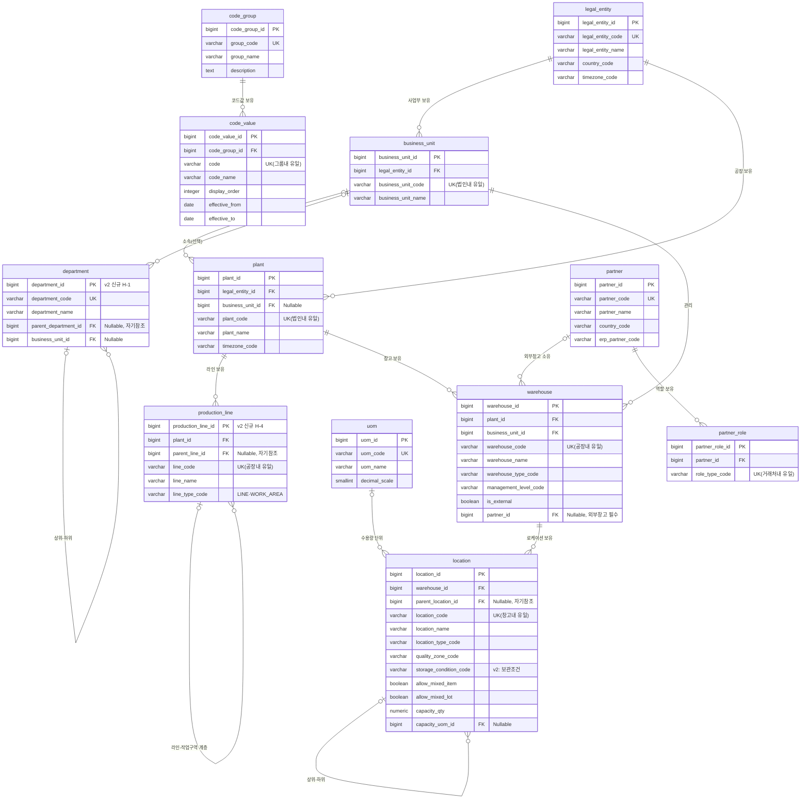
```mermaid
erDiagram
    code_group ||--o{ code_value : "코드값 보유"
    legal_entity ||--o{ business_unit : "사업부 보유"
    legal_entity ||--o{ plant : "공장 보유"
    business_unit |o--o{ plant : "소속(선택)"
    plant ||--o{ production_line : "라인 보유"
    production_line |o--o{ production_line : "라인-작업구역 계층"
    business_unit |o--o{ department : "소속(선택)"
    department |o--o{ department : "상위-하위"
    plant ||--o{ warehouse : "창고 보유"
    business_unit ||--o{ warehouse : "관리"
    partner |o--o{ warehouse : "외부창고 소유"
    partner ||--o{ partner_role : "역할 보유"
    warehouse ||--o{ location : "로케이션 보유"
    location |o--o{ location : "상위-하위"
    uom |o--o{ location : "수용량 단위"

    code_group {
        bigint code_group_id PK
        varchar group_code UK
        varchar group_name
        text description
    }
    code_value {
        bigint code_value_id PK
        bigint code_group_id FK
        varchar code "UK(그룹내 유일)"
        varchar code_name
        integer display_order
        date effective_from
        date effective_to
    }
    legal_entity {
        bigint legal_entity_id PK
        varchar legal_entity_code UK
        varchar legal_entity_name
        varchar country_code
        varchar timezone_code
    }
    business_unit {
        bigint business_unit_id PK
        bigint legal_entity_id FK
        varchar business_unit_code "UK(법인내 유일)"
        varchar business_unit_name
    }
    plant {
        bigint plant_id PK
        bigint legal_entity_id FK
        bigint business_unit_id FK "Nullable"
        varchar plant_code "UK(법인내 유일)"
        varchar plant_name
        varchar timezone_code
    }
    production_line {
        bigint production_line_id PK "v2 신규 H-4"
        bigint plant_id FK
        bigint parent_line_id FK "Nullable, 자기참조"
        varchar line_code "UK(공장내 유일)"
        varchar line_name
        varchar line_type_code "LINE·WORK_AREA"
    }
    department {
        bigint department_id PK "v2 신규 H-1"
        varchar department_code UK
        varchar department_name
        bigint parent_department_id FK "Nullable, 자기참조"
        bigint business_unit_id FK "Nullable"
    }
    partner {
        bigint partner_id PK
        varchar partner_code UK
        varchar partner_name
        varchar country_code
        varchar erp_partner_code
    }
    partner_role {
        bigint partner_role_id PK
        bigint partner_id FK
        varchar role_type_code "UK(거래처내 유일)"
    }
    warehouse {
        bigint warehouse_id PK
        bigint plant_id FK
        bigint business_unit_id FK
        varchar warehouse_code "UK(공장내 유일)"
        varchar warehouse_name
        varchar warehouse_type_code
        varchar management_level_code
        boolean is_external
        bigint partner_id FK "Nullable, 외부창고 필수"
    }
    location {
        bigint location_id PK
        bigint warehouse_id FK
        bigint parent_location_id FK "Nullable, 자기참조"
        varchar location_code "UK(창고내 유일)"
        varchar location_name
        varchar location_type_code
        varchar quality_zone_code
        varchar storage_condition_code "v2: 보관조건"
        boolean allow_mixed_item
        boolean allow_mixed_lot
        numeric capacity_qty
        bigint capacity_uom_id FK "Nullable"
    }
    uom {
        bigint uom_id PK
        varchar uom_code UK
        varchar uom_name
        smallint decimal_scale
    }
```

---

## 2. 사용자·권한 (app) — v2 신규 (H-1)

> 1-2 사용자·권한 관리, 2-7 NFR-IM-010/011, 3-1 §5.10 반영. `user_data_scope`는 RLS(§24 템플릿)와 연동되는 사업부·공장 접근범위이다.

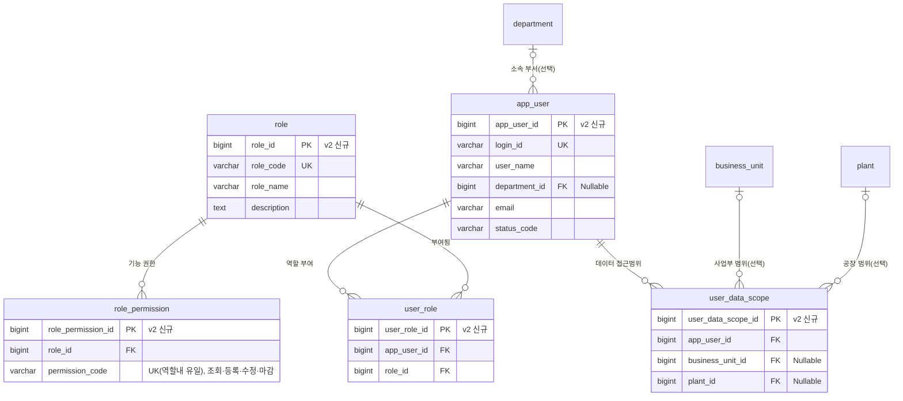
```mermaid
erDiagram
    department |o--o{ app_user : "소속 부서(선택)"
    app_user ||--o{ user_role : "역할 부여"
    role ||--o{ user_role : "부여됨"
    role ||--o{ role_permission : "기능 권한"
    app_user ||--o{ user_data_scope : "데이터 접근범위"
    business_unit |o--o{ user_data_scope : "사업부 범위(선택)"
    plant |o--o{ user_data_scope : "공장 범위(선택)"

    app_user {
        bigint app_user_id PK "v2 신규"
        varchar login_id UK
        varchar user_name
        bigint department_id FK "Nullable"
        varchar email
        varchar status_code
    }
    role {
        bigint role_id PK "v2 신규"
        varchar role_code UK
        varchar role_name
        text description
    }
    role_permission {
        bigint role_permission_id PK "v2 신규"
        bigint role_id FK
        varchar permission_code "UK(역할내 유일), 조회·등록·수정·마감"
    }
    user_role {
        bigint user_role_id PK "v2 신규"
        bigint app_user_id FK
        bigint role_id FK
    }
    user_data_scope {
        bigint user_data_scope_id PK "v2 신규"
        bigint app_user_id FK
        bigint business_unit_id FK "Nullable"
        bigint plant_id FK "Nullable"
    }
```

---

## 3. 품목·공정·설비·작업자·단말기 기준정보 (mdm)

```mermaid
erDiagram
    uom ||--o{ item : "기본단위"
    item ||--o{ item_uom_conversion : "단위환산"
    uom ||--o{ item_uom_conversion : "from 단위"
    uom ||--o{ item_uom_conversion : "to 단위"
    item ||--o{ item_external_code : "외부코드 매핑"
    partner |o--o{ item_external_code : "거래처별 코드"
    business_unit ||--o{ item_bu_item_map : "출발 사업부"
    business_unit ||--o{ item_bu_item_map : "도착 사업부"
    item ||--o{ item_bu_item_map : "출발 품목"
    item ||--o{ item_bu_item_map : "도착 품목"
    plant ||--o{ equipment : "설비 보유"
    process |o--o{ equipment : "기본공정"
    production_line |o--o{ equipment : "소속 라인(선택)"
    plant ||--o{ mold : "금형 보유"
    business_unit ||--o{ worker : "소속"
    plant ||--o{ worker : "근무 공장"
    department |o--o{ worker : "소속 부서(선택)"
    app_user |o--o{ worker : "시스템 사용자 연결(선택)"
    worker ||--o{ worker_qualification : "자격 보유"
    process |o--o{ worker_qualification : "대상 공정(선택)"
    plant ||--o{ shift : "근무조"
    plant ||--o{ terminal : "단말기"
    location |o--o{ terminal : "설치 위치"
    terminal ||--o{ terminal_process : "처리가능 공정"
    process ||--o{ terminal_process : "연결"

    item {
        bigint item_id PK
        varchar item_code UK
        varchar item_name
        varchar item_type_code "원재료·부품·반제품·완제품"
        bigint base_uom_id FK
        varchar lot_control_type_code
        varchar serial_control_type_code
        integer shelf_life_days
        boolean inspection_required
        varchar fifo_policy_code "FIFO·FEFO"
        boolean negative_stock_allowed
        varchar storage_condition_code "v2: 보관조건"
        integer opened_shelf_life_hours "v2: 개봉 후 사용시간"
    }
    item_uom_conversion {
        bigint item_uom_conversion_id PK
        bigint item_id FK
        bigint from_uom_id FK
        bigint to_uom_id FK
        numeric conversion_rate
        date effective_from
        date effective_to
    }
    item_external_code {
        bigint item_external_code_id PK
        bigint item_id FK
        varchar external_system_code
        bigint partner_id FK "Nullable"
        varchar external_item_code
    }
    item_bu_item_map {
        bigint item_bu_item_map_id PK "v2 신규 M-16"
        bigint from_business_unit_id FK
        bigint from_item_id FK
        bigint to_business_unit_id FK
        bigint to_item_id FK
        date effective_from
        date effective_to
    }
    process {
        bigint process_id PK
        varchar process_code UK
        varchar process_name
        varchar process_type_code
    }
    equipment {
        bigint equipment_id PK
        bigint plant_id FK
        varchar equipment_code "UK(공장내 유일)"
        varchar equipment_name
        varchar equipment_type_code
        bigint process_id FK "Nullable"
        bigint production_line_id FK "Nullable, v2 H-4"
        varchar status_code
        boolean calibration_required "v2 M-7: 교정관리"
        date last_calibration_date "v2 M-7"
        date calibration_due_date "v2 M-7"
    }
    mold {
        bigint mold_id PK
        bigint plant_id FK
        varchar mold_code "UK(공장내 유일)"
        varchar mold_name
        integer cavity_count
        bigint guaranteed_shot_count
        bigint current_shot_count
        varchar status_code
    }
    worker {
        bigint worker_id PK
        varchar worker_no UK
        varchar worker_name
        bigint business_unit_id FK
        bigint plant_id FK
        bigint department_id FK "Nullable, v2 H-1"
        bigint app_user_id FK "Nullable, v2 H-1: 작업자-입력자 구분"
        varchar status_code
    }
    worker_qualification {
        bigint worker_qualification_id PK "v2 신규 M-8"
        bigint worker_id FK
        varchar qualification_type_code
        bigint process_id FK "Nullable"
        varchar certificate_no
        date valid_from
        date valid_to
    }
    shift {
        bigint shift_id PK
        bigint plant_id FK
        varchar shift_code "UK(공장내 유일)"
        varchar shift_name
        time start_time
        time end_time
        boolean crosses_midnight
    }
    terminal {
        bigint terminal_id PK
        varchar terminal_code UK
        bigint plant_id FK
        bigint location_id FK "Nullable"
        varchar terminal_type_code
        varchar status_code
    }
    terminal_process {
        bigint terminal_process_id PK
        bigint terminal_id FK
        bigint process_id FK
        boolean can_input_material
        boolean can_input_result
        boolean can_input_inspection
        boolean can_print_label
        boolean can_start_work "v2 L"
        boolean can_complete_work "v2 L"
        boolean can_cancel_input "v2 L"
        boolean can_return_material "v2 L"
    }
```

---

## 4. BOM·라우팅 (planning)

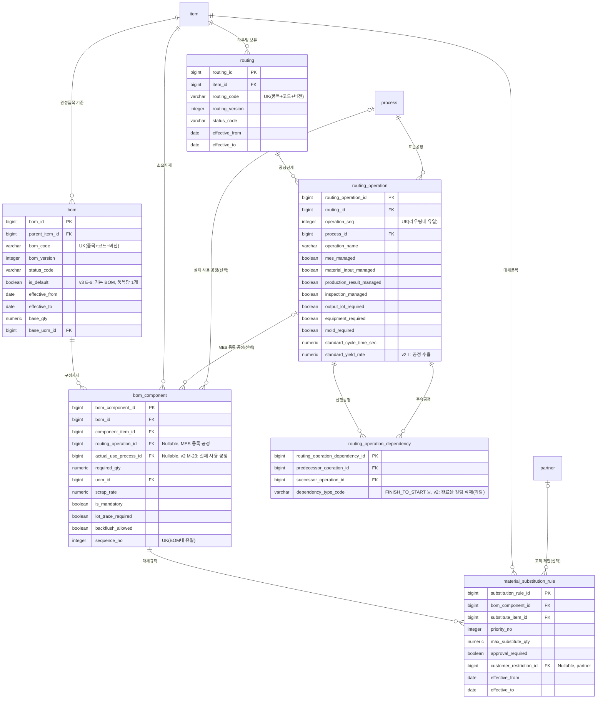
```mermaid
erDiagram
    item ||--o{ bom : "완성품목 기준"
    item ||--o{ routing : "라우팅 보유"
    bom ||--o{ bom_component : "구성자재"
    item ||--o{ bom_component : "소요자재"
    routing ||--o{ routing_operation : "공정단계"
    process ||--o{ routing_operation : "표준공정"
    routing_operation |o--o{ bom_component : "MES 등록 공정(선택)"
    process |o--o{ bom_component : "실제 사용 공정(선택)"
    routing_operation ||--o{ routing_operation_dependency : "선행공정"
    routing_operation ||--o{ routing_operation_dependency : "후속공정"
    bom_component ||--o{ material_substitution_rule : "대체규칙"
    item ||--o{ material_substitution_rule : "대체품목"
    partner |o--o{ material_substitution_rule : "고객 제한(선택)"

    bom {
        bigint bom_id PK
        bigint parent_item_id FK
        varchar bom_code "UK(품목+코드+버전)"
        integer bom_version
        varchar status_code
        boolean is_default "v3 E-6: 기본 BOM, 품목당 1개"
        date effective_from
        date effective_to
        numeric base_qty
        bigint base_uom_id FK
    }
    bom_component {
        bigint bom_component_id PK
        bigint bom_id FK
        bigint component_item_id FK
        bigint routing_operation_id FK "Nullable, MES 등록 공정"
        bigint actual_use_process_id FK "Nullable, v2 M-23: 실제 사용 공정"
        numeric required_qty
        bigint uom_id FK
        numeric scrap_rate
        boolean is_mandatory
        boolean lot_trace_required
        boolean backflush_allowed
        integer sequence_no "UK(BOM내 유일)"
    }
    material_substitution_rule {
        bigint substitution_rule_id PK
        bigint bom_component_id FK
        bigint substitute_item_id FK
        integer priority_no
        numeric max_substitute_qty
        boolean approval_required
        bigint customer_restriction_id FK "Nullable, partner"
        date effective_from
        date effective_to
    }
    routing {
        bigint routing_id PK
        bigint item_id FK
        varchar routing_code "UK(품목+코드+버전)"
        integer routing_version
        varchar status_code
        date effective_from
        date effective_to
    }
    routing_operation {
        bigint routing_operation_id PK
        bigint routing_id FK
        integer operation_seq "UK(라우팅내 유일)"
        bigint process_id FK
        varchar operation_name
        boolean mes_managed
        boolean material_input_managed
        boolean production_result_managed
        boolean inspection_managed
        boolean output_lot_required
        boolean equipment_required
        boolean mold_required
        numeric standard_cycle_time_sec
        numeric standard_yield_rate "v2 L: 공정 수율"
    }
    routing_operation_dependency {
        bigint routing_operation_dependency_id PK
        bigint predecessor_operation_id FK
        bigint successor_operation_id FK
        varchar dependency_type_code "FINISH_TO_START 등, v2: 완료율 컬럼 삭제(과함)"
    }
```

---

## 5. 생산오더·생산계획·작업지시·작업세션 (planning, production)

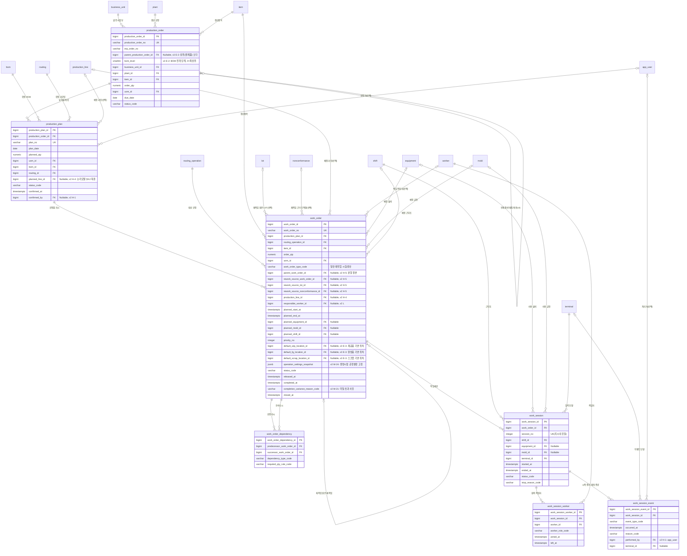
```mermaid
erDiagram
    business_unit ||--o{ production_order : "발주 사업부"
    plant ||--o{ production_order : "생산 공장"
    item ||--o{ production_order : "생산품목"
    production_order |o--o{ production_order : "완제품-반제품 계층(v3)"
    production_order ||--o{ production_plan : "일자별 계획"
    bom ||--o{ production_plan : "확정 BOM"
    routing ||--o{ production_plan : "확정 라우팅"
    production_line |o--o{ production_plan : "예정 라인(선택)"
    app_user |o--o{ production_plan : "확정자(선택)"
    production_plan ||--o{ work_order : "공정별 지시"
    routing_operation ||--o{ work_order : "대상 공정"
    item ||--o{ work_order : "생산품목"
    work_order |o--o{ work_order : "분할 원본-자식"
    work_order |o--o{ work_order : "재작업 원본-재작업"
    lot |o--o{ work_order : "재작업 원본 LOT(선택)"
    nonconformance |o--o{ work_order : "재작업 근거 부적합(선택)"
    production_line |o--o{ work_order : "배정 라인(선택)"
    worker |o--o{ work_order : "책임 작업자(선택)"
    equipment |o--o{ work_order : "예정 설비"
    mold |o--o{ work_order : "예정 금형"
    shift |o--o{ work_order : "예정 근무조"
    work_order ||--o{ work_order_dependency : "선행지시"
    work_order ||--o{ work_order_dependency : "후속지시"
    work_order ||--o{ work_session : "작업세션"
    shift ||--o{ work_session : "근무조"
    equipment |o--o{ work_session : "사용 설비"
    mold |o--o{ work_session : "사용 금형"
    terminal ||--o{ work_session : "입력 단말"
    work_session ||--o{ work_session_worker : "참여 작업자"
    worker ||--o{ work_session_worker : "작업자"
    work_session ||--o{ work_session_event : "시작·중지·재개·종료"
    terminal |o--o{ work_session_event : "이벤트 단말"
    app_user |o--o{ work_session_event : "처리자(선택)"

    production_order {
        bigint production_order_id PK
        varchar production_order_no UK
        varchar erp_order_no
        bigint parent_production_order_id FK "Nullable, v3 E-2: 상위(완제품) 오더"
        smallint bom_level "v3 E-2: BOM 전개 단계, 0=최상위"
        bigint business_unit_id FK
        bigint plant_id FK
        bigint item_id FK
        numeric order_qty
        bigint uom_id FK
        date due_date
        varchar status_code
    }
    production_plan {
        bigint production_plan_id PK
        bigint production_order_id FK
        varchar plan_no UK
        date plan_date
        numeric planned_qty
        bigint uom_id FK
        bigint bom_id FK
        bigint routing_id FK
        bigint planned_line_id FK "Nullable, v2 H-4: 논리모델 §9.2 복원"
        varchar status_code
        timestamptz confirmed_at
        bigint confirmed_by FK "Nullable, v2 H-1"
    }
    work_order {
        bigint work_order_id PK
        varchar work_order_no UK
        bigint production_plan_id FK
        bigint routing_operation_id FK
        bigint item_id FK
        numeric order_qty
        bigint uom_id FK
        varchar work_order_type_code "일반·재작업·시험생산"
        bigint parent_work_order_id FK "Nullable, v2 H-5: 분할 원본"
        bigint rework_source_work_order_id FK "Nullable, v2 H-5"
        bigint rework_source_lot_id FK "Nullable, v2 H-5"
        bigint rework_source_nonconformance_id FK "Nullable, v2 H-5"
        bigint production_line_id FK "Nullable, v2 H-4"
        bigint responsible_worker_id FK "Nullable, v2 L"
        timestamptz planned_start_at
        timestamptz planned_end_at
        bigint planned_equipment_id FK "Nullable"
        bigint planned_mold_id FK "Nullable"
        bigint planned_shift_id FK "Nullable"
        integer priority_no
        bigint default_wip_location_id FK "Nullable, v3 E-3: 재공품 기본 위치"
        bigint default_fg_location_id FK "Nullable, v3 E-3: 완성품 기본 위치"
        bigint default_scrap_location_id FK "Nullable, v3 E-3: 스크랩 기본 위치"
        jsonb operation_settings_snapshot "v2 M-24: 생성시점 공정설정 고정"
        varchar status_code
        timestamptz released_at
        timestamptz completed_at
        varchar completion_variance_reason_code "v2 M-21: 미달·초과 사유"
        timestamptz closed_at
    }
    work_order_dependency {
        bigint work_order_dependency_id PK
        bigint predecessor_work_order_id FK
        bigint successor_work_order_id FK
        varchar dependency_type_code
        varchar required_qty_rule_code
    }
    work_session {
        bigint work_session_id PK
        bigint work_order_id FK
        integer session_no "UK(지시내 유일)"
        bigint shift_id FK
        bigint equipment_id FK "Nullable"
        bigint mold_id FK "Nullable"
        bigint terminal_id FK
        timestamptz started_at
        timestamptz ended_at
        varchar status_code
        varchar stop_reason_code
    }
    work_session_worker {
        bigint work_session_worker_id PK
        bigint work_session_id FK
        bigint worker_id FK
        varchar worker_role_code
        timestamptz joined_at
        timestamptz left_at
    }
    work_session_event {
        bigint work_session_event_id PK
        bigint work_session_id FK
        varchar event_type_code
        timestamptz occurred_at
        varchar reason_code
        bigint performed_by FK "v2 H-1: app_user"
        bigint terminal_id FK "Nullable"
    }
```

---

## 6. 구매 P/O·ASN·입하·입고·적치 (logistics)

> v3(E-1): 적치 규칙 마스터 `putaway_rule`(품목×창고×위치, 수용량·우선순위)이 추가되어 권장 위치 산출 근거를 데이터로 관리하고, `putaway_task.applied_putaway_rule_id`로 적용 규칙을 역참조한다 (ERPNext Putaway Rule 벤치마킹).

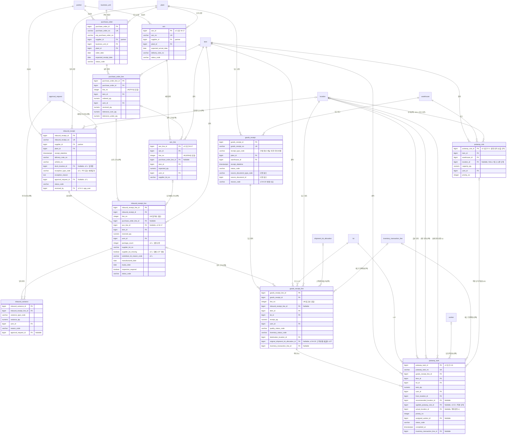
```mermaid
erDiagram
    partner ||--o{ purchase_order : "공급사"
    business_unit ||--o{ purchase_order : "구매 사업부"
    plant ||--o{ purchase_order : "입고 공장"
    purchase_order ||--o{ purchase_order_line : "발주 품목"
    item ||--o{ purchase_order_line : "품목"
    partner ||--o{ asn : "공급사"
    plant ||--o{ asn : "입하 공장"
    asn ||--o{ asn_line : "예정 품목"
    purchase_order_line |o--o{ asn_line : "발주 근거(선택)"
    item ||--o{ asn_line : "품목"
    partner ||--o{ inbound_receipt : "공급사"
    plant ||--o{ inbound_receipt : "입하 공장"
    location |o--o{ inbound_receipt : "입하장 도크(선택)"
    approval_request |o--o{ inbound_receipt : "예외입하 승인(선택)"
    inbound_receipt ||--o{ inbound_receipt_line : "입하 품목"
    purchase_order_line |o--o{ inbound_receipt_line : "발주 근거(선택)"
    asn_line |o--o{ inbound_receipt_line : "입하예정 근거(선택)"
    item ||--o{ inbound_receipt_line : "품목"
    inbound_receipt_line ||--o{ inbound_variance : "입하 차이"
    approval_request |o--o{ inbound_variance : "차이 승인(선택)"
    plant ||--o{ goods_receipt : "입고 공장"
    warehouse ||--o{ goods_receipt : "입고 창고"
    goods_receipt ||--o{ goods_receipt_line : "입고 품목"
    inbound_receipt_line |o--o{ goods_receipt_line : "입하 근거(선택)"
    item ||--o{ goods_receipt_line : "품목"
    lot ||--o{ goods_receipt_line : "입고 LOT"
    location ||--o{ goods_receipt_line : "입고 위치"
    shipment_lot_allocation |o--o{ goods_receipt_line : "고객반품 원출하(선택)"
    inventory_transaction_line |o--o{ goods_receipt_line : "재고 트랜잭션(선택)"
    goods_receipt_line ||--o{ putaway_task : "적치지시"
    item ||--o{ putaway_task : "품목"
    lot ||--o{ putaway_task : "LOT"
    location ||--o{ putaway_task : "출발 위치"
    location |o--o{ putaway_task : "권장 위치(선택)"
    location |o--o{ putaway_task : "실제 위치(확정 시)"
    worker |o--o{ putaway_task : "담당 작업자(선택)"
    inventory_transaction_line |o--o{ putaway_task : "재고 트랜잭션(선택)"
    item ||--o{ putaway_rule : "품목"
    warehouse ||--o{ putaway_rule : "창고"
    location |o--o{ putaway_rule : "위치(선택, NULL=창고 수준)"
    putaway_rule |o--o{ putaway_task : "적용 규칙 역참조(v3)"

    purchase_order {
        bigint purchase_order_id PK
        varchar purchase_order_no UK
        varchar erp_purchase_order_no
        bigint supplier_id FK "partner"
        bigint business_unit_id FK
        bigint plant_id FK
        date order_date
        date expected_receipt_date
        varchar status_code
    }
    purchase_order_line {
        bigint purchase_order_line_id PK
        bigint purchase_order_id FK
        integer line_no "UK(P/O내 유일)"
        bigint item_id FK
        numeric ordered_qty
        bigint uom_id FK
        numeric received_qty
        numeric tolerance_over_qty
        numeric tolerance_under_qty
    }
    asn {
        bigint asn_id PK "v2 신규 M-17"
        varchar asn_no UK
        bigint supplier_id FK "partner"
        bigint plant_id FK
        date expected_arrival_date
        varchar delivery_note_no
        varchar status_code
    }
    asn_line {
        bigint asn_line_id PK "v2 신규 M-17"
        bigint asn_id FK
        integer line_no "UK(ASN내 유일)"
        bigint purchase_order_line_id FK "Nullable"
        bigint item_id FK
        numeric expected_qty
        bigint uom_id FK
        varchar supplier_lot_no
    }
    inbound_receipt {
        bigint inbound_receipt_id PK
        varchar inbound_receipt_no UK
        bigint supplier_id FK "partner"
        bigint plant_id FK
        timestamptz receipt_datetime
        varchar delivery_note_no
        varchar vehicle_no
        bigint dock_location_id FK "Nullable, v2 L: 입하장"
        varchar exception_type_code "v2 L: P/O 없는 예외입하"
        text exception_reason
        bigint approval_request_id FK "Nullable, v2 L"
        varchar status_code
        bigint received_by FK "v2 H-1: app_user"
    }
    inbound_receipt_line {
        bigint inbound_receipt_line_id PK
        bigint inbound_receipt_id FK
        integer line_no "UK(입하내 유일)"
        bigint purchase_order_line_id FK "Nullable"
        bigint asn_line_id FK "Nullable, v2 M-17"
        bigint item_id FK
        numeric received_qty
        bigint uom_id FK
        integer package_count "v2 L: 포장수량"
        varchar supplier_lot_no
        boolean supplier_lot_missing "v2 L: 대체 LOT 생성"
        varchar substitute_lot_reason_code "v2 L"
        date manufactured_date
        date expiry_date
        boolean inspection_required
        varchar status_code
    }
    inbound_variance {
        bigint inbound_variance_id PK
        bigint inbound_receipt_line_id FK
        varchar variance_type_code
        numeric variance_qty
        bigint uom_id FK
        varchar reason_code
        bigint approval_request_id FK "Nullable"
    }
    goods_receipt {
        bigint goods_receipt_id PK
        varchar goods_receipt_no UK
        varchar receipt_type_code "구매·생산·반납·외주·이동·반품"
        bigint plant_id FK
        bigint warehouse_id FK
        timestamptz receipt_datetime
        varchar status_code
        varchar source_document_type_code "다형 참조"
        bigint source_document_id "다형 참조"
        varchar reason_code "v2 M-20: 반품 사유"
    }
    goods_receipt_line {
        bigint goods_receipt_line_id PK
        bigint goods_receipt_id FK
        integer line_no "UK(입고내 유일)"
        bigint inbound_receipt_line_id FK "Nullable"
        bigint item_id FK
        bigint lot_id FK
        numeric receipt_qty
        bigint uom_id FK
        varchar quality_status_code
        varchar inventory_status_code
        bigint destination_location_id FK
        bigint original_shipment_lot_allocation_id FK "Nullable, v2 M-20: 고객반품 원출하 LOT"
        bigint inventory_transaction_line_id FK "Nullable"
    }
    putaway_rule {
        bigint putaway_rule_id PK "v3 신규 E-1: 권장 위치 산출 규칙"
        bigint item_id FK
        bigint warehouse_id FK
        bigint location_id FK "Nullable, NULL=창고 수준 규칙"
        numeric capacity_qty
        bigint uom_id FK
        integer priority_no
    }
    putaway_task {
        bigint putaway_task_id PK "v2 신규 H-6"
        varchar putaway_task_no UK
        bigint goods_receipt_line_id FK
        bigint item_id FK
        bigint lot_id FK
        numeric task_qty
        bigint uom_id FK
        bigint from_location_id FK
        bigint recommended_location_id FK "Nullable"
        bigint applied_putaway_rule_id FK "Nullable, v3 E-1: 적용 규칙"
        bigint actual_location_id FK "Nullable, 적치확정 시"
        integer priority_no
        bigint assigned_worker_id FK "Nullable"
        varchar status_code
        timestamptz completed_at
        bigint inventory_transaction_line_id FK "Nullable"
    }
```

---

## 7. LOT·재고잔액·재고 트랜잭션·예약·취급단위 (trace, inventory)

```mermaid
erDiagram
    item ||--o{ lot : "품목"
    plant ||--o{ lot : "생성 공장"
    lot |o--o{ lot : "분할 상위 LOT(표시용)"
    lot ||--o{ lot_external_identifier : "외부 식별자"
    partner |o--o{ lot_external_identifier : "거래처(선택)"
    legal_entity ||--o{ inventory_balance : "법인"
    business_unit ||--o{ inventory_balance : "사업부"
    plant ||--o{ inventory_balance : "공장"
    warehouse ||--o{ inventory_balance : "창고"
    location ||--o{ inventory_balance : "로케이션"
    item ||--o{ inventory_balance : "품목"
    lot |o--o{ inventory_balance : "LOT(선택)"
    partner |o--o{ inventory_balance : "외부 소유자(선택)"
    plant ||--o{ inventory_transaction : "공장"
    inventory_transaction |o--o{ inventory_transaction : "취소 원본(v2 복합 FK)"
    inventory_transaction ||--o{ inventory_transaction_line : "증감 Line"
    item ||--o{ inventory_transaction_line : "품목"
    lot |o--o{ inventory_transaction_line : "LOT(선택)"
    warehouse |o--o{ inventory_transaction_line : "출발 창고"
    location |o--o{ inventory_transaction_line : "출발 위치"
    warehouse |o--o{ inventory_transaction_line : "도착 창고"
    location |o--o{ inventory_transaction_line : "도착 위치"
    partner |o--o{ inventory_transaction_line : "소유자(선택)"
    handling_unit |o--o{ inventory_transaction_line : "취급단위(선택)"
    item ||--o{ inventory_reservation : "품목"
    lot |o--o{ inventory_reservation : "LOT(선택)"
    warehouse ||--o{ inventory_reservation : "창고"
    location |o--o{ inventory_reservation : "위치(선택)"
    handling_unit |o--o{ handling_unit : "상위 취급단위"
    warehouse |o--o{ handling_unit : "현재 창고"
    location |o--o{ handling_unit : "현재 위치"
    handling_unit ||--o{ handling_unit_content : "내용물"
    item ||--o{ handling_unit_content : "품목"
    lot ||--o{ handling_unit_content : "LOT"

    lot {
        bigint lot_id PK
        varchar lot_no "UK(공장내 유일)"
        bigint item_id FK
        varchar lot_type_code "자재·반제품·완제품·재작업"
        bigint plant_id FK
        numeric initial_qty
        bigint uom_id FK
        timestamptz manufactured_at
        date expiry_date
        varchar source_type_code "입고·생산·분할·재작업"
        bigint source_id "다형 참조"
        varchar status_code
        bigint parent_lot_id FK "Nullable, v2 M-14: 표시용 비정규화(원천은 lot_relation)"
    }
    lot_external_identifier {
        bigint lot_external_identifier_id PK
        bigint lot_id FK
        varchar identifier_type_code
        varchar external_identifier
        bigint partner_id FK "Nullable"
        varchar external_system_code
    }
    inventory_balance {
        bigint inventory_balance_id PK
        bigint legal_entity_id FK
        bigint business_unit_id FK
        bigint plant_id FK
        bigint warehouse_id FK
        bigint location_id FK
        bigint item_id FK
        bigint lot_id FK "Nullable"
        varchar quality_status_code
        varchar inventory_status_code
        varchar ownership_type_code
        bigint owner_partner_id FK "Nullable"
        numeric on_hand_qty "v2 H-2: signed, 음수는 품목 정책+트리거 검증"
        numeric reserved_qty
        numeric picked_qty
        numeric blocked_qty
        numeric available_qty "계산 컬럼"
        bigint uom_id FK
        timestamptz last_transaction_at
    }
    inventory_transaction {
        bigint inventory_transaction_id PK
        date business_date PK "RANGE 파티션 키"
        varchar transaction_no "UK"
        varchar transaction_type_code
        bigint plant_id FK
        timestamptz occurred_at
        timestamptz recorded_at
        varchar source_document_type_code "다형 참조"
        bigint source_document_id "다형 참조"
        varchar status_code
        varchar idempotency_key UK
        bigint reversal_of_transaction_id FK "Nullable, 취소 원본"
        date reversal_of_business_date FK "Nullable, v2 M-2: 복합 FK 성립"
    }
    inventory_transaction_line {
        bigint inventory_transaction_line_id PK
        bigint inventory_transaction_id FK
        date business_date FK
        integer line_no "UK(트랜잭션내 유일)"
        bigint item_id FK
        bigint lot_id FK "Nullable"
        numeric qty "항상 양수"
        bigint uom_id FK
        bigint from_warehouse_id FK "Nullable"
        bigint from_location_id FK "Nullable"
        varchar from_quality_status_code
        varchar from_inventory_status_code
        bigint to_warehouse_id FK "Nullable"
        bigint to_location_id FK "Nullable"
        varchar to_quality_status_code
        varchar to_inventory_status_code
        varchar ownership_type_code
        bigint owner_partner_id FK "Nullable"
        bigint handling_unit_id FK "Nullable"
        numeric from_qty_after_transaction "Nullable, v3 E-5: 직후 잔액 스냅샷"
        numeric to_qty_after_transaction "Nullable, v3 E-5"
    }
    inventory_reservation {
        bigint inventory_reservation_id PK
        varchar reservation_no UK
        varchar reservation_type_code
        varchar source_document_type_code "다형 참조"
        bigint source_document_id "다형 참조"
        bigint item_id FK
        bigint lot_id FK "Nullable"
        bigint warehouse_id FK
        bigint location_id FK "Nullable"
        numeric reserved_qty
        numeric released_qty
        numeric consumed_qty
        bigint uom_id FK
        varchar status_code
    }
    handling_unit {
        bigint handling_unit_id PK
        varchar handling_unit_no UK
        varchar handling_unit_type_code "박스·대차·팔레트"
        bigint parent_handling_unit_id FK "Nullable, 자기참조"
        bigint warehouse_id FK "Nullable"
        bigint location_id FK "Nullable"
        varchar status_code
    }
    handling_unit_content {
        bigint handling_unit_content_id PK
        bigint handling_unit_id FK
        bigint item_id FK
        bigint lot_id FK
        numeric qty
        bigint uom_id FK
    }
```

---

## 8. 생산출고·피킹·출고·현장 인수 (logistics)

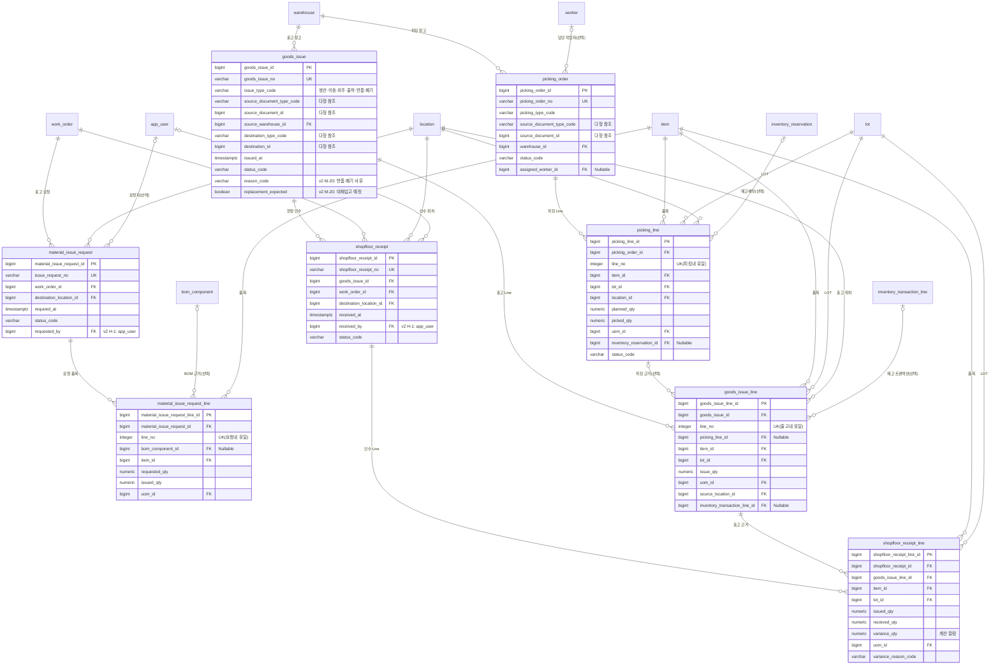
```mermaid
erDiagram
    work_order ||--o{ material_issue_request : "출고 요청"
    location ||--o{ material_issue_request : "인도 위치"
    app_user |o--o{ material_issue_request : "요청자(선택)"
    material_issue_request ||--o{ material_issue_request_line : "요청 품목"
    bom_component |o--o{ material_issue_request_line : "BOM 근거(선택)"
    item ||--o{ material_issue_request_line : "품목"
    warehouse ||--o{ picking_order : "피킹 창고"
    worker |o--o{ picking_order : "담당 작업자(선택)"
    picking_order ||--o{ picking_line : "피킹 Line"
    item ||--o{ picking_line : "품목"
    lot ||--o{ picking_line : "LOT"
    location ||--o{ picking_line : "피킹 위치"
    inventory_reservation |o--o{ picking_line : "재고예약(선택)"
    warehouse ||--o{ goods_issue : "출고 창고"
    goods_issue ||--o{ goods_issue_line : "출고 Line"
    picking_line |o--o{ goods_issue_line : "피킹 근거(선택)"
    item ||--o{ goods_issue_line : "품목"
    lot ||--o{ goods_issue_line : "LOT"
    location ||--o{ goods_issue_line : "출고 위치"
    inventory_transaction_line |o--o{ goods_issue_line : "재고 트랜잭션(선택)"
    goods_issue ||--o{ shopfloor_receipt : "현장 인수"
    work_order ||--o{ shopfloor_receipt : "대상 지시"
    location ||--o{ shopfloor_receipt : "인수 위치"
    app_user |o--o{ shopfloor_receipt : "인수자(선택)"
    shopfloor_receipt ||--o{ shopfloor_receipt_line : "인수 Line"
    goods_issue_line ||--o{ shopfloor_receipt_line : "출고 근거"
    item ||--o{ shopfloor_receipt_line : "품목"
    lot ||--o{ shopfloor_receipt_line : "LOT"

    material_issue_request {
        bigint material_issue_request_id PK
        varchar issue_request_no UK
        bigint work_order_id FK
        bigint destination_location_id FK
        timestamptz required_at
        varchar status_code
        bigint requested_by FK "v2 H-1: app_user"
    }
    material_issue_request_line {
        bigint material_issue_request_line_id PK
        bigint material_issue_request_id FK
        integer line_no "UK(요청내 유일)"
        bigint bom_component_id FK "Nullable"
        bigint item_id FK
        numeric requested_qty
        numeric issued_qty
        bigint uom_id FK
    }
    picking_order {
        bigint picking_order_id PK
        varchar picking_order_no UK
        varchar picking_type_code
        varchar source_document_type_code "다형 참조"
        bigint source_document_id "다형 참조"
        bigint warehouse_id FK
        varchar status_code
        bigint assigned_worker_id FK "Nullable"
    }
    picking_line {
        bigint picking_line_id PK
        bigint picking_order_id FK
        integer line_no "UK(피킹내 유일)"
        bigint item_id FK
        bigint lot_id FK
        bigint location_id FK
        numeric planned_qty
        numeric picked_qty
        bigint uom_id FK
        bigint inventory_reservation_id FK "Nullable"
        varchar status_code
    }
    goods_issue {
        bigint goods_issue_id PK
        varchar goods_issue_no UK
        varchar issue_type_code "생산·이동·외주·출하·반품·폐기"
        varchar source_document_type_code "다형 참조"
        bigint source_document_id "다형 참조"
        bigint source_warehouse_id FK
        varchar destination_type_code "다형 참조"
        bigint destination_id "다형 참조"
        timestamptz issued_at
        varchar status_code
        varchar reason_code "v2 M-20: 반품·폐기 사유"
        boolean replacement_expected "v2 M-20: 대체입고 예정"
    }
    goods_issue_line {
        bigint goods_issue_line_id PK
        bigint goods_issue_id FK
        integer line_no "UK(출고내 유일)"
        bigint picking_line_id FK "Nullable"
        bigint item_id FK
        bigint lot_id FK
        numeric issue_qty
        bigint uom_id FK
        bigint source_location_id FK
        bigint inventory_transaction_line_id FK "Nullable"
    }
    shopfloor_receipt {
        bigint shopfloor_receipt_id PK
        varchar shopfloor_receipt_no UK
        bigint goods_issue_id FK
        bigint work_order_id FK
        bigint destination_location_id FK
        timestamptz received_at
        bigint received_by FK "v2 H-1: app_user"
        varchar status_code
    }
    shopfloor_receipt_line {
        bigint shopfloor_receipt_line_id PK
        bigint shopfloor_receipt_id FK
        bigint goods_issue_line_id FK
        bigint item_id FK
        bigint lot_id FK
        numeric issued_qty
        numeric received_qty
        numeric variance_qty "계산 컬럼"
        bigint uom_id FK
        varchar variance_reason_code
    }
```

---

## 9. 자재투입·사용배분·반납·손실 (production)

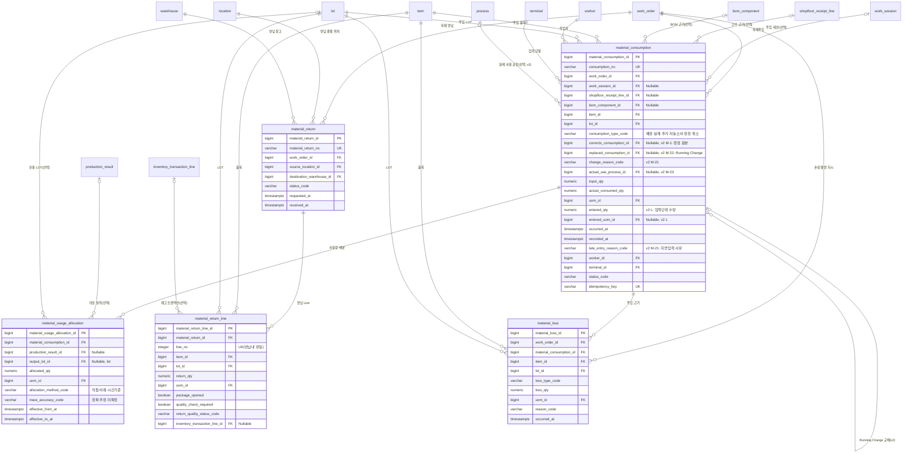
```mermaid
erDiagram
    work_order ||--o{ material_consumption : "자재투입"
    work_session |o--o{ material_consumption : "투입 세션(선택)"
    shopfloor_receipt_line |o--o{ material_consumption : "인수 근거(선택)"
    bom_component |o--o{ material_consumption : "BOM 근거(선택)"
    item ||--o{ material_consumption : "투입 품목"
    lot ||--o{ material_consumption : "투입 LOT"
    worker ||--o{ material_consumption : "작업자"
    terminal ||--o{ material_consumption : "입력 단말"
    material_consumption |o--o{ material_consumption : "정정 원본(v2)"
    material_consumption |o--o{ material_consumption : "Running Change 교체(v2)"
    process |o--o{ material_consumption : "실제 사용 공정(선택, v2)"
    material_consumption ||--o{ material_usage_allocation : "사용량 배분"
    production_result |o--o{ material_usage_allocation : "대상 실적(선택)"
    lot |o--o{ material_usage_allocation : "산출 LOT(선택)"
    work_order ||--o{ material_return : "자재 반납"
    location ||--o{ material_return : "반납 출발 위치"
    warehouse ||--o{ material_return : "반납 창고"
    material_return ||--o{ material_return_line : "반납 Line"
    item ||--o{ material_return_line : "품목"
    lot ||--o{ material_return_line : "LOT"
    inventory_transaction_line |o--o{ material_return_line : "재고 트랜잭션(선택)"
    work_order ||--o{ material_loss : "손실 발생 지시"
    material_consumption ||--o{ material_loss : "투입 근거"
    item ||--o{ material_loss : "품목"
    lot ||--o{ material_loss : "LOT"

    material_consumption {
        bigint material_consumption_id PK
        varchar consumption_no UK
        bigint work_order_id FK
        bigint work_session_id FK "Nullable"
        bigint shopfloor_receipt_line_id FK "Nullable"
        bigint bom_component_id FK "Nullable"
        bigint item_id FK
        bigint lot_id FK
        varchar consumption_type_code "예정·실제·추가·자동소비·정정·취소"
        bigint corrects_consumption_id FK "Nullable, v2 M-1: 정정 원본"
        bigint replaced_consumption_id FK "Nullable, v2 M-22: Running Change"
        varchar change_reason_code "v2 M-21"
        bigint actual_use_process_id FK "Nullable, v2 M-23"
        numeric input_qty
        numeric actual_consumed_qty
        bigint uom_id FK
        numeric entered_qty "v2 L: 입력단위 수량"
        bigint entered_uom_id FK "Nullable, v2 L"
        timestamptz occurred_at
        timestamptz recorded_at
        varchar late_entry_reason_code "v2 M-21: 지연입력 사유"
        bigint worker_id FK
        bigint terminal_id FK
        varchar status_code
        varchar idempotency_key UK
    }
    material_usage_allocation {
        bigint material_usage_allocation_id PK
        bigint material_consumption_id FK
        bigint production_result_id FK "Nullable"
        bigint output_lot_id FK "Nullable, lot"
        numeric allocated_qty
        bigint uom_id FK
        varchar allocation_method_code "직접·비례·시간기준"
        varchar trace_accuracy_code "정확·추정·미확정"
        timestamptz effective_from_at
        timestamptz effective_to_at
    }
    material_return {
        bigint material_return_id PK
        varchar material_return_no UK
        bigint work_order_id FK
        bigint source_location_id FK
        bigint destination_warehouse_id FK
        varchar status_code
        timestamptz requested_at
        timestamptz received_at
    }
    material_return_line {
        bigint material_return_line_id PK
        bigint material_return_id FK
        integer line_no "UK(반납내 유일)"
        bigint item_id FK
        bigint lot_id FK
        numeric return_qty
        bigint uom_id FK
        boolean package_opened
        boolean quality_check_required
        varchar return_quality_status_code
        bigint inventory_transaction_line_id FK "Nullable"
    }
    material_loss {
        bigint material_loss_id PK
        bigint work_order_id FK
        bigint material_consumption_id FK
        bigint item_id FK
        bigint lot_id FK
        varchar loss_type_code
        numeric loss_qty
        bigint uom_id FK
        varchar reason_code
        timestamptz occurred_at
    }
```

---

## 10. 생산실적·LOT 배분·공정 인계 (production)

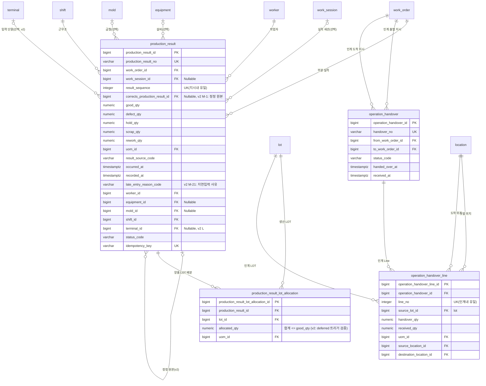
```mermaid
erDiagram
    work_order ||--o{ production_result : "부분 실적"
    work_session |o--o{ production_result : "실적 세션(선택)"
    production_result |o--o{ production_result : "정정 원본(v2)"
    worker ||--o{ production_result : "작업자"
    equipment |o--o{ production_result : "설비(선택)"
    mold |o--o{ production_result : "금형(선택)"
    shift ||--o{ production_result : "근무조"
    terminal |o--o{ production_result : "입력 단말(선택, v2)"
    production_result ||--o{ production_result_lot_allocation : "양품 LOT 배분"
    lot ||--o{ production_result_lot_allocation : "생산 LOT"
    work_order ||--o{ operation_handover : "인계 출발 지시"
    work_order ||--o{ operation_handover : "인계 도착 지시"
    operation_handover ||--o{ operation_handover_line : "인계 Line"
    lot ||--o{ operation_handover_line : "인계 LOT"
    location ||--o{ operation_handover_line : "출발 위치"
    location ||--o{ operation_handover_line : "도착 위치"

    production_result {
        bigint production_result_id PK
        varchar production_result_no UK
        bigint work_order_id FK
        bigint work_session_id FK "Nullable"
        integer result_sequence "UK(지시내 유일)"
        bigint corrects_production_result_id FK "Nullable, v2 M-1: 정정 원본"
        numeric good_qty
        numeric defect_qty
        numeric hold_qty
        numeric scrap_qty
        numeric rework_qty
        bigint uom_id FK
        varchar result_source_code
        timestamptz occurred_at
        timestamptz recorded_at
        varchar late_entry_reason_code "v2 M-21: 지연입력 사유"
        bigint worker_id FK
        bigint equipment_id FK "Nullable"
        bigint mold_id FK "Nullable"
        bigint shift_id FK
        bigint terminal_id FK "Nullable, v2 L"
        varchar status_code
        varchar idempotency_key UK
    }
    production_result_lot_allocation {
        bigint production_result_lot_allocation_id PK
        bigint production_result_id FK
        bigint lot_id FK
        numeric allocated_qty "합계 <= good_qty (v2: deferred 트리거 검증)"
        bigint uom_id FK
    }
    operation_handover {
        bigint operation_handover_id PK
        varchar handover_no UK
        bigint from_work_order_id FK
        bigint to_work_order_id FK
        varchar status_code
        timestamptz handed_over_at
        timestamptz received_at
    }
    operation_handover_line {
        bigint operation_handover_line_id PK
        bigint operation_handover_id FK
        integer line_no "UK(인계내 유일)"
        bigint source_lot_id FK "lot"
        numeric handover_qty
        numeric received_qty
        bigint uom_id FK
        bigint source_location_id FK
        bigint destination_location_id FK
    }
```

---

## 11. 품질검사·불량·부적합·처리결정·특채·교정 (quality)

> `concession`(특채)은 v2에서 물리 모델에 정식 반영되었다(CHANGELOG H-3). 허용 작업지시·공정·고객·수량·유효기간의 사용범위 통제 컬럼과 승인 필수 제약을 포함한다.

```mermaid
erDiagram
    item |o--o{ inspection_plan : "대상 품목(선택)"
    process |o--o{ inspection_plan : "대상 공정(선택)"
    routing |o--o{ inspection_plan : "적용 라우팅(선택, v2)"
    app_user |o--o{ inspection_plan : "승인자(선택, v2)"
    inspection_plan ||--o{ inspection_plan_version : "버전"
    inspection_plan_version ||--o{ inspection_item_spec : "검사항목·규격"
    equipment |o--o{ inspection_item_spec : "지정 검사장비(선택, v2)"
    inspection_plan_version ||--o{ inspection_request : "적용 계획"
    item ||--o{ inspection_request : "대상 품목"
    lot |o--o{ inspection_request : "대상 LOT(선택)"
    work_order |o--o{ inspection_request : "대상 지시(선택)"
    production_result |o--o{ inspection_request : "대상 실적(선택)"
    inspection_request ||--o{ inspection_result : "검사 실행(회차)"
    worker ||--o{ inspection_result : "검사자"
    terminal |o--o{ inspection_result : "처리 단말(선택, v2)"
    inspection_result |o--o{ inspection_result : "재검사 이전 결과"
    inspection_result ||--o{ inspection_measurement : "측정값"
    inspection_item_spec ||--o{ inspection_measurement : "검사항목"
    equipment |o--o{ inspection_measurement : "검사 장비(선택)"
    defect_code |o--o{ defect_code : "상위 불량코드"
    process |o--o{ defect_code : "관련 공정(선택)"
    cause_code |o--o{ cause_code : "상위 원인코드"
    process |o--o{ cause_code : "관련 공정(선택)"
    production_result |o--o{ defect_record : "실적 근거(선택)"
    inspection_result |o--o{ defect_record : "검사 근거(선택)"
    work_order ||--o{ defect_record : "발생 지시"
    lot |o--o{ defect_record : "대상 LOT(선택)"
    defect_code ||--o{ defect_record : "불량현상"
    cause_code |o--o{ defect_record : "추정원인(선택, v2)"
    cause_code |o--o{ defect_record : "확정원인(선택, v2)"
    department |o--o{ defect_record : "귀책부서(선택, v2)"
    worker |o--o{ defect_record : "작업자(선택, v2)"
    process ||--o{ defect_record : "발생 공정"
    process ||--o{ defect_record : "검출 공정"
    equipment |o--o{ defect_record : "설비(선택)"
    mold |o--o{ defect_record : "금형(선택)"
    item ||--o{ nonconformance : "대상 품목"
    work_order |o--o{ nonconformance : "관련 지시(선택)"
    inspection_result |o--o{ nonconformance : "관련 검사(선택)"
    department |o--o{ nonconformance : "책임부서(선택, v2 FK)"
    app_user |o--o{ nonconformance : "조치 담당자(선택, v2)"
    nonconformance ||--o{ nonconformance_lot : "영향 LOT"
    lot ||--o{ nonconformance_lot : "LOT"
    nonconformance ||--o{ disposition_decision : "처리결정"
    app_user ||--o{ disposition_decision : "결정자(v2 FK)"
    approval_request |o--o{ disposition_decision : "승인(선택)"
    disposition_decision ||--o{ sorting_result : "선별 실행(v2)"
    worker ||--o{ sorting_result : "선별 작업자"
    lot |o--o{ sorting_result : "양품 LOT(선택)"
    lot |o--o{ sorting_result : "불량 LOT(선택)"
    nonconformance ||--o{ concession : "특채"
    lot ||--o{ concession : "특채 LOT"
    work_order |o--o{ concession : "허용 지시(선택)"
    process |o--o{ concession : "허용 공정(선택)"
    partner |o--o{ concession : "허용 고객(선택)"
    approval_request ||--o{ concession : "특채 승인(필수)"
    equipment ||--o{ equipment_calibration : "교정 이력(v2)"
    app_user |o--o{ equipment_calibration : "교정자(선택)"

    inspection_plan {
        bigint inspection_plan_id PK
        varchar inspection_plan_code UK
        varchar inspection_plan_name
        bigint item_id FK "Nullable"
        bigint process_id FK "Nullable"
        bigint routing_id FK "Nullable, v2 M-9"
        varchar inspection_type_code "수입·공정·최종·출하"
        bigint approved_by FK "Nullable, v2 M-9"
        timestamptz approved_at
    }
    inspection_plan_version {
        bigint inspection_plan_version_id PK
        bigint inspection_plan_id FK
        integer plan_version "UK(계획내 유일)"
        date effective_from
        date effective_to
        varchar sampling_method_code
        numeric sampling_qty
        numeric aql_value "v2 M-9: AQL"
        integer acceptance_number "v2 M-9: Ac"
        integer rejection_number "v2 M-9: Re"
        varchar inspection_frequency_code
        numeric frequency_interval_value "v2 M-9: 주기값"
        varchar frequency_interval_uom_code
        varchar status_code
    }
    inspection_item_spec {
        bigint inspection_item_spec_id PK
        bigint inspection_plan_version_id FK
        integer sequence_no "UK(버전내 유일)"
        varchar inspection_item_code
        varchar inspection_item_name
        varchar data_type_code
        bigint uom_id FK "Nullable"
        numeric target_value
        numeric lower_limit
        numeric upper_limit
        integer measurement_count "v2 M-9: 측정횟수"
        varchar inspection_method_code "v2 M-9"
        bigint default_inspection_equipment_id FK "Nullable, v2 M-9"
        boolean required_flag
        boolean automatic_judgment
    }
    inspection_request {
        bigint inspection_request_id PK
        varchar inspection_request_no UK
        varchar inspection_type_code
        bigint inspection_plan_version_id FK
        varchar target_type_code "다형 참조"
        bigint target_id "다형 참조"
        bigint item_id FK
        bigint lot_id FK "Nullable"
        bigint work_order_id FK "Nullable"
        bigint production_result_id FK "Nullable"
        numeric target_qty
        bigint uom_id FK
        timestamptz coverage_from_at "v2 L: 적용 생산구간"
        timestamptz coverage_to_at "v2 L"
        varchar status_code
        timestamptz requested_at
    }
    inspection_result {
        bigint inspection_result_id PK
        varchar inspection_result_no UK
        bigint inspection_request_id FK
        integer inspection_round "UK(요청내 유일)"
        numeric inspected_qty
        numeric accepted_qty
        numeric rejected_qty
        numeric held_qty
        bigint uom_id FK
        varchar overall_judgment_code
        bigint inspector_id FK "worker"
        timestamptz inspected_at
        timestamptz confirmed_at
        bigint terminal_id FK "Nullable, v2 M-10"
        varchar status_code
        bigint previous_result_id FK "Nullable, 자기참조"
        varchar reinspection_reason_code "v2 L: 재검사 사유"
        varchar idempotency_key UK "v2 M-10: 멱등성"
    }
    inspection_measurement {
        bigint inspection_measurement_id PK
        bigint inspection_result_id FK
        bigint inspection_item_spec_id FK
        integer sample_no
        numeric numeric_value
        text text_value
        boolean boolean_value
        varchar judgment_code
        timestamptz measured_at
        bigint inspection_equipment_id FK "Nullable, equipment"
    }
    defect_code {
        bigint defect_code_id PK
        varchar defect_code UK
        varchar defect_name
        bigint parent_defect_code_id FK "Nullable, 자기참조"
        bigint process_id FK "Nullable"
    }
    cause_code {
        bigint cause_code_id PK "v2 신규 M-11: 현상-원인 분리"
        varchar cause_code UK
        varchar cause_name
        bigint parent_cause_code_id FK "Nullable, 자기참조"
        bigint process_id FK "Nullable"
    }
    defect_record {
        bigint defect_record_id PK
        bigint production_result_id FK "Nullable"
        bigint inspection_result_id FK "Nullable"
        bigint work_order_id FK
        bigint lot_id FK "Nullable"
        bigint defect_code_id FK
        bigint suspected_cause_code_id FK "Nullable, v2 M-11"
        bigint confirmed_cause_code_id FK "Nullable, v2 M-11"
        varchar responsibility_type_code "v2 M-11: 귀책구분"
        bigint responsible_department_id FK "Nullable, v2 M-11"
        bigint worker_id FK "Nullable, v2 M-11"
        text defect_description "v2 M-11"
        numeric defect_qty
        bigint uom_id FK
        bigint occurrence_process_id FK
        bigint detection_process_id FK
        bigint equipment_id FK "Nullable"
        bigint mold_id FK "Nullable"
        timestamptz occurred_at
        timestamptz detected_at
    }
    nonconformance {
        bigint nonconformance_id PK
        varchar nonconformance_no UK
        bigint item_id FK
        bigint work_order_id FK "Nullable"
        bigint inspection_result_id FK "Nullable"
        varchar severity_code
        text description
        bigint responsible_department_id FK "Nullable, v2 H-1: FK 성립"
        text action_description "v2 M-12: 조치내용"
        bigint action_owner_id FK "Nullable, v2 M-12"
        date action_due_date "v2 M-12"
        timestamptz action_completed_at "v2 M-12"
        varchar status_code
        timestamptz opened_at
        timestamptz closed_at
    }
    nonconformance_lot {
        bigint nonconformance_lot_id PK
        bigint nonconformance_id FK
        bigint lot_id FK
        numeric affected_qty
        bigint uom_id FK
        varchar quality_status_before_code
        varchar quality_status_after_code
    }
    disposition_decision {
        bigint disposition_decision_id PK
        bigint nonconformance_id FK
        varchar disposition_type_code "특채·재작업·폐기·반품·선별"
        numeric decision_qty
        bigint uom_id FK
        text reason
        bigint decided_by FK "v2 H-1: app_user"
        timestamptz decided_at
        bigint approval_request_id FK "Nullable"
    }
    sorting_result {
        bigint sorting_result_id PK "v2 신규 M-13"
        bigint disposition_decision_id FK
        numeric sorted_qty
        numeric good_qty
        numeric defect_qty
        numeric hold_qty
        bigint uom_id FK
        text sorting_criteria
        bigint worker_id FK
        timestamptz started_at
        timestamptz ended_at
        bigint good_lot_id FK "Nullable, lot"
        bigint defect_lot_id FK "Nullable, lot"
        varchar status_code
    }
    concession {
        bigint concession_id PK "v2 신규 H-3: 물리 반영"
        varchar concession_no UK
        bigint nonconformance_id FK
        bigint lot_id FK
        numeric approved_qty
        numeric consumed_qty "합계 <= approved_qty CHECK"
        bigint uom_id FK
        date valid_from
        date valid_to
        bigint allowed_work_order_id FK "Nullable"
        bigint allowed_process_id FK "Nullable"
        bigint allowed_customer_id FK "Nullable, partner"
        bigint approval_request_id FK "NOT NULL: 승인 필수"
        varchar status_code
    }
    equipment_calibration {
        bigint equipment_calibration_id PK "v2 신규 M-7"
        bigint equipment_id FK
        date calibration_date "UK(장비+일자)"
        varchar result_code
        date valid_until
        varchar certificate_no
        bigint calibrated_by FK "Nullable, app_user"
    }
```

---

## 12. LOT 계보·보류·영향분석·시리얼 (trace)

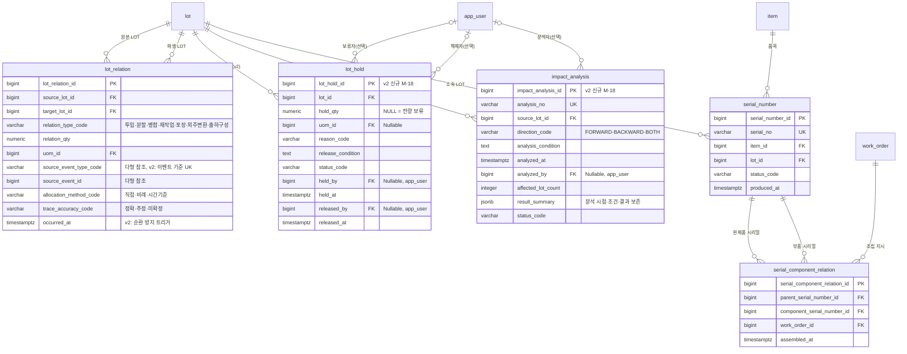
```mermaid
erDiagram
    lot ||--o{ lot_relation : "원본 LOT"
    lot ||--o{ lot_relation : "파생 LOT"
    lot ||--o{ lot_hold : "보류(v2)"
    app_user |o--o{ lot_hold : "보류자(선택)"
    app_user |o--o{ lot_hold : "해제자(선택)"
    lot ||--o{ impact_analysis : "분석 기준 LOT(v2)"
    app_user |o--o{ impact_analysis : "분석자(선택)"
    item ||--o{ serial_number : "품목"
    lot ||--o{ serial_number : "소속 LOT"
    serial_number ||--o{ serial_component_relation : "완제품 시리얼"
    serial_number ||--o{ serial_component_relation : "부품 시리얼"
    work_order ||--o{ serial_component_relation : "조립 지시"

    lot_relation {
        bigint lot_relation_id PK
        bigint source_lot_id FK
        bigint target_lot_id FK
        varchar relation_type_code "투입·분할·병합·재작업·포장·외주변환·출하구성"
        numeric relation_qty
        bigint uom_id FK
        varchar source_event_type_code "다형 참조, v2: 이벤트 기준 UK"
        bigint source_event_id "다형 참조"
        varchar allocation_method_code "직접·비례·시간기준"
        varchar trace_accuracy_code "정확·추정·미확정"
        timestamptz occurred_at "v2: 순환 방지 트리거"
    }
    lot_hold {
        bigint lot_hold_id PK "v2 신규 M-18"
        bigint lot_id FK
        numeric hold_qty "NULL = 전량 보류"
        bigint uom_id FK "Nullable"
        varchar reason_code
        text release_condition
        varchar status_code
        bigint held_by FK "Nullable, app_user"
        timestamptz held_at
        bigint released_by FK "Nullable, app_user"
        timestamptz released_at
    }
    impact_analysis {
        bigint impact_analysis_id PK "v2 신규 M-18"
        varchar analysis_no UK
        bigint source_lot_id FK
        varchar direction_code "FORWARD·BACKWARD·BOTH"
        text analysis_condition
        timestamptz analyzed_at
        bigint analyzed_by FK "Nullable, app_user"
        integer affected_lot_count
        jsonb result_summary "분석 시점·조건·결과 보존"
        varchar status_code
    }
    serial_number {
        bigint serial_number_id PK
        varchar serial_no UK
        bigint item_id FK
        bigint lot_id FK
        varchar status_code
        timestamptz produced_at
    }
    serial_component_relation {
        bigint serial_component_relation_id PK
        bigint parent_serial_number_id FK
        bigint component_serial_number_id FK
        bigint work_order_id FK
        timestamptz assembled_at
    }
```

---

## 13. 재고이동·외주 (logistics)

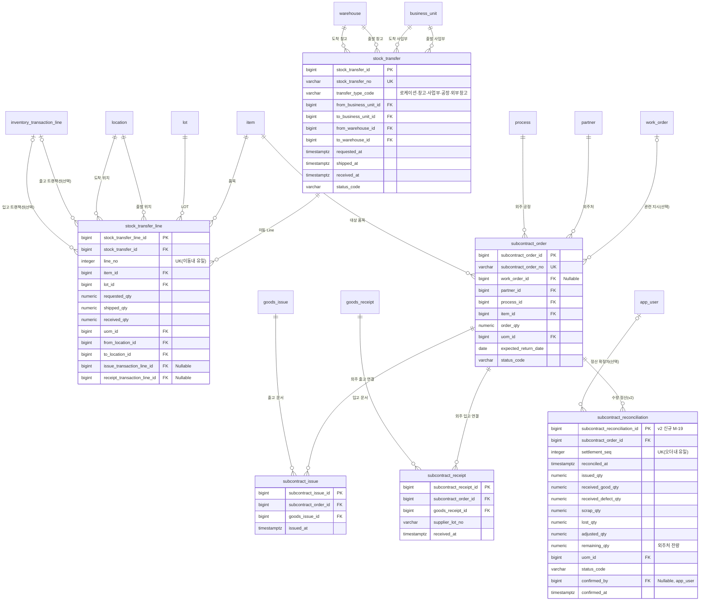
```mermaid
erDiagram
    business_unit ||--o{ stock_transfer : "출발 사업부"
    business_unit ||--o{ stock_transfer : "도착 사업부"
    warehouse ||--o{ stock_transfer : "출발 창고"
    warehouse ||--o{ stock_transfer : "도착 창고"
    stock_transfer ||--o{ stock_transfer_line : "이동 Line"
    item ||--o{ stock_transfer_line : "품목"
    lot ||--o{ stock_transfer_line : "LOT"
    location ||--o{ stock_transfer_line : "출발 위치"
    location ||--o{ stock_transfer_line : "도착 위치"
    inventory_transaction_line |o--o{ stock_transfer_line : "출고 트랜잭션(선택)"
    inventory_transaction_line |o--o{ stock_transfer_line : "입고 트랜잭션(선택)"
    work_order |o--o{ subcontract_order : "관련 지시(선택)"
    partner ||--o{ subcontract_order : "외주처"
    process ||--o{ subcontract_order : "외주 공정"
    item ||--o{ subcontract_order : "대상 품목"
    subcontract_order ||--o{ subcontract_issue : "외주 출고 연결"
    goods_issue ||--o{ subcontract_issue : "출고 문서"
    subcontract_order ||--o{ subcontract_receipt : "외주 입고 연결"
    goods_receipt ||--o{ subcontract_receipt : "입고 문서"
    subcontract_order ||--o{ subcontract_reconciliation : "수량 정산(v2)"
    app_user |o--o{ subcontract_reconciliation : "정산 확정자(선택)"

    stock_transfer {
        bigint stock_transfer_id PK
        varchar stock_transfer_no UK
        varchar transfer_type_code "로케이션·창고·사업부·공장·외부창고"
        bigint from_business_unit_id FK
        bigint to_business_unit_id FK
        bigint from_warehouse_id FK
        bigint to_warehouse_id FK
        timestamptz requested_at
        timestamptz shipped_at
        timestamptz received_at
        varchar status_code
    }
    stock_transfer_line {
        bigint stock_transfer_line_id PK
        bigint stock_transfer_id FK
        integer line_no "UK(이동내 유일)"
        bigint item_id FK
        bigint lot_id FK
        numeric requested_qty
        numeric shipped_qty
        numeric received_qty
        bigint uom_id FK
        bigint from_location_id FK
        bigint to_location_id FK
        bigint issue_transaction_line_id FK "Nullable"
        bigint receipt_transaction_line_id FK "Nullable"
    }
    subcontract_order {
        bigint subcontract_order_id PK
        varchar subcontract_order_no UK
        bigint work_order_id FK "Nullable"
        bigint partner_id FK
        bigint process_id FK
        bigint item_id FK
        numeric order_qty
        bigint uom_id FK
        date expected_return_date
        varchar status_code
    }
    subcontract_issue {
        bigint subcontract_issue_id PK
        bigint subcontract_order_id FK
        bigint goods_issue_id FK
        timestamptz issued_at
    }
    subcontract_receipt {
        bigint subcontract_receipt_id PK
        bigint subcontract_order_id FK
        bigint goods_receipt_id FK
        varchar supplier_lot_no
        timestamptz received_at
    }
    subcontract_reconciliation {
        bigint subcontract_reconciliation_id PK "v2 신규 M-19"
        bigint subcontract_order_id FK
        integer settlement_seq "UK(오더내 유일)"
        timestamptz reconciled_at
        numeric issued_qty
        numeric received_good_qty
        numeric received_defect_qty
        numeric scrap_qty
        numeric lost_qty
        numeric adjusted_qty
        numeric remaining_qty "외주처 잔량"
        bigint uom_id FK
        varchar status_code
        bigint confirmed_by FK "Nullable, app_user"
        timestamptz confirmed_at
    }
```

---

## 14. 판매오더·출하 (logistics)

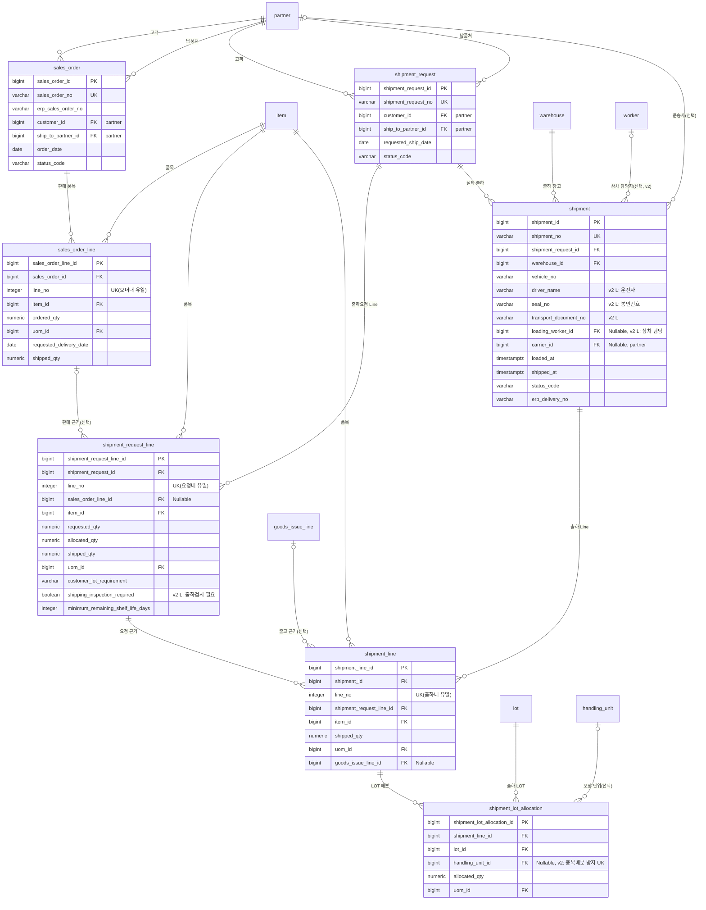
```mermaid
erDiagram
    partner ||--o{ sales_order : "고객"
    partner ||--o{ sales_order : "납품처"
    sales_order ||--o{ sales_order_line : "판매 품목"
    item ||--o{ sales_order_line : "품목"
    partner ||--o{ shipment_request : "고객"
    partner ||--o{ shipment_request : "납품처"
    shipment_request ||--o{ shipment_request_line : "출하요청 Line"
    sales_order_line |o--o{ shipment_request_line : "판매 근거(선택)"
    item ||--o{ shipment_request_line : "품목"
    shipment_request ||--o{ shipment : "실제 출하"
    warehouse ||--o{ shipment : "출하 창고"
    partner |o--o{ shipment : "운송사(선택)"
    worker |o--o{ shipment : "상차 담당자(선택, v2)"
    shipment ||--o{ shipment_line : "출하 Line"
    shipment_request_line ||--o{ shipment_line : "요청 근거"
    item ||--o{ shipment_line : "품목"
    goods_issue_line |o--o{ shipment_line : "출고 근거(선택)"
    shipment_line ||--o{ shipment_lot_allocation : "LOT 배분"
    lot ||--o{ shipment_lot_allocation : "출하 LOT"
    handling_unit |o--o{ shipment_lot_allocation : "포장 단위(선택)"

    sales_order {
        bigint sales_order_id PK
        varchar sales_order_no UK
        varchar erp_sales_order_no
        bigint customer_id FK "partner"
        bigint ship_to_partner_id FK "partner"
        date order_date
        varchar status_code
    }
    sales_order_line {
        bigint sales_order_line_id PK
        bigint sales_order_id FK
        integer line_no "UK(오더내 유일)"
        bigint item_id FK
        numeric ordered_qty
        bigint uom_id FK
        date requested_delivery_date
        numeric shipped_qty
    }
    shipment_request {
        bigint shipment_request_id PK
        varchar shipment_request_no UK
        bigint customer_id FK "partner"
        bigint ship_to_partner_id FK "partner"
        date requested_ship_date
        varchar status_code
    }
    shipment_request_line {
        bigint shipment_request_line_id PK
        bigint shipment_request_id FK
        integer line_no "UK(요청내 유일)"
        bigint sales_order_line_id FK "Nullable"
        bigint item_id FK
        numeric requested_qty
        numeric allocated_qty
        numeric shipped_qty
        bigint uom_id FK
        varchar customer_lot_requirement
        boolean shipping_inspection_required "v2 L: 출하검사 필요"
        integer minimum_remaining_shelf_life_days
    }
    shipment {
        bigint shipment_id PK
        varchar shipment_no UK
        bigint shipment_request_id FK
        bigint warehouse_id FK
        varchar vehicle_no
        varchar driver_name "v2 L: 운전자"
        varchar seal_no "v2 L: 봉인번호"
        varchar transport_document_no "v2 L"
        bigint loading_worker_id FK "Nullable, v2 L: 상차 담당"
        bigint carrier_id FK "Nullable, partner"
        timestamptz loaded_at
        timestamptz shipped_at
        varchar status_code
        varchar erp_delivery_no
    }
    shipment_line {
        bigint shipment_line_id PK
        bigint shipment_id FK
        integer line_no "UK(출하내 유일)"
        bigint shipment_request_line_id FK
        bigint item_id FK
        numeric shipped_qty
        bigint uom_id FK
        bigint goods_issue_line_id FK "Nullable"
    }
    shipment_lot_allocation {
        bigint shipment_lot_allocation_id PK
        bigint shipment_line_id FK
        bigint lot_id FK
        bigint handling_unit_id FK "Nullable, v2: 중복배분 방지 UK"
        numeric allocated_qty
        bigint uom_id FK
    }
```

---

## 15. 재고실사·조정 (inventory)

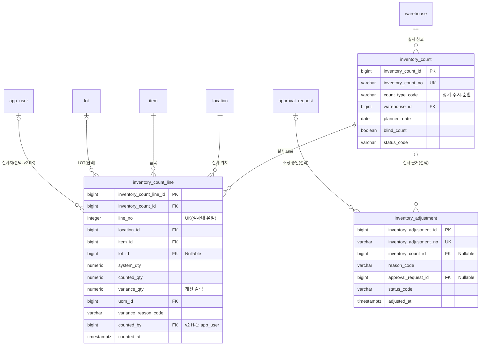
```mermaid
erDiagram
    warehouse ||--o{ inventory_count : "실사 창고"
    inventory_count ||--o{ inventory_count_line : "실사 Line"
    location ||--o{ inventory_count_line : "실사 위치"
    item ||--o{ inventory_count_line : "품목"
    lot |o--o{ inventory_count_line : "LOT(선택)"
    app_user |o--o{ inventory_count_line : "실사자(선택, v2 FK)"
    inventory_count |o--o{ inventory_adjustment : "실사 근거(선택)"
    approval_request |o--o{ inventory_adjustment : "조정 승인(선택)"

    inventory_count {
        bigint inventory_count_id PK
        varchar inventory_count_no UK
        varchar count_type_code "정기·수시·순환"
        bigint warehouse_id FK
        date planned_date
        boolean blind_count
        varchar status_code
    }
    inventory_count_line {
        bigint inventory_count_line_id PK
        bigint inventory_count_id FK
        integer line_no "UK(실사내 유일)"
        bigint location_id FK
        bigint item_id FK
        bigint lot_id FK "Nullable"
        numeric system_qty
        numeric counted_qty
        numeric variance_qty "계산 컬럼"
        bigint uom_id FK
        varchar variance_reason_code
        bigint counted_by FK "v2 H-1: app_user"
        timestamptz counted_at
    }
    inventory_adjustment {
        bigint inventory_adjustment_id PK
        varchar inventory_adjustment_no UK
        bigint inventory_count_id FK "Nullable"
        varchar reason_code
        bigint approval_request_id FK "Nullable"
        varchar status_code
        timestamptz adjusted_at
    }
```

---

## 16. 승인·정책·채번·발행이력·예외·첨부·감사·ERP 연계 (app, audit, integration)

```mermaid
erDiagram
    app_user ||--o{ approval_request : "요청자(v2 FK)"
    approval_request ||--o{ approval_step : "승인 단계"
    app_user ||--o{ approval_step : "승인자(v2 FK)"
    approval_request ||--o{ inbound_variance : "입하 차이 승인"
    approval_request ||--o{ disposition_decision : "부적합 처리 승인"
    approval_request ||--o{ inventory_adjustment : "재고 조정 승인"
    approval_request ||--o{ concession : "특채 승인"
    business_unit |o--o{ approval_route : "적용 사업부(선택)"
    approval_route ||--o{ approval_route_step : "경로 단계"
    app_user |o--o{ approval_route_step : "지정 승인자(선택)"
    role |o--o{ approval_route_step : "지정 역할(선택)"
    department |o--o{ approval_route_step : "지정 부서(선택)"
    business_unit |o--o{ operation_policy : "사업부 범위(선택)"
    plant |o--o{ operation_policy : "공장 범위(선택)"
    item |o--o{ operation_policy : "품목 범위(선택)"
    process |o--o{ operation_policy : "공정 범위(선택)"
    plant |o--o{ numbering_rule : "공장별 규칙(선택)"
    numbering_rule ||--o{ numbering_counter : "주기별 시퀀스"
    lot |o--o{ document_issue_log : "라벨 대상 LOT(선택)"
    app_user ||--o{ document_issue_log : "발행자"
    terminal |o--o{ document_issue_log : "발행 단말(선택)"
    department |o--o{ exception_case : "담당 부서(선택, v2 FK)"
    app_user |o--o{ exception_case : "담당자(선택, v2 FK)"
    app_user ||--o{ attachment : "업로더(v2 FK)"
    terminal |o--o{ audit_event : "발생 단말(선택)"

    approval_request {
        bigint approval_request_id PK
        varchar approval_request_no UK
        varchar approval_type_code
        varchar target_type_code "다형 참조"
        bigint target_id "다형 참조"
        bigint requested_by FK "v2 H-1: app_user"
        timestamptz requested_at
        varchar status_code
        text reason
    }
    approval_step {
        bigint approval_step_id PK
        bigint approval_request_id FK
        integer step_no "UK(요청내 유일)"
        bigint approver_id FK "v2 H-1: app_user"
        varchar decision_code
        timestamptz decision_at
        text decision_comment
    }
    approval_route {
        bigint approval_route_id PK "v2 신규 M-6"
        varchar approval_type_code
        bigint business_unit_id FK "Nullable"
        numeric min_value "수량·금액 구간"
        numeric max_value
    }
    approval_route_step {
        bigint approval_route_step_id PK "v2 신규 M-6"
        bigint approval_route_id FK
        integer step_no "UK(경로내 유일)"
        varchar approver_type_code "USER·ROLE·DEPARTMENT 중 하나"
        bigint approver_user_id FK "Nullable"
        bigint approver_role_id FK "Nullable"
        bigint approver_department_id FK "Nullable"
    }
    operation_policy {
        bigint operation_policy_id PK "v2 신규 M-4"
        varchar policy_code "UK(범위 조합별)"
        bigint business_unit_id FK "Nullable"
        bigint plant_id FK "Nullable"
        bigint item_id FK "Nullable"
        bigint process_id FK "Nullable"
        varchar value_text
        numeric value_numeric
        boolean value_boolean
        date effective_from
        date effective_to
    }
    numbering_rule {
        bigint numbering_rule_id PK "v2 신규 M-5"
        varchar document_type_code "UK(유형+공장+LOT유형)"
        bigint plant_id FK "Nullable"
        varchar lot_type_code "Nullable, LOT 채번용"
        varchar pattern "예: WO-PLANT-YYMMDD-SEQ4"
        varchar reset_cycle_code "DAILY·MONTHLY 등"
    }
    numbering_counter {
        bigint numbering_counter_id PK "v2 신규 M-5"
        bigint numbering_rule_id FK
        varchar period_key "UK(규칙내 유일)"
        bigint last_value
    }
    document_issue_log {
        bigint document_issue_log_id PK "v2 신규 M-3"
        varchar document_type_code "LABEL·COA·TRACE_REPORT"
        varchar target_type_code "다형 참조"
        bigint target_id "다형 참조"
        bigint lot_id FK "Nullable"
        integer issue_seq "UK(대상별), 1=최초 2+=재발행"
        varchar reissue_reason_code "재발행 시 필수 CHECK"
        bigint issued_by FK "app_user"
        timestamptz issued_at
        bigint terminal_id FK "Nullable"
        varchar printer_name
    }
    exception_case {
        bigint exception_case_id PK
        varchar exception_case_no UK
        varchar exception_type_code
        varchar severity_code
        varchar target_type_code "다형 참조"
        bigint target_id "다형 참조"
        bigint assigned_department_id FK "Nullable, v2 H-1"
        bigint assigned_user_id FK "Nullable, v2 H-1"
        timestamptz due_at
        varchar status_code
        text resolution
    }
    attachment {
        bigint attachment_id PK
        varchar target_type_code "다형 참조"
        bigint target_id "다형 참조"
        varchar file_name
        varchar storage_key
        varchar mime_type
        bigint file_size
        varchar checksum_sha256
        bigint uploaded_by FK "v2 H-1: app_user"
        timestamptz uploaded_at
    }
    audit_event {
        bigint audit_event_id PK
        timestamptz occurred_at PK "RANGE 파티션 키"
        varchar target_type_code "다형 참조"
        bigint target_id "다형 참조"
        varchar event_type_code
        jsonb before_value
        jsonb after_value
        text reason
        bigint performed_by "FK 미설정(파티션·적재량, 의도)"
        bigint terminal_id FK "Nullable"
        varchar correlation_id
    }
    integration_message {
        bigint integration_message_id PK
        varchar message_key UK
        varchar interface_code
        varchar direction_code "IN·OUT"
        varchar target_type_code "다형 참조"
        bigint target_id "다형 참조"
        jsonb payload
        varchar status_code
        integer retry_count
        text last_error_message
        timestamptz available_at
        timestamptz sent_at
        timestamptz completed_at
        timestamptz locked_at
        varchar locked_by
    }
    external_document_reference {
        bigint external_document_reference_id PK
        varchar target_type_code "다형 참조"
        bigint target_id "다형 참조"
        varchar external_system_code
        varchar external_document_type_code
        varchar external_document_no
    }
```

---

## 부록: 도메인 간 핵심 흐름 요약

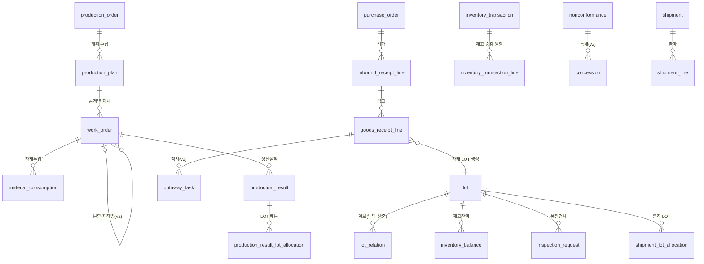
```mermaid
erDiagram
    production_order ||--o{ production_plan : "계획 수립"
    production_plan ||--o{ work_order : "공정별 지시"
    work_order |o--o{ work_order : "분할·재작업(v2)"
    work_order ||--o{ material_consumption : "자재투입"
    work_order ||--o{ production_result : "생산실적"
    production_result ||--o{ production_result_lot_allocation : "LOT 배분"
    purchase_order ||--o{ inbound_receipt_line : "입하"
    inbound_receipt_line ||--o{ goods_receipt_line : "입고"
    goods_receipt_line }o--|| lot : "자재 LOT 생성"
    goods_receipt_line ||--o{ putaway_task : "적치(v2)"
    lot ||--o{ lot_relation : "계보(투입-산출)"
    lot ||--o{ inventory_balance : "재고잔액"
    inventory_transaction ||--o{ inventory_transaction_line : "재고 증감 원장"
    lot ||--o{ inspection_request : "품질검사"
    nonconformance ||--o{ concession : "특채(v2)"
    lot ||--o{ shipment_lot_allocation : "출하 LOT"
    shipment ||--o{ shipment_line : "출하"
```
